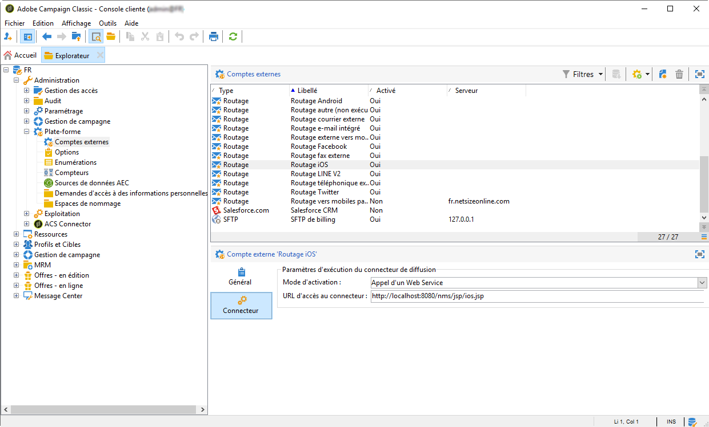
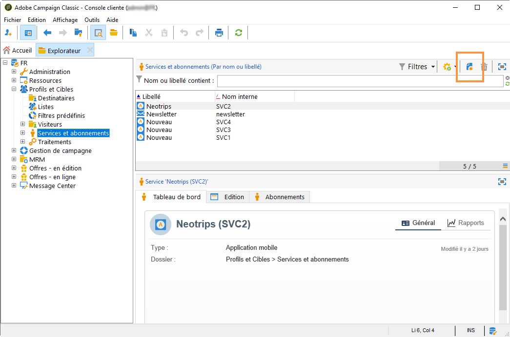
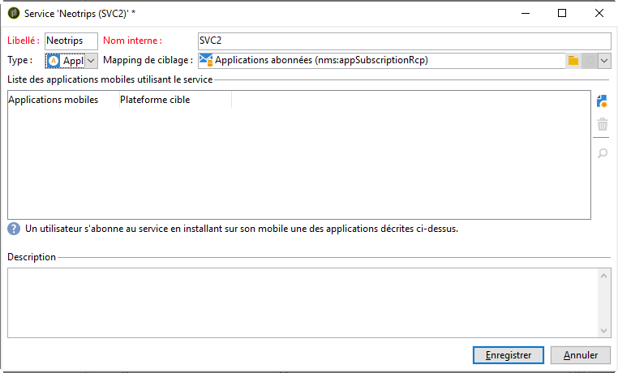
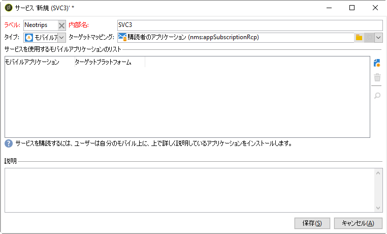
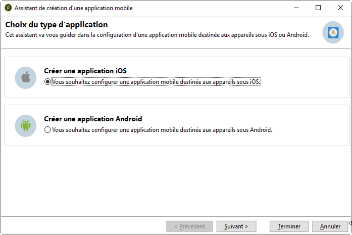
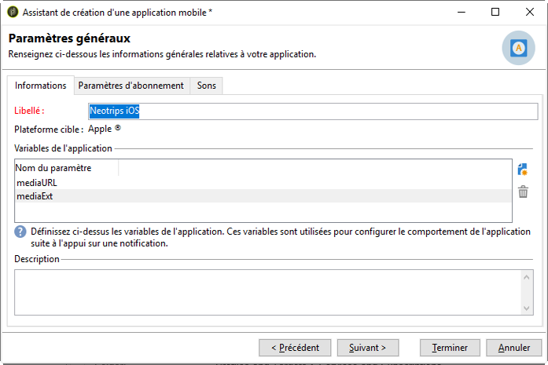
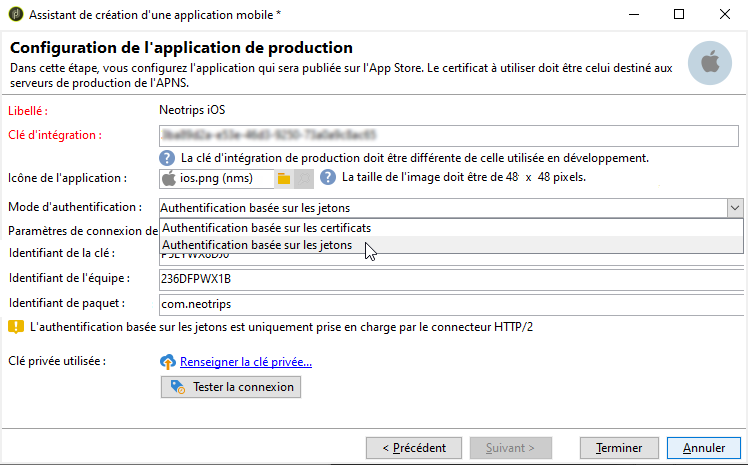

# Étapes de configuration pour iOS {#configuring-the-mobile-application-in-adobe-campaign-ios}

Une fois le package installé, vous pouvez définir les paramètres de votre application iOS dans Adobe Campaign Classic.

Les étapes clés sont les suivantes :

1. [Configuration du compte externe iOS](#configuring-external-account-ios)
1. [Configuration du service iOS](#configuring-ios-service)
1. [Intégration de l&#39;application mobile iOS dans Campaign](#creating-ios-app)

Vous pourrez ensuite [créer une notification push pour les appareils iOS](create-notifications-ios.md).

## Configuration du compte externe iOS {#configuring-external-account-ios}

Pour iOS, le connecteur HTTP/2 iOS envoie des notifications à l&#39;APNS HTTP/2.

Pour configurer ce connecteur, procédez comme suit :

1. Accédez à **[!UICONTROL Administration > Plateforme > Comptes externes]**.
1. Sélectionnez le compte externe **[!UICONTROL routage iOS]**.
1. Dans l&#39;onglet **[!UICONTROL Connecteur]**, renseignez le champ **[!UICONTROL URL d&#39;accès au connecteur]** avec l&#39;URL suivante :`http://localhost:8080/nms/jsp/iosHTTP2.jsp`

   

1. Cliquez sur **[!UICONTROL Enregistrer]**.

Votre connecteur iOS est maintenant paramétré. Vous pouvez créer votre service.

## Configuration du service iOS {#configuring-ios-service}

>[!CAUTION]
>
>L&#39;application doit avoir été configurée pour des actions de Push AVANT toute intégration au SDK Adobe.
>
>Si ce n&#39;est pas le cas, veuillez consulter [cette page](https://developer.apple.com/documentation/usernotifications).

1. Dans l&#39;arborescence, positionnez-vous sur le nœud **[!UICONTROL Profils et Cibles > Services et abonnements]** et cliquez sur le bouton **[!UICONTROL Nouveau]**.

   

1. Définissez un **[!UICONTROL Libellé]** et un **[!UICONTROL Nom interne]**.
1. Dans le champ **[!UICONTROL Type]**, choisissez **[!UICONTROL Application mobile]**.

   >[!NOTE]
   >
   >Le mapping de ciblage **[!UICONTROL Applications abonnées (nms:appSubscriptionRcp)]** par défaut est lié à la table des destinataires. Si vous souhaitez utiliser un autre mapping de ciblage, vous devez en créer un nouveau et le saisir dans le champ **[!UICONTROL Mapping de ciblage]** du service. Pour plus d’informations sur la création d’un mapping de ciblage, reportez-vous au [Guide de configuration](../../configuration/using/about-custom-recipient-table.md).

   

1. Cliquez ensuite sur le bouton **[!UICONTROL Ajouter]** pour sélectionner le type d’application.

   

1. Créez vos applications de développement et de production iOS. Pour plus d’informations à ce sujet, consultez cette [section](configuring-the-mobile-application.md#creating-ios-app).

## Création d&#39;une application mobile iOS {#creating-ios-app}

Après avoir créé votre service, créez votre application iOS dans Campaign. Procédez comme suit :

1. Dans le service que vous venez de créer, cliquez sur le bouton **[!UICONTROL Ajouter]** pour choisir le type d&#39;application.

   

1. La fenêtre suivante s’affiche. Sélectionnez **[!UICONTROL Créer une application iOS]**, puis indiquez le **[!UICONTROL libellé]**.

   

1. Si nécessaire, vous pouvez enrichir le contenu d&#39;un message push avec certaines **[!UICONTROL variables d&#39;application]**. Ils sont entièrement personnalisables et font partie de la payload du message envoyée à l’appareil mobile.
Dans l’exemple suivant, nous ajoutons **mediaURl** et **mediaExt** pour créer une notification push enrichie et fournir à l’application l’image à afficher dans la notification.

   

1. L’onglet **[!UICONTROL Paramètres d’abonnement]** vous permet de définir le mapping avec une extension du schéma **[!UICONTROL Applications abonnées (nms:appsubscriptionRcp)]**.

   >[!NOTE]
   >
   >Assurez-vous que vous n&#39;utilisez pas le même certificat pour la version de développement (sandbox) et la version de production de l&#39;application.

1. L’onglet **[!UICONTROL Sons]** permet de spécifier un son à lire. Cliquez sur **[!UICONTROL Ajouter]** et renseignez le champ **[!UICONTROL Nom interne]**. Il doit contenir le nom du fichier incorporé dans l’application ou le nom du son système.

1. Cliquez sur **[!UICONTROL Suivant]** pour passer à la configuration de l’application de développement.

1. Assurez-vous que la même **[!UICONTROL clé d’intégration]** est définie dans Adobe Campaign et dans le code de l’application via le SDK.<!--For more on this, refer to [this page](integrating-campaign-sdk-into-the-mobile-application.md).--> Cette clé d’intégration, spécifique à chaque application, vous permet de lier l’application mobile à la plateforme Adobe Campaign.

   >[!NOTE]
   >
   > La **[!UICONTROL clé d&#39;intégration]** est entièrement personnalisable avec une valeur de chaîne, mais doit être exactement identique à celle spécifiée dans le SDK.

1. Sélectionnez l&#39;une des icônes d’usine dans le champ **[!UICONTROL Icône de l&#39;application]** pour personnaliser l&#39;application mobile dans votre service.

1. Sélectionnez le **[!UICONTROL mode d’authentification]**.

   

   Deux modes sont disponibles :

   * (Recommandé) **[!UICONTROL Authentification basée sur les jetons]** : renseignez les paramètres de connexion APNs **[!UICONTROL Identifiant de la clé]**, **[!UICONTROL Identifiant de l&#39;équipe]** et **[!UICONTROL Identifiant de paquet]** puis sélectionnez votre certificat p8 en cliquant sur **[!UICONTROL Renseigner la clé privée...]**. Pour plus d’informations sur l’**[!UICONTROL authentification basée sur les jetons]**, consultez la [documentation d’Apple](https://developer.apple.com/documentation/usernotifications/setting_up_a_remote_notification_server/establishing_a_token-based_connection_to_apns){target="_blank"}.

   * **[!UICONTROL Authentification basée sur les certificats]** : cliquez sur **[!UICONTROL Renseigner le certificat...]**, sélectionnez votre clé p12 et saisissez le mot de passe fourni par l’équipe de développement d’applications mobiles.

   >[!NOTE]
   >
   > Adobe recommande d’utiliser l’**[!UICONTROL Authentification basée sur les jetons]** pour votre configuration iOS, car les clés d’authentification P8 sont plus récentes et sécurisées.

1. Utilisez le bouton **[!UICONTROL Tester la connexion]** pour valider votre configuration.

1. Cliquez sur **[!UICONTROL Suivant]** pour passer à la configuration de l’application de production et procédez comme décrit ci-dessus.

1. Cliquez sur **[!UICONTROL Terminer]**.

Votre application iOS est maintenant prête à être utilisée dans Campaign Classic.
