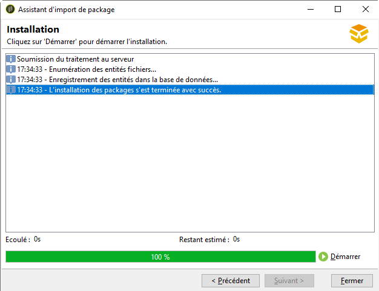
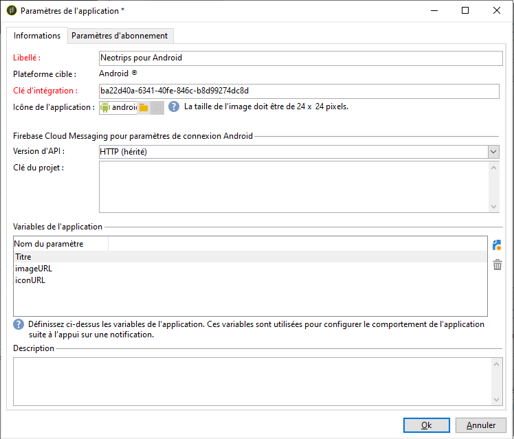

# Paramétrage de l&#39;application mobile dans Adobe Campaign {#configuring-the-mobile-application-in-adobe-campaign}

Vous trouverez ci-dessous un exemple de configuration pour une entreprise qui vend des forfaits de vacances en ligne. Elle propose son application mobile (Neotrips) en deux versions : Neotrips pour Android et Neotrips pour iOS. Pour configurer l’application mobile dans Adobe Campaign, vous devez procéder comme suit :

* Créez un service d’information de type **[!UICONTROL Application mobile]** pour l’application mobile Neotrips.
* Ajoutez, à ce service, les versions iOS et Android de l&#39;application.
* Créez une diffusion pour iOS et Android.

>[!NOTE]
>
>Dans l&#39;onglet **[!UICONTROL Abonnements]** du service, vous trouverez la liste de tous les abonnés au service, c&#39;est-à-dire toutes les personnes ayant installé l&#39;application sur leur terminal mobile et accepté de recevoir des notifications.

## Configuration de l’application mobile avec iOS {#configuring-the-mobile-application-ios}

>[!CAUTION]
>
>L&#39;application doit avoir été configurée pour des actions de Push AVANT toute intégration au SDK Adobe Campaign.
>
>Si ce n&#39;est pas le cas, veuillez consulter [cette page](https://developer.apple.com/library/archive/documentation/NetworkingInternet/Conceptual/RemoteNotificationsPG/).

### Étape 1 : Installation du package {#installing-package-ios}

1. Accédez à l&#39;assistant d&#39;import de package depuis le menu **[!UICONTROL Outils > Avancé > Import de package...]** de la console cliente Adobe Campaign.

   

1. Sélectionnez **[!UICONTROL Installer un package standard]**.

1. Dans la liste qui s’affiche, vérifiez le canal **[!UICONTROL des applications]** mobiles.

   

1. Cliquez sur **[!UICONTROL Suivant]** puis **[!UICONTROL Démarrer]** pour commencer l&#39;installation du package.

   Une fois les packages installés, la barre de progression indique **100 %**. De plus, les logs d&#39;installation contiennent le message suivant : **[!UICONTROL L&#39;installation des packages s&#39;est terminée avec succès]**.

   

1. **[!UICONTROL Fermez]** la fenêtre d&#39;installation.

### Étape 2 : Configuration d’un compte externe iOS {#configuring-external-account-ios}

Deux connecteurs sont disponibles pour iOS :

* Le connecteur binaire iOS envoie des notifications au serveur APNS binaire.
* Le connecteur HTTP/2 iOS envoie des notifications à l&#39;APNS HTTP/2.

Pour sélectionner le connecteur à utiliser, procédez comme suit :

1. Accédez à **[!UICONTROL Administration > Plate-forme > Comptes externes]**.
1. Select the **[!UICONTROL iOS routing]** external account.
1. Dans l&#39;onglet **[!UICONTROL Connecteur]**, renseignez le champ **[!UICONTROL URL d&#39;accès au connecteur]** :

   Pour le connecteur HTTP2 iOS : http://localhost:8080/nms/jsp/iosHTTP2.jsp

   

   >[!NOTE]
   >
   > Vous pouvez également le configurer comme suit https://localhost:8080/nms/jsp/ios.jsp, mais nous vous conseillons d’utiliser la version 2 du connecteur.

1. Cliquez sur **[!UICONTROL Enregistrer]**.

Votre connecteur iOS est maintenant configuré. Vous pouvez commencer à créer votre service.

### Étape 3 : Configuration du service iOS {#configuring-ios-service}

1. Dans l&#39;arborescence, positionnez-vous sur le noeud **[!UICONTROL Profils et Cibles > Services et abonnements]** et cliquez sur le bouton **[!UICONTROL Nouveau]**.

   

1. Définissez un **[!UICONTROL Libellé]** et un **[!UICONTROL Nom interne]**.
1. Dans le champ **[!UICONTROL Type]**, choisissez **[!UICONTROL Application mobile]**.

   >[!NOTE]
   >
   >Le mapping de ciblage par défaut **[!UICONTROL Applications abonnées (nms:appSubscriptionRcp)]** est lié à la table des destinataires. Si vous souhaitez utiliser un autre mapping de ciblage, vous devez créer un nouveau mapping de ciblage et le renseigner dans le champ **[!UICONTROL Mapping de ciblage]** du service. La création d&#39;un mapping de ciblage est présentée dans le [Guide de configuration](../../configuration/using/about-custom-recipient-table.md).

   

1. Cliquez ensuite sur le bouton **[!UICONTROL Ajouter]** pour sélectionner le type d’application.

   

1. La fenêtre suivante s’affiche. Sélectionnez **[!UICONTROL Créer une application]** iOS et commencez par saisir le **[!UICONTROL libellé]**.

   

1. Vous pouvez, si nécessaire, enrichir un contenu de message push avec certaines variables **[!UICONTROL d’]** application. Elles sont entièrement personnalisables et font partie de la charge utile du message envoyé au périphérique mobile.
Dans l’exemple suivant, nous ajoutons **mediaURl** et **mediaExt** pour créer une notification Push riche, puis fournissons à l’application l’image à afficher dans la notification.

   

1. L’onglet Paramètres **[!UICONTROL d’]** abonnement vous permet de définir le mappage avec une extension du schéma des applications **[!UICONTROL d’abonné (nms:appsubscriptionRcp)]** .

   >[!NOTE]
   >
   >Assurez-vous que vous n&#39;utilisez pas le même certificat pour la version de développement (sandbox) et la version de production de l&#39;application.

1. L’onglet **[!UICONTROL Sons]** vous permet de spécifier un son à lire. Cliquez sur **[!UICONTROL Ajouter]** et remplissez le champ Nom **** interne qui doit contenir le nom du fichier incorporé dans l’application ou le nom du son système.

1. Cliquez sur **[!UICONTROL Suivant]** pour commencer à configurer l’application de développement.

1. Assurez-vous que la même clé **[!UICONTROL d’]** intégration est définie dans Adobe Campaign et dans le code de l’application via le SDK. Pour plus d’informations à ce sujet, voir : [Intégration du SDK de campagne dans l’application](#integrating-campaign-sdk-into-the-mobile-application)mobile. Cette clé d’intégration, spécifique à chaque application, vous permet de lier l’application mobile à la plateforme Adobe Campaign.

   >[!NOTE]
   >
   > La clé **[!UICONTROL d’intégration]** est entièrement personnalisable avec une valeur de chaîne, mais doit être exactement la même que celle spécifiée dans le SDK.

1. Sélectionnez l’une des icônes prêtes à l’emploi dans le champ d’icône **[!UICONTROL de l’]** application pour personnaliser l’application mobile dans votre service.

1. Cliquez sur le lien **[!UICONTROL Renseigner le certificat]** puis sélectionnez le certificat d&#39;authentification et saisissez le mot de passe qui vous ont été fournis par le développeur de l&#39;application mobile. Vous pouvez cliquer sur **[!UICONTROL Tester la connexion]** pour vous assurer qu’elle est réussie.

   >[!NOTE]
   >
   >Apple requiert différents certificats pour les versions de développement et de production d’une même application mobile. Vous devrez configurer les deux applications distinctes dans Adobe Campaign.

   

1. Cliquez sur **[!UICONTROL Suivant]** pour commencer à configurer l’application de production et suivez les étapes décrites ci-dessus.

   

1. Cliquez sur **[!UICONTROL Terminer]**. Votre application iOS est maintenant prête à être utilisée dans Campaign Classic.

### Étape 4 : Création d’une notification iOS enrichie {#creating-ios-delivery}

Avec iOS 10 ou version ultérieure, il est possible de générer des notifications enrichies. Adobe Campaign peut envoyer des notifications à l&#39;aide de variables qui permettront à l&#39;appareil d&#39;afficher des notifications enrichies.

Vous devez maintenant créer une nouvelle diffusion et la lier à l’application mobile que vous avez créée.

1. Accédez à **[!UICONTROL Gestion de campagne]** > **[!UICONTROL Diffusions]**.

1. Cliquez sur **[!UICONTROL Nouveau]**.

   

1. Sélectionnez **[!UICONTROL Livrer sur iOS (ios)]** dans la liste déroulante des modèles **[!UICONTROL de]** diffusion. Ajoutez une **[!UICONTROL étiquette]** à votre diffusion.

1. Cliquez sur **[!UICONTROL À]** pour définir la population à cibler. Par défaut, le mappage cible de l’application **** abonné est appliqué. Cliquez sur **[!UICONTROL Ajouter]** pour sélectionner le service créé précédemment.

   

1. Dans la fenêtre Type **[!UICONTROL de]** Target, sélectionnez **[!UICONTROL Abonnés d’une application mobile iOS (iPhone, iPad)]** et cliquez sur **[!UICONTROL Suivant]**.

1. Dans la liste déroulante **[!UICONTROL Service]** , sélectionnez votre service créé précédemment, puis l’application à cibler, puis cliquez sur **[!UICONTROL Terminer]**.
Les variables **** Application sont automatiquement ajoutées en fonction de ce qui a été ajouté au cours des étapes de configuration.

   

1. Modifiez votre notification enrichie.

   

1. Check the **[!UICONTROL Mutable content]** box in the edit notification window to allow the mobile application to download media content.

1. Cliquez sur **[!UICONTROL Enregistrer]**, puis envoyez votre diffusion.

L’image et la page Web doivent être affichées dans la notification Push lorsqu’elles sont reçues sur les périphériques iOS mobiles des abonnés.

## Configuration de l’application mobile avec Android {#configuring-the-mobile-application-android}

### Étape 1 : Installation du package {#installing-package-android}

1. Accédez à l&#39;assistant d&#39;import de package depuis le menu **[!UICONTROL Outils > Avancé > Import de package...]** de la console cliente Adobe Campaign.

   

1. Sélectionnez **[!UICONTROL Installer un package standard]**.

1. Dans la liste qui s’affiche, vérifiez le canal **[!UICONTROL des applications]** mobiles.

   

1. Cliquez sur **[!UICONTROL Suivant]** puis **[!UICONTROL Démarrer]** pour commencer l&#39;installation du package.

   Une fois les packages installés, la barre de progression indique **100 %**. De plus, les logs d&#39;installation contiennent le message suivant : **[!UICONTROL L&#39;installation des packages s&#39;est terminée avec succès]**.

   

1. **[!UICONTROL Fermez]** la fenêtre d&#39;installation.

### Étape 2 : Configuration du compte externe Android {#configuring-external-account-android}

Deux connecteurs sont disponibles pour Android :

* Le connecteur V1 permet une connexion par MTA child.
* Le connecteur V2 permet plusieurs connexions simultanées avec le serveur FCM pour améliorer le débit.

Pour sélectionner le connecteur à utiliser, procédez comme suit :

1. Accédez à **[!UICONTROL Administration > Plate-forme > Comptes externes]**.
1. Sélectionnez le compte externe de **[!UICONTROL routage Android]**.
1. Dans l&#39;onglet **[!UICONTROL Connecteur]**, renseignez le champ **[!UICONTROL JavaScript du connecteur]** :

   Pour Android V2 : https://localhost:8080/nms/jsp/androidPushConnectorV2.js

   >[!NOTE]
   >
   > Vous pouvez également le configurer comme suit https://localhost:8080/nms/jsp/androidPushConnector.js, mais nous vous conseillons d’utiliser la version 2 du connecteur.

   

1. Pour Android V2, un paramètre supplémentaire est disponible dans le fichier de configuration du serveur Adobe (serverConf.xml) :

   * **maxGCMConnectPerChild** : limite maximale du nombre de requêtes HTTP parallèles sur le serveur FCM initiées par chaque serveur fils (8 par défaut).

### Étape 3 : Configuration du service Android {#configuring-android-service}

1. Dans l&#39;arborescence, positionnez-vous sur le noeud **[!UICONTROL Profils et Cibles > Services et abonnements]** et cliquez sur le bouton **[!UICONTROL Nouveau]**.

   

1. Définissez un **[!UICONTROL Libellé]** et un **[!UICONTROL Nom interne]**.
1. Dans le champ **[!UICONTROL Type]**, choisissez **[!UICONTROL Application mobile]**.

   >[!NOTE]
   >
   >Le mapping de ciblage par défaut **[!UICONTROL Applications abonnées (nms:appSubscriptionRcp)]** est lié à la table des destinataires. Si vous souhaitez utiliser un autre mapping de ciblage, vous devez créer un nouveau mapping de ciblage et le renseigner dans le champ **[!UICONTROL Mapping de ciblage]** du service. La création d&#39;un mapping de ciblage est présentée dans le [Guide de configuration](../../configuration/using/about-custom-recipient-table.md).

   

1. Cliquez ensuite sur le bouton **[!UICONTROL Ajouter]** pour sélectionner le type d’application.

   

1. Sélectionnez **[!UICONTROL Créer une application]** Android.

   

1. Saisissez un **[!UICONTROL Libellé]**.

1. Assurez-vous que la même clé **[!UICONTROL d’]** intégration est définie dans Adobe Campaign et dans le code de l’application via le SDK. Pour plus d’informations à ce sujet, voir : [Intégration du SDK de campagne dans l’application](#integrating-campaign-sdk-into-the-mobile-application)mobile.

   >[!NOTE]
   >
   > La clé **[!UICONTROL d’intégration]** est entièrement personnalisable avec une valeur de chaîne, mais doit être exactement la même que celle spécifiée dans le SDK.

1. Sélectionnez l’une des icônes prêtes à l’emploi dans le champ d’icône **[!UICONTROL de l’]** application pour personnaliser l’application mobile dans votre service.

1. Entrez les paramètres de connexion de l’application : saisissez la clé de projet fournie par le développeur de l’application mobile.

1. Vous pouvez, si nécessaire, enrichir un contenu de message push avec certaines variables **[!UICONTROL d’]** application. Elles sont entièrement personnalisables et font partie de la charge utile du message envoyé au périphérique mobile.

   Dans l’exemple suivant, nous ajoutons **title**, **imageURL** et **iconURL** pour créer une notification Push riche, puis fournissons à l’application l’image, le titre et l’icône à afficher dans la notification.

   

1. Click **[!UICONTROL Finish]** then **[!UICONTROL Save]**. Votre application Android est maintenant prête à être utilisée dans Campaign Classic.

Par défaut, Adobe Campaign enregistre une clé dans le champ **[!UICONTROL Identifiant de l&#39;utilisateur]** (@userKey) de la table **[!UICONTROL Applications abonnées (nms:appSubscriptionRcp)]**. Cette clé permet de relier un abonnement à un destinataire. Si vous souhaitez collecter des données additionnelles (par exemple une clé de réconciliation complexe), vous devez effectuer le paramétrage suivant :

1. Créez une extension du schéma **[!UICONTROL Applications abonnées (nms:appSubscriptionRcp)]** et définissez les nouveaux champs.
1. Définissez le mapping dans l&#39;onglet **[!UICONTROL Paramètres d&#39;abonnement]**.
   >[!CAUTION]
   >
   >Make sure the configuration names in the **[!UICONTROL Subscription parameters]** tab are the same as those in the mobile application code. Reportez-vous à la section [Intégration du SDK de campagne dans l’application](#integrating-campaign-sdk-into-the-mobile-application) mobile.

### Étape 4 : Création d’une notification Android riche {#creating-android-delivery}

Vous devez maintenant créer une nouvelle diffusion et la lier à l’application mobile que vous avez créée.

1. Accédez à **[!UICONTROL Gestion de campagne]** > **[!UICONTROL Diffusions]**.

1. Cliquez sur **[!UICONTROL Nouveau]**.

   

1. Sélectionnez **[!UICONTROL Livrer sur Android (android)]** dans la liste déroulante Modèle **[!UICONTROL de]** diffusion. Ajoutez une **[!UICONTROL étiquette]** à votre diffusion.

1. Cliquez sur **[!UICONTROL À]** pour définir la population à cibler. Par défaut, le mappage cible de l’application **** abonné est appliqué. Cliquez sur **[!UICONTROL Ajouter]** pour sélectionner le service créé précédemment.

   

1. Dans la fenêtre Type **[!UICONTROL de]** Target, sélectionnez Abonnés d’une application mobile Android et cliquez sur **[!UICONTROL Suivant]**.

1. Dans la liste déroulante **[!UICONTROL Service]** , sélectionnez le service créé précédemment, puis l’application, puis cliquez sur **[!UICONTROL Terminer]**.
Les variables **** Application sont automatiquement ajoutées en fonction de ce qui a été ajouté au cours des étapes de configuration.

   

1. Modifiez votre notification enrichie.

   

1. Cliquez sur **[!UICONTROL Enregistrer]**, puis envoyez votre diffusion.

L&#39;image et la page web doivent s&#39;afficher dans la notification push lors de la réception sur les appareils Android des abonnés.

