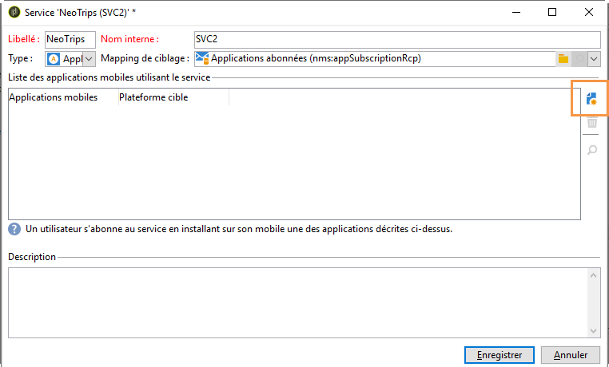
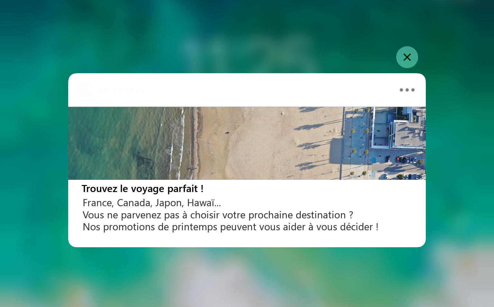

# Etapes de configuration pour iOS {#configuring-the-mobile-application-in-adobe-campaign-ios}

Une fois le pack installé, vous pouvez définir les paramètres de votre application iOS dans Adobe Campaign Classic.

>[!NOTE]
>
>Pour savoir comment configurer votre application pour Android et comment créer une diffusion pour Android, reportez-vous à cette [section](../../delivery/using/configuring-the-mobile-application-android.md).

## Configuring iOS external account {#configuring-external-account-ios}

Pour iOS, le connecteur HTTP/2 iOS envoie des notifications aux APN HTTP/2.

Pour configurer ce connecteur, procédez comme suit :

1. Accédez à **[!UICONTROL Administration > Plate-forme > Comptes externes]**.
1. Sélectionnez le compte externe **[!UICONTROL routage iOS]**.
1. In the **[!UICONTROL Connector]** tab, fill in the **[!UICONTROL Access URL of the connector]** field with the following URL: ```http://localhost:8080/nms/jsp/iosHTTP2.jsp```

   >[!NOTE]
   >
   > A compter de la version Campaign 20.3, le connecteur binaire hérité d’iOS est obsolète. Si vous utilisez ce connecteur, vous devez adapter votre mise en oeuvre en conséquence. [En savoir plus](https://helpx.adobe.com/campaign/kb/migrate-to-http2.html)

   

1. Cliquez sur **[!UICONTROL Enregistrer]**.

Votre connecteur iOS est maintenant paramétré. Vous pouvez créer votre service.

## Configuration du service iOS {#configuring-ios-service}

>[!CAUTION]
>
>L&#39;application doit avoir été configurée pour des actions de Push AVANT toute intégration au SDK Adobe Campaign.
>
>Si ce n&#39;est pas le cas, veuillez consulter [cette page](https://developer.apple.com/library/archive/documentation/NetworkingInternet/Conceptual/RemoteNotificationsPG/).

1. Dans l&#39;arborescence, positionnez-vous sur le noeud **[!UICONTROL Profils et Cibles > Services et abonnements]** et cliquez sur le bouton **[!UICONTROL Nouveau]**.

   

1. Définissez un **[!UICONTROL Libellé]** et un **[!UICONTROL Nom interne]**.
1. Dans le champ **[!UICONTROL Type]**, choisissez **[!UICONTROL Application mobile]**.

   >[!NOTE]
   >
   >Le mapping de ciblage par défaut **[!UICONTROL Applications abonnées (nms:appSubscriptionRcp)]** est lié à la table des destinataires. Si vous souhaitez utiliser un autre mapping de ciblage, vous devez créer un nouveau mapping de ciblage et le renseigner dans le champ **[!UICONTROL Mapping de ciblage]** du service. La création d&#39;un mapping de ciblage est présentée dans le [Guide de configuration](../../configuration/using/about-custom-recipient-table.md).

   

1. Cliquez ensuite sur le bouton **[!UICONTROL Ajouter]** pour sélectionner le type d’application.

   

1. Créez vos applications de développement et de production iOS. Pour plus d’informations à ce sujet, consultez cette [section](../../delivery/using/configuring-the-mobile-application.md#creating-ios-app).

## Création d’applications mobiles iOS {#creating-ios-app}

Après avoir créé votre service, vous devez à présent créer votre application iOS :

1. Dans le service que vous venez de créer, cliquez sur le bouton **[!UICONTROL Ajouter]** pour sélectionner le type d’application.

   

1. La fenêtre suivante s’affiche. Sélectionnez **[!UICONTROL Créer une application iOS]**, puis indiquez le **[!UICONTROL libellé]**.

   

1. Vous pouvez, si nécessaire, enrichir un contenu de message push avec certaines **[!UICONTROL variables d’application]**. Elles sont entièrement personnalisables et font partie de la payload du message envoyé à l’appareil mobile.
Dans l’exemple suivant, nous ajoutons **mediaURl** et **mediaExt** pour créer une notification push enrichie, puis nous fournissons à l’application l’image à afficher dans la notification.

   

1. L’onglet **[!UICONTROL Paramètres d’abonnement]** permet de définir la correspondance avec une extension du schéma **[!UICONTROL Applications abonnées (nms:appsubscriptionRcp)]**.

   >[!NOTE]
   >
   >Assurez-vous que vous n&#39;utilisez pas le même certificat pour la version de développement (sandbox) et la version de production de l&#39;application.

1. L’onglet **[!UICONTROL Sons]** permet de spécifier un son à lire. Cliquez sur **[!UICONTROL Ajouter]** et renseignez le champ **[!UICONTROL Nom interne]**. Il doit contenir le nom du fichier incorporé dans l’application ou le nom du son système.

1. Cliquez sur **[!UICONTROL Suivant]** pour passer à la configuration de l’application de développement.

1. Assurez-vous que la même **[!UICONTROL clé d’intégration]** est définie dans Adobe Campaign et dans le code de l’application via le SDK. Voir à ce sujet la section : [Intégrer le SDK Campaign dans l’application mobile](../../delivery/using/integrating-campaign-sdk-into-the-mobile-application.md). Cette clé d’intégration, spécifique à chaque application, vous permet de lier l’application mobile à la plateforme Adobe Campaign.

   >[!NOTE]
   >
   > La **[!UICONTROL clé d’intégration]** est entièrement personnalisable avec une valeur de chaîne, mais doit être exactement identique à celle spécifiée dans le SDK.

1. Select one of the out-of-the-box icons from the **[!UICONTROL Application icon]** field to personalize mobile application in your service.

1. Sélectionnez le mode **** Authentification. Notez que vous pouvez toujours modifier votre mode d&#39;authentification ultérieurement dans l&#39;onglet **[!UICONTROL Certificat]** de votre application mobile.
   * **[!UICONTROL Authentification]** basée sur un certificat : Cliquez sur **[!UICONTROL Saisissez le certificat...]** puis sélectionnez votre clé p12 et saisissez le mot de passe fourni par le développeur d&#39;applications mobiles.
   * **[!UICONTROL Authentification]** basée sur un jeton : Renseignez les paramètres de connexion **[!UICONTROL Key ID]**, **[!UICONTROL Team ID]** et **[!UICONTROL Bundle ID]** , puis sélectionnez votre certificat p8 en cliquant sur **[!UICONTROL Enter the private key.]** Pour plus d’informations sur l’authentification **[!UICONTROL basée sur]** un jeton, reportez-vous à la documentation [](https://developer.apple.com/documentation/usernotifications/setting_up_a_remote_notification_server/establishing_a_token-based_connection_to_apnsToken-based)Apple.

   >[!NOTE]
   >
   > L’Adobe recommande l’utilisation d’une authentification **[!UICONTROL basée sur un]** jeton pour votre configuration iOS, car ce mode d’authentification est plus sécurisé et ne doit pas être lié à l’expiration du certificat.

   

1. Vous pouvez cliquer sur **[!UICONTROL Tester la connexion]** pour vous assurer qu’elle fonctionne bien.

1. Cliquez sur **[!UICONTROL Suivant]** pour passer à la configuration de l’application de production et procédez comme décrit ci-dessus.

   

1. Cliquez sur **[!UICONTROL Terminer]**.

Votre application iOS est maintenant prête à être utilisée dans Campaign Classic.

## Creating an iOS rich notification {#creating-ios-delivery}

Avec iOS 10 ou version ultérieure, il est possible de générer des notifications enrichies. Adobe Campaign peut envoyer des notifications à l&#39;aide de variables qui permettront à l&#39;appareil d&#39;afficher des notifications enrichies.

Vous devez maintenant créer une nouvelle diffusion et l’associer à l’application mobile que vous avez créée.

1. Accédez à **[!UICONTROL Gestion de campagne]** > **[!UICONTROL Diffusions]**.

1. Cliquez sur **[!UICONTROL Nouveau]**.

   

1. Sélectionnez **[!UICONTROL Diffuser sur iOS (ios)]** dans la liste déroulante **[!UICONTROL Modèle de diffusion]**. Ajoutez un **[!UICONTROL Libellé]** à la diffusion.

1. Cliquez sur **[!UICONTROL Pour]** pour définir la population à cibler. Par défaut, l’**[!UICONTROL Application abonnée]** est appliquée. Cliquez sur **[!UICONTROL Ajouter]** pour sélectionner le service créé précédemment.

   

1. Dans la fenêtre **[!UICONTROL Type de cible]**, sélectionnez **[!UICONTROL Abonnés d’une application mobile iOS (iPhone, iPad)]** et cliquez sur **[!UICONTROL Suivant]**.

1. Dans la liste déroulante **[!UICONTROL Service]**, sélectionnez le service créé précédemment, puis l’application ciblée, et cliquez sur **[!UICONTROL Terminer]**.
Les **[!UICONTROL variables d’application]** sont automatiquement ajoutées en fonction de ce qui a été incorporé au cours des étapes de configuration.

   

1. Éditez la notification enrichie.

   

1. Cochez la case **[!UICONTROL Contenu mutable]** dans la fenêtre d’édition des notifications. L’application mobile pourra ainsi télécharger le contenu multimédia.

1. Cliquez sur **[!UICONTROL Enregistrer]**, puis envoyez votre diffusion.

L’image et la page web doivent s’afficher dans la notification push lors de la réception sur les appareils iOS des abonnés.


