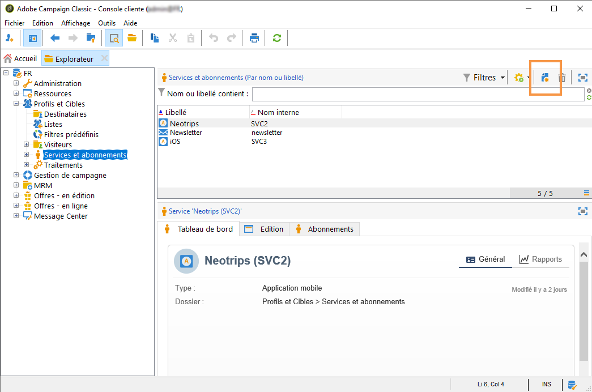
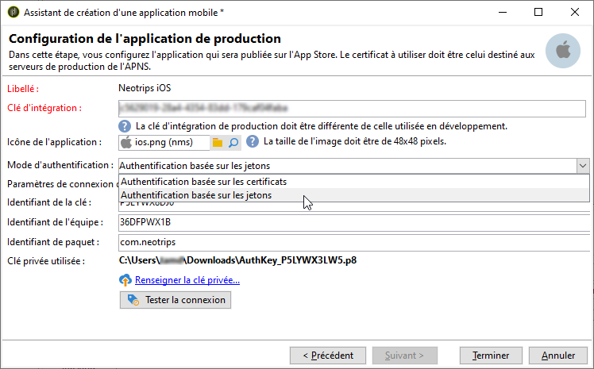
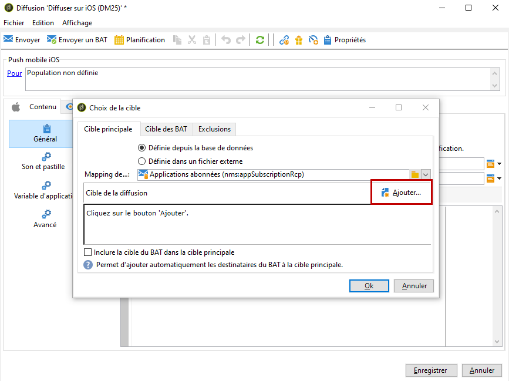
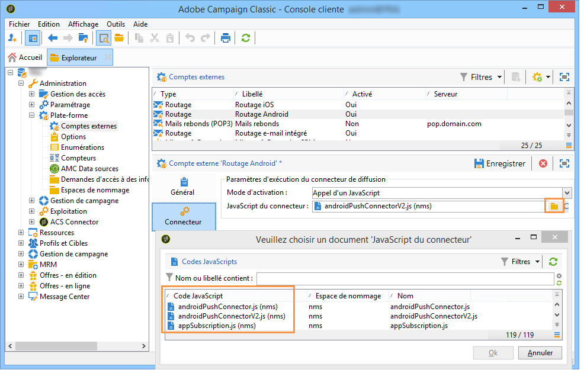
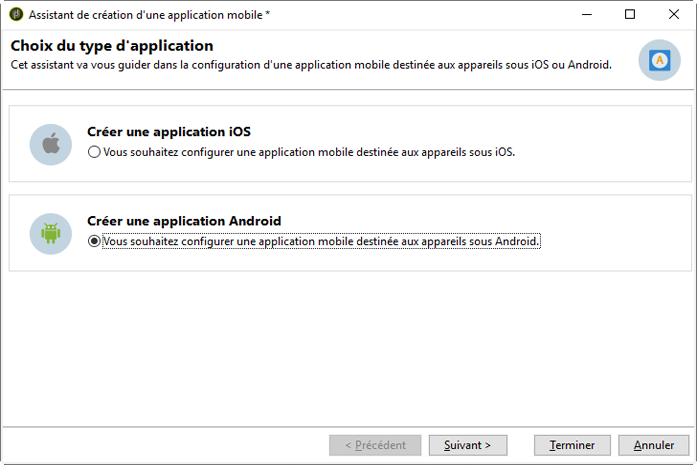

# Paramétrage de l&#39;application mobile dans Adobe Campaign {#configuring-the-mobile-application-in-adobe-campaign}

Vous trouverez ci-dessous un exemple de configuration pour une entreprise qui vend des forfaits de vacances en ligne. Elle propose son application mobile (Neotrips) en deux versions : Neotrips pour Android et Neotrips pour iOS. Pour configurer l’application mobile dans Adobe Campaign, vous devez procéder comme suit :

* Create a **[!UICONTROL Mobile application]** type information service for the Neotrips mobile application.
* Ajoutez, à ce service, les versions iOS et Android de l&#39;application.
* Créez une diffusion pour iOS et Android.

>[!NOTE]
>
>Go to the **[!UICONTROL Subscriptions]** tab of the service to view the list of subscribers to the service, i.e. all people who have installed the application on their mobile and agreed to receive notifications.

## Configuration de l’application mobile avec iOS {#configuring-the-mobile-application-ios}

>[!CAUTION]
>
>L&#39;application doit avoir été configurée pour des actions de Push AVANT toute intégration au SDK Adobe Campaign.
>
>Si ce n&#39;est pas le cas, veuillez consulter [cette page](https://developer.apple.com/library/archive/documentation/NetworkingInternet/Conceptual/RemoteNotificationsPG/).

### Étape 1 : Installation du package {#installing-package-ios}

1. Accédez à l’assistant d’importation de package **[!UICONTROL Tools > Advanced > Package import...]** dans la console client Adobe Campaign.

   

1. Sélectionner **[!UICONTROL Install a standard package]**.

1. Dans la liste qui s&#39;affiche, cochez **[!UICONTROL Mobile App Channel]**.

   

1. Click **[!UICONTROL Next]**, then **[!UICONTROL Start]** to start the package installation.

   Once the packages are installed, the progress bar shows **100%** and you can see the following message in the installation logs: **[!UICONTROL Installation of packages successful]**.

   

1. **[!UICONTROL Close]** la fenêtre d’installation.

### Étape 2 : Configuration d’un compte externe iOS {#configuring-external-account-ios}

Deux connecteurs sont disponibles pour iOS :

* Le connecteur binaire iOS envoie des notifications au serveur APNS binaire.
* Le connecteur HTTP/2 iOS envoie des notifications à l&#39;APNS HTTP/2.

Pour sélectionner le connecteur à utiliser, procédez comme suit :

1. Go to **[!UICONTROL Administration > Platform > External accounts]**.
1. Sélectionnez le compte **[!UICONTROL iOS routing]** externe.
1. Dans l’ **[!UICONTROL Connector]** onglet, renseignez le **[!UICONTROL Access URL of the connector]** champ :

   Pour le connecteur HTTP2 iOS : http://localhost:8080/nms/jsp/iosHTTP2.jsp

   

   >[!NOTE]
   >
   > Vous pouvez également le configurer comme suit https://localhost:8080/nms/jsp/ios.jsp, mais nous vous conseillons d’utiliser la version 2 du connecteur.

1. Clics **[!UICONTROL Save]**.

Votre connecteur iOS est maintenant configuré. Vous pouvez commencer à créer votre service.

### Étape 3 : Configuration du service iOS {#configuring-ios-service}

1. Accédez au **[!UICONTROL Profiles and Targets > Services and subscriptions]** noeud et cliquez sur **[!UICONTROL New]**.

   

1. Définissez un **[!UICONTROL Label]** et un **[!UICONTROL Internal name]**.
1. Accédez au **[!UICONTROL Type]** champ et sélectionnez **[!UICONTROL Mobile application]**.

   >[!NOTE]
   >
   >Le mappage **[!UICONTROL Subscriber applications (nms:appSubscriptionRcp)]** cible par défaut est lié à la table des destinataires. Si vous souhaitez utiliser un mappage de cible différent, vous devez créer un mappage de cible et le saisir dans le **[!UICONTROL Target mapping]** champ du service. Pour plus d’informations sur la création du mappage des cibles, reportez-vous au guide [de](../../configuration/using/about-custom-recipient-table.md)configuration.

   

1. Cliquez ensuite sur le **[!UICONTROL Add]** bouton pour sélectionner le type d’application.

   

1. La fenêtre suivante s’affiche. Sélectionnez **[!UICONTROL Create an iOS application]** et commencez en saisissant la **[!UICONTROL Label]**.

   

1. Vous pouvez, si nécessaire, enrichir le contenu d’un message push avec certains messages **[!UICONTROL Application variables]** . Elles sont entièrement personnalisables et font partie de la charge utile du message envoyé au périphérique mobile.
Dans l’exemple suivant, nous ajoutons **mediaURl** et **mediaExt** pour créer une notification Push riche, puis fournissons à l’application l’image à afficher dans la notification.

   

1. L’ **[!UICONTROL Subscription parameters]** onglet vous permet de définir le mappage avec une extension du **[!UICONTROL Subscriber applications (nms:appsubscriptionRcp)]** schéma.

   >[!NOTE]
   >
   >Assurez-vous que vous n&#39;utilisez pas le même certificat pour la version de développement (sandbox) et la version de production de l&#39;application.

1. L&#39; **[!UICONTROL Sounds]** onglet vous permet de spécifier un son à lire. Cliquez sur **[!UICONTROL Add]** et remplissez le **[!UICONTROL Internal name]** champ qui doit contenir le nom du fichier incorporé dans l’application ou le nom du son système.

1. Cliquez sur **[!UICONTROL Next]** pour commencer à configurer l’application de développement.

1. Assurez-vous que la même **[!UICONTROL Integration key]** est définie dans Adobe Campaign et dans le code de l’application via le SDK. Pour plus d’informations à ce sujet, voir : [Intégration du SDK de campagne dans l’application](../../delivery/using/integrating-campaign-sdk-into-the-mobile-application.md)mobile. Cette clé d’intégration, spécifique à chaque application, vous permet de lier l’application mobile à la plateforme Adobe Campaign.

   >[!NOTE]
   >
   > La valeur **[!UICONTROL Integration key]** est entièrement personnalisable, mais elle doit être identique à celle spécifiée dans le SDK.

1. Sélectionnez l’une des icônes prêtes à l’emploi dans le **[!UICONTROL Application icon]** champ pour personnaliser l’application mobile dans votre service.

1. Click the **[!UICONTROL Enter the certificate...]** link then select the authentication certificate and enter the password that was provided by the mobile application developer. Vous pouvez cliquer **[!UICONTROL Test the connection]** pour vous assurer qu’il fonctionne.

   >[!NOTE]
   >
   >Apple requiert différents certificats pour les versions de développement et de production d’une même application mobile. Vous devrez configurer les deux applications distinctes dans Adobe Campaign.

   

1. Cliquez sur **[!UICONTROL Next]** pour commencer à configurer l’application de production et suivez les étapes décrites ci-dessus.

   

1. Clics **[!UICONTROL Finish]**. Votre application iOS est maintenant prête à être utilisée dans Campaign Classic.

### Étape 4 : Création d’une notification iOS enrichie {#creating-ios-delivery}

Avec iOS 10 ou version ultérieure, il est possible de générer des notifications enrichies. Adobe Campaign peut envoyer des notifications à l&#39;aide de variables qui permettront à l&#39;appareil d&#39;afficher des notifications enrichies.

Vous devez maintenant créer une nouvelle diffusion et la lier à l’application mobile que vous avez créée.

1. Go to **[!UICONTROL Campaign management]** > **[!UICONTROL Deliveries]**.

1. Clics **[!UICONTROL New]**.

   

1. Sélectionnez **[!UICONTROL Deliver on iOS (ios)]** dans la **[!UICONTROL Delivery template]** liste déroulante. Ajoutez un élément **[!UICONTROL Label]** à votre livraison.

1. Cliquez sur **[!UICONTROL To]** pour définir la population à cibler. Par défaut, le mappage **[!UICONTROL Subscriber application]** cible est appliqué. Cliquez sur **[!UICONTROL Add]** pour sélectionner notre service créé précédemment.

   

1. Dans la **[!UICONTROL Target type]** fenêtre, sélectionnez **[!UICONTROL Subscribers of an iOS mobile application (iPhone, iPad)]** et cliquez sur **[!UICONTROL Next]**.

1. Dans la **[!UICONTROL Service]** liste déroulante, sélectionnez votre service créé précédemment, puis l’application à cibler, puis cliquez sur **[!UICONTROL Finish]**.
Les éléments **[!UICONTROL Application variables]** sont automatiquement ajoutés en fonction de ce qui a été ajouté lors des étapes de configuration.

   

1. Modifiez votre notification enrichie.

   

1. Check the **[!UICONTROL Mutable content]** box in the edit notification window to allow the mobile application to download media content.

1. Click **[!UICONTROL Save]** and send your delivery.

L’image et la page Web doivent être affichées dans la notification Push lorsqu’elles sont reçues sur les périphériques iOS mobiles des abonnés.

## Configuration de l’application mobile avec Android {#configuring-the-mobile-application-android}

### Étape 1 : Installation du package {#installing-package-android}

1. Accédez à l’assistant d’importation de package **[!UICONTROL Tools > Advanced > Package import...]** dans la console client Adobe Campaign.

   

1. Sélectionner **[!UICONTROL Install a standard package]**.

1. Dans la liste qui s&#39;affiche, cochez **[!UICONTROL Mobile App Channel]**.

   

1. Click **[!UICONTROL Next]**, then **[!UICONTROL Start]** to start the package installation.

   Once the packages are installed, the progress bar shows **100%** and you can see the following message in the installation logs: **[!UICONTROL Installation of packages successful]**.

   

1. **[!UICONTROL Close]** la fenêtre d’installation.

### Étape 2 : Configuration du compte externe Android {#configuring-external-account-android}

Deux connecteurs sont disponibles pour Android :

* Le connecteur V1 permet une connexion par MTA child.
* Le connecteur V2 permet plusieurs connexions simultanées avec le serveur FCM pour améliorer le débit.

Pour sélectionner le connecteur à utiliser, procédez comme suit :

1. Go to **[!UICONTROL Administration > Platform > External accounts]**.
1. Sélectionnez le compte **[!UICONTROL Android routing]** externe.
1. Dans l’ **[!UICONTROL Connector]** onglet, renseignez le **[!UICONTROL JavaScript used in the connector]** champ :

   Pour Android V2 : https://localhost:8080/nms/jsp/androidPushConnectorV2.js

   >[!NOTE]
   >
   > Vous pouvez également le configurer comme suit https://localhost:8080/nms/jsp/androidPushConnector.js, mais nous vous conseillons d’utiliser la version 2 du connecteur.

   

1. Pour Android V2, un paramètre supplémentaire est disponible dans le fichier de configuration du serveur Adobe (serverConf.xml) :

   * **maxGCMConnectPerChild** : limite maximale du nombre de requêtes HTTP parallèles sur le serveur FCM initiées par chaque serveur fils (8 par défaut).

### Étape 3 : Configuration du service Android {#configuring-android-service}

1. Accédez au **[!UICONTROL Profiles and Targets > Services and subscriptions]** noeud et cliquez sur **[!UICONTROL New]**.

   

1. Définissez un **[!UICONTROL Label]** et un **[!UICONTROL Internal name]**.
1. Accédez au **[!UICONTROL Type]** champ et sélectionnez **[!UICONTROL Mobile application]**.

   >[!NOTE]
   >
   >Le mappage **[!UICONTROL Subscriber applications (nms:appSubscriptionRcp)]** cible par défaut est lié à la table des destinataires. Si vous souhaitez utiliser un mappage de cible différent, vous devez créer un mappage de cible et le saisir dans le **[!UICONTROL Target mapping]** champ du service. Pour plus d’informations sur la création du mappage des cibles, reportez-vous au guide [de](../../configuration/using/about-custom-recipient-table.md)configuration.

   

1. Cliquez ensuite sur le **[!UICONTROL Add]** bouton pour sélectionner le type d’application.

   

1. Sélectionner **[!UICONTROL Create an Android application]**.

   

1. Entrez un **[!UICONTROL Label]**.

1. Assurez-vous que la même **[!UICONTROL Integration key]** est définie dans Adobe Campaign et dans le code de l’application via le SDK. Pour plus d’informations à ce sujet, voir : [Intégration du SDK de campagne dans l’application](../../delivery/using/integrating-campaign-sdk-into-the-mobile-application.md)mobile.

   >[!NOTE]
   >
   > La valeur **[!UICONTROL Integration key]** est entièrement personnalisable, mais elle doit être identique à celle spécifiée dans le SDK.

1. Sélectionnez l’une des icônes prêtes à l’emploi dans le **[!UICONTROL Application icon]** champ pour personnaliser l’application mobile dans votre service.

1. Entrez les paramètres de connexion de l’application : saisissez la clé de projet fournie par le développeur de l’application mobile.

1. Vous pouvez, si nécessaire, enrichir le contenu d’un message push avec certains messages **[!UICONTROL Application variables]** . Elles sont entièrement personnalisables et font partie de la charge utile du message envoyé au périphérique mobile.

   Dans l’exemple suivant, nous ajoutons **title**, **imageURL** et **iconURL** pour créer une notification Push riche, puis fournissons à l’application l’image, le titre et l’icône à afficher dans la notification.

   

1. Cliquez **[!UICONTROL Finish]** alors **[!UICONTROL Save]**. Votre application Android est maintenant prête à être utilisée dans Campaign Classic.

Par défaut, Adobe Campaign enregistre une clé dans le champ **[!UICONTROL User identifier]** (@userKey) de la **[!UICONTROL Subscriber applications (nms:appSubscriptionRcp)]** table. Cette clé vous permet de lier un abonnement à un destinataire. Pour collecter des données supplémentaires (par exemple, une clé de rapprochement complexe), vous devez appliquer la configuration suivante :

1. Créez une extension du **[!UICONTROL Subscriber applications (nms:appsubscriptionRcp)]** schéma et définissez les nouveaux champs.
1. Définissez le mappage dans l’ **[!UICONTROL Subscription parameters]** onglet.
   >[!CAUTION]
   >
   >Make sure the configuration names in the **[!UICONTROL Subscription parameters]** tab are the same as those in the mobile application code. Reportez-vous à la section [Intégration du SDK de campagne dans l’application](../../delivery/using/integrating-campaign-sdk-into-the-mobile-application.md) mobile.

### Étape 4 : Création d’une notification Android riche {#creating-android-delivery}

Vous devez maintenant créer une nouvelle diffusion et la lier à l’application mobile que vous avez créée.

1. Go to **[!UICONTROL Campaign management]** > **[!UICONTROL Deliveries]**.

1. Clics **[!UICONTROL New]**.

   

1. Sélectionnez **[!UICONTROL Deliver on Android (android)]** dans la **[!UICONTROL Delivery template]** liste déroulante. Ajoutez un élément **[!UICONTROL Label]** à votre livraison.

1. Cliquez sur **[!UICONTROL To]** pour définir la population à cibler. Par défaut, le mappage **[!UICONTROL Subscriber application]** cible est appliqué. Cliquez sur **[!UICONTROL Add]** pour sélectionner notre service créé précédemment.

   

1. Dans la **[!UICONTROL Target type]** fenêtre, sélectionnez Abonnés d&#39;une application mobile Android et cliquez sur **[!UICONTROL Next]**.

1. Dans la **[!UICONTROL Service]** liste déroulante, sélectionnez le service créé précédemment, puis l’application, puis cliquez sur **[!UICONTROL Finish]**.
Les éléments **[!UICONTROL Application variables]** sont automatiquement ajoutés en fonction de ce qui a été ajouté lors des étapes de configuration.

   

1. Modifiez votre notification enrichie.

   

1. Click **[!UICONTROL Save]** and send your delivery.

L&#39;image et la page web doivent s&#39;afficher dans la notification push lors de la réception sur les appareils Android des abonnés.

