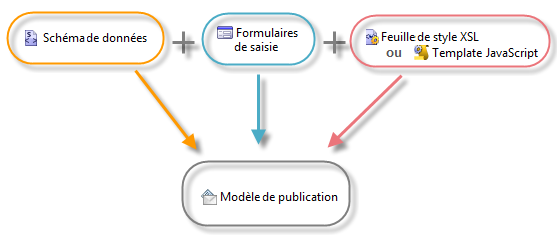

# Ressources et principes de la gestion de contenu{#content-manager-resources-and-principles}

Vous devez définir un modèle de publication contenant des modèles de transformation pour chaque contenu.

Un contenu est structuré dans un document XML pour le stockage des données. Une interface de saisie éditoriale va permettre de renseigner ce contenu dans la console cliente Adobe Campaign ou à partir d&#39;un navigateur Web. Le contenu peut également être automatiquement renseigné à partir de capture de flux XML ou de données agrégées dans une base de données.

La combinaison du document XML et des feuilles de styles XSL ou un Template Javascript génère automatiquement la projection dans les différents formats (HTML, Texte) du modèle de publication.

Les différentes ressources nécessaires pour le paramétrage d&#39;un contenu sont les suivantes :

* Schémas de données : description de la structure des contenus XML. Voir à ce sujet la section [Schémas de données](data-schemas.md).
* Formulaires de saisie de données : construction d&#39;écrans de saisie de données. Pour plus d&#39;informations, consultez la section [Formulaires de saisie](input-forms.md).
* Images : images utilisées dans les formulaires de saisie de données. Pour plus d&#39;informations, consultez la section [Gestion des images](formatting.md#image-management).
* Feuilles de style : formatage des documents de sortie en langage XSLT. Pour plus d&#39;informations, consultez la section [Formatage](formatting.md).
* Modèles JavaScript : formatage des documents de sortie en langage JavaScript. Pour plus d&#39;informations, consultez la section [Modèles de publication](publication-templates.md).
* Codes JavaScript : codes JavaScript pour l&#39;agrégation des données. Pour plus d&#39;informations, consultez la section [Agrégateur](publication-templates.md#aggregator).
* Modèles de publication : définition des modèles de publication. Pour plus d&#39;informations, consultez la section [Modèles de publication](publication-templates.md).
* Contenu : instances de contenu à créer et à publier. Pour plus d&#39;informations à ce sujet, reportez-vous à la section [Utiliser un modèle de contenu](using-a-content-template.md).
