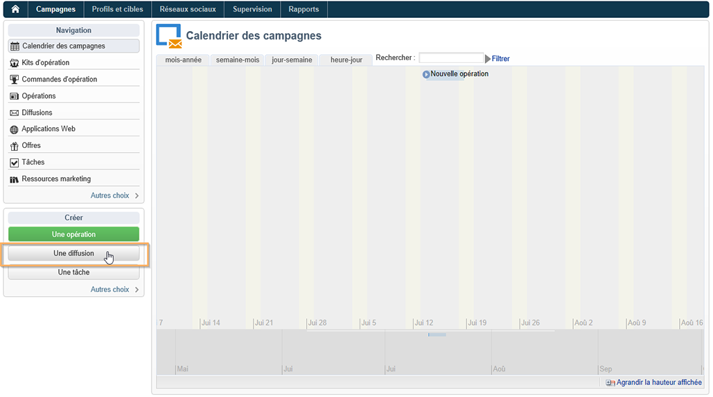

# Créer des notifications pour Android{#create-notificaations-android}

Utilisez Adobe Campaign pour envoyer des notifications push sur les appareils Android. Les concepts généraux relatifs à la création d&#39;une diffusion sont présentés dans [cette section](steps-about-delivery-creation-steps.md).

Créez tout d&#39;abord une nouvelle diffusion.

Firebase Cloud Messaging vous permet de choisir entre deux types de messages :

* **[!UICONTROL Message de données]**, géré par l&#39;application cliente.
    Les messages sont envoyés directement à l&#39;application mobile qui génèrera et affichera la notification Android sur l&#39;appareil. Les messages de données contiennent uniquement vos variables d&#39;application personnalisées.

* **[!UICONTROL Message de notification]**, géré automatiquement par le SDK FCM.
     FCM affiche automatiquement le message sur les appareils de vos utilisateurs pour le compte de l&#39;application cliente. Les messages de notification contiennent un ensemble de paramètres et d&#39;options prédéfini, mais peuvent encore être personnalisés avec des variables d&#39;application personnalisées.

Pour plus d&#39;informations sur les types de messages Firebase Cloud Messaging, consultez la [documentation de FCM](https://firebase.google.com/docs/cloud-messaging/concept-options#notifications_and_data_messages).

## Créer un message de données {#creating-data-message}

1. Accédez à **[!UICONTROL Gestion de campagne]** > **[!UICONTROL Diffusions]**.

1. Cliquez sur **[!UICONTROL Nouveau]**.

   

1. Sélectionnez **[!UICONTROL Diffuser sur Android (android)]** dans la liste déroulante **[!UICONTROL Modèle de diffusion]**. Ajoutez un **[!UICONTROL Libellé]** à la diffusion.

1. Cliquez sur **[!UICONTROL Pour]** pour définir la population à cibler. Par défaut, le mapping de ciblage **[!UICONTROL Application abonnés]** est appliquée. Cliquez sur **[!UICONTROL Ajouter]** pour sélectionner votre service.

   

1. Dans la fenêtre **[!UICONTROL Type de cible]******, sélectionnez Abonnés d&#39;une application mobile Android, puis cliquez sur **[!UICONTROL Suivant]**.

1. Dans la liste déroulante **[!UICONTROL Service]**, sélectionnez le service créé précédemment, puis l&#39;application ciblée, et cliquez sur **[!UICONTROL Terminer]**.
Les **[!UICONTROL variables d&#39;application]** sont automatiquement ajoutées en fonction de ce qui a été incorporé au cours des étapes de configuration.

   

1. Sélectionnez le **[!UICONTROL message de données]** comme **[!UICONTROL type de message]**.

1. Modifiez la notification enrichie.

   

1. Si nécessaire, vous pouvez ajouter des informations dans vos **[!UICONTROL variables d&#39;application]** configurées précédemment. **[!UICONTROL Les variables d&#39;application]** doivent être configurées dans le service Android et font partie de la payload du message envoyée à l&#39;appareil mobile.

1. Cliquez sur **[!UICONTROL Enregistrer]**, puis envoyez votre diffusion.

L&#39;image et la page web doivent s&#39;afficher dans la notification push lors de la réception sur les appareils Android des abonnés.

## Créer un message de notification {#creating-notification-message}

>[!NOTE]
>
>D&#39;autres options de message de notification sont disponibles uniquement avec la configuration d&#39;API HTTP v1. Pour plus d&#39;informations à ce sujet, consultez cette [section](configuring-the-mobile-application-android.md#android-service-httpv1).

 [Découvrez comment créer une notification push Android en vidéo](https://experienceleague.adobe.com/docs/campaign-classic-learn/getting-started-with-push-notifications-for-android/configuring-and-sending-push-notifications.html?lang=fr#additional-resources)

1. Accédez à **[!UICONTROL Gestion de campagne]** > **[!UICONTROL Diffusions]**.

1. Cliquez sur **[!UICONTROL Nouveau]**.

   

1. Sélectionnez **[!UICONTROL Diffuser sur Android (android)]** dans la liste déroulante **[!UICONTROL Modèle de diffusion]**. Ajoutez un **[!UICONTROL Libellé]** à la diffusion.

1. Cliquez sur **[!UICONTROL Pour]** pour définir la population à cibler. Par défaut, le mapping de ciblage **[!UICONTROL Application abonnés]** est appliquée. Cliquez sur **[!UICONTROL Ajouter]** pour sélectionner votre service.

   

1. Dans la fenêtre **[!UICONTROL Type de cible]******, sélectionnez Abonnés d&#39;une application mobile Android, puis cliquez sur **[!UICONTROL Suivant]**.

1. Dans la liste déroulante **[!UICONTROL Service]**, sélectionnez le service créé précédemment, puis l&#39;application ciblée, et cliquez sur **[!UICONTROL Terminer]**.

   

1. Sélectionnez le **[!UICONTROL message de notification]** comme **[!UICONTROL type de message]**.

1. Ajoutez un titre et modifiez votre message. Personnalisez votre notification push avec les **[!UICONTROL options de notification]** :

   * **[!UICONTROL Identifiant de canal]** : définissez l&#39;identifiant de canal de votre notification. L&#39;application doit créer un canal avec cet identifiant de canal avant la réception d&#39;une notification avec cet identifiant de canal.
   * **[!UICONTROL Son]** : définissez le son à émettre lorsque l&#39;appareil reçoit votre notification.
   * **[!UICONTROL Couleur]** définissez la couleur de l&#39;icône de votre notification.
   * **[!UICONTROL Icône]** : définissez l&#39;icône de la notification pour qu&#39;elle s&#39;affiche sur les appareils de vos profils.
   * **[!UICONTROL Balise]** : définissez l&#39;identifiant utilisé pour remplacer les notifications existantes dans le tiroir de notifications.
   * **[!UICONTROL Action de clic]** : définissez l&#39;action associée à un clic de l&#39;utilisateur sur votre notification.

   Pour plus d&#39;informations sur les **[!UICONTROL options de notification]** et sur la façon de remplir ces champs, consultez la [documentation FCM](https://firebase.google.com/docs/reference/fcm/rest/v1/projects.messages#androidnotification).

   

1. Si votre application est configurée avec le protocole API HTTP v1, vous pouvez personnaliser davantage votre notification push à l&#39;aide des **[!UICONTROL options supplémentaires HTTPV1]** suivantes :

   * **[!UICONTROL Bandeau déroulant]** : définissez le texte du bandeau déroulant de votre notification. Uniquement disponible pour les appareils configurés sur Android 5.0 Lollipop.
   * **[!UICONTROL Image]** : définissez l&#39;URL de l&#39;image à afficher dans votre notification.
   * **[!UICONTROL Nombre de notifications]** : définissez le nombre de nouvelles informations non lues à afficher directement sur l&#39;icône de l&#39;application.
   * **[!UICONTROL Épinglé]** : définissez cette variable sur true ou false. Si elle est définie sur false, la notification est automatiquement ignorée lorsque l&#39;utilisateur clique dessus. Si elle est définie sur true, la notification reste affichée même lorsque l&#39;utilisateur clique dessus.
   * **[!UICONTROL Priorité des notifications]** : définissez les niveaux de priorité de votre notification sur &#39;par défaut&#39;, &#39;minimum&#39;, &#39;basse&#39; ou &#39;élevée&#39;. Pour plus d&#39;informations à ce propos, consultez la [documentation FCM](https://firebase.google.com/docs/reference/fcm/rest/v1/projects.messages#NotificationPriority).
   * **[!UICONTROL Visibilité]** : définissez les niveaux de visibilité de votre notification sur public, privé ou secret. Pour plus d&#39;informations à ce propos, consultez la [documentation FCM](https://firebase.google.com/docs/reference/fcm/rest/v1/projects.messages#visibility).

   Pour plus d&#39;informations sur les **[!UICONTROL options supplémentaires HTTPv1]** et sur la façon de remplir ces champs, consultez la [documentation FCM](https://firebase.google.com/docs/reference/fcm/rest/v1/projects.messages#androidnotification).

   

1. Si nécessaire, vous pouvez ajouter des informations dans vos **[!UICONTROL variables d&#39;application]** configurées précédemment. **[!UICONTROL Les variables d&#39;application]** doivent être configurées dans le service Android et font partie de la payload du message envoyée à l&#39;appareil mobile.

1. Cliquez sur **[!UICONTROL Enregistrer]**, puis envoyez votre diffusion.

L&#39;image et la page web doivent s&#39;afficher dans la notification push lors de la réception sur les appareils Android des abonnés.
