# Créer des notifications pour iOS{#create-notifications-ios}

Cette section présente les éléments spécifiques à la diffusion de notifications iOS. Les concepts généraux relatifs à la création d&#39;une diffusion sont présentés dans [cette section](steps-about-delivery-creation-steps.md).

Créez tout d&#39;abord une nouvelle diffusion.

Pour créer une notification push pour les appareils iOS, procédez comme suit :

1. Sélectionnez le modèle de diffusion **[!UICONTROL Diffuser sur iOS]**.

   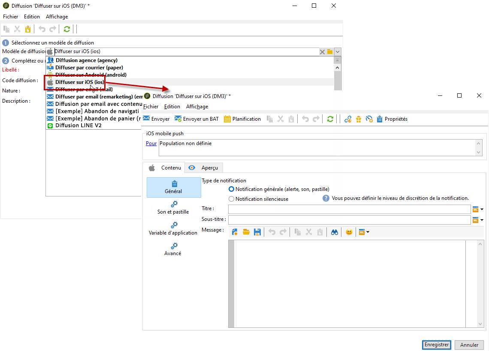

1. Pour définir la cible de la notification, cliquez sur le lien **[!UICONTROL Pour]**, puis sur **[!UICONTROL Ajouter]**.

   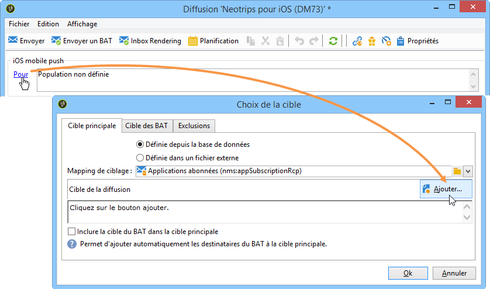

   >[!NOTE]
   >
   >Le processus détaillé de sélection de la population cible d’une diffusion est présenté dans [cette section](steps-defining-the-target-population.md).
   >
   >Pour plus d’informations sur l’utilisation des champs de personnalisation, consultez [cette section](about-personalization.md).
   >
   >Pour plus d’informations sur l’inclusion d’une liste de contrôle, consultez la section [À propos des adresses de contrôle](about-seed-addresses.md).

1. Sélectionnez **[!UICONTROL Abonnés d&#39;une application mobile iOS (iPhone, iPad)]**, choisissez le service correspondant à votre application mobile (Neotrips, dans notre exemple), puis sélectionnez la version iOS de l&#39;application.

   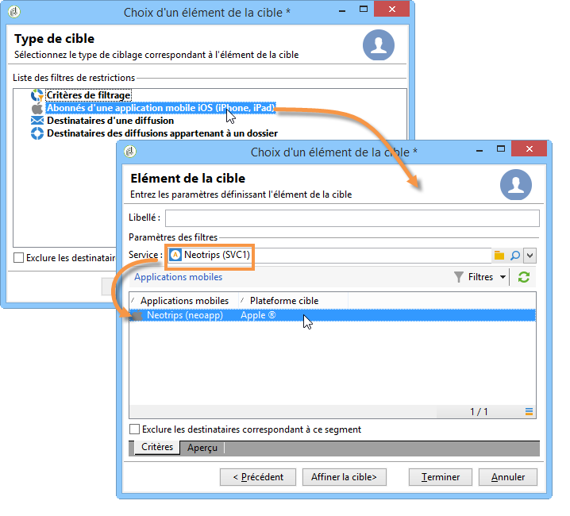

1. Choisissez votre **[!UICONTROL Type de notification]** entre **[!UICONTROL Notification générale (alerte, son, pastille)]** ou **[!UICONTROL Notification silencieuse]**.

   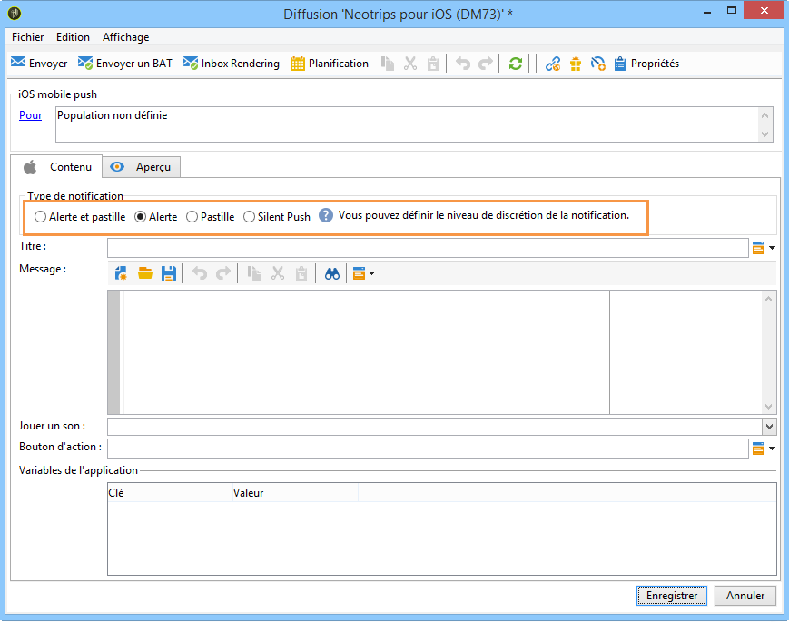

   >[!NOTE]
   >
   >Le mode **Notification silencieuse** permet d&#39;envoyer une notification &quot;silencieuse&quot; à une application mobile. L&#39;utilisateur n&#39;est pas averti de l&#39;arrivée de la notification. Elle est directement transférée à l&#39;application.

1. Dans le champ **[!UICONTROL Titre]**, saisissez le libellé du titre qui doit apparaître dans la liste des notifications disponibles depuis le centre de notifications.

   Ce champ vous permet de définir la valeur du paramètre **Titre** de la payload de notification iOS.

1. Vous pouvez ajouter un **[!UICONTROL Sous-titre]**, valeur du paramètre sous-titre de la payload de notification iOS. Consultez [cette section](configuring-the-mobile-application.md).

1. Saisissez le contenu du message dans la section **[!UICONTROL Contenu du message]** de l’assistant. L’utilisation des champs de personnalisation est présentée dans la section [À propos de la personnalisation](about-personalization.md).

   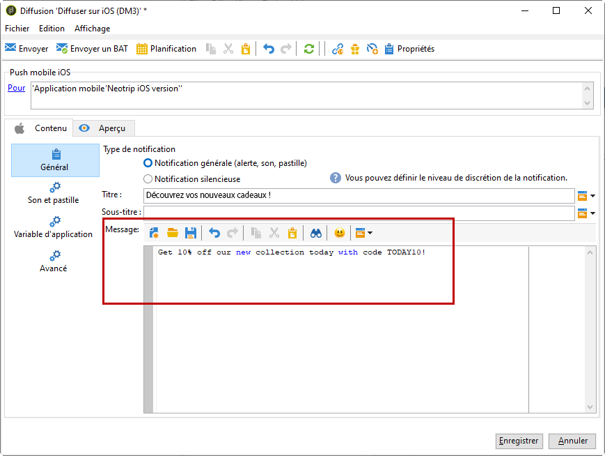

1. Cliquez sur l’icône **[!UICONTROL Insérer une émoticône]** pour insérer des émoticônes dans votre notification push. Pour personnaliser la liste des émoticônes, consultez [cette section](customizing-emoticon-list.md).

1. Dans l’onglet **[!UICONTROL Son et pastille]** vous pouvez modifier les options suivantes :

   * **[!UICONTROL Nettoyer la pastille]** : activez cette option pour actualiser la valeur de la pastille.

   * **[!UICONTROL Valeur]** : définissez un nombre qui sera utilisé pour afficher directement sur l’icône de l’application le nombre de nouvelles informations non lues.

   * **[!UICONTROL Mode d’alerte critique]** : activez cette option pour ajouter du son à votre notification, même si le téléphone de l&#39;utilisateur est en mode thème ou si l’iPhone est en mode silencieux.

   * **[!UICONTROL Nom]** : sélectionnez le son que doit émettre le terminal mobile à la réception de la notification.

   * **[!UICONTROL Volume]** : volume de votre son de 0 à 100.

   >[!NOTE]
   >
   >Les sons doivent être inclus dans l’application et définis lors de la création du service. Consultez [cette section](configuring-the-mobile-application.md#configuring-external-account-ios).

   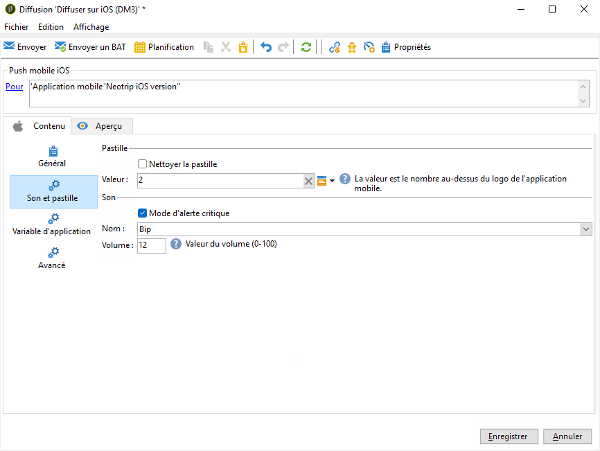

1. Dans l’onglet **[!UICONTROL Variables de l’application]**, vos **[!UICONTROL variables d’application]** sont automatiquement ajoutées. Elles permettent de définir le comportement des notifications. Par exemple, vous pouvez configurer l’affichage d’un écran spécifique lorsque l’utilisateur active la notification.

   Pour plus d’informations, consultez [cette section](configuring-the-mobile-application.md).

1. Dans l’onglet **[!UICONTROL Avancé]**, vous pouvez modifier les options générales suivantes :

   * **[!UICONTROL Contenu mutable]** : activez cette option pour permettre à l’application mobile de télécharger le contenu multimédia.

   * **[!UICONTROL Thread-id]** : identifiant utilisé pour regrouper les notifications associées.

   * **[!UICONTROL Catégorie]** : nom de votre identifiant de catégorie qui affichera les boutons d’action. Ces notifications permettent à l&#39;utilisateur d&#39;effectuer plus rapidement différentes tâches en réponse à celles-ci, sans ouvrir l&#39;application ou la parcourir.

   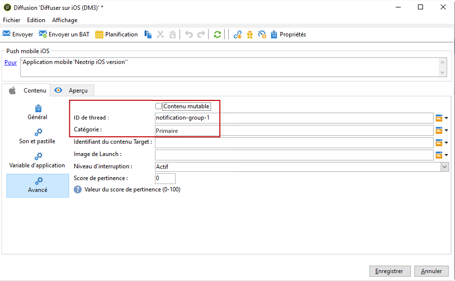

1. Pour une notification sensible à l’heure, vous pouvez spécifier les options suivantes :

   * **[!UICONTROL Identifiant du contenu Target]** : identifiant utilisé pour cibler la fenêtre d&#39;application à afficher au premier plan à l&#39;ouverture de la notification.

   * **[!UICONTROL Image de Launch]** : nom du fichier image de Launch à afficher. Si l’utilisateur choisit de lancer votre application, l’image sélectionnée s’affichera au lieu de l’écran de lancement de votre application.

   * **[!UICONTROL Niveau d&#39;interruption]**:

      * **[!UICONTROL Actif]** : défini par défaut, le système présente immédiatement la notification, illumine l’écran et peut émettre un son. Les notifications ne passent pas en mode Thème.

      * **[!UICONTROL Passif]** : le système ajoute la notification à la liste de notifications sans allumer l’écran ni émettre de son. Les notifications ne passent pas en mode Thème.

      * **[!UICONTROL Sensible à l’heure]** : le système présente immédiatement la notification, allume l’écran, peut émettre un son et passer en mode Concentration. Ce niveau ne nécessite pas d’autorisation spéciale de la part d’Apple.

      * **[!UICONTROL Critique]** : le système présente immédiatement la notification, allume l’écran et contourne le bouton de désactivation ou le mode Concentration. Notez que ce niveau nécessite une autorisation spéciale de la part d’Apple.

   * **[!UICONTROL Score de pertinence]** : définissez un score de pertinence compris entre 0 et 100. Le système l’utilise pour trier les notifications dans le résumé de la notification.

   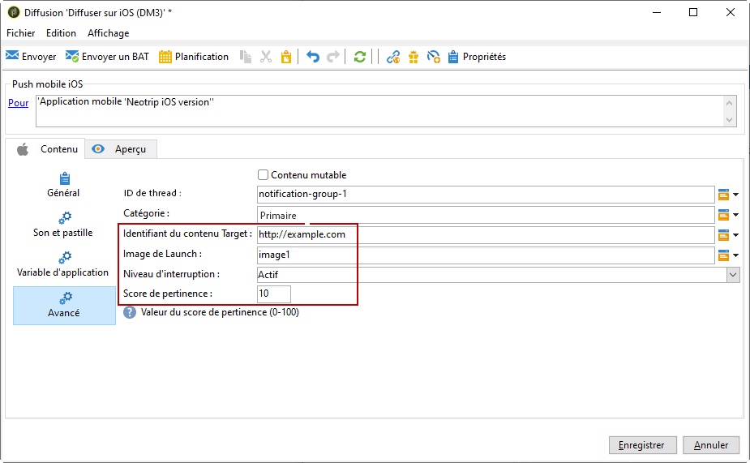

1. Une fois la notification configurée, cliquez sur l&#39;onglet **[!UICONTROL Aperçu]** pour la prévisualiser.

   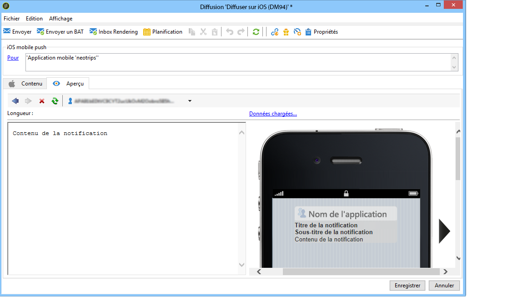

   >[!NOTE]
   >
   >Le style de la notification (bannière ou alerte) n&#39;est pas défini dans Adobe Campaign. Il dépend de la configuration choisie par l&#39;utilisateur dans les réglages iOS. Adobe Campaign vous permet cependant d&#39;afficher un aperçu de la notification pour chaque style. Cliquez sur la flèche, en bas à droite, pour basculer d&#39;un style à l&#39;autre.
   >
   >L&#39;aperçu utilise l&#39;apparence d&#39;iOS 10.

L’envoi du BAT et l’envoi final de la notification s’effectuent de la même manière que pour une diffusion par e-mail. [En savoir plus](steps-validating-the-delivery.md)

Après l&#39;envoi des messages, vous pouvez surveiller et suivre vos diffusions. Pour plus d’informations, consultez les sections suivantes :

* [Quarantaines des notifications push](understanding-quarantine-management.md#push-notification-quarantines)
* [Contrôler une diffusion](about-delivery-monitoring.md)
* [Comprendre les échecs de diffusion](understanding-delivery-failures.md)

## Créer une notification iOS enrichie {#creating-ios-delivery}

Avec iOS 10 ou version ultérieure, il est possible de générer des notifications enrichies. Adobe Campaign peut envoyer des notifications à l&#39;aide de variables qui permettront à l&#39;appareil d&#39;afficher des notifications enrichies.

Vous devez maintenant créer une nouvelle diffusion et l’associer à l’application mobile que vous avez créée.

1. Accédez à **[!UICONTROL Gestion de campagne]** > **[!UICONTROL Diffusions]**.

1. Cliquez sur **[!UICONTROL Nouveau]**.

   

1. Sélectionnez **[!UICONTROL Diffuser sur iOS (ios)]** dans la liste déroulante **[!UICONTROL Modèle de diffusion]**. Ajoutez un **[!UICONTROL Libellé]** à la diffusion.

1. Cliquez sur **[!UICONTROL Pour]** pour définir la population à cibler. Par défaut, le mapping de ciblage **[!UICONTROL Application abonnés]** est appliquée. Cliquez sur **[!UICONTROL Ajouter]** pour sélectionner le service créé précédemment.

   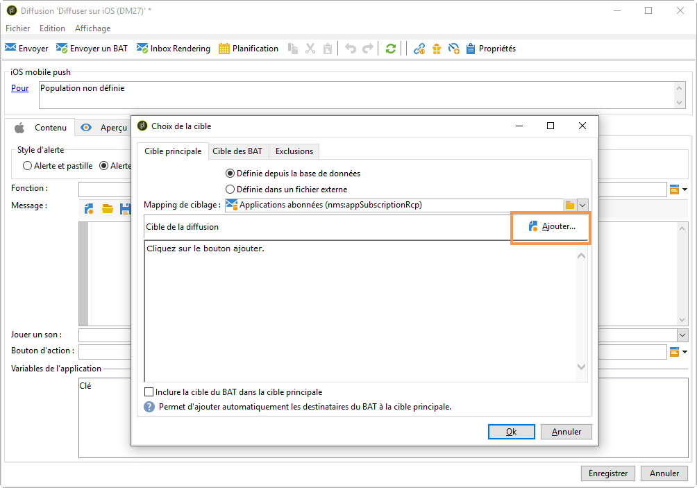

1. Dans la fenêtre **[!UICONTROL Type de cible]**, sélectionnez **[!UICONTROL Abonnés d’une application mobile iOS (iPhone, iPad)]** et cliquez sur **[!UICONTROL Suivant]**.

1. Dans la liste déroulante **[!UICONTROL Service]**, sélectionnez le service créé précédemment, puis l’application ciblée, et cliquez sur **[!UICONTROL Terminer]**.

   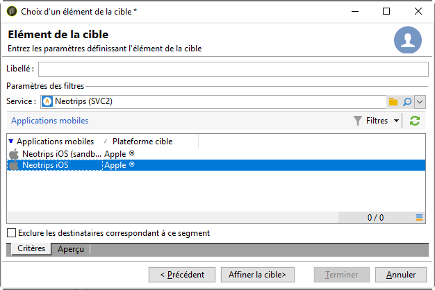

1. Modifiez la notification enrichie.

   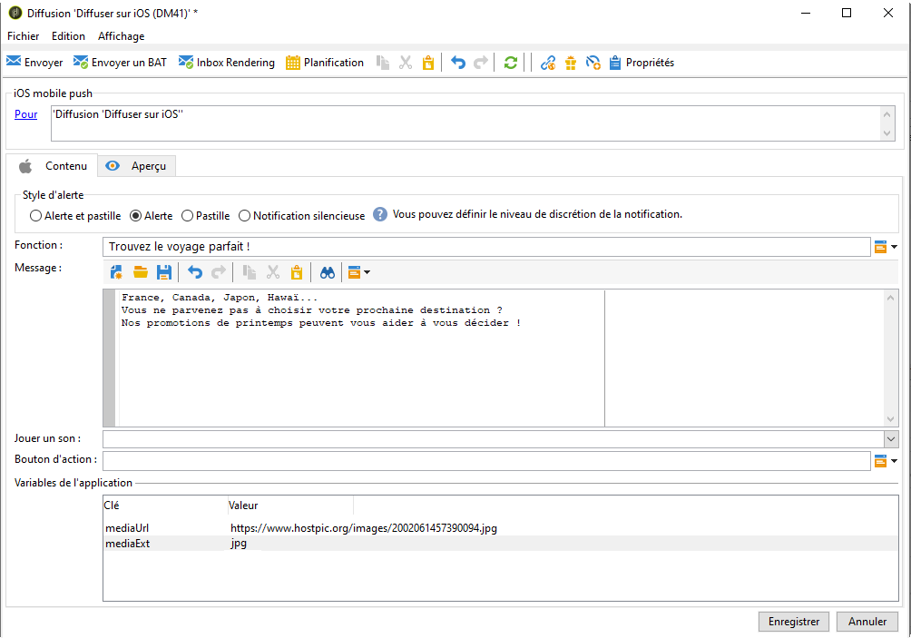

1. Dans l’onglet **[!UICONTROL Variables d’application]**, vos **[!UICONTROL variables d’application]** sont automatiquement ajoutées en fonction de ce qui a été ajouté lors des étapes de configuration.

   >[!NOTE]
   >
   >Les variables d’application doivent être définies dans le code de l’application mobile et saisies lors de la création du service. Pour plus d’informations, consultez [cette section](configuring-the-mobile-application.md).

   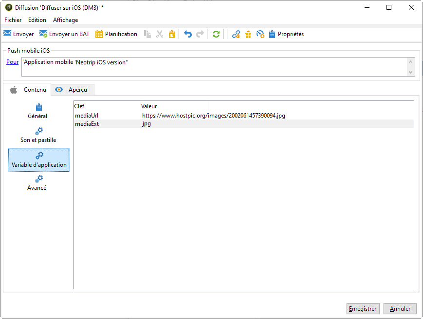

1. Dans l’onglet **[!UICONTROL Avancé]**, cochez la case **[!UICONTROL Contenu mutable]** pour permettre à l’application mobile de télécharger du contenu multimédia.

1. Cliquez sur **[!UICONTROL Enregistrer]**, puis envoyez votre diffusion.

L’image et la page web doivent s’afficher dans la notification push lors de la réception sur les appareils iOS des abonnés.

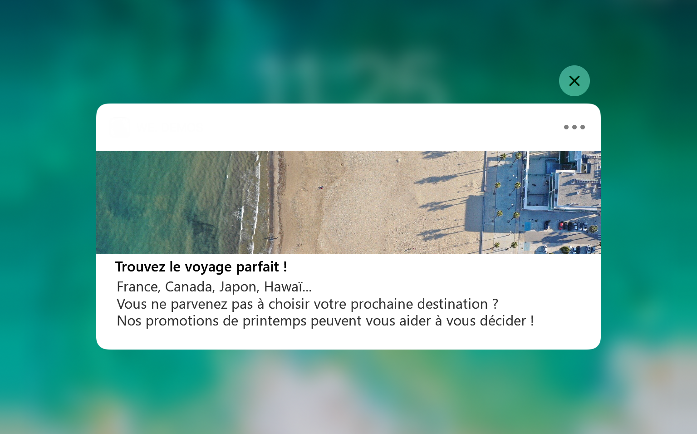

