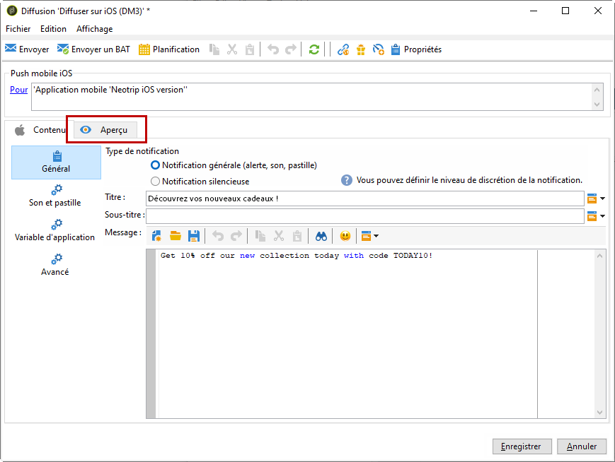
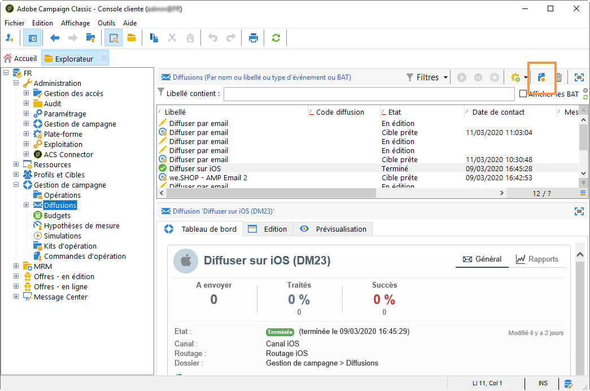
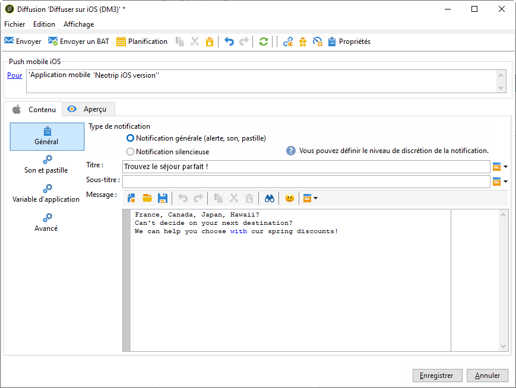

# Créer des notifications pour iOS{#create-notifications-ios}

Cette section présente les éléments spécifiques à la diffusion de notifications iOS. Les concepts généraux relatifs à la création d&#39;une diffusion sont présentés dans [cette section](steps-about-delivery-creation-steps.md).

Créez tout d&#39;abord une nouvelle diffusion.

Pour créer une notification push pour les appareils iOS, procédez comme suit :

1. Sélectionnez le modèle de diffusion **[!UICONTROL Diffuser sur iOS]**.

   

1. Pour définir la cible de la notification, cliquez sur le lien **[!UICONTROL Pour]**, puis sur **[!UICONTROL Ajouter]**.

   

   >[!NOTE]
   >
   >Le processus détaillé de sélection de la population cible d’une diffusion est présenté dans [cette section](steps-defining-the-target-population.md).
   >
   >Pour plus d’informations sur l’utilisation des champs de personnalisation, consultez [cette section](about-personalization.md).
   >
   >Pour plus d’informations sur l’inclusion d’une liste de contrôle, consultez la section [À propos des adresses de contrôle](about-seed-addresses.md).

1. Sélectionnez **[!UICONTROL Abonnés d&#39;une application mobile iOS (iPhone, iPad)]**, choisissez le service correspondant à votre application mobile (Neotrips, dans notre exemple), puis sélectionnez la version iOS de l&#39;application.

   

1. Sélectionnez le type de notification : **[!UICONTROL Alerte]**, **[!UICONTROL Pastille]**, **[!UICONTROL Alerte et pastille]** ou **[!UICONTROL Silent push]**.

   

   >[!NOTE]
   >
   >Le mode **Notification silencieuse** permet d&#39;envoyer une notification &quot;silencieuse&quot; à une application mobile. L&#39;utilisateur n&#39;est pas averti de l&#39;arrivée de la notification. Elle est directement transférée à l&#39;application.

1. Dans le champ **[!UICONTROL Titre]**, renseignez le libellé du titre que vous souhaitez voir apparaître sur la notification. Il apparaîtra uniquement au niveau de la liste de notifications disponible depuis le centre de notifications. Ce champ permet de définir la valeur du paramètre **title** de la payload des notifications iOS.

1. Si vous utilisez le connecteur HTTP/2, vous pouvez ajouter un sous-titre (valeur du paramètre **subtitle** de la payload des notifications iOS). Consultez [cette section](configuring-the-mobile-application.md).

1. Saisissez ensuite le **[!UICONTROL Message]** et la **[!UICONTROL Valeur de la pastille]**, en fonction du type de notification choisi.

   

   >[!NOTE]
   >
   >Les notifications de type **[!UICONTROL Pastille]** et **[!UICONTROL Alerte et pastille]** permettent de modifier la valeur de la pastille (le chiffre affiché au-dessus du logo de l&#39;application mobile). Pour réinitialiser la pastille, il suffit de mettre 0 comme valeur. Si le champ est vide, la valeur de la pastille ne sera pas changée.

1. Cliquez sur l’icône **[!UICONTROL Insérer une émoticône]** pour insérer des émoticônes dans votre notification push. Pour personnaliser la liste des émoticônes, consultez [cette section](customizing-emoticon-list.md).

1. Le champ **[!UICONTROL Bouton d&#39;action]** vous permet de définir un libellé pour le bouton d&#39;action apparaissant sur les notifications de type alerte (champ **action_loc_key** de la payload). Si votre application iOS gère les chaînes localisables (**Localizable.strings**), renseignez dans ce champ, la clé correspondante. Si votre application ne gère pas le texte localisé, renseignez le libellé que vous souhaitez voir apparaître sur le bouton d&#39;action. Pour plus d&#39;informations sur les chaînes localisables, consultez [la documentation Apple](https://developer.apple.com/library/archive/documentation/NetworkingInternet/Conceptual/RemoteNotificationsPG/CreatingtheNotificationPayload.html#//apple_ref/doc/uid/TP40008194-CH10-SW1) .
1. Dans le champ **[!UICONTROL Jouer un son]**, sélectionnez le son que doit émettre le terminal mobile à la réception de la notification.

   >[!NOTE]
   >
   >Les sons doivent être inclus dans l’application et définis lors de la création du service. Consultez [cette section](configuring-the-mobile-application.md#configuring-external-account-ios).

1. Dans le champ **[!UICONTROL Variables de l&#39;application]**, renseignez la valeur de chaque variable. Les variables de l&#39;application permettent de définir le comportement des notifications : par exemple, lorsque l&#39;utilisateur active la notification, il est possible d&#39;afficher un écran particulier de l&#39;application.

   >[!NOTE]
   >
   >Les variables d’application doivent être définies dans le code de l’application mobile et saisies lors de la création du service. Pour plus d&#39;informations à ce sujet, consultez [cette section](configuring-the-mobile-application.md).

1. Une fois la notification renseignée, cliquez sur l&#39;onglet **[!UICONTROL Aperçu]** pour afficher la prévisualisation de la notification.

   

   >[!NOTE]
   >
   >Le style de la notification (bannière ou alerte) n&#39;est pas défini dans Adobe Campaign. Il dépend de la configuration choisie par l&#39;utilisateur dans les réglages iOS. Adobe Campaign vous permet cependant d&#39;afficher un aperçu de la notification pour chaque style. Cliquez sur la flèche, en bas à droite, pour basculer d&#39;un style à l&#39;autre.
   >
   >L&#39;aperçu utilise l&#39;apparence d&#39;iOS 10.

L&#39;envoi du BAT et l&#39;envoi final de la notification s&#39;effectuent de la même manière que pour une diffusion par e-mail.

Après l&#39;envoi des messages, vous pouvez surveiller et suivre vos diffusions. Pour plus d’informations, consultez les sections suivantes :

* [Quarantaines des notifications push](understanding-quarantine-management.md#push-notification-quarantines)
* [Contrôler une diffusion](about-delivery-monitoring.md)
* [Comprendre les échecs de diffusion](understanding-delivery-failures.md)

## Créer une notification iOS enrichie {#creating-ios-delivery}

Avec iOS 10 ou version ultérieure, il est possible de générer des notifications enrichies. Adobe Campaign peut envoyer des notifications à l&#39;aide de variables qui permettront à l&#39;appareil d&#39;afficher des notifications enrichies.

Vous devez maintenant créer une nouvelle diffusion et l’associer à l’application mobile que vous avez créée.

1. Accédez à **[!UICONTROL Gestion de campagne]** > **[!UICONTROL Diffusions]**.

1. Cliquez sur **[!UICONTROL Nouveau]**.

   

1. Sélectionnez **[!UICONTROL Diffuser sur iOS (ios)]** dans la liste déroulante **[!UICONTROL Modèle de diffusion]**. Ajoutez un **[!UICONTROL Libellé]** à la diffusion.

1. Cliquez sur **[!UICONTROL Pour]** pour définir la population à cibler. Par défaut, le mapping de ciblage **[!UICONTROL Application abonnés]** est appliquée. Cliquez sur **[!UICONTROL Ajouter]** pour sélectionner le service créé précédemment.

   

1. Dans la fenêtre **[!UICONTROL Type de cible]**, sélectionnez **[!UICONTROL Abonnés d’une application mobile iOS (iPhone, iPad)]** et cliquez sur **[!UICONTROL Suivant]**.

1. Dans la liste déroulante **[!UICONTROL Service]**, sélectionnez le service créé précédemment, puis l’application ciblée, et cliquez sur **[!UICONTROL Terminer]**.
Les **[!UICONTROL variables d’application]** sont automatiquement ajoutées en fonction de ce qui a été incorporé au cours des étapes de configuration.

   

1. Modifiez la notification enrichie.

   

1. Cochez la case **[!UICONTROL Contenu mutable]** dans la fenêtre d’édition des notifications. L’application mobile pourra ainsi télécharger le contenu multimédia.

1. Cliquez sur **[!UICONTROL Enregistrer]**, puis envoyez votre diffusion.

L’image et la page web doivent s’afficher dans la notification push lors de la réception sur les appareils iOS des abonnés.

