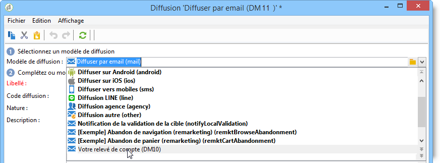
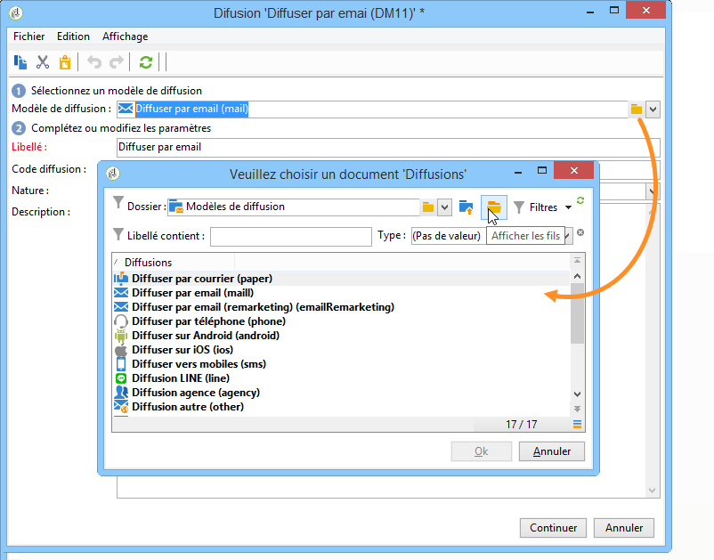
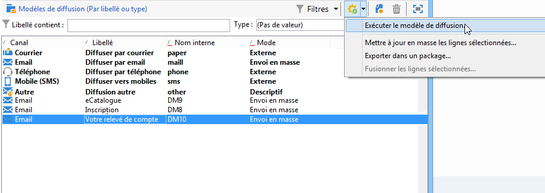

# Création d’une diffusion depuis un modèle{#creating-a-delivery-from-a-template}

## Association du modèle à une diffusion {#linking-the-template-to-a-delivery}

Pour créer une diffusion basée sur un modèle existant, vous devez sélectionner le modèle dans la liste des modèles de diffusion proposés.

Sinon, cliquez sur le dossier **[!UICONTROL Choisir le lien]** situé à droite du champ pour parcourir l&#39;arborescence.

Sélectionnez le répertoire visé depuis le champ **[!UICONTROL Dossier]** ou cliquez sur l&#39;icône **[!UICONTROL Afficher les fils]** pour afficher le contenu des répertoires situés en sous-arborescence du répertoire courant.

Sélectionnez le modèle de diffusion à utiliser et cliquez sur **[!UICONTROL Ok]**.

## Exécution du modèle {#executing-the-template}

Vous pouvez lancer l&#39;exécution d&#39;un modèle directement depuis la liste des modèles, sans devoir créer de diffusion au préalable. Pour ce faire, sélectionnez le modèle à exécuter et cliquez avec le bouton droit de la souris. Sélectionnez **[!UICONTROL Actions > Exécuter le modèle de diffusion...]**.

Vous pouvez aussi utiliser le menu **[!UICONTROL Fichier > Actions > Exécuter le modèle de diffusion...]**.

Renseignez ensuite les paramètres de la diffusion et cliquez sur **[!UICONTROL Envoyer]**.

Cette action crée une diffusion dans le dossier attaché au modèle. Le nom de cette diffusion est le nom du modèle de diffusion à partir duquel elle a été créée.

>[!NOTE]
>
>Pour plus dʼinformations sur la configuration dʼune diffusion, consultez la section [Définition du contenu de lʼe-mail](defining-the-email-content.md).
