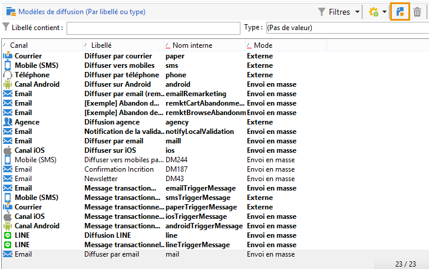

# Créer un modèle de diffusion{#creating-a-delivery-template}

 [Découvrez cette fonctionnalité en vidéo](#delivery-template-video)

## Transformer une diffusion existante en modèle {#converting-an-existing-delivery-to-a-template}

Une diffusion peut être convertie en modèle pour de nouvelles actions de diffusion répétées. Pour transformer une diffusion en modèle, sélectionnez-la dans la liste des diffusions accessible à partir du **[!UICONTROL Gestion de campagne]** du noeud de l’arborescence.

Cliquez avec le bouton droit et choisissez **[!UICONTROL Actions > Sauver comme modèle...]**.

Cette action crée un modèle de diffusion à partir de la diffusion sélectionnée. Vous devez saisir le dossier dans lequel il est enregistré (dans la variable **[!UICONTROL Dossier]** ) ainsi que le dossier dans lequel les diffusions créées à partir de ce modèle sont créées (dans la variable **[!UICONTROL Dossier d’exécution]** ).

Pour plus d’informations sur le mode de configuration, voir [Associer le modèle à une diffusion](creating-a-delivery-from-a-template.md#linking-the-template-to-a-delivery).

## Créer un modèle {#creating-a-new-template}

>[!NOTE]
>
>Afin d’éviter toute erreur de configuration, Adobe recommande de dupliquer un modèle natif et de personnaliser ses paramètres plutôt que de créer un modèle.

Pour configurer un modèle de diffusion, procédez comme suit :

1. Ouvrez l&#39;Explorateur de Campaign.
1. Dans le dossier **Ressources**, sélectionnez **Modèles** puis **Modèles de diffusion**.

   

1. Cliquez sur **Nouveau** dans la barre d’outils pour créer un modèle de diffusion, ou sur **Dupliquer** pour dupliquer un modèle existant.

   

1. Modifiez le **libellé** et le **nom interne** du dossier.
1. Enregistrez le modèle et rouvrez-le.
1. Cliquez sur le bouton **Propriétés**, puis modifiez les valeurs selon vos besoins.

   

1. Dans l&#39;onglet **Général**, validez ou modifiez les emplacements sélectionnés dans les menus déroulants **Dossier d&#39;exécution**, **Dossier** et **Routage**.

   

1. Remplissez la catégorie **Paramètres de l’e-mail** avec l’objet de l’e-mail et la population ciblée.
1. Ajoutez votre **contenu HTML** afin de personnaliser votre modèle. Vous pouvez afficher une page miroir et un lien de désinscription.
1. Sélectionnez la variable **Aperçu** . Dans le **Test de la personnalisation** menu déroulant, sélectionnez **Destinataire** pour prévisualiser votre modèle en tant que profil sélectionné.

   

1. Cliquez sur **Enregistrer**. Votre modèle est maintenant prêt à être utilisé dans une diffusion.

## Tutoriels vidéo {#delivery-template-video}

### Comment configurer un modèle de diffusion

La vidéo suivante montre comment configurer un modèle pour une diffusion ad hoc.

>[!VIDEO](https://video.tv.adobe.com/v/24066?quality=12)

### Comment configurer les propriétés des modèles de diffusion

La vidéo suivante montre comment définir les propriétés des modèles de diffusion et explique en détail chaque propriété.

>[!VIDEO](https://video.tv.adobe.com/v/24067?quality=12)

### Comment déployer un modèle de diffusion ad hoc

Cette vidéo montre comment déployer un modèle de diffusion email ad hoc. Elle explique aussi la différence entre une diffusion email et un workflow de diffusion.

>[!VIDEO](https://video.tv.adobe.com/v/24065?quality=12)

D’autres vidéos pratiques sur Campaign Classic sont disponibles [ici](https://experienceleague.adobe.com/docs/campaign-classic-learn/tutorials/overview.html?lang=fr).
