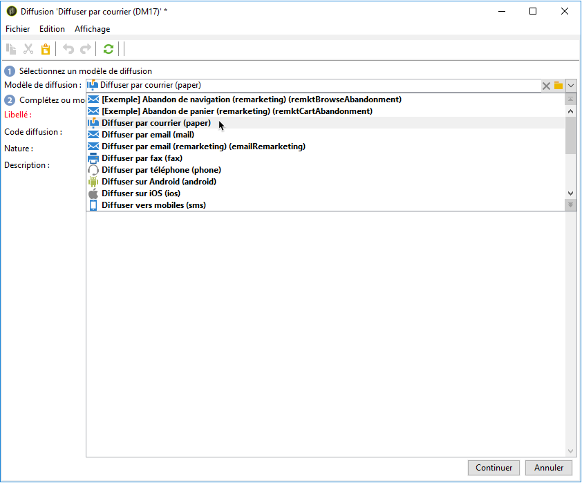

# Création d’une diffusion courrier{#creating-a-direct-mail-delivery}

Pour créer une diffusion courrier, procédez comme suit :

>[!NOTE]
>
>Les concepts généraux relatifs à la création de diffusions sont présentés dans la documentation de [Campaign v8](https://experienceleague.adobe.com/docs/campaign/campaign-v8/send/create-message.html?lang=fr){target="_blank"}.

1. Créez une diffusion, par exemple depuis le tableau de bord des diffusions.
1. Sélectionnez le modèle de diffusion **Diffuser par courrier (papier)**.

   

1. Identifiez votre diffusion avec un libellé, un code et une description. Pour plus d’informations à ce sujet, consultez cette section dans la documentation de [Campaign v8](https://experienceleague.adobe.com/docs/campaign/campaign-v8/send/create-message.html?lang=fr#create-the-delivery){target="_blank"}.
1. Cliquez sur **Continuer** pour valider ces informations et afficher la fenêtre de configuration du message.
