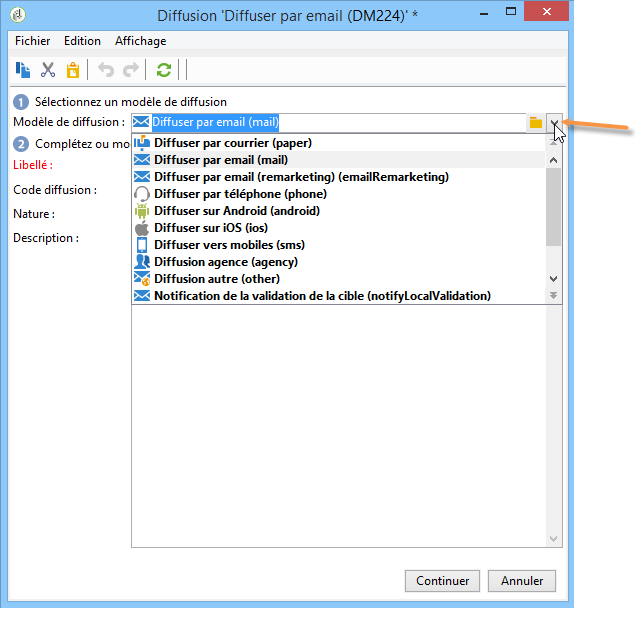

# Création d’une diffusion par e-mail{#creating-an-email-delivery}

Pour créer une diffusion email, procédez comme suit :

>[!NOTE]
>
>Les concepts généraux relatifs à la création d&#39;une diffusion sont présentés dans [cette section](steps-about-delivery-creation-steps.md).

1. Créez une diffusion, par exemple depuis le tableau de bord des diffusions.
1. Sélectionnez le modèle de diffusion **Diffusion email (mail)** ou n&#39;importe quel modèle de diffusion que vous avez créé. Pour plus d&#39;informations sur les modèles de diffusion, consultez [cette section](about-templates.md).

   

1. Identifiez votre diffusion avec un libellé, un code et une description. Pour plus d’informations, consultez [cette section](steps-create-and-identify-the-delivery.md#identifying-the-delivery).
1. Cliquez sur **Continuer** pour valider ces informations et afficher la fenêtre de configuration du message.
