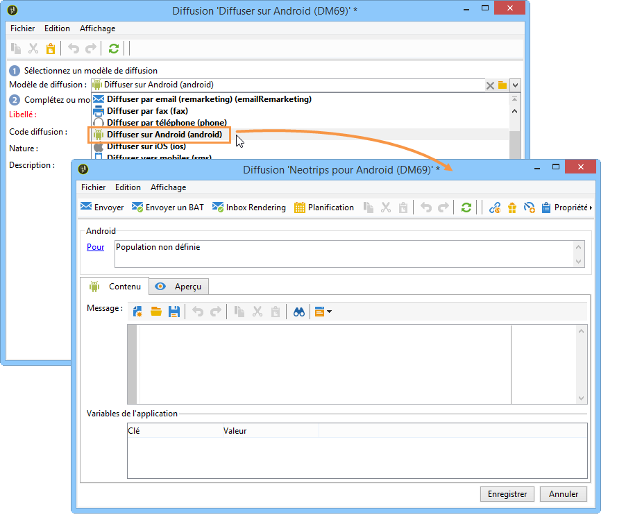
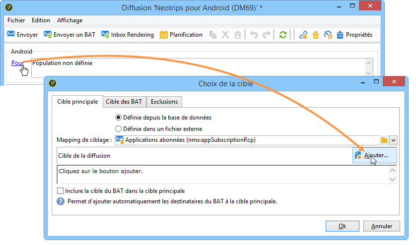
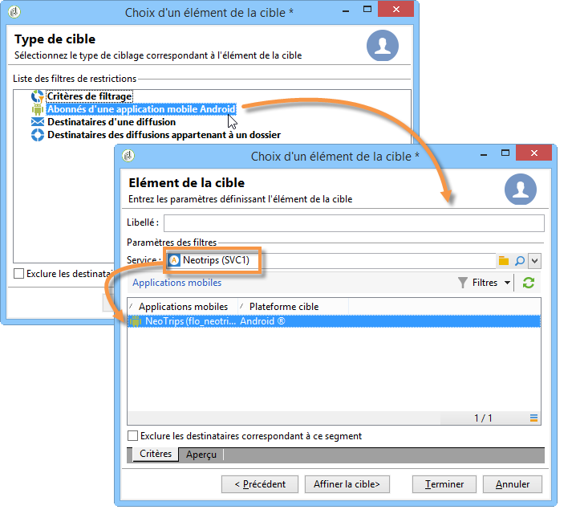
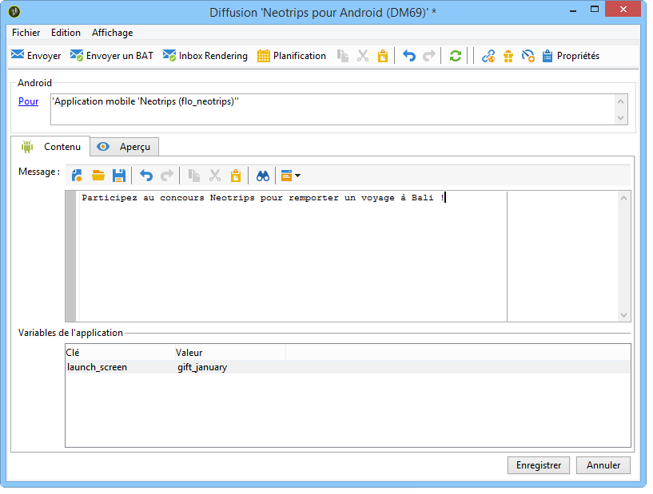

# Créer des notifications{#creating-notifications}

Cette section présente les éléments spécifiques à la diffusion de notifications iOS et Android. Les concepts généraux relatifs à la création d&#39;une diffusion sont présentés dans [cette section](../../delivery/using/steps-about-delivery-creation-steps.md).

Créez tout d&#39;abord une nouvelle diffusion.

## Envoi de notifications sur iOS {#sending-notifications-on-ios}

1. Sélectionnez le modèle de diffusion **[!UICONTROL Diffuser sur iOS]**.

   

1. Pour définir la cible de la notification, cliquez sur le lien **[!UICONTROL Pour]**, puis sur **[!UICONTROL Ajouter]**.

   

   >[!NOTE]
   >
   >Le processus détaillé lors de la sélection de la population cible d&#39;une diffusion est présenté dans [cette section](../../delivery/using/steps-defining-the-target-population.md).
   >
   >For more on the use of personalization fields, refer to [About personalization](../../delivery/using/about-personalization.md).
   >
   >For more on the inclusion of a seed list, refer to [About seed addresses](../../delivery/using/about-seed-addresses.md).

1. Sélectionnez **[!UICONTROL Abonnés d&#39;une application mobile iOS (iPhone, iPad)]**, choisissez le service correspondant à votre application mobile (Neotrips, dans notre exemple), puis sélectionnez la version iOS de l&#39;application.

   

1. Sélectionnez le type de notification : **[!UICONTROL Alerte]**, **[!UICONTROL Pastille]**, **[!UICONTROL Alerte et pastille]** ou **[!UICONTROL Silent push]**.

   

   >[!NOTE]
   >
   >Le mode **Silent push** est disponible à partir de la version 7 d&#39;iOS. Il permet d&#39;envoyer une notification &quot;silencieuse&quot; à une application mobile. L&#39;utilisateur n&#39;est pas averti de l&#39;arrivée de la notification. Elle est directement transmise à l&#39;application.

1. Dans le champ **[!UICONTROL Titre]**, renseignez le libellé du titre que vous souhaitez voir apparaître sur la notification. Il apparaîtra uniquement au niveau de la liste de notifications disponible depuis le centre de notifications. Ce champ permet de définir la valeur du paramètre **title** de la payload des notifications iOS.
1. If you use the HTTP/2 connector, you can add a subtitle (value of the **subtitle** parameter of the iOS notification payload). Reportez-vous à la section [Configuration de l’application mobile dans Adobe Campaign](../../delivery/using/configuring-the-mobile-application.md) .
1. Saisissez ensuite le **[!UICONTROL Message]** et la **[!UICONTROL Valeur de la pastille]**, en fonction du type de notification choisi.

   

   >[!NOTE]
   >
   >Vous pouvez ajouter des emojis au contenu de votre notification. Pour ce faire, accédez à un site web d&#39;emojis ([exemple](https://www.utf8-chartable.de/unicode-utf8-table.pl?start=9728)), copiez-en un et collez-le directement dans l&#39;éditeur de contenu. Sous Windows 7, certains emojis peuvent ne pas s&#39;afficher correctement dans l&#39;éditeur (carré). Ils sont toutefois envoyés correctement dans la notification finale. La possibilité ou non d&#39;afficher des emojis dépend du système d&#39;exploitation utilisé sur l&#39;appareil. Il est recommandé d&#39;envoyer des BAT pour vérifier l&#39;affichage de la notification avant son envoi.

   >[!NOTE]
   >
   >Les notifications de type **[!UICONTROL Pastille]** et **[!UICONTROL Alerte et pastille]** permettent de modifier la valeur de la pastille (le chiffre affiché au-dessus du logo de l&#39;application mobile). Pour réinitialiser la pastille, il suffit de mettre 0 comme valeur. Si le champ est vide, la valeur de la pastille ne sera pas changée.

1. Le champ **[!UICONTROL Bouton d&#39;action]** vous permet de définir un libellé pour le bouton d&#39;action apparaissant sur les notifications de type alerte (champ **action_loc_key** de la payload). Si votre application iOS gère les chaînes localisables (**Localizable.strings**), renseignez dans ce champ, la clé correspondante. Si votre application ne gère pas le texte localisé, renseignez le libellé que vous souhaitez voir apparaître sur le bouton d&#39;action. Pour plus d&#39;informations sur les chaînes localisables, consultez [la documentation Apple](https://developer.apple.com/library/content/documentation/NetworkingInternet/Conceptual/RemoteNotificationsPG/CreatingtheNotificationPayload.md#//apple_ref/doc/uid/TP40008194-CH10-SW1) .
1. Dans le champ **[!UICONTROL Jouer un son]**, sélectionnez le son que doit émettre le terminal mobile à la réception de la notification.

   >[!NOTE]
   >
   >Les sons doivent être inclus dans l’application et définis lors de la création du service. Reportez-vous à [Configuration d’un compte](../../delivery/using/configuring-the-mobile-application.md#configuring-external-account-ios)externe iOS.

1. Dans le champ **[!UICONTROL Variables de l&#39;application]**, renseignez la valeur de chaque variable. Les variables de l&#39;application permettent de définir le comportement des notifications : par exemple, lorsque l&#39;utilisateur active la notification, il est possible d&#39;afficher un écran particulier de l&#39;application.

   >[!NOTE]
   >
   >Les variables d’application doivent être définies dans le code de l’application mobile et saisies lors de la création du service. For more on this, refer to: [Configuring a mobile application in Adobe Campaign](../../delivery/using/configuring-the-mobile-application.md).

1. Une fois la notification renseignée, cliquez sur l&#39;onglet **[!UICONTROL Aperçu]** pour afficher la prévisualisation de la notification.

   

   >[!NOTE]
   >
   >Le style de la notification (bannière ou alerte) n&#39;est pas défini dans Adobe Campaign. Il dépend de la configuration choisie par l&#39;utilisateur dans les réglages iOS. Adobe Campaign vous permet cependant d&#39;afficher un aperçu de la notification pour chaque style. Cliquez sur la flèche, en bas à droite, pour basculer d&#39;un style à l&#39;autre.
   >
   >L&#39;aperçu utilise l&#39;apparence d&#39;iOS 10.

L&#39;envoi du BAT et l&#39;envoi final de la notification s&#39;effectuent de la même manière que pour une diffusion par e-mail.

Une fois les messages envoyés, vous pouvez effectuer le suivi et le tracking des diffusions. Voir à ce sujet les sections suivantes :

* [Quarantaines des notifications push](../../delivery/using/understanding-quarantine-management.md#push-notification-quarantines)
* [Contrôler une diffusion](../../delivery/using/monitoring-a-delivery.md)
* [Comprendre les diffusions en échec](../../delivery/using/understanding-delivery-failures.md)

## Envoi de notifications sur Android {#sending-notifications-on-android}

1. Sélectionnez tout d&#39;abord le modèle de diffusion **[!UICONTROL Diffuser sur Android (android)]**.

   

1. Pour définir la cible de la notification, cliquez sur le lien **[!UICONTROL Pour]**, puis sur **[!UICONTROL Ajouter]**.

   

1. Sélectionnez **[!UICONTROL Abonnés d&#39;une application mobile Android]**, choisissez le service correspondant à votre application mobile (Neotrips, dans notre exemple), puis sélectionnez la version Android de l&#39;application.

   

1. Saisissez ensuite le contenu de la notification.

   

   >[!NOTE]
   >
   >Vous pouvez ajouter des emojis au contenu de votre notification. Pour ce faire, accédez à un site web d&#39;emojis ([exemple](https://www.utf8-chartable.de/unicode-utf8-table.pl?start=9728)), copiez-en un et collez-le directement dans l&#39;éditeur de contenu. Sous Windows 7, certains emojis peuvent ne pas s&#39;afficher correctement dans l&#39;éditeur (carré). Ils sont toutefois envoyés correctement dans la notification finale. La possibilité ou non d&#39;afficher des emojis dépend du système d&#39;exploitation utilisé sur l&#39;appareil. Il est recommandé d&#39;envoyer des BAT pour vérifier l&#39;affichage de la notification avant son envoi.

1. Dans le champ **[!UICONTROL Variables de l&#39;application]**, renseignez la valeur de chaque variable. Les variables de l&#39;application permettent de définir le comportement des notifications : par exemple, lorsque l&#39;utilisateur active la notification, il est possible d&#39;afficher un écran particulier de l&#39;application.

   >[!NOTE]
   >
   >Les variables d’application doivent être définies dans le code de l’application mobile et saisies lors de la création du service. For more on this, refer to: [Configuring a mobile application in Adobe Campaign](../../delivery/using/configuring-the-mobile-application.md).

1. Une fois la notification renseignée, cliquez sur l&#39;onglet **[!UICONTROL Aperçu]** pour afficher la prévisualisation de la notification.

   

L&#39;envoi du BAT et l&#39;envoi final de la notification s&#39;effectuent de la même manière que pour une diffusion par e-mail.

Le processus détaillé lors de la validation et l&#39;envoi d&#39;une diffusion est présenté dans les sections ci-dessous :

* [Valider la diffusion](../../delivery/using/steps-validating-the-delivery.md)
* [Envoyer la diffusion](../../delivery/using/steps-sending-the-delivery.md)

Une fois les messages envoyés, vous pouvez effectuer le suivi et le tracking des diffusions. Voir à ce sujet les sections suivantes :

* [Quarantaines des notifications push](../../delivery/using/understanding-quarantine-management.md#push-notification-quarantines)
* [Contrôler une diffusion](../../delivery/using/monitoring-a-delivery.md)
* [Comprendre les diffusions en échec](../../delivery/using/understanding-delivery-failures.md)
