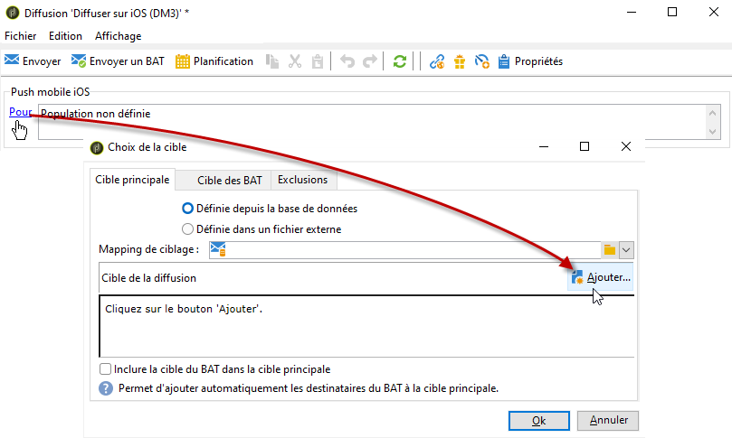
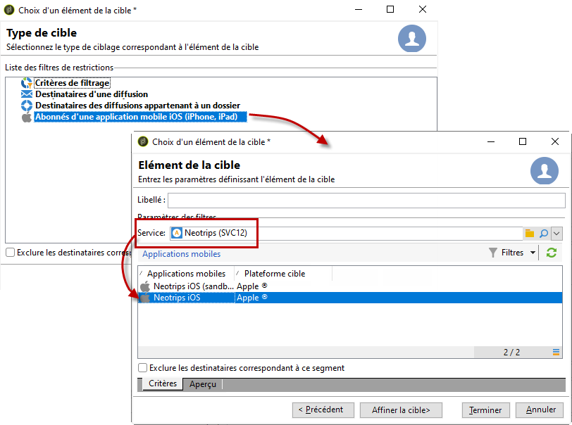
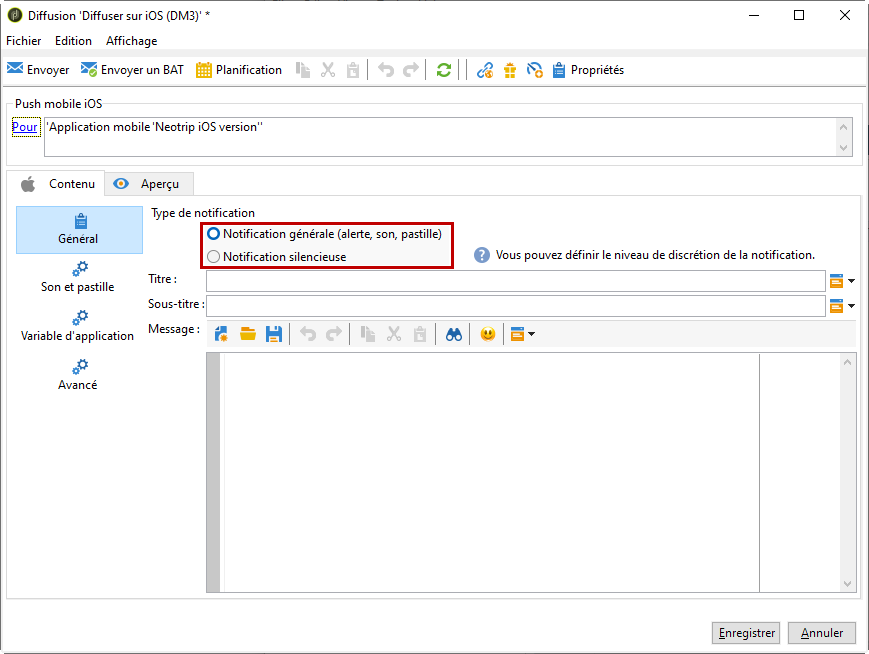
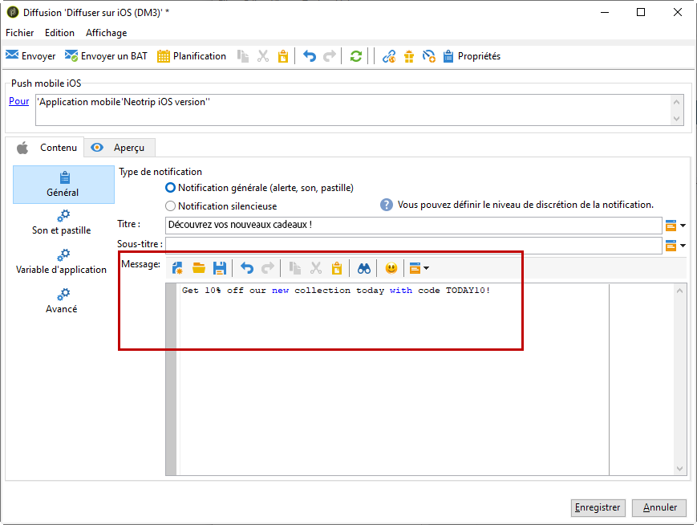

# Créer des notifications{#creating-notifications}

Cette section présente les éléments spécifiques à la diffusion de notifications iOS et Android. Les concepts généraux relatifs à la création d&#39;une diffusion sont présentés dans [cette section](../../delivery/using/steps-about-delivery-creation-steps.md).

Créez tout d&#39;abord une nouvelle diffusion.

## Envoi de notifications sur iOS {#sending-notifications-on-ios}

1. Sélectionnez le modèle de **[!UICONTROL Deliver on iOS]** remise.

   

1. To define the target of the notification, click the **[!UICONTROL To]** link, then click **[!UICONTROL Add]**.

   

   >[!NOTE]
   >
   >Le processus détaillé lors de la sélection de la population cible d&#39;une diffusion est présenté dans [cette section](../../delivery/using/steps-defining-the-target-population.md).
   >
   >For more on the use of personalization fields, refer to [About personalization](../../delivery/using/about-personalization.md).
   >
   >For more on the inclusion of a seed list, refer to [About seed addresses](../../delivery/using/about-seed-addresses.md).

1. Sélectionnez **[!UICONTROL Subscribers of an iOS mobile application (iPhone, iPad)]**, sélectionnez le service correspondant à votre application mobile (Neotrip, dans ce cas), puis sélectionnez la version iOS de l’application.

   

1. Sélectionnez le type de notification : **[!UICONTROL Alert]**, **[!UICONTROL Badge]**, ou **[!UICONTROL Alert and badge]** ou **[!UICONTROL Silent Push]**.

   

   >[!NOTE]
   >
   >Le mode **Silent push** est disponible à partir de la version 7 d&#39;iOS. Il permet d&#39;envoyer une notification &quot;silencieuse&quot; à une application mobile. L&#39;utilisateur n&#39;est pas averti de l&#39;arrivée de la notification. Elle est directement transmise à l&#39;application.

1. Dans le **[!UICONTROL Title]** champ, saisissez le libellé du titre à afficher dans la notification. Il apparaîtra uniquement dans la liste des notifications disponibles depuis le centre de notification. Ce champ vous permet de définir la valeur du paramètre **title** de la charge utile de notification iOS.
1. If you use the HTTP/2 connector, you can add a subtitle (value of the **subtitle** parameter of the iOS notification payload). Reportez-vous à la section [Configuration de l’application mobile dans Adobe Campaign](../../delivery/using/configuring-the-mobile-application.md) .
1. Entrez ensuite le **[!UICONTROL Message]** et le **[!UICONTROL Value of the badge]** en fonction du type de notification choisi.

   

   >[!NOTE]
   >
   >Vous pouvez ajouter des emojis au contenu de votre notification. Pour ce faire, accédez à un site web d&#39;emojis ([exemple](https://www.utf8-chartable.de/unicode-utf8-table.pl?start=9728)), copiez-en un et collez-le directement dans l&#39;éditeur de contenu. Sous Windows 7, certains emojis peuvent ne pas s&#39;afficher correctement dans l&#39;éditeur (carré). Ils sont toutefois envoyés correctement dans la notification finale. La possibilité ou non d&#39;afficher des emojis dépend du système d&#39;exploitation utilisé sur l&#39;appareil. Il est recommandé d&#39;envoyer des BAT pour vérifier l&#39;affichage de la notification avant son envoi.

   >[!NOTE]
   >
   >**[!UICONTROL Badge]** et les notifications **[!UICONTROL Alert and badge]** de type vous permettent de modifier la valeur du badge (le numéro au-dessus du logo de l&#39;application mobile). Pour actualiser le badge, il vous suffit de saisir 0 comme valeur. Si le champ est vide, la valeur du badge ne change pas.

1. Le **[!UICONTROL Action button]** permet de définir le libellé du bouton d’action qui apparaît dans les notifications d’alerte (champ **action_loc_key** de la charge utile). Si votre application iOS gère les chaînes localisables (**Localizable.strings**), entrez la clé correspondante dans ce champ. Si votre application ne gère pas le texte localisable, entrez le libellé qui doit apparaître sur le bouton d’action. Pour plus d’informations sur les chaînes localisables, consultez la documentation  Apple .
1. In the **[!UICONTROL Play a sound]** field, select the sound to be played by the mobile terminal when the notification is received.

   >[!NOTE]
   >
   >Les sons doivent être inclus dans l’application et définis lors de la création du service. Reportez-vous à [Configuration d’un compte](../../delivery/using/configuring-the-mobile-application.md#configuring-external-account-ios)externe iOS.

1. Dans le **[!UICONTROL Application variables]** champ, entrez la valeur de chaque variable. Les variables d’application vous permettent de définir le comportement de notification : par exemple, vous pouvez configurer un écran d’application spécifique pour qu’il s’affiche lorsque l’utilisateur active la notification.

   >[!NOTE]
   >
   >Les variables d’application doivent être définies dans le code de l’application mobile et saisies lors de la création du service. For more on this, refer to: [Configuring a mobile application in Adobe Campaign](../../delivery/using/configuring-the-mobile-application.md).

1. Once the notification is configured, click the **[!UICONTROL Preview]** tab to preview the notification.

   

   >[!NOTE]
   >
   >Le style de la notification (bannière ou alerte) n&#39;est pas défini dans Adobe Campaign. Il dépend de la configuration choisie par l&#39;utilisateur dans les réglages iOS. Adobe Campaign vous permet cependant d&#39;afficher un aperçu de la notification pour chaque style. Cliquez sur la flèche, en bas à droite, pour basculer d&#39;un style à l&#39;autre.
   >
   >L&#39;aperçu utilise l&#39;apparence d&#39;iOS 10.

L&#39;envoi du BAT et l&#39;envoi final de la notification s&#39;effectuent de la même manière que pour une diffusion par e-mail.

Une fois les messages envoyés, vous pouvez effectuer le suivi et le tracking des diffusions. Voir à ce sujet les sections suivantes :

* [Quarantaines des notifications push](../../delivery/using/understanding-quarantine-management.md#push-notification-quarantines)
* [Contrôler une diffusion](../../delivery/using/monitoring-a-delivery.md)
* [Comprendre les diffusions en échec](../../delivery/using/understanding-delivery-failures.md)

## Envoi de notifications sur Android {#sending-notifications-on-android}

1. Commencez par sélectionner le modèle de **[!UICONTROL Deliver on Android (android)]** remise.

   

1. To define the target of the notification, click the **[!UICONTROL To]** link, then click **[!UICONTROL Add]**.

   

1. Select **[!UICONTROL Subscribers of an Android mobile application]**, choose the service relevant to your mobile application (Neotrips, in this case), then select the Android version of the application.

   

1. Saisissez ensuite le contenu de la notification.

   

   >[!NOTE]
   >
   >Vous pouvez ajouter des emojis au contenu de votre notification. Pour ce faire, accédez à un site web d&#39;emojis ([exemple](https://www.utf8-chartable.de/unicode-utf8-table.pl?start=9728)), copiez-en un et collez-le directement dans l&#39;éditeur de contenu. Sous Windows 7, certains emojis peuvent ne pas s&#39;afficher correctement dans l&#39;éditeur (carré). Ils sont toutefois envoyés correctement dans la notification finale. La possibilité ou non d&#39;afficher des emojis dépend du système d&#39;exploitation utilisé sur l&#39;appareil. Il est recommandé d&#39;envoyer des BAT pour vérifier l&#39;affichage de la notification avant son envoi.

1. Dans le **[!UICONTROL Application variables]** champ, entrez la valeur de chaque variable. Les variables d’application vous permettent de définir le comportement de notification : par exemple, vous pouvez configurer un écran d’application spécifique pour qu’il s’affiche lorsque l’utilisateur active la notification.

   >[!NOTE]
   >
   >Les variables d’application doivent être définies dans le code de l’application mobile et saisies lors de la création du service. For more on this, refer to: [Configuring a mobile application in Adobe Campaign](../../delivery/using/configuring-the-mobile-application.md).

1. Once the notification is configured, click the **[!UICONTROL Preview]** tab to preview the notification.

   

L&#39;envoi du BAT et l&#39;envoi final de la notification s&#39;effectuent de la même manière que pour une diffusion par e-mail.

Le processus détaillé lors de la validation et l&#39;envoi d&#39;une diffusion est présenté dans les sections ci-dessous :

* [Valider la diffusion](../../delivery/using/steps-validating-the-delivery.md)
* [Envoyer la diffusion](../../delivery/using/steps-sending-the-delivery.md)

Une fois les messages envoyés, vous pouvez effectuer le suivi et le tracking des diffusions. Voir à ce sujet les sections suivantes :

* [Quarantaines des notifications push](../../delivery/using/understanding-quarantine-management.md#push-notification-quarantines)
* [Contrôler une diffusion](../../delivery/using/monitoring-a-delivery.md)
* [Comprendre les diffusions en échec](../../delivery/using/understanding-delivery-failures.md)
