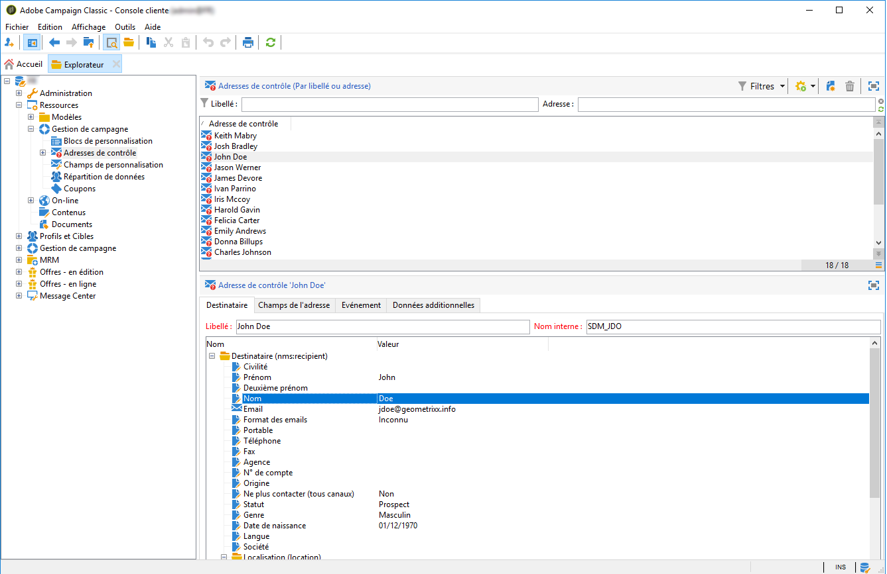
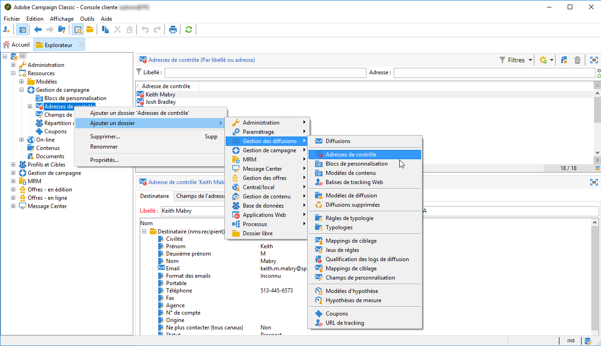
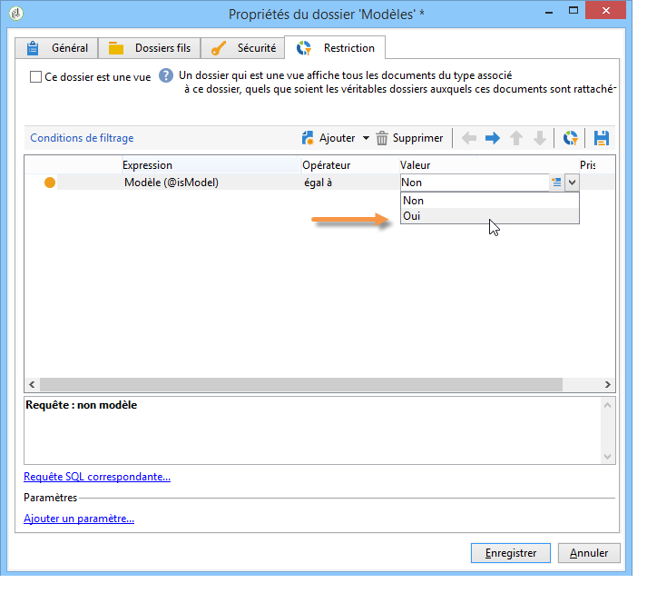

# Création d’adresses de contrôle{#creating-seed-addresses}

Les adresses de contrôle ne sont pas gérées via les profils et cibles standards, mais dans un nœud dédié de l&#39;arborescence Adobe Campaign, sous **[!UICONTROL Ressources > Gestion de campagne > Adresses de contrôle]**.

Vous pouvez créer des sous-dossiers afin d&#39;organiser les adresses de contrôle. Pour cela, cliquez avec le bouton droit sur le nœud **[!UICONTROL Adresses de contrôle]** et sélectionnez **[!UICONTROL Ajouter un dossier « Adresses de contrôle »]**. Nommez le sous-dossier et validez par la touche **[!UICONTROL Entrée]** du clavier. Vous pouvez ensuite créer ou copier des adresses de contrôle dans ce sous-dossier. Pour plus dʼinformations à ce sujet, consultez la section [Défintion dʼadresses](#defining-addresses).

Adobe Campaign permet également de créer des modèles dʼadresses de contrôle qui sont importées au niveau des diffusions ou des campagnes et sont ensuite adaptées selon les besoins spécifiques aux diffusions et campagnes concernées. Consultez la section [Création de modèles dʼadresses de contrôle](#creating-seed-address-templates).

## Définition dʼadresses {#defining-addresses}

Pour créer des adresses de contrôle, procédez comme suit :

1. Cliquez sur le bouton **[!UICONTROL Nouveau]** situé au-dessus de la liste des adresses de contrôle.
1. Saisissez les données associées à l&#39;adresse dans les champs correspondants de l&#39;onglet **[!UICONTROL Destinataire]**. Les champs disponibles correspondent aux champs standard dans les profils des personnes destinataires de la diffusion (table nms:recipient) : nom, prénom, e-mail, etc.

   >[!NOTE]
   >
   >Le libellé de l’adresse reprend automatiquement le nom et le prénom saisis.
   >
   >Lors de la création d’une adresse de contrôle, il n’est pas nécessaire de renseigner tous les champs de chaque onglet. En effet, les éléments de personnalisation manquants sont renseignés de manière aléatoire lors de l’analyse de la diffusion.

   

1. Indiquez dans l’onglet **[!UICONTROL Champs de l’adresse]** les valeurs qui seront insérées dans les logs de diffusion lors de la phase d’analyse (dans la table **[!UICONTROL nms:broadLog]**).

1. Dans l&#39;onglet **[!UICONTROL Données additionnelles]**, renseignez les données de personnalisation utilisées pour les diffusions créées dans les workflows Data management et auxquelles vous souhaitez affecter une valeur spécifique.

   >[!NOTE]
   >
   >Assurez-vous que les données additionnelles de la cible ont été définies avec un alias commençant par &#39;@&#39; dans l&#39;activité **[!UICONTROL Enrichissement]**. Sinon, vous ne pourrez pas les utiliser correctement avec vos adresses de contrôle dans votre activité de diffusion.

## Créer des modèles d&#39;adresses de contrôle {#creating-seed-address-templates}

Pour créer des modèles d&#39;adresses, qui seront importées et pourront être modifiées pour chaque diffusion, la procédure est la même que celle permettant de définir une nouvelle adresse de contrôle, mais les adresses des modèles doivent être stockées dans un dossier de type &#39;Modèle&#39;.

Pour définir un dossier de modèle, la procédure est la suivante :

1. Créez un dossier de type **[!UICONTROL Adresses de contrôle]**, cliquez avec le bouton droit dessus et sélectionnez **[!UICONTROL Propriétés...]**.

   

1. Cliquez sur l’onglet **[!UICONTROL Restriction]** et ajoutez la condition de filtrage suivante : **@isModel = true**.

   

   Les adresses stockées dans ce dossier pourront ainsi être utilisées comme des modèles d&#39;adresses. Vous pouvez les importer dans des diffusions ou des campagnes et les adapter en fonction des besoins spécifiques des livraisons et campagnes concernées (consultez la section [Ajout dʼadresses de contrôle](adding-seed-addresses.md)).
