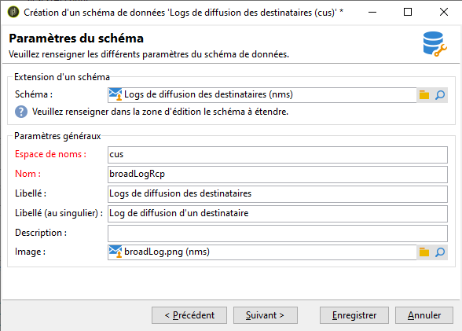
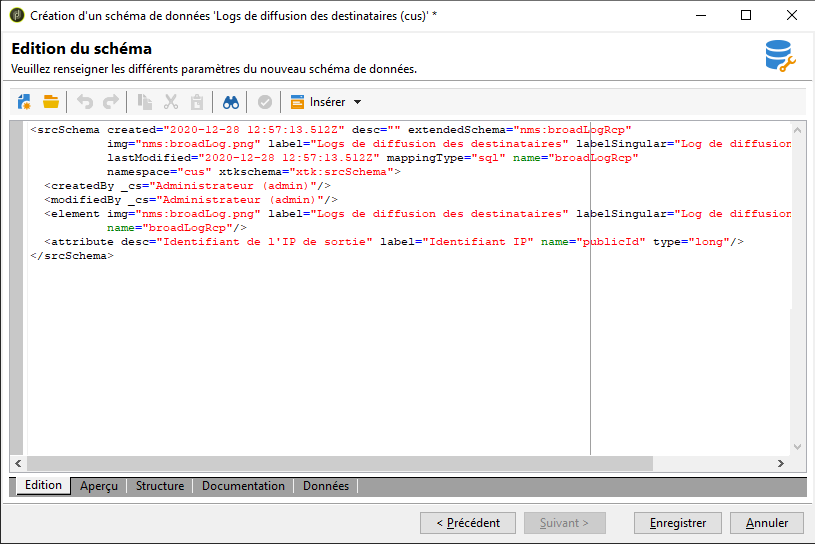
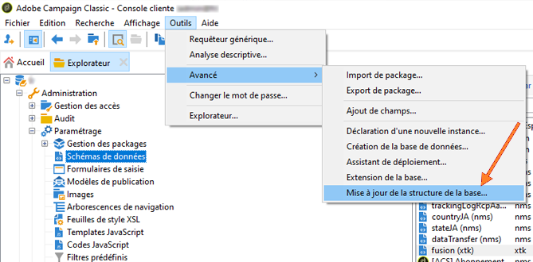
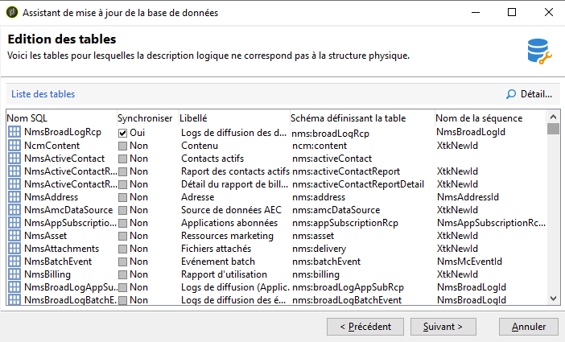
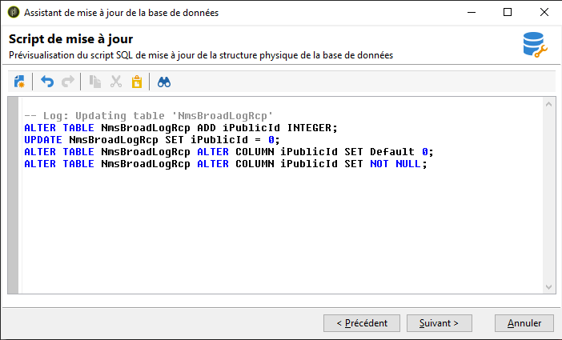
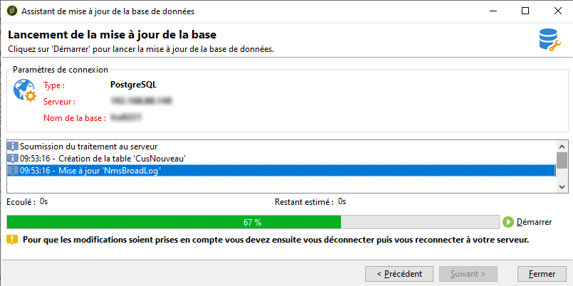
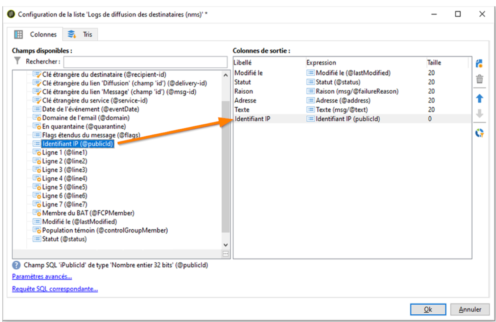
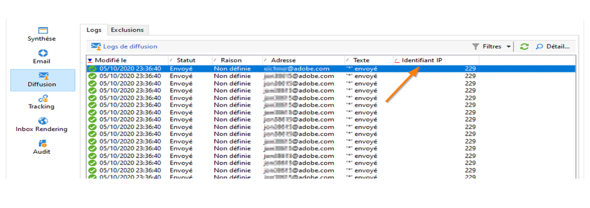

# Avancé : personnalisation des logs de diffusion {#customize-delivery-logs}

>[!NOTE]
>
>Des conseils complets sur l’accès à la liste des diffusions et l’utilisation du tableau de bord des diffusions sont présentés dans la [documentation de Campaign v8](https://experienceleague.adobe.com/fr/docs/campaign/campaign-v8/send/monitor/delivery-dashboard). Ce contenu s’applique aux utilisateurs et utilisatrices de Campaign Classic v7 et de Campaign v8.
>
>Cette page présente les **personnalisations avancées spécifiques à Campaign Classic v7** pour les déploiements hybrides et on-premise.

Pour surveiller les diffusions dans l’interface d’utilisation de Campaign, consultez la section [Surveiller les diffusions de Campaign v8 dans la documentation de l’interface d’utilisation de Campaign](https://experienceleague.adobe.com/fr/docs/campaign/campaign-v8/send/monitor/delivery-dashboard){target="_blank"}.

## Personnaliser les logs de diffusion {#use-case}

Pour les **déploiements hybrides/on-premise de Campaign Classic v7**, vous pouvez personnaliser les logs de diffusion en étendant les schémas. Cette section explique comment ajouter les adresses IP des expéditeurs et expéditrices aux logs de diffusion.

>[!NOTE]
>
>Cette personnalisation nécessite des fonctionnalités d’extension de schéma disponibles dans les déploiements on-premise. Les utilisateurs et utilisatrices de Campaign v8 Managed Cloud Services doivent contacter l’assistance clientèle d’Adobe pour obtenir les champs personnalisés des logs de diffusion.
>
>Cette modification est différente si vous utilisez une instance unique ou une instance de midsourcing. Avant de procéder à la modification, vérifiez que vous êtes connecté à l&#39;instance d&#39;envoi d&#39;email.

### Étape 1 : Optimiser le schéma

Pour ajouter **publicID** dans vos logs de diffusion, vous devez d&#39;abord optimiser le schéma. Vous pouvez procéder comme suit.

1. Créez une extension de schéma sous **[!UICONTROL Administration]** > **[!UICONTROL Configuration]** > **[!UICONTROL Schémas de données]** > **[!UICONTROL Nouveau]**.

   Pour plus d&#39;informations sur les extensions de schéma, consultez [cette page](../../configuration/using/extending-a-schema.md).

1. Sélectionnez **[!UICONTROL broadLogRcp]** pour optimiser les logs de diffusion du destinataire (nms) et définir un espace de noms personnalisé. Dans ce cas, ce sera &quot;cus&quot; :

   

   >[!NOTE]
   >
   >Si votre instance est en midsourcing, vous devez utiliser le schéma broadLogMid.

1. Ajoutez le nouveau champ dans votre extension. Dans cet exemple, vous devez remplacer :

   ```
   <element img="nms:broadLog.png" label="Recipient delivery logs" labelSingular="Recipient delivery log" name="broadLogRcp"/>
   ```

   par :

   ```
   <element img="nms:broadLog.png" label="Recipient delivery logs" labelSingular="Recipient delivery log" name="broadLogRcp">
   <attribute desc="Outbound IP identifier" label="IP identifier"
   name="publicId" type="long"/>
   </element>
   ```

   

### Étape 2 : Mettre à jour la structure de la base de données

Une fois les modifications effectuées, vous devez mettre à jour la structure de la base de données afin de l&#39;aligner sur sa description logique.

Pour ce faire, procédez comme suit :

1. Cliquez sur **[!UICONTROL Outils]** > **[!UICONTROL Avancé]** > **[!UICONTROL Mise à jour de la structure de la base...]**.

   

1. Dans la fenêtre **[!UICONTROL Modification des tables]**, la table **[!UICONTROL NmsBroadLogRcp]** est cochée (ou la table **[!UICONTROL broadLogMid]** si votre environnement est en midsourcing), comme suit :

   

   >[!IMPORTANT]
   >
   >Assurez-vous toujours qu&#39;il n&#39;y a aucune autre modification, à l&#39;exception de la table **[!UICONTROL NmsBroadLoGRcp]** (ou de la table **[!UICONTROL broadLogMid]** si vous êtes dans un environnement de midsourcing). Si tel est le cas, désélectionnez les autres tables.

1. Cliquez sur **[!UICONTROL Suivant]** pour valider. L’écran suivant s’affiche :

   

1. Cliquez sur **[!UICONTROL Suivant]**, puis sur **[!UICONTROL Démarrer]** pour commencer la mise à jour de la structure de la base de données. La création de l&#39;index commence. Cette étape peut être longue, en fonction du nombre de lignes dans la table **[!UICONTROL NmsBroadLogRcp]**.

   

>[!NOTE]
>
>Une fois la mise à jour de la structure physique de la base de données terminée avec succès, vous devez vous déconnecter et vous reconnecter afin que vos modifications soient prises en compte.

### Étape 3 : Valider la modification

Pour vérifier que tout a fonctionné correctement, vous devez mettre à jour l’écran des logs de diffusion.

Pour ce faire, accédez aux logs de diffusion et ajoutez la colonne &quot;Identifiant de l&#39;IP&quot;.



>[!NOTE]
>
>Pour savoir comment configurer des listes dans l&#39;interface de Campaign Classic, consultez [cette page](../../platform/using/adobe-campaign-workspace.md).

Vous trouverez ci-dessous ce que vous devez voir dans l’onglet **[!UICONTROL Diffusion]** après les modifications :



## Rubriques connexes

* [Surveiller les diffusions dans l’interface d’utilisation de Campaign](https://experienceleague.adobe.com/fr/docs/campaign/campaign-v8/send/monitor/delivery-dashboard){target="_blank"} (documentation de Campaign v8)
* [Statuts des diffusions](https://experienceleague.adobe.com/fr/docs/campaign/campaign-v8/send/monitor/delivery-statuses){target="_blank"} (documentation de Campaign v8)
* [Comprendre les diffusions en échec](https://experienceleague.adobe.com/fr/docs/campaign/campaign-v8/send/monitor/delivery-failures){target="_blank"} (documentation de Campaign v8)
* [Gestion des quarantaines](https://experienceleague.adobe.com/fr/docs/campaign/campaign-v8/send/monitor/quarantines){target="_blank"} (documentation de Campaign v8)
* [Extension d’un schéma](../../configuration/using/extending-a-schema.md) (v7 hybride/on-premise)

