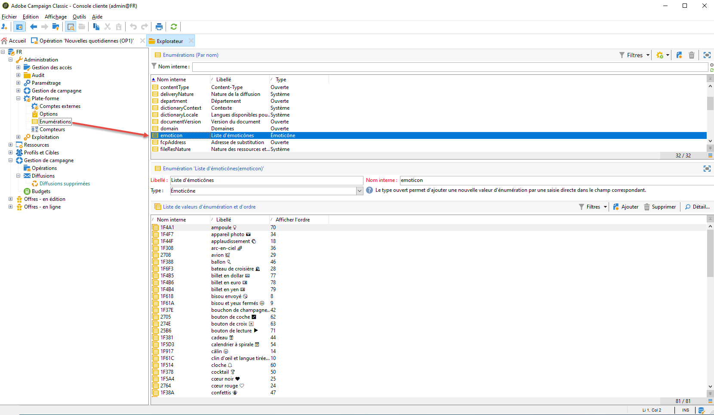
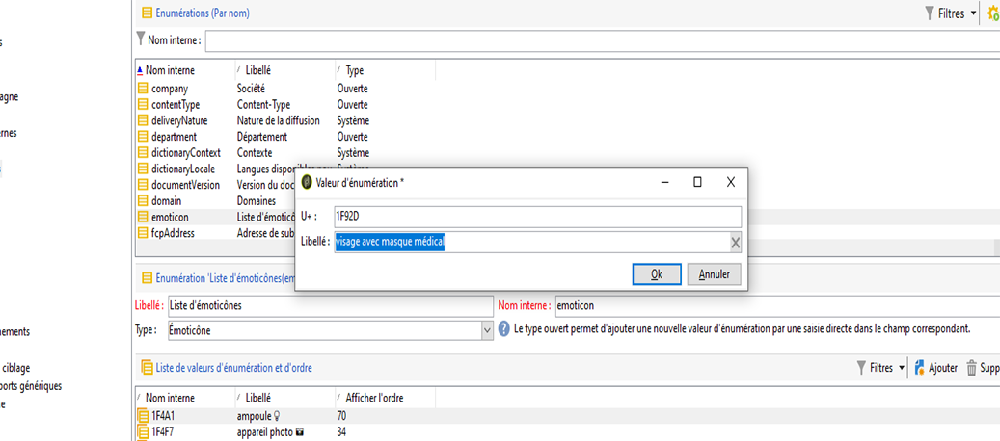
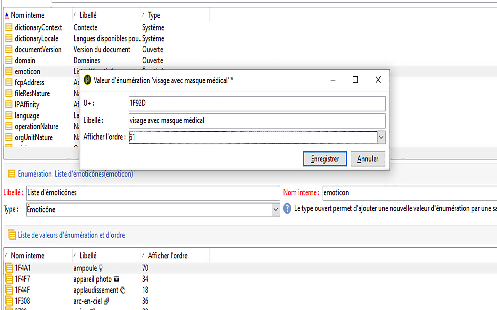
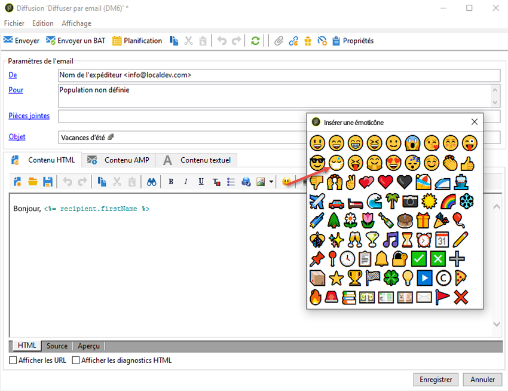
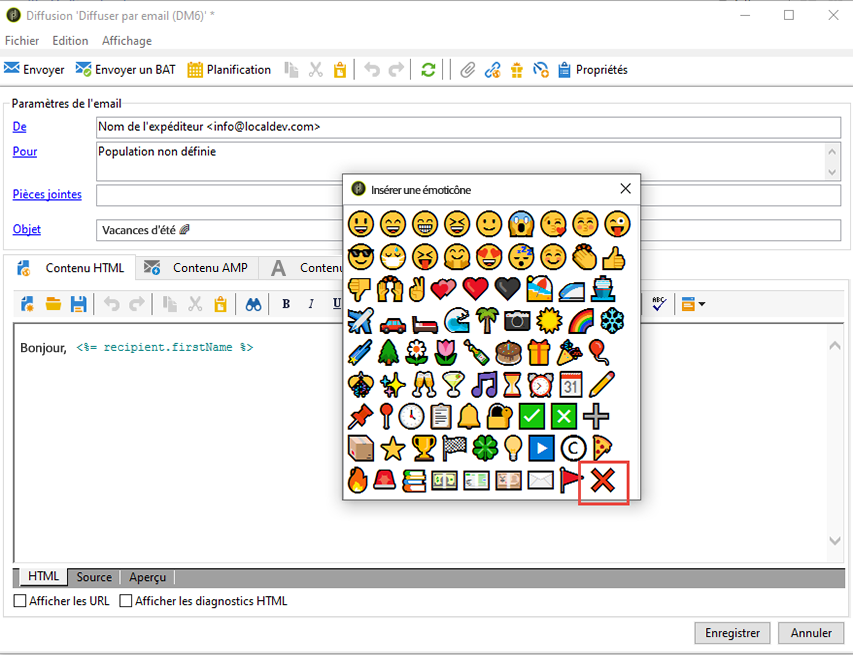

# Personnaliser la liste des émoticônes {#customize-emoticons}

La liste des émoticônes affichée dans la fenêtre contextuelle est régie par une énumération. Vous pouvez ainsi afficher les valeurs contenues dans une liste pour limiter les choix de l’utilisateur ou de l’utilisatrice pour un champ donné.
L’ordre de la liste des émoticônes peut être personnalisé et vous pouvez ajouter d’autres émoticônes à votre liste.

Notez que les émoticônes ne sont disponibles que pour les e-mails et les notifications push. Pour en savoir plus, consultez la [documentation de Campaign v8](https://experienceleague.adobe.com/docs/campaign/campaign-v8/send/emails/defining-the-email-content.html?lang=fr#inserting-emoticons){target="_blank"}.

## Ajout d’une nouvelle émoticône {#add-new-emoticon}

>[!CAUTION]
>
>La liste des émoticônes ne peut pas afficher plus de 81 entrées.

1. Sélectionnez la nouvelle émoticône à ajouter dans cette [page](https://unicode.org/emoji/charts/full-emoji-list.html). Notez qu’elle doit être compatible avec les différentes plateformes, telles que le navigateur et le système d’exploitation.

1. Dans l’**[!UICONTROL Explorateur]**, sélectionnez **[!UICONTROL Administration]** > **[!UICONTROL Plateforme]** > **[!UICONTROL Énumérations]**, puis cliquez sur l’énumération d’usine **[!UICONTROL Liste des émoticônes]**.

   >[!NOTE]
   >
   >Les énumérations d’usine ne peuvent être gérées que par un administrateur de votre console Adobe Campaign Classic.

   

1. Cliquez sur **[!UICONTROL Ajouter]**.

1. Renseignez les champs :

   * **[!UICONTROL U+]** : code de votre nouvel émoticône. Vous trouverez la liste des codes d’émoticônes sur cette [page](https://unicode.org/emoji/charts/full-emoji-list.html).
Pour éviter tout problème de compatibilité, il est conseillé de choisir des émoticônes prises en charge sur les navigateurs et sur tous les systèmes d’exploitation.

   * **[!UICONTROL Libellé]** : libellé de la nouvelle émoticône.

   

1. Cliquez sur **[!UICONTROL OK]**, puis sur **[!UICONTROL Enregistrer]** lorsque la configuration est terminée.
Votre nouvel émoticône sera automatiquement stocké.

1. Pour l’afficher dans la fenêtre **[!UICONTROL Insérer une émoticône]** de vos diffusions, sélectionnez-la en double-cliquant dessus.

1. Dans la liste déroulante **[!UICONTROL Position d’affichage]**, sélectionnez la position dans laquelle votre nouvelle émoticône s’affichera. Si vous sélectionnez une position d’affichage déjà attribuée, l’émoticône existante sera automatiquement déplacée vers le magasin.

    Dans cet exemple, nous avons choisi le numéro de position d’affichage 61. Si une entrée avait déjà cette position, elle serait automatiquement déplacée vers le magasin et la nouvelle entrée prendrait sa place dans la liste d’énumérations.

   

1. La nouvelle émoticône a maintenant été ajoutée à l’énumération d’usine **[!UICONTROL Liste d’émoticônes]**. Vous pouvez modifier la **[!UICONTROL position d’affichage]** à tout moment ou déplacer l’émoticône vers le magasin si vous n’en avez plus besoin.

1. Pour que les modifications soient prises en compte, déconnectez-vous d’Adobe Campaign Classic, puis reconnectez-vous. Si la nouvelle émoticône n’apparaît toujours pas dans la fenêtre pop-up **[!UICONTROL Insérer une émoticône]**, vous devrez peut-être vider le cache. Voir à ce propos cette [section](../../platform/using/faq-campaign-classic-v7.md#how-do-i-clear-console-cache).

1. La nouvelle émoticône se trouve maintenant dans vos diffusions, dans la fenêtre pop-up **[!UICONTROL Insérer une émoticône]**, à la 61e position, suite à la configuration effectuée lors des étapes précédentes. Pour plus d’informations sur l’utilisation des émoticônes dans vos diffusions, consultez la [documentation de Campaign v8](https://experienceleague.adobe.com/docs/campaign/campaign-v8/send/emails/defining-the-email-content.html?lang=fr#inserting-emoticons){target="_blank"}.

   

1. Si les émoticônes suivantes apparaissent dans la fenêtre pop-up **[!UICONTROL Insérer une émoticône]**, cela signifie qu’elles n’ont pas été correctement configurées. Vérifiez si le code **[!UICONTROL U+]** ou la **[!UICONTROL position d’affichage]** est correcte dans la **[!UICONTROL liste des émoticônes]**.

   
