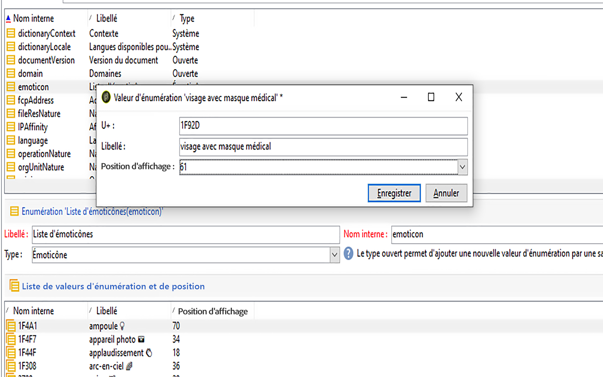
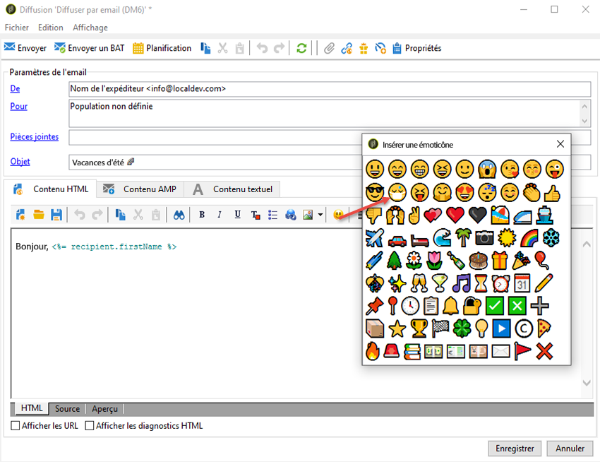

# Personnalisation de la liste des émoticônes {#customize-emoticons}

La liste des émoticônes affichée dans la fenêtre contextuelle est régie par une énumération. Vous pouvez ainsi afficher les valeurs contenues dans une liste pour limiter les choix de l’utilisateur pour un champ donné.
Il est possible de personnaliser l’ordre des émoticônes dans la liste et d’en ajouter d’autres.
Des émoticônes sont disponibles pour les emails et les notifications push. Pour plus d’informations à ce propos, voir cette [page](../../delivery/using/defining-the-email-content.md#inserting-emoticons).

## Ajout d’une nouvelle émoticône {#add-new-emoticon}

>[!CAUTION]
>
>La liste des émoticônes ne peut pas afficher plus de 81 entrées.

1. Sélectionnez la nouvelle émoticône à ajouter dans cette [page](https://unicode.org/emoji/charts/full-emoji-list.html). Notez qu’elle doit être compatible avec les différentes plates-formes, telles que le navigateur et le système d’exploitation.

1. Dans l’**[!UICONTROL Explorateur]**, sélectionnez **[!UICONTROL Administration]** > **[!UICONTROL Plate-forme]** > **[!UICONTROL Énumérations]**, puis cliquez sur l’énumération d’usine **[!UICONTROL Liste des émoticônes]**.

   >[!NOTE]
   >
   >Les énumérations d’usine ne peuvent être supprimées que par un administrateur de votre console Adobe Campaign Classic.

   

1. Cliquez sur **[!UICONTROL Ajouter]**.

1. Renseignez les champs :

   * **[!UICONTROL U+]** : code de votre nouvelle émoticône. La liste des codes des émoticônes se trouve dans cette [page](https://unicode.org/emoji/charts/full-emoji-list.html).
Pour éviter tout problème de compatibilité, il est conseillé de choisir des émoticônes prises en charge sur les navigateurs et sur tous les systèmes d’exploitation.

   * **[!UICONTROL Libellé]** : libellé de la nouvelle émoticône.

   

1. Cliquez sur **[!UICONTROL Ok]**, puis sur **[!UICONTROL Enregistrer]** lorsque la configuration est terminée.
Votre nouvelle émoticône sera automatiquement placée dans le magasin.

1. Pour l’afficher dans la fenêtre **[!UICONTROL Insérer une émoticône]** de vos diffusions, sélectionnez l’émoticône créée en double-cliquant sur celle-ci.

1. Dans la liste déroulante **[!UICONTROL Ordre de l’affichage]**, sélectionnez l’ordre dans lequel votre nouvelle émoticône s’affichera. Si vous sélectionnez un ordre d’affichage déjà attribué, l’émoticône existante sera automatiquement déplacée vers le magasin.

    Dans cet exemple, nous avons choisi le numéro d’ordre d’affichage 61. Si une entrée avait déjà cet ordre d’affichage, elle serait automatiquement déplacée vers le magasin et la nouvelle entrée prendrait sa place dans la liste d’énumérations.

   

1. La nouvelle émoticône a maintenant été ajoutée à l’énumération d’usine **[!UICONTROL Liste Insérer une émoticône]**. Vous pouvez modifier l’**[!UICONTROL ordre de l’affichage]** à tout moment ou déplacer l’émoticône vers le magasin si vous n’en avez plus besoin.

1. Pour que les modifications soient prises en compte, déconnectez-vous d’Adobe Campaign Classic, puis reconnectez-vous. Si la nouvelle émoticône n’apparaît toujours pas dans la fenêtre contextuelle **[!UICONTROL Insérer une émoticône]**, vous devrez peut-être vider le cache. Voir à ce propos cette [section](../../platform/using/faq-campaign-config.md#perform-soft-cache-clear).

1. La nouvelle émoticône se trouve maintenant dans vos diffusions, dans la fenêtre contextuelle **[!UICONTROL Insérer une émoticône]**, à la 61e position, suite à la configuration effectuée lors des étapes précédentes. Pour plus d’informations sur l’utilisation des émoticônes dans vos diffusions, consultez cette [page](../../delivery/using/defining-the-email-content.md#inserting-emoticons).

   

1. Si les émoticônes suivantes apparaissent dans la fenêtre contextuelle **[!UICONTROL Insérer une émoticône]**, cela signifie qu’elles n’ont pas été correctement configurées. Vérifiez si le code **[!UICONTROL U+]** ou l’**[!UICONTROL ordre de l’affichage]** est correct dans la **[!UICONTROL liste des émoticônes]**.

   
