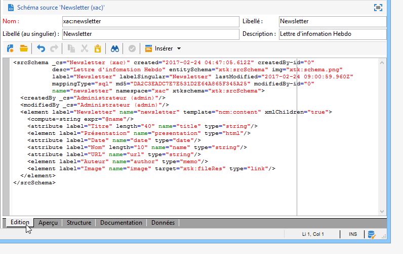

# Utiliser les schémas de données dans Campaign{#data-schemas}

Vous trouverez ci-après quelques principes généraux sur l&#39;utilisation des schémas de données dans Adobe Campaign.

La création et le paramétrage des schémas de données dans Adobe Campaign sont présentés dans [cette section](../../configuration/using/about-schema-edition.md).

## Structure d&#39;un schéma {#schema-structure}

Le document XML d&#39;un schéma de données doit contenir l&#39;élément racine **`<srcschema>`** avec les attributs **name** et **namespace** pour renseigner respectivement le nom du schéma et son espace de noms.

```
<srcSchema name="schema_name" namespace="namespace">
...
</srcSchema>
```

Le point d&#39;entrée du schéma est son élément principal. Il est facilement identifiable car son nom est identique à celui du schéma et il doit être enfant de l&#39;élément racine. C&#39;est à partir de cet élément que commence la description du contenu.

Dans un schéma de gestion de contenu, l&#39;élément principal est représenté par la ligne :

```
<element name="book" template="ncm:content" xmlChildren="true">
```

L&#39;attribut **template** renseigné sur l&#39;élément principal permet d&#39;étendre le schéma avec les propriétés génériques à toutes les définitions de contenu tel que le nom, la date de création, l&#39;auteur, la chaîne associée, etc.

Ces propriétés sont décrites dans le schéma **ncm:content**.

>[!NOTE]
>
>La présence de l&#39;attribut **xmlChildren** indique que la structure des données renseignée à partir de l&#39;élément principal est stockée dans un document XML de l&#39;instance de contenu.

>[!CAUTION]
>
>Lors de la création ou de l’extension d’un schéma, vous devez conserver la valeur de la séquence de la clé primaire (@pkSequence) pour l’ensemble du schéma.

## Types de données {#data-types}

Exemple de schéma de gestion de contenu complété avec les types :

```
<srcSchema name="book" namespace="cus">
  <element name="book" template="ncm:content" xmlChildren="true">
    <attribute name="title" type="string"/>
    <attribute name="date" type="date"/>
    <attribute name="language" type="string"/>
    <element name="chapter">
      <attribute name="name" type="string"/>
      <element name="page" type="string>
        <attribute name="number" type="short"/>
      </element>
    </element>
  </element>
</element>
```

## Propriétés {#properties}

Différentes propriétés permettent d&#39;enrichir les éléments **`<element>`** et **`<attribute>`** du schéma de données.

Les principales propriétés utilisées dans la gestion de contenu sont les suivantes :

* **label** : description courte,
* **desc** : description longue,
* **default** : expression retournant une valeur par défaut à la création du contenu,
* **userEnum** : énumération libre pour mémoriser et afficher les valeurs renseignées à partir de ce champ,
* **enum** : énumération fixe utilisée lorsque la liste des valeurs possibles est connue à l&#39;avance.

Notre schéma d&#39;exemple complété avec les propriétés :

```
<srcSchema name="book" namespace="cus">
  <enumeration name="language" basetype="string" default="eng">    
    <value name="fra" label="French"/>    
    <value name="eng" label="English"/>   
  </enumeration>

  <element name="book" label="Book" desc="Example book" template="ncm:content" xmlChildren="true">
    <attribute name="title" type="string" label="Title" default="'New book'"/>
    <attribute name="date" type="date" default="GetDate()"/>
    <attribute name="language" type="string" label="Language" enum="language"/>
    <element name="chapter" label="Chapter">
      <attribute name="name" type="string" label="Name" desc="Name of chapter"/>
      <element name="page" type="string" label="Page" desc="Page content">
        <attribute name="number" type="short" label="Number" default="CounterValue('numPage')"/>
      </element>
    </element>
  </element>
</srcSchema>
```

## Eléments de collection {#collection-elements}

Une collection est une liste d&#39;éléments de même nom et de même niveau hiérarchique.

Dans notre exemple, les éléments **`<chapter>`** et **`<page>`** sont des éléments de collection. L&#39;attribut **unbound** doit donc être ajouté à la définition de ces éléments :

```
<element name="chapter" label="Chapter" unbound="true" ordered="true">
```

```
<element name="page" type="string" label="Page" desc="Content of page" unbound="true">
```

>[!NOTE]
>
>La présence de l&#39;attribut **ordered=&quot;true&quot;** permet l&#39;ordonnancement des éléments de collection insérés.

## Référencement d&#39;éléments {#element-referencing}

Le référencement d’éléments est largement utilisé dans les schémas de contenu. Il vous permet de personnaliser la définition d’un **`<element>`** élément afin qu’il puisse être référencé sur d’autres éléments de la même structure.

L&#39;attribut **ref** sur l&#39;élément à référencer doit être renseigné avec le chemin (XPath) de l&#39;élément de référence.

**Exemple** : ajout d’une section **Annexe** ayant la même structure que l&#39;élément **`<chapter>`** de notre schéma d’exemple.

```
<srcSchema name="book" namespace="cus">
  <element name="section">
    <attribute name="name" type="string" label="Name" desc="Name"/>
    <element name="page" type="string" label="Page" desc="Content of page">
      <attribute name="number" type="short" label="Number" default="CounterValue('numPage')"/>
    </element>

  <element name="book" label="Book" desc="Example book" template="ncm:content" xmlChildren="true">
    <attribute name="title" type="string" label="Title" default="'New book'"/>
    <attribute name="date" type="date" default="GetDate()"/>
    <attribute name="language" type="string" label="Language" enum="language"/>
    <element name="chapter" label="Chapter" ref="section"/>
    <element name="appendix" label="Appendix" ref="section"/>
  </element>
</srcSchema>
```

La structure du chapitre est déplacée dans l&#39;élément de nom &quot;section&quot; en dehors de l&#39;élément principal. Le chapitre et la section référencent l&#39;élément &quot;section&quot;.

## Compute string {#compute-string}

Une **Compute string** est une expression XPath utilisée pour construire une chaîne représentant une instance de contenu.

Notre schéma d&#39;exemple complété avec sa **Compute string** :

```
<srcSchema name="book" namespace="cus">
  <element name="book" label="Book" desc="Example book" template="ncm:content" xmlChildren="true">
    <compute-string expr="@name"/>
    ...
  </element>
</srcSchema>
```

## Edition des schémas {#editing-schemas}

La zone d&#39;édition permet de renseigner le contenu XML du schéma source :



La sauvegarde du schéma source va automatiquement lancer la génération du schéma étendu.

>[!NOTE]
>
>Le contrôle d&#39;édition **Nom** permet de saisir la clé du schéma composée du nom et de l&#39;espace de noms. Les attributs **name** et **namespace** de l’élément racine du schéma sont automatiquement mis à jour dans la zone d’édition XML du schéma.
