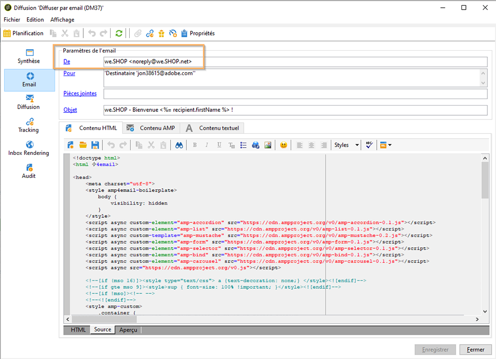

# Définition de contenu interactif{#defining-interactive-content}

Adobe Campaign vous permet de tester le nouveau format interactif [AMP pour les courriers électroniques](https://amp.dev/about/email/) , qui permet d’envoyer des courriers électroniques dynamiques, sous certaines conditions.

>[!IMPORTANT]
>
>* Cette fonctionnalité est une fonctionnalité bêta d’Adobe Campaign.
>* AMP for Email est un nouveau format open source qui permet aux développeurs de créer des courriels dynamiques et interactifs. Il est actuellement pris en charge par quelques fournisseurs de messagerie : Gmail, Outlook et Mail.ru.

Actuellement, vous pouvez uniquement :
* Testez la remise des courriers électroniques AMP à des adresses spécifiques correctement configurées.
* Remettez des courriels AMP aux adresses Gmail, Outlook ou Mail.ru après vous être enregistré auprès des fournisseurs correspondants.

Pour plus d’informations sur le test et l’envoi de courriers électroniques AMP, voir [Ciblage d’un courrier électronique](#targeting-amp-email)AMP.

Cette fonctionnalité est disponible via un pack dédié dans Adobe Campaign. Pour l&#39;utiliser, ce package doit être installé. Une fois terminé, redémarrez le serveur pour que le package soit pris en compte.

Pour les architectures hybrides et hébergées, le package doit être installé sur tous les serveurs, y compris le serveur [de](../../installation/using/mid-sourcing-server.md) milieu de gamme et l’instance [d’](../../message-center/using/creating-a-shared-connection.md#execution-instance)exécution. Contactez votre gestionnaire de compte.

Regardez cette [vidéo](https://docs.adobe.com/content/help/en/campaign-learn/campaign-classic-tutorials/sending-messages/email-channel/defining-interactive-email-content-with-amp.html) pour découvrir comment activer AMP dans Adobe Campaign et en savoir plus sur son utilisation.

## A propos d’AMP pour le courrier électronique {#about-amp-for-email}

Le nouveau format **AMP for Email** permet d’inclure des composants AMP dans les messages afin d’améliorer l’expérience du courrier électronique grâce à un contenu riche et exploitable. Grâce à la fonctionnalité d’application moderne directement disponible dans les courriers électroniques, les destinataires peuvent interagir dynamiquement avec le contenu du message lui-même.

Par exemple :
* Les courriers électroniques écrits avec AMP peuvent contenir des éléments interactifs tels que des carrousels d’image.
* Le contenu reste à jour dans le message.
* Les destinataires peuvent agir comme répondre à un formulaire sans quitter leur boîte de réception.

AMP for Email est compatible avec les courriers électroniques existants. La version AMP du message est incorporée dans le courrier électronique en tant que nouvelle partie MIME, en plus du code HTML et/ou du texte brut, assurant la compatibilité entre tous les clients de messagerie.

Pour plus d’informations sur le format de courrier électronique AMP, les spécifications et les exigences, consultez la documentation [destinée aux développeurs](https://amp.dev/documentation/guides-and-tutorials/learn/email-spec/amp-email-format/?format=email)AMP.

## Etapes clés d’utilisation d’AMP pour les courriels avec Adobe Campaign {#key-steps-to-use-amp}

Pour tester et envoyer un courrier électronique AMP avec Adobe Campaign, procédez comme suit :
1. Installez le package de prise en charge **[!UICONTROL AMP (bêta)]** . Voir [Installation des packs](../../installation/using/installing-campaign-standard-packages.md)standard de campagne.
1. Créez un courrier électronique et créez votre contenu AMP dans Adobe Campaign. Voir [Créer du contenu de courrier électronique AMP avec Adobe Campaign](#build-amp-email-content).
1. Veillez à respecter toutes les exigences de remise des fournisseurs de messagerie prenant en charge le format AMP. Voir [AMP pour connaître les conditions](#amp-for-email-delivery-requirements)de remise des courriers électroniques.

   >[!NOTE]
   >
   >AMP for Email est disponible en tant que fonctionnalité bêta à des fins de test. Actuellement, seuls quelques fournisseurs de messagerie prennent en charge le test de ce format.

1. Lorsque vous définissez votre cible, assurez-vous de sélectionner les destinataires qui pourront afficher le format AMP. Voir [Ciblage d’un courrier électronique](#targeting-amp-email)AMP.

   >[!NOTE]
   >
   >Actuellement, vous ne pouvez tester la remise des courriers électroniques AMP à des adresses électroniques spécifiques correctement configurées ou après enregistrement auprès des fournisseurs de messagerie participant au programme bêta AMP.

1. Envoyez votre courriel comme d&#39;habitude. Voir [Envoi d’un courrier électronique](#sending-amp-email)AMP.

## Création de contenu de courrier électronique AMP dans Adobe Campaign {#build-amp-email-content}

Pour créer un courrier électronique au format AMP, procédez comme suit.

>[!IMPORTANT]
>
>Veillez à respecter les exigences et les spécifications relatives aux courriers électroniques décrites dans la documentation [du développeur](https://amp.dev/documentation/guides-and-tutorials/learn/email_fundamentals/?format=email)AMP. Vous pouvez également consulter la page [AMP pour connaître les meilleures pratiques](https://amp.dev/documentation/guides-and-tutorials/develop/amp_email_best_practices/?format=email)en matière de messagerie électronique.

1. Lors de la création de votre diffusion par courrier électronique, sélectionnez un modèle.

   >[!NOTE]
   >
   >Un modèle AMP spécifique contient un exemple des principales capacités que vous pouvez utiliser : liste des produits, carrousel, double inclusion, enquête et demande de serveur avancée.

1. Cliquez sur l’onglet Contenu **** AMP.

   

1. Modifiez le contenu AMP en fonction de vos besoins.

   >[!NOTE]
   >
   >Pour plus d’informations sur la création de votre premier courrier électronique AMP, consultez la documentation [destinée aux développeurs](https://amp.dev/documentation/guides-and-tutorials/start/create_email/?format=email)AMP.

   Vous pouvez, par exemple, utiliser le composant de liste de produits du modèle AMP et tenir à jour une liste de produits d’un système tiers, voire dans Adobe Campaign. Chaque fois que vous ajustez un prix ou un autre élément, il est automatiquement répercuté lorsque le destinataire ouvre à nouveau le courrier électronique à partir de sa boîte aux lettres.

1. Personnalisez votre contenu AMP selon vos besoins, comme vous le feriez habituellement avec le format HTML dans Adobe Campaign, avec des champs de personnalisation et des blocs de personnalisation.

   

1. Une fois la modification terminée, sélectionnez tout votre contenu AMP et copiez-collez-le dans le validateur [Web](https://validator.ampproject.org) AMP ou un site Web similaire.

   >[!NOTE]
   >
   >Veillez à sélectionner **AMP4 EMAIL** dans la liste déroulante en haut de l’écran.

   

   Toutes les erreurs seront marquées en ligne.

   >[!NOTE]
   >
   >L’éditeur AMP Adobe Campaign n’est pas conçu pour la validation du contenu. Utilisez un site Web externe tel que le validateur [Web](https://validator.ampproject.org) AMP pour vérifier que votre contenu est correct.

1. Apportez les modifications nécessaires jusqu’à ce que le contenu AMP soit validé.

   

1. Copiez-collez votre contenu validé dans [AMP Playground](https://playground.amp.dev) ou un site Web similaire pour prévisualiser votre contenu.

   >[!NOTE]
   >
   >Veillez à sélectionner **AMP pour courriel** dans la liste déroulante en haut de l’écran.

   

   >[!NOTE]
   >
   >Vous ne pouvez pas prévisualiser votre contenu AMP directement dans Adobe Campaign. Utilisez un site Web externe tel que [AMP Playground](https://playground.amp.dev).

1. Revenez à Adobe Campaign et copiez-collez votre contenu validé dans l’onglet de contenu **** AMP.

1. Passez à l’onglet Contenu **** HTML ou Contenu **** texte et définissez le contenu pour au moins l’un de ces deux formats.

   >[!IMPORTANT]
   >
   >Si votre courrier électronique ne contient pas de version HTML ou texte brut en plus du contenu AMP, il ne peut pas être envoyé.

## AMP pour les besoins de remise de courrier électronique {#amp-for-email-delivery-requirements}

Lors de la création de votre contenu AMP dans Adobe Campaign, vous devez respecter les conditions de diffusion d’un courrier électronique dynamique, qui sont spécifiques aux fournisseurs de messagerie de vos destinataires.

Actuellement, trois fournisseurs de messagerie prennent en charge le test de ce format : Gmail, Outlook et Mail.ru.

Toutes les étapes et spécifications requises pour tester la distribution au format AMP sur les comptes Gmail sont détaillées dans les documentations [Gmail](https://developers.google.com/gmail/ampemail?), [Outlook ](https://docs.microsoft.com/en-gb/outlook/amphtml/) et [Mail.ru](https://postmaster.mail.ru/amp) correspondantes.

En particulier, les conditions suivantes doivent être remplies:
* Respectez les exigences de sécurité AMP spécifiques à [Gmail](https://developers.google.com/gmail/ampemail/security-requirements), [Outlook](https://docs.microsoft.com/en-gb/outlook/amphtml/security-requirements) et [Mail.ru](https://postmaster.mail.ru/amp/?lang=en#howto).
* La partie MIME AMP doit contenir un document [AMP](https://amp.dev/documentation/guides-and-tutorials/learn/validation-workflow/validate_emails/?format=email)valide.
* La partie MIME AMP doit être inférieure à 100 Ko.

Vous pouvez également consulter les [conseils et les limites connues de Gmail](https://developers.google.com/gmail/ampemail/tips) et les bonnes pratiques [AMP pour Outlook](https://docs.microsoft.com/en-gb/outlook/amphtml/best-practices).

## Ciblage d’un courrier électronique AMP {#targeting-amp-email}

AMP for Email étant disponible en tant que fonctionnalité bêta, vous pouvez actuellement tester l’envoi d’un courrier électronique AMP en deux étapes :

1. Adobe Campaign vous permet de tester la diffusion d’un courrier électronique dynamique piloté par AMP vers des adresses électroniques sélectionnées correctement configurées, afin de vérifier son contenu et son comportement. Voir [Test de la remise de courrier électronique AMP pour les adresses](#testing-amp-delivery-for-selected-addresses)sélectionnées.
1. Une fois testé, vous pouvez envoyer une diffusion ou une campagne dans le cadre du programme bêta AMP for Email en vous enregistrant auprès du ou des fournisseurs de messagerie concernés pour que votre domaine d’expéditeur soit autorisé. Voir [Diffusion de courriers électroniques AMP en vous enregistrant auprès d’un fournisseur](#delivering-amp-emails-by-registering)de messagerie.

### Test de la remise de courrier électronique AMP pour les adresses sélectionnées {#testing-amp-delivery-for-selected-addresses}

Vous pouvez tester l’envoi de messages dynamiques d’Adobe Campaign vers des adresses électroniques sélectionnées.

>[!NOTE]
>
>Actuellement, seuls Gmail, Outlook et Mail.ru prennent en charge le test du format AMP.

Pour Gmail et Outlook, vous devez d’abord mettre en liste blanche la ou les adresses d’expéditeur que vous utilisez pour diffuser à partir d’Adobe Campaign pour les comptes Gmail et Outlook que vous ciblez.

Pour cela :
1. Vérifiez que l’option d’activation du courrier électronique dynamique est recherchée par le ou les fournisseurs de messagerie appropriés.
1. Copiez l’adresse de l’expéditeur affichée dans le champ **[!UICONTROL De]** la remise et collez-la dans la section appropriée des paramètres du compte du fournisseur de messagerie.

Pour plus de détails, consultez les documentations des développeurs [Gmail](https://developers.google.com/gmail/ampemail/testing-dynamic-email) et [Outlook](https://docs.microsoft.com/en-gb/outlook/amphtml/register-outlook#individual-mailbox-registration) .

Pour tester l’envoi d’un courrier électronique AMP à une adresse Mail.ru, suivez les étapes de la documentation [destinée aux développeurs de](https://postmaster.mail.ru/amp/?lang=en#howto) Mail.ru (**Si vous êtes un utilisateur** ).

### Diffusion de courriers électroniques AMP en s’enregistrant auprès d’un fournisseur de messagerie {#delivering-amp-emails-by-registering}

Vous pouvez expérimenter la diffusion de courriers électroniques dynamiques en vous enregistrant auprès des fournisseurs de messagerie qui participent au programme bêta AMP afin d’obtenir la liste blanche de votre domaine d’expéditeur.

>[!NOTE]
>
>Actuellement, seuls Gmail, Outlook et Mail.ru prennent en charge le format AMP.

Une fois testé avec quelques adresses, vous pouvez envoyer des courriels AMP à n&#39;importe quelle adresse Gmail ou Outlook. Pour ce faire, vous devez vous enregistrer respectueusement auprès de Google ou de Microsoft, et attendre leur réponse. Suivez les étapes présentées dans les documentations des développeurs [Gmail](https://developers.google.com/gmail/ampemail/register) et [Outlook](https://docs.microsoft.com/en-gb/outlook/amphtml/register-outlook#global-registration) . Après une inscription réussie, vous devenez un expéditeur autorisé.

Pour envoyer des courriers électroniques AMP aux adresses Mail.ru, suivez les exigences et étapes répertoriées dans la documentation [destinée aux développeurs de](https://postmaster.mail.ru/amp/?lang=en#howto) Mail.ru (**Si vous êtes un expéditeur** de courrier électronique).

## Envoi d’un courrier électronique AMP {#sending-amp-email}

Une fois que votre contenu AMP et vos abandons sont prêts, et une fois que vous avez défini une cible compatible, vous pouvez envoyer le courrier électronique comme vous le feriez normalement.

Actuellement, seuls Gmail, Outlook et Mail.ru prennent en charge le format AMP, dans certaines conditions. Vous pouvez cibler les adresses d’autres fournisseurs de messagerie, mais ils recevront la version HTML ou en texte brut de votre messagerie.

>[!IMPORTANT]
>
>Si votre courrier électronique ne contient pas de version HTML ou texte brut en plus du contenu AMP, il ne peut pas être envoyé.

Les destinataires correspondants verront la version AMP du courrier électronique affichée dans leur boîte aux lettres.

Si, par exemple, vous avez inclus une liste de produits dans votre courrier électronique, les prix sont automatiquement ajustés chaque fois que vos destinataires ouvrent à nouveau le courrier électronique dans leur boîte aux lettres lors de la modification des prix dans un système tiers.

>[!NOTE]
>
>Vous pouvez créer une règle de traitement du courrier pour empêcher des domaines spécifiques de recevoir des courriers électroniques AMP. Voir [Gestion des formats](../../installation/using/email-deliverability.md#managing-email-formats)de courrier électronique.
>
>Par défaut, l’option d’inclusion **** AMP est définie sur **[!UICONTROL Non]**.
