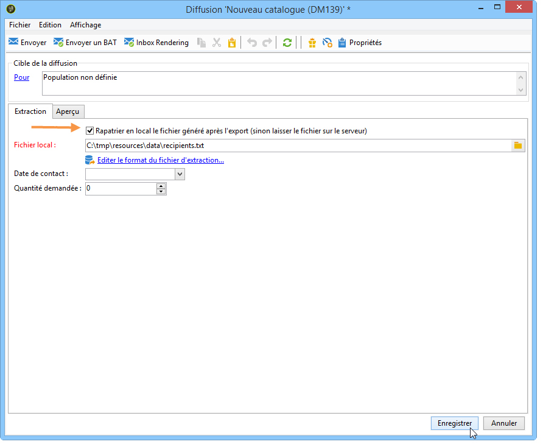
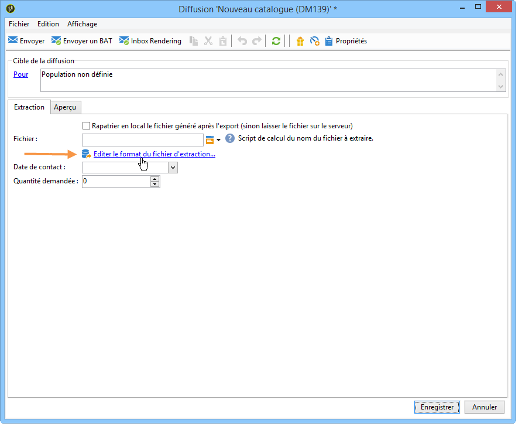
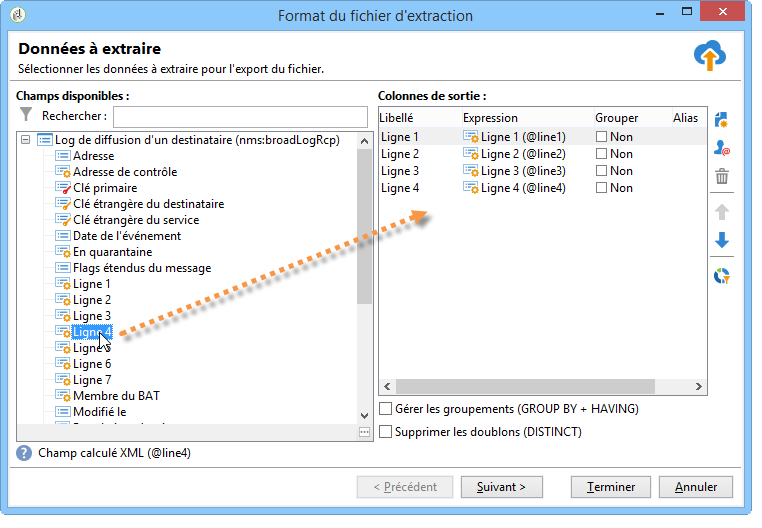

# Définition du contenu du publipostage direct{#defining-the-direct-mail-content}

## Fichier d&#39;extraction {#extraction-file}

Le nom du fichier contenant les données extraites est défini dans le champ **[!UICONTROL Fichier]**. Le bouton situé à droite du champ permet d&#39;utiliser des champs de personnalisation pour créer le nom du fichier.

Par défaut, le fichier d&#39;extraction est créé et stocké sur le serveur. Vous pouvez l&#39;enregistrer sur votre ordinateur. Pour cela, cochez l&#39;option **[!UICONTROL Rapatrier en local le fichier généré après l&#39;export]**. Dans ce cas, vous devez indiquer le chemin d&#39;accès au répertoire de stockage local et le nom du fichier.

Pour une diffusion par courrier, le contenu de l&#39;extraction est défini à partir du lien **[!UICONTROL Editer le format du fichier d&#39;extraction...]**.

Ce lien permet d&#39;accéder à l&#39;assistant d&#39;extraction et de définir les informations (colonnes) à exporter dans le fichier de sortie.

Il est possible d’insérer une URL personnalisée dans le fichier d’extraction. Pour plus d’informations, consultez [cette section](../../web/using/publishing-a-web-form.md).

>[!NOTE]
>
>Cet assistant comprend les étapes de l’assistant d’exportation décrites dans la section [Prise en main](../../platform/using/executing-export-jobs.md) .
