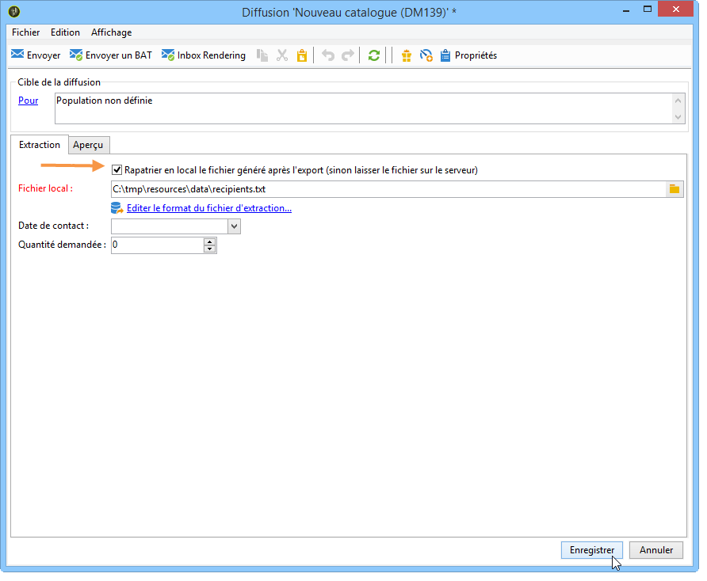

# Définition du contenu du publipostage direct{#defining-the-direct-mail-content}

## Fichier d&#39;extraction {#extraction-file}

Le nom du fichier contenant les données extraites est défini dans le champ **[!UICONTROL Fichier]**.Le bouton situé à droite du champ vous permet d’utiliser des champs de personnalisation pour créer le nom du fichier.

Par défaut, le fichier d’extraction est créé et stocké sur le serveur.Vous pouvez l’enregistrer sur votre ordinateur.Pour cela, cochez l&#39;option **[!UICONTROL Rapatrier en local le fichier généré après l&#39;export]**. Dans ce cas, vous devez indiquer le chemin d&#39;accès au répertoire de stockage local et le nom du fichier.

Pour une diffusion par courrier, le contenu de l’extraction est défini à partir du lien **[!UICONTROL Éditer le format du fichier d’extraction...]**.

Ce lien permet d’accéder à l’assistant d’extraction afin de définir les informations (colonnes) à exporter dans le fichier de sortie.

Il est possible d’insérer une URL personnalisée dans le fichier d’extraction. Pour plus d’informations, consultez [cette section](../../web/using/publishing-a-web-form.md).

>[!NOTE]
>
>Cet assistant reprend les étapes de l’assistant d’export décrites dans la section [Prise en main](../../platform/using/executing-export-jobs.md).
