<?xml version="1.0" encoding="UTF-8"?>
<xliff xmlns="urn:oasis:names:tc:xliff:document:1.2" xmlns:okp="okapi-framework:xliff-extensions" xmlns:its="http://www.w3.org/2005/11/its" xmlns:itsxlf="http://www.w3.org/ns/its-xliff/" version="1.2" its:version="2.0">
<file original="help/delivery/using/defining-the-email-content.md.mdsc" source-language="en-US" target-language="en-XX" datatype="x-text/markdown">
<body>
<trans-unit id="tu33" xml:space="preserve">
<source xml:lang="en-US">https://experienceleague.adobe.com/en/docs/control-panel/using/instances-settings/url-permissions</source>
<target xml:lang="en-XX">https://experienceleague.adobe.com/fr/docs/control-panel/using/instances-settings/url-permissions</target>
</trans-unit>
<trans-unit id="tu59" xml:space="preserve">
<source xml:lang="en-US">https://amp.dev/about/email/</source>
<target xml:lang="en-XX">https://amp.dev/fr/about/email/</target>
</trans-unit>
<trans-unit id="tu61" xml:space="preserve">
<source xml:lang="en-US">https://experienceleague.adobe.com/docs/campaign/campaign-v8/send/emails/defining-interactive-content.html</source>
<target xml:lang="en-XX">https://experienceleague.adobe.com/docs/campaign/campaign-v8/send/emails/defining-interactive-content.html?lang=fr</target>
</trans-unit>
<trans-unit id="tu1" restype="x-YAML_METADATA_HEADER_VALUE" xml:space="preserve">
<source xml:lang="en-US">Define the email content in Adobe Campaign Classic</source>
<target xml:lang="en-XX">Définir le contenu d’e-mail dans Adobe Campaign Classic</target>
</trans-unit>
<trans-unit id="tu2" restype="x-YAML_METADATA_HEADER_VALUE" xml:space="preserve">
<source xml:lang="en-US">Learn how to define the email content when using Adobe Campaign</source>
<target xml:lang="en-XX">Découvrez comment définir le contenu d'e-mail avec Adobe Campaign</target>
</trans-unit>
<trans-unit id="tu3" xml:space="preserve">
<source xml:lang="en-US">Also applies to v8</source>
<target xml:lang="en-XX">S’applique également à la v8.</target>
</trans-unit>
<trans-unit id="tu4" xml:space="preserve">
<source xml:lang="en-US">Also applies to Campaign v8</source>
<target xml:lang="en-XX">S’applique également à Campaign v8.</target>
</trans-unit>
<trans-unit id="tu5" xml:space="preserve">
<source xml:lang="en-US">Define the email content</source>
<target xml:lang="en-XX">Définition du contenu de l’e-mail</target>
</trans-unit>
<trans-unit id="tu6" xml:space="preserve">
<source xml:lang="en-US">Sender</source>
<target xml:lang="en-XX">Expéditeur</target>
</trans-unit>
<trans-unit id="tu7" xml:space="preserve">
<source xml:lang="en-US">To define the name and address of the sender which will appear in the header of messages sent, click the <ph id="1" ctype="x-STRONG_EMPHASIS">**[!UICONTROL </ph>From<ph id="3" ctype="x-LINK_REF">]**</ph> link.</source>
<target xml:lang="en-XX">Pour définir le nom et l’adresse de l’expéditeur qui apparaîtront dans l’en-tête des messages envoyés, cliquez sur le lien <ph id="1" ctype="x-STRONG_EMPHASIS">**[!UICONTROL </ph>De<ph id="3" ctype="x-LINK_REF">]**</ph>.</target>
</trans-unit>
<trans-unit id="tu8" xml:space="preserve">
<source xml:lang="en-US"><ph id="1" ctype="x-IMAGE"></ph></source>
<target xml:lang="en-XX"><ph id="1" ctype="x-IMAGE"></ph></target>
</trans-unit>
<trans-unit id="tu9" xml:space="preserve">
<source xml:lang="en-US">This window lets you enter all the information required to create the email message headers. This information can be personalized. To do this, use the buttons to the right of the input fields to insert personalization fields.</source>
<target xml:lang="en-XX">Cette fenêtre permet de saisir toutes les informations nécessaires à l’élaboration des en-têtes de messages e-mail. Ces informations peuvent être personnalisées. Cette fenêtre permet de saisir toutes les informations nécessaires à l’élaboration des en-têtes de messages e-mail.</target>
</trans-unit>
<trans-unit id="tu10" xml:space="preserve">
<source xml:lang="en-US">To find out how to insert and use personalization fields, refer to <ph id="1" ctype="x-LINK">[</ph>About personalization<ph id="2" ctype="x-LINK">](about-personalization.md)</ph> section.</source>
<target xml:lang="en-XX">L’insertion et l’utilisation de champs de personnalisation sont présentées dans la section <ph id="1" ctype="x-LINK">[</ph>À propos de la personnalisation<ph id="2" ctype="x-LINK">](about-personalization.md)</ph>.</target>
</trans-unit>
<trans-unit id="tu11" xml:space="preserve">
<source xml:lang="en-US"><ph id="1" ctype="x-regxph" equiv-text="&lbrack;!NOTE">[!NOTE]</ph></source>
<target xml:lang="en-XX"><ph id="1" ctype="x-regxph" equiv-text="&lbrack;!NOTE">[!NOTE]</ph></target>
</trans-unit>
<trans-unit id="tu12" xml:space="preserve">
<source xml:lang="en-US">The sender's address is used for replies by default.</source>
<target xml:lang="en-XX">Par défaut, l’adresse de réponse est l’adresse de l’expéditeur ou de l’expéditrice.</target>
</trans-unit>
<trans-unit id="tu13" xml:space="preserve">
<source xml:lang="en-US">The header parameters must not be empty. By default, they contain the values input when configuring the deployment wizard. Learn more in <ph id="1" ctype="x-LINK">[</ph>this section<ph id="2" ctype="x-LINK">](../../installation/using/deploying-an-instance.md)</ph>.</source>
<target xml:lang="en-XX">Les paramètres d’en-tête ne doivent pas être vides. Par défaut, ils contiennent les valeurs saisies lors de la configuration de l’assistant de déploiement. En savoir plus dans <ph id="1" ctype="x-LINK">[</ph>cette section<ph id="2" ctype="x-LINK">](../../installation/using/deploying-an-instance.md)</ph>.</target>
</trans-unit>
<trans-unit id="tu14" xml:space="preserve">
<source xml:lang="en-US">The sender's address is mandatory to allow an email to be sent (RFC standard).</source>
<target xml:lang="en-XX">L'adresse de l'expéditeur est obligatoire pour permettre l'envoi d'un email (norme RFC).</target>
</trans-unit>
<trans-unit id="tu15" xml:space="preserve">
<source xml:lang="en-US">Adobe Campaign checks the syntax of email addresses entered.</source>
<target xml:lang="en-XX">Adobe Campaign effectue une vérification syntaxique des adresses email saisies.</target>
</trans-unit>
<trans-unit id="tu16" xml:space="preserve">
<source xml:lang="en-US"><ph id="1" ctype="x-regxph" equiv-text="&lbrack;!CAUTION">[!CAUTION]</ph></source>
<target xml:lang="en-XX"><ph id="1" ctype="x-regxph" equiv-text="&lbrack;!CAUTION">[!CAUTION]</ph></target>
</trans-unit>
<trans-unit id="tu17" xml:space="preserve">
<source xml:lang="en-US">To avoid deliverability issues, the email accounts that correspond to the addresses specified for deliveries and replies must exist and must be monitored. Check with your system administrator.</source>
<target xml:lang="en-XX">Pour éviter tout problème de délivrabilité, les comptes e-mail qui correspondent aux adresses spécifiées pour les diffusions et les réponses doivent exister et doivent être surveillés. Parlez-en avec l’administrateur ou l’administratrice système.</target>
</trans-unit>
<trans-unit id="tu18" xml:space="preserve">
<source xml:lang="en-US">Message subject</source>
<target xml:lang="en-XX">Objet du message</target>
</trans-unit>
<trans-unit id="tu19" xml:space="preserve">
<source xml:lang="en-US">The subject of the message is configured in the corresponding field. You can enter it directly in the field or click the <ph id="1" ctype="x-STRONG_EMPHASIS">**[!UICONTROL </ph>Subject<ph id="3" ctype="x-LINK_REF">]**</ph> link to enter a script. The personalization link lets you insert database fields in the subject.</source>
<target xml:lang="en-XX">L'objet du message est paramétré dans le champ correspondant. Vous pouvez le saisir directement dans le champ ou cliquer sur le lien <ph id="1" ctype="x-STRONG_EMPHASIS">**[!UICONTROL </ph>Objet<ph id="3" ctype="x-LINK_REF">]**</ph> pour saisir un script. Le lien de personnalisation permet d'insérer des champs de la base dans l'objet.</target>
</trans-unit>
<trans-unit id="tu20" xml:space="preserve">
<source xml:lang="en-US"><ph id="1" ctype="x-regxph" equiv-text="&lbrack;!IMPORTANT">[!IMPORTANT]</ph></source>
<target xml:lang="en-XX"><ph id="1" ctype="x-regxph" equiv-text="&lbrack;!IMPORTANT">[!IMPORTANT]</ph></target>
</trans-unit>
<trans-unit id="tu21" xml:space="preserve">
<source xml:lang="en-US">The message subject is mandatory.</source>
<target xml:lang="en-XX">L'objet du message est obligatoire.</target>
</trans-unit>
<trans-unit id="tu22" xml:space="preserve">
<source xml:lang="en-US"><ph id="1" ctype="x-IMAGE"></ph></source>
<target xml:lang="en-XX"><ph id="1" ctype="x-IMAGE"></ph></target>
</trans-unit>
<trans-unit id="tu23" xml:space="preserve">
<source xml:lang="en-US">The field content will be replaced by the value in the recipient profile when the message is sent.</source>
<target xml:lang="en-XX">Le contenu des champs sera remplacé par la valeur enregistrée dans le profil du destinataire lors de l'envoi du message.</target>
</trans-unit>
<trans-unit id="tu24" xml:space="preserve">
<source xml:lang="en-US">For example, in the message above, the subject of the message is personalized for each recipient with data from their profile.</source>
<target xml:lang="en-XX">Par exemple, dans le message ci-dessus, l’objet du message est personnalisé pour chaque destinataire avec les données de son profil.</target>
</trans-unit>
<trans-unit id="tu25" xml:space="preserve">
<source xml:lang="en-US"><ph id="1" ctype="x-regxph" equiv-text="&lbrack;!NOTE">[!NOTE]</ph></source>
<target xml:lang="en-XX"><ph id="1" ctype="x-regxph" equiv-text="&lbrack;!NOTE">[!NOTE]</ph></target>
</trans-unit>
<trans-unit id="tu26" xml:space="preserve">
<source xml:lang="en-US">The use of personalization fields is presented in <ph id="1" ctype="x-LINK">[</ph>About personalization<ph id="2" ctype="x-LINK">](about-personalization.md)</ph>.</source>
<target xml:lang="en-XX">L’utilisation des champs de personnalisation est présentée dans la section <ph id="1" ctype="x-LINK">[</ph>À propos de la personnalisation<ph id="2" ctype="x-LINK">](about-personalization.md)</ph>.</target>
</trans-unit>
<trans-unit id="tu27" xml:space="preserve">
<source xml:lang="en-US">You can also insert emoticons to your subject line with the <ph id="1" ctype="x-STRONG_EMPHASIS">**[!UICONTROL </ph>Insert emoticon<ph id="3" ctype="x-LINK_REF">]**</ph> pop-up window.</source>
<target xml:lang="en-XX">Vous pouvez également insérer des émoticônes dans votre ligne Objet à l’aide de la fenêtre pop-up <ph id="1" ctype="x-STRONG_EMPHASIS">**[!UICONTROL </ph>Insérer une émoticône<ph id="3" ctype="x-LINK_REF">]**</ph>.</target>
</trans-unit>
<trans-unit id="tu28" xml:space="preserve">
<source xml:lang="en-US">Message content</source>
<target xml:lang="en-XX">Contenu du message</target>
</trans-unit>
<trans-unit id="tu29" xml:space="preserve">
<source xml:lang="en-US"><ph id="1" ctype="x-regxph" equiv-text="&lbrack;!IMPORTANT">[!IMPORTANT]</ph></source>
<target xml:lang="en-XX"><ph id="1" ctype="x-regxph" equiv-text="&lbrack;!IMPORTANT">[!IMPORTANT]</ph></target>
</trans-unit>
<trans-unit id="tu30" xml:space="preserve">
<source xml:lang="en-US">For privacy reasons, we recommend using HTTPS for all external resources.</source>
<target xml:lang="en-XX">Pour des raisons de confidentialité, nous vous recommandons d’utiliser HTTPS pour toutes les ressources externes.</target>
</trans-unit>
<trans-unit id="tu31" xml:space="preserve">
<source xml:lang="en-US"><ph id="1" ctype="x-regxph" equiv-text="&lbrack;!IMPORTANT">[!IMPORTANT]</ph></source>
<target xml:lang="en-XX"><ph id="1" ctype="x-regxph" equiv-text="&lbrack;!IMPORTANT">[!IMPORTANT]</ph></target>
</trans-unit>
<trans-unit id="tu32" xml:space="preserve">
<source xml:lang="en-US">Release 7.4.4 (build 9401) includes an update to the external URL allow list. Make sure the domains used in your message content are added to your instance's approved allow list so that resources continue to load without interruption. As a Campaign Administrator, use the Control Panel to add and manage allow-listed URLs. See <ph id="1" ctype="x-LINK">&lbrack;</ph>Add URL permissions<ph id="2" ctype="x-LINK">[#$tu33]{target="_blank"}</ph> for steps.</source>
<target xml:lang="en-XX">La version 7.4.4 (build 9401) comprend une mise à jour de la liste des URL externes autorisées. Assurez-vous que les domaines utilisés dans le contenu de votre message sont ajoutés à la liste autorisée approuvée de votre instance afin que les ressources puissent continuer à se charger sans interruption. En tant qu’administrateur ou administratrice de Campaign, utilisez le panneau de contrôle pour ajouter et gérer des URL placées sur la liste autorisée. Pour connaître la procédure, consultez <ph id="1" ctype="x-LINK">&lbrack;</ph>Ajouter des autorisations d’URL<ph id="2" ctype="x-LINK">[#$tu33]{target="_blank"}</ph>.</target>
</trans-unit>
<trans-unit id="tu34" xml:space="preserve">
<source xml:lang="en-US">The content of the message is defined in the lower section of the delivery configuration window.</source>
<target xml:lang="en-XX">Le contenu du message est défini dans la section inférieure de la fenêtre de configuration de la diffusion.</target>
</trans-unit>
<trans-unit id="tu35" xml:space="preserve">
<source xml:lang="en-US">Messages are sent in HTML or text format by default, according to recipient preference. We recommend creating content in both formats to ensure that messages can be correctly displayed in any mail system. For more on this, refer to <ph id="1" ctype="x-LINK">[</ph>Selecting message formats<ph id="2" ctype="x-LINK">](email-parameters.md#selecting-message-formats)</ph>.</source>
<target xml:lang="en-XX">Les messages sont envoyés par défaut au format HTML ou texte, selon les préférences des destinataires. Il est recommandé de créer un contenu dans les deux formats afin de permettre un affichage correct dans toutes les messageries. Voir à ce sujet la section <ph id="1" ctype="x-LINK">[</ph>Sélection des formats du message<ph id="2" ctype="x-LINK">](email-parameters.md#selecting-message-formats)</ph>.</target>
</trans-unit>
<trans-unit id="tu36" xml:space="preserve">
<source xml:lang="en-US">To import an HTML content, use the <ph id="1" ctype="x-STRONG_EMPHASIS">**[!UICONTROL </ph>Open<ph id="3" ctype="x-LINK_REF">]**</ph> button. You can also paste the source code directly into the <ph id="5" ctype="x-STRONG_EMPHASIS">**[!UICONTROL </ph>Source<ph id="7" ctype="x-LINK_REF">]**</ph> sub-tab.</source>
<target xml:lang="en-XX">Pour importer un contenu HTML, utilisez le bouton <ph id="1" ctype="x-STRONG_EMPHASIS">**[!UICONTROL </ph>Ouvrir<ph id="3" ctype="x-LINK_REF">]**</ph>. Vous pouvez également coller le code source directement dans le sous-onglet <ph id="5" ctype="x-STRONG_EMPHASIS">**[!UICONTROL </ph>Source<ph id="7" ctype="x-LINK_REF">]**</ph>.</target>
</trans-unit>
<trans-unit id="tu37" xml:space="preserve">
<source xml:lang="en-US">If you are using the <ph id="1" ctype="x-LINK">[</ph>Digital Content Editor<ph id="2" ctype="x-LINK">](../../web/using/about-campaign-html-editor.md)</ph> (DCE), refer to <ph id="3" ctype="x-LINK">[</ph>Selecting a content template<ph id="4" ctype="x-LINK">](../../web/using/use-case-creating-an-email-delivery.md#step-3---selecting-a-content)</ph>.</source>
<target xml:lang="en-XX">Si vous utilisez <ph id="1" ctype="x-LINK">[</ph>Digital Content Editor<ph id="2" ctype="x-LINK">](../../web/using/about-campaign-html-editor.md)</ph> (DCE), consultez <ph id="3" ctype="x-LINK">[</ph>Sélection d'un modèle de contenu<ph id="4" ctype="x-LINK">](../../web/using/use-case-creating-an-email-delivery.md#step-3---selecting-a-content)</ph>.</target>
</trans-unit>
<trans-unit id="tu38" xml:space="preserve">
<source xml:lang="en-US"><ph id="1" ctype="x-regxph" equiv-text="&lbrack;!IMPORTANT">[!IMPORTANT]</ph></source>
<target xml:lang="en-XX"><ph id="1" ctype="x-regxph" equiv-text="&lbrack;!IMPORTANT">[!IMPORTANT]</ph></target>
</trans-unit>
<trans-unit id="tu39" xml:space="preserve">
<source xml:lang="en-US">The HTML content must be created beforehand, then imported into Adobe Campaign. The HTML editor is not designed for content creation.</source>
<target xml:lang="en-XX">Le contenu HTML doit être préalablement créé puis importé dans Adobe Campaign. L’éditeur HTML n’est pas conçu pour la création de contenu.</target>
</trans-unit>
<trans-unit id="tu40" xml:space="preserve">
<source xml:lang="en-US">The <ph id="1" ctype="x-STRONG_EMPHASIS">**[!UICONTROL </ph>Preview<ph id="3" ctype="x-LINK_REF">]**</ph> sub-tab lets you view the rendering of each content for a recipient. The personalization fields and the conditional elements of content are replaced with the corresponding information for the selected profile.</source>
<target xml:lang="en-XX">Le sous-onglet <ph id="1" ctype="x-STRONG_EMPHASIS">**[!UICONTROL </ph>Prévisualisation<ph id="3" ctype="x-LINK_REF">]**</ph> vous permet de visualiser le rendu de chaque contenu pour une personne destinataire. Les champs de personnalisation et les éléments conditionnels du contenu sont remplacés par les informations correspondantes pour le profil sélectionné.</target>
</trans-unit>
<trans-unit id="tu41" xml:space="preserve">
<source xml:lang="en-US">The toolbar buttons provide access to the standard actions and formatting parameters for the HTML page.</source>
<target xml:lang="en-XX">Les boutons de la barre d'outils permettent d'accéder aux paramètres de mise en forme standard pour la page HTML.</target>
</trans-unit>
<trans-unit id="tu42" xml:space="preserve">
<source xml:lang="en-US"><ph id="1" ctype="x-IMAGE">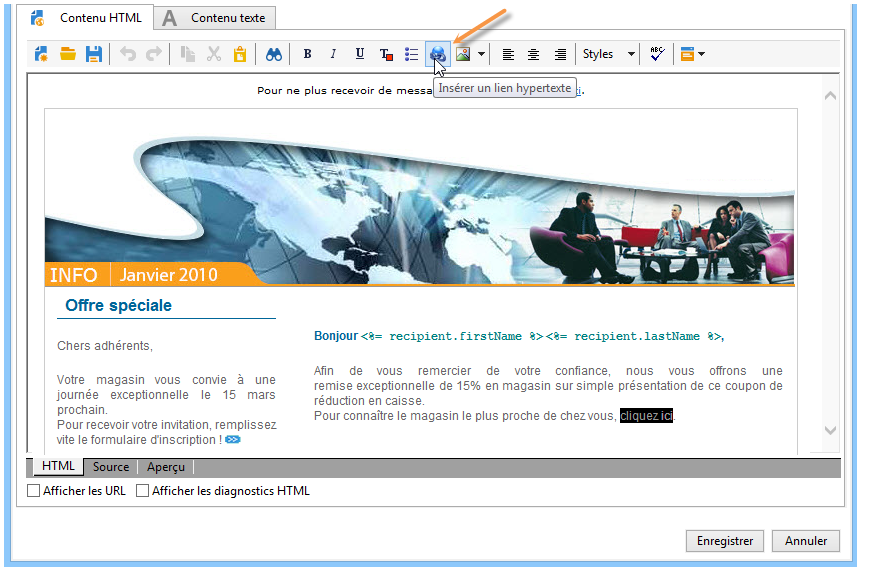</ph></source>
<target xml:lang="en-XX"><ph id="1" ctype="x-IMAGE"></ph></target>
</trans-unit>
<trans-unit id="tu43" xml:space="preserve">
<source xml:lang="en-US">You can insert images in messages from a local file or from an image library in Adobe Campaign. To do this, click the <ph id="1" ctype="x-STRONG_EMPHASIS">**[!UICONTROL </ph>Image<ph id="3" ctype="x-LINK_REF">]**</ph> icon and select the appropriate option.</source>
<target xml:lang="en-XX">Vous pouvez insérer des images dans les messages depuis un fichier local ou depuis la bibliothèque d'images disponible dans Adobe Campaign. Pour cela, cliquez sur l'icône <ph id="1" ctype="x-STRONG_EMPHASIS">**[!UICONTROL </ph>Image<ph id="3" ctype="x-LINK_REF">]**</ph> et sélectionnez l'option adéquate.</target>
</trans-unit>
<trans-unit id="tu44" xml:space="preserve">
<source xml:lang="en-US"><ph id="1" ctype="x-IMAGE">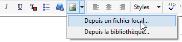</ph></source>
<target xml:lang="en-XX"><ph id="1" ctype="x-IMAGE"></ph></target>
</trans-unit>
<trans-unit id="tu45" xml:space="preserve">
<source xml:lang="en-US">Library images can be accessed via the <ph id="1" ctype="x-STRONG_EMPHASIS">**[!UICONTROL </ph>Resources>Online>Public resources<ph id="3" ctype="x-LINK_REF">]**</ph> folder in the folder tree. Also refer to <ph id="5" ctype="x-LINK">[</ph>Adding images<ph id="6" ctype="x-LINK">](#adding-images)</ph>.</source>
<target xml:lang="en-XX">Les images de la bibliothèque sont accessibles depuis le dossier <ph id="1" ctype="x-STRONG_EMPHASIS">**[!UICONTROL </ph>Ressources>On-line>Ressources publiques<ph id="3" ctype="x-LINK_REF">]**</ph> de l’arborescence. Voir aussi la section <ph id="5" ctype="x-LINK">[</ph>Ajout d’images<ph id="6" ctype="x-LINK">](#adding-images)</ph>.</target>
</trans-unit>
<trans-unit id="tu46" xml:space="preserve">
<source xml:lang="en-US">The last button in the toolbar lets you insert personalization fields.</source>
<target xml:lang="en-XX">Le dernier bouton de la barre d'outils permet d'insérer des champs de personnalisation.</target>
</trans-unit>
<trans-unit id="tu47" xml:space="preserve">
<source xml:lang="en-US"><ph id="1" ctype="x-regxph" equiv-text="&lbrack;!NOTE">[!NOTE]</ph></source>
<target xml:lang="en-XX"><ph id="1" ctype="x-regxph" equiv-text="&lbrack;!NOTE">[!NOTE]</ph></target>
</trans-unit>
<trans-unit id="tu48" xml:space="preserve">
<source xml:lang="en-US">The use of personalization fields is presented in <ph id="1" ctype="x-LINK">[</ph>About personalization<ph id="2" ctype="x-LINK">](about-personalization.md)</ph>.</source>
<target xml:lang="en-XX">L’utilisation des champs de personnalisation est présentée dans la section <ph id="1" ctype="x-LINK">[</ph>À propos de la personnalisation<ph id="2" ctype="x-LINK">](about-personalization.md)</ph>.</target>
</trans-unit>
<trans-unit id="tu49" xml:space="preserve">
<source xml:lang="en-US">The tabs at the bottom of the page let you display the HTML code of the page being created and view the rendering of the message with its personalization. To launch this display, click <ph id="1" ctype="x-STRONG_EMPHASIS">**[!UICONTROL </ph>Preview<ph id="3" ctype="x-LINK_REF">]**</ph> and select a recipient using the <ph id="5" ctype="x-STRONG_EMPHASIS">**[!UICONTROL </ph>Test personalization<ph id="7" ctype="x-LINK_REF">]**</ph> button in the toolbar. You can select a recipient from the defined target(s) or choose another recipient.</source>
<target xml:lang="en-XX">Les onglets en bas de page permettent d’afficher le code HTML associé à la page en cours de création et de visualiser le rendu du message, avec sa personnalisation. Pour lancer la visualisation, cliquez sur l’onglet <ph id="1" ctype="x-STRONG_EMPHASIS">**[!UICONTROL </ph>Aperçu<ph id="3" ctype="x-LINK_REF">]**</ph> et sélectionnez un destinataire à partir du bouton <ph id="5" ctype="x-STRONG_EMPHASIS">**[!UICONTROL </ph>Tester la personnalisation<ph id="7" ctype="x-LINK_REF">]**</ph> situé dans la barre d’outils. Vous pouvez sélectionner un destinataire parmi la ou les cibles définies ou choisir un autre destinataire.</target>
</trans-unit>
<trans-unit id="tu50" xml:space="preserve">
<source xml:lang="en-US"><ph id="1" ctype="x-IMAGE">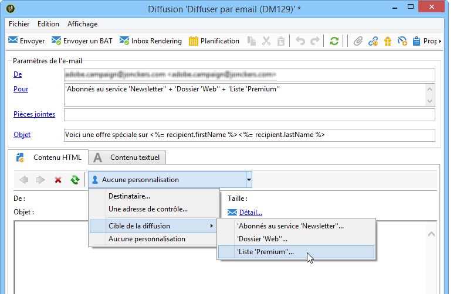</ph></source>
<target xml:lang="en-XX"><ph id="1" ctype="x-IMAGE"></ph></target>
</trans-unit>
<trans-unit id="tu51" xml:space="preserve">
<source xml:lang="en-US">You can validate the HTML message. You can also view the content of the email header.</source>
<target xml:lang="en-XX">Vous pouvez valider le message HTML. Vous pouvez également visualiser le contenu de l’en-tête de l’e-mail.</target>
</trans-unit>
<trans-unit id="tu52" xml:space="preserve">
<source xml:lang="en-US"><ph id="1" ctype="x-IMAGE">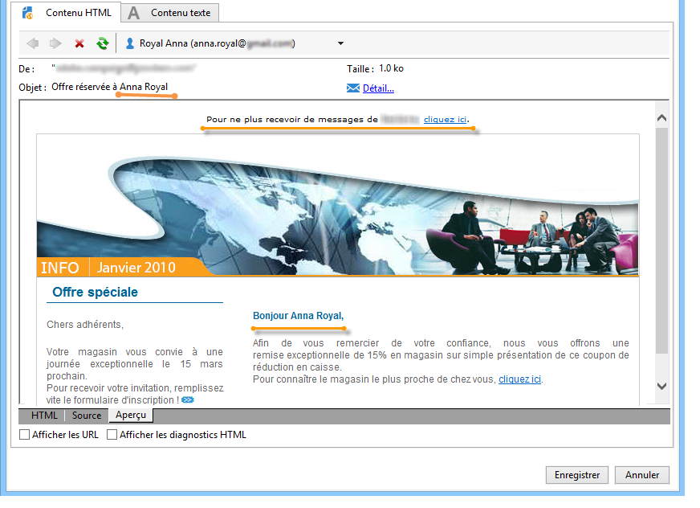</ph></source>
<target xml:lang="en-XX"><ph id="1" ctype="x-IMAGE"></ph></target>
</trans-unit>
<trans-unit id="tu53" xml:space="preserve">
<source xml:lang="en-US">To import a text content, use the <ph id="1" ctype="x-STRONG_EMPHASIS">**[!UICONTROL </ph>Open<ph id="3" ctype="x-LINK_REF">]**</ph> button, or the <ph id="5" ctype="x-STRONG_EMPHASIS">**[!UICONTROL </ph>Text Content<ph id="7" ctype="x-LINK_REF">]**</ph> tab to enter the content of the message when displayed in text format. Use the toolbar buttons to access actions on the contents. The last button lets you insert personalization fields.</source>
<target xml:lang="en-XX">Pour importer un contenu texte, utilisez le bouton <ph id="1" ctype="x-STRONG_EMPHASIS">**[!UICONTROL </ph>Ouvrir<ph id="3" ctype="x-LINK_REF">]**</ph> ou l’onglet <ph id="5" ctype="x-STRONG_EMPHASIS">**[!UICONTROL </ph>Contenu texte<ph id="7" ctype="x-LINK_REF">]**</ph> pour saisir le contenu du message lorsqu’il sera affiché au format texte. Utilisez les boutons de la barre d’outils pour accéder aux actions sur le contenu. Le dernier bouton permet d’insérer des champs de personnalisation.</target>
</trans-unit>
<trans-unit id="tu54" xml:space="preserve">
<source xml:lang="en-US"><ph id="1" ctype="x-IMAGE">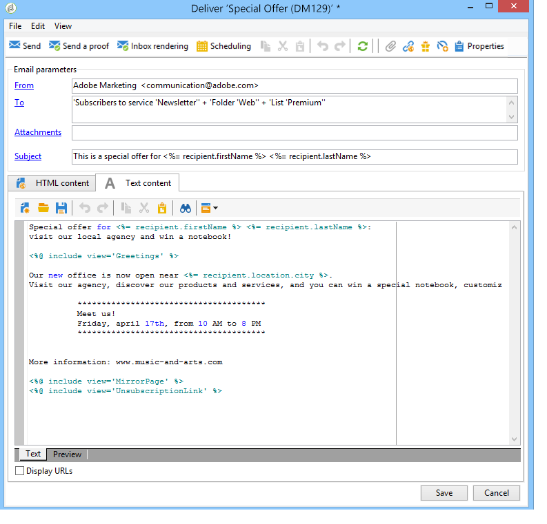</ph></source>
<target xml:lang="en-XX"><ph id="1" ctype="x-IMAGE"></ph></target>
</trans-unit>
<trans-unit id="tu55" xml:space="preserve">
<source xml:lang="en-US">As for the HTML format click the <ph id="1" ctype="x-STRONG_EMPHASIS">**[!UICONTROL </ph>Preview<ph id="3" ctype="x-LINK_REF">]**</ph> tab at the bottom of the page to view the rendering of the message with its personalization.</source>
<target xml:lang="en-XX">Comme pour le format HTML, cliquez sur l'onglet <ph id="1" ctype="x-STRONG_EMPHASIS">**[!UICONTROL </ph>Aperçu<ph id="3" ctype="x-LINK_REF">]**</ph> en bas de page pour visualiser le rendu du message, avec sa personnalisation.</target>
</trans-unit>
<trans-unit id="tu56" xml:space="preserve">
<source xml:lang="en-US"><ph id="1" ctype="x-IMAGE">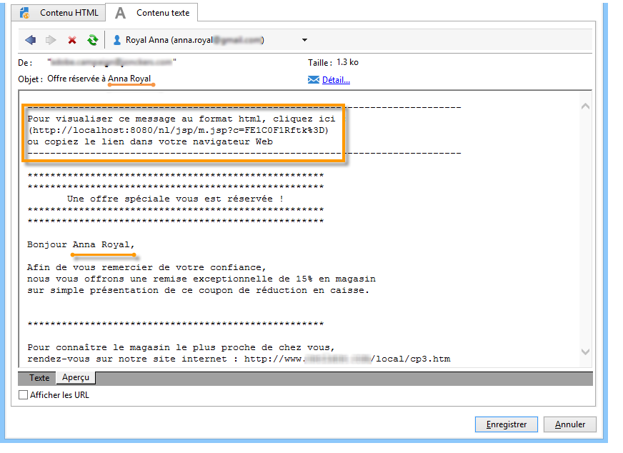</ph></source>
<target xml:lang="en-XX"><ph id="1" ctype="x-IMAGE"></ph></target>
</trans-unit>
<trans-unit id="tu57" xml:space="preserve">
<source xml:lang="en-US">Define interactive content</source>
<target xml:lang="en-XX">Définition du contenu interactif</target>
</trans-unit>
<trans-unit id="tu58" xml:space="preserve">
<source xml:lang="en-US">Adobe Campaign enables you to try the new interactive <ph id="1" ctype="x-LINK">&lbrack;</ph>AMP for Email<ph id="2" ctype="x-LINK">[#$tu59]</ph> format, which enables to send dynamic emails, under certain conditions.</source>
<target xml:lang="en-XX">Adobe Campaign permet de tester le nouveau format interactif <ph id="1" ctype="x-LINK">&lbrack;</ph>AMP for email<ph id="2" ctype="x-LINK">[#$tu59]</ph> qui sert, sous certaines conditions, à envoyer des e-mails dynamiques.</target>
</trans-unit>
<trans-unit id="tu60" xml:space="preserve">
<source xml:lang="en-US">For more on this, see the <ph id="1" ctype="x-LINK">&lbrack;</ph>Campaign v8 documentation<ph id="2" ctype="x-LINK">[#$tu61]{target="_blank"}</ph>.</source>
<target xml:lang="en-XX">Pour en savoir plus, consultez la <ph id="1" ctype="x-LINK">&lbrack;</ph>documentation de Campaign v8<ph id="2" ctype="x-LINK">[#$tu61]{target="_blank"}</ph>.</target>
</trans-unit>
<trans-unit id="tu62" xml:space="preserve">
<source xml:lang="en-US">Use content management</source>
<target xml:lang="en-XX">Utiliser la gestion de contenu</target>
</trans-unit>
<trans-unit id="tu63" xml:space="preserve">
<source xml:lang="en-US">You can define the content of the delivery using the content management forms, directly in the delivery assistant. To do this, you must reference the publication template of the content management to be used, in the <ph id="1" ctype="x-STRONG_EMPHASIS">**[!UICONTROL </ph>Advanced<ph id="3" ctype="x-LINK_REF">]**</ph> tab of the delivery properties.</source>
<target xml:lang="en-XX">Vous pouvez définir le contenu de la diffusion en utilisant les formulaires d’une gestion de contenu, directement dans l’assistant de diffusion. Pour cela, vous devez référencer le modèle de publication de la gestion de contenu à utiliser, dans l'onglet <ph id="1" ctype="x-STRONG_EMPHASIS">**[!UICONTROL </ph>Avancé<ph id="3" ctype="x-LINK_REF">]**</ph> des propriétés de la diffusion.</target>
</trans-unit>
<trans-unit id="tu64" xml:space="preserve">
<source xml:lang="en-US"><ph id="1" ctype="x-IMAGE"></ph></source>
<target xml:lang="en-XX"><ph id="1" ctype="x-IMAGE"></ph></target>
</trans-unit>
<trans-unit id="tu65" xml:space="preserve">
<source xml:lang="en-US">An additional tab lets you enter content that will automatically be integrated and formatted according to the content management rules.</source>
<target xml:lang="en-XX">Ainsi, un onglet supplémentaire permet de saisir un contenu qui sera automatiquement intégré et mis en forme selon les règles de la gestion de contenu.</target>
</trans-unit>
<trans-unit id="tu66" xml:space="preserve">
<source xml:lang="en-US"><ph id="1" ctype="x-IMAGE">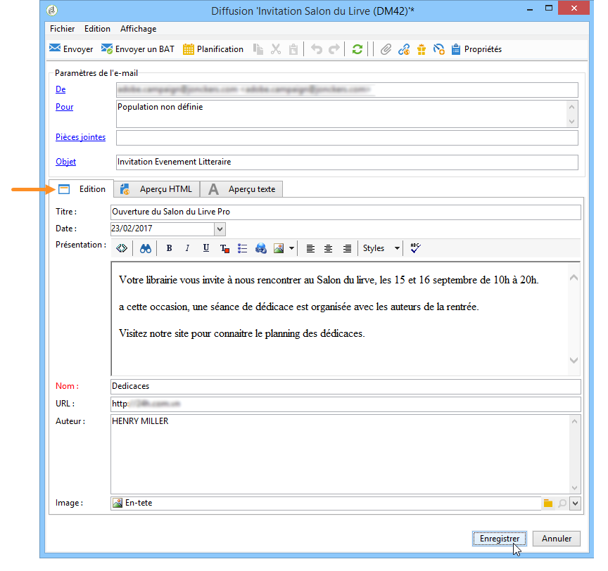</ph></source>
<target xml:lang="en-XX"><ph id="1" ctype="x-IMAGE"></ph></target>
</trans-unit>
<trans-unit id="tu67" xml:space="preserve">
<source xml:lang="en-US"><ph id="1" ctype="x-regxph" equiv-text="&lbrack;!NOTE">[!NOTE]</ph></source>
<target xml:lang="en-XX"><ph id="1" ctype="x-regxph" equiv-text="&lbrack;!NOTE">[!NOTE]</ph></target>
</trans-unit>
<trans-unit id="tu68" xml:space="preserve">
<source xml:lang="en-US">For further information about content management in Adobe Campaign, refer to <ph id="1" ctype="x-LINK">[</ph>this section<ph id="2" ctype="x-LINK">](about-content-management.md)</ph>.</source>
<target xml:lang="en-XX">Pour plus d’informations sur la gestion de contenu dans Adobe Campaign, voir <ph id="1" ctype="x-LINK">[</ph>cette section<ph id="2" ctype="x-LINK">](about-content-management.md)</ph>.</target>
</trans-unit>
<trans-unit id="tu69" xml:space="preserve">
<source xml:lang="en-US">Insert emoticons</source>
<target xml:lang="en-XX">Insérer des émoticônes</target>
</trans-unit>
<trans-unit id="tu70" xml:space="preserve">
<source xml:lang="en-US">You can insert emoticons to your email content.</source>
<target xml:lang="en-XX">Vous pouvez insérer des émoticônes dans le contenu d’un email.</target>
</trans-unit>
<trans-unit id="tu71" xml:space="preserve">
<source xml:lang="en-US">Click the <ph id="1" ctype="x-STRONG_EMPHASIS">**[!UICONTROL </ph>Insert emoticon<ph id="3" ctype="x-LINK_REF">]**</ph> icon.</source>
<target xml:lang="en-XX">Cliquez sur l’icône <ph id="1" ctype="x-STRONG_EMPHASIS">**[!UICONTROL </ph>Insérer une émoticône<ph id="3" ctype="x-LINK_REF">]**</ph>.</target>
</trans-unit>
<trans-unit id="tu72" xml:space="preserve">
<source xml:lang="en-US">Select an emoticon from the pop-up window.</source>
<target xml:lang="en-XX">Sélectionnez une émoticône dans la fenêtre pop-up.</target>
</trans-unit>
<trans-unit id="tu73" xml:space="preserve">
<source xml:lang="en-US"><ph id="1" ctype="x-IMAGE">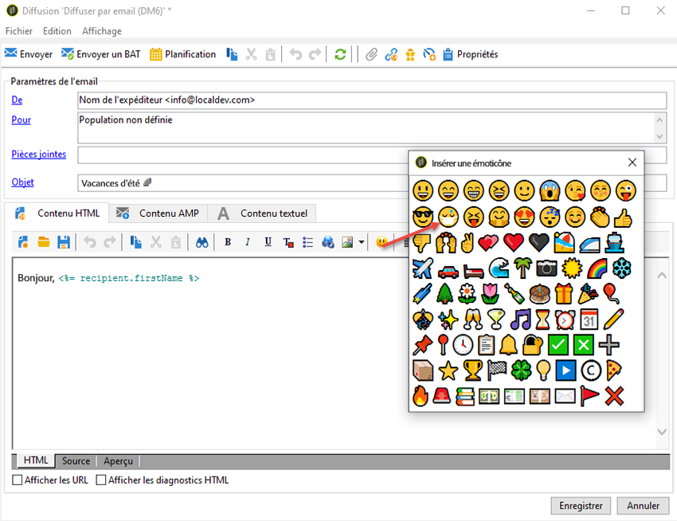</ph></source>
<target xml:lang="en-XX"><ph id="1" ctype="x-IMAGE"></ph></target>
</trans-unit>
<trans-unit id="tu74" xml:space="preserve">
<source xml:lang="en-US">Click the <ph id="1" ctype="x-STRONG_EMPHASIS">**[!UICONTROL </ph>Close<ph id="3" ctype="x-LINK_REF">]**</ph> button when done.</source>
<target xml:lang="en-XX">Cliquez sur le bouton <ph id="1" ctype="x-STRONG_EMPHASIS">**[!UICONTROL </ph>Fermer<ph id="3" ctype="x-LINK_REF">]**</ph> lorsque vous avez terminé.</target>
</trans-unit>
<trans-unit id="tu75" xml:space="preserve">
<source xml:lang="en-US">To customize the emoticon list, refer to this <ph id="1" ctype="x-LINK">[</ph>page<ph id="2" ctype="x-LINK">](customizing-emoticon-list.md)</ph>.</source>
<target xml:lang="en-XX">Pour personnaliser la liste des émoticônes, voir cette <ph id="1" ctype="x-LINK">[</ph>page<ph id="2" ctype="x-LINK">](customizing-emoticon-list.md)</ph>.</target>
</trans-unit>
<trans-unit id="tu76" xml:space="preserve">
<source xml:lang="en-US">Add images</source>
<target xml:lang="en-XX">Ajouter des images</target>
</trans-unit>
<trans-unit id="tu77" xml:space="preserve">
<source xml:lang="en-US">HTML format email deliveries can contain images. From the delivery assistant, you can import an HTML page containing images or insert images directly using the HTML editor via the <ph id="1" ctype="x-STRONG_EMPHASIS">**[!UICONTROL </ph>Image<ph id="3" ctype="x-LINK_REF">]**</ph> icon.</source>
<target xml:lang="en-XX">Les diffusions par e-mail au format HTML peuvent contenir des images. Depuis l’assistant de diffusion, vous pouvez importer une page HTML contenant des images ou insérer des images directement depuis l’éditeur HTML à partir de l’icône <ph id="1" ctype="x-STRONG_EMPHASIS">**[!UICONTROL </ph>Image<ph id="3" ctype="x-LINK_REF">]**</ph>.</target>
</trans-unit>
<trans-unit id="tu78" xml:space="preserve">
<source xml:lang="en-US">Guardrails</source>
<target xml:lang="en-XX">Mécanismes de sécurisation</target>
</trans-unit>
<trans-unit id="tu79" xml:space="preserve">
<source xml:lang="en-US">To avoid performance issues, images included in emails cannot exceed 100 KB. This limit, set by default, can be changed from the <ph id="1" ctype="x-CODE">`NmsDelivery_MaxDownloadedImageSize`</ph> option. However, Adobe strongly recommends to avoid large images in your email deliveries.</source>
<target xml:lang="en-XX">Pour éviter des problèmes de performances, les images incluses dans les e-mails ne doivent pas dépasser 100 Ko. Cette limite, définie par défaut, peut être modifiée à partir de l’option <ph id="1" ctype="x-CODE">`NmsDelivery_MaxDownloadedImageSize`</ph>. Cependant, Adobe recommande vivement d’éviter les images volumineuses dans vos diffusions e-mail.</target>
</trans-unit>
<trans-unit id="tu80" xml:space="preserve">
<source xml:lang="en-US">Learn more in <ph id="1" ctype="x-LINK">[</ph>the list of Campaign Classic options<ph id="2" ctype="x-LINK">](../../installation/using/configuring-campaign-options.md#delivery)</ph>.</source>
<target xml:lang="en-XX">En savoir plus dans <ph id="1" ctype="x-LINK">[</ph>la liste des options de Campaign Classic<ph id="2" ctype="x-LINK">](../../installation/using/configuring-campaign-options.md#delivery)</ph>.</target>
</trans-unit>
<trans-unit id="tu81" xml:space="preserve">
<source xml:lang="en-US">Types of images</source>
<target xml:lang="en-XX">Types d’images</target>
</trans-unit>
<trans-unit id="tu82" xml:space="preserve">
<source xml:lang="en-US">Images can be:</source>
<target xml:lang="en-XX">Ces images peuvent être :</target>
</trans-unit>
<trans-unit id="tu83" xml:space="preserve">
<source xml:lang="en-US">A local image, or an image called from a server</source>
<target xml:lang="en-XX">locales ou appelées depuis un serveur</target>
</trans-unit>
<trans-unit id="tu84" xml:space="preserve">
<source xml:lang="en-US">An image stored in the Adobe Campaign public resources library</source>
<target xml:lang="en-XX">stockées dans la bibliothèque des ressources publiques d'Adobe Campaign</target>
</trans-unit>
<trans-unit id="tu85" xml:space="preserve">
<source xml:lang="en-US">Public resources are accessible via the <ph id="1" ctype="x-STRONG_EMPHASIS">**[!UICONTROL </ph>Resources > Online<ph id="3" ctype="x-LINK_REF">]**</ph> node of the Adobe Campaign hierarchy. They are grouped in a library and can be included in email messages, but can also be used for campaigns or tasks, or for content management.</source>
<target xml:lang="en-XX">Les ressources publiques sont accessibles à partir du nœud <ph id="1" ctype="x-STRONG_EMPHASIS">**[!UICONTROL </ph>Ressources > En ligne<ph id="3" ctype="x-LINK_REF">]**</ph> de la hiérarchie d’Adobe Campaign. Elles sont regroupées dans une bibliothèque et peuvent être incluses dans les e-mails, mais aussi utilisées au niveau des opérations ou des tâches, ainsi que pour la gestion de contenu.</target>
</trans-unit>
<trans-unit id="tu86" xml:space="preserve">
<source xml:lang="en-US">An asset shared with Adobe Experience Cloud. Refer to <ph id="1" ctype="x-LINK">[</ph>this section<ph id="2" ctype="x-LINK">](../../integrations/using/sharing-assets-with-adobe-experience-cloud.md)</ph>.</source>
<target xml:lang="en-XX">Une ressource partagée via Adobe Experience Cloud. Consultez <ph id="1" ctype="x-LINK">[</ph>cette section<ph id="2" ctype="x-LINK">](../../integrations/using/sharing-assets-with-adobe-experience-cloud.md)</ph>.</target>
</trans-unit>
<trans-unit id="tu87" xml:space="preserve">
<source xml:lang="en-US">Insert and manage images</source>
<target xml:lang="en-XX">Insérer et gérer des images</target>
</trans-unit>
<trans-unit id="tu88" xml:space="preserve">
<source xml:lang="en-US">The delivery assistant lets you add local images, or images stored in the library, to the content of messages. To do this, click the <ph id="1" ctype="x-STRONG_EMPHASIS">**[!UICONTROL </ph>Image<ph id="3" ctype="x-LINK_REF">]**</ph> button in the HTML content toolbar.</source>
<target xml:lang="en-XX">L’assistant de diffusion vous permet d’ajouter dans le contenu des messages des images locales ou des images stockées dans la bibliothèque. Pour cela, cliquez sur le bouton <ph id="1" ctype="x-STRONG_EMPHASIS">**[!UICONTROL </ph>Image<ph id="3" ctype="x-LINK_REF">]**</ph> situé dans la barre d'outils du contenu HTML.</target>
</trans-unit>
<trans-unit id="tu89" xml:space="preserve">
<source xml:lang="en-US"><ph id="1" ctype="x-IMAGE">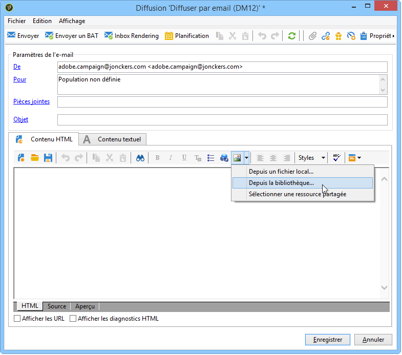</ph></source>
<target xml:lang="en-XX"><ph id="1" ctype="x-IMAGE"></ph></target>
</trans-unit>
<trans-unit id="tu90" xml:space="preserve">
<source xml:lang="en-US"><ph id="1" ctype="x-regxph" equiv-text="&lbrack;!IMPORTANT">[!IMPORTANT]</ph></source>
<target xml:lang="en-XX"><ph id="1" ctype="x-regxph" equiv-text="&lbrack;!IMPORTANT">[!IMPORTANT]</ph></target>
</trans-unit>
<trans-unit id="tu91" xml:space="preserve">
<source xml:lang="en-US">In order for the recipients to be able to view the images included in the messages that they receive, these messages must be available on a server accessible from the outside.</source>
<target xml:lang="en-XX">Pour être visibles par les destinataires, ces images dans les messages doivent être présentes sur un serveur accessible depuis l'extérieur.</target>
</trans-unit>
<trans-unit id="tu92" xml:space="preserve">
<source xml:lang="en-US">To manage images via the delivery assistant:</source>
<target xml:lang="en-XX">Pour gérer les images via l’assistant de diffusion, procédez comme suit :</target>
</trans-unit>
<trans-unit id="tu93" xml:space="preserve">
<source xml:lang="en-US">Click the <ph id="1" ctype="x-STRONG_EMPHASIS">**[!UICONTROL </ph>Tracking &amp; Images<ph id="3" ctype="x-LINK_REF">]**</ph> icon in the toolbar.
</source>
<target xml:lang="en-XX">Cliquez sur l’icône <ph id="1" ctype="x-STRONG_EMPHASIS">**[!UICONTROL </ph>Tracking &amp; Images<ph id="3" ctype="x-LINK_REF">]**</ph> dans la barre d’outils.
</target>
</trans-unit>
<trans-unit id="tu94" xml:space="preserve">
<source xml:lang="en-US"><ph id="1" ctype="x-IMAGE"></ph></source>
<target xml:lang="en-XX"><ph id="1" ctype="x-IMAGE"></ph></target>
</trans-unit>
<trans-unit id="tu95" xml:space="preserve">
<source xml:lang="en-US">Select <ph id="1" ctype="x-STRONG_EMPHASIS">**[!UICONTROL </ph>Upload images<ph id="3" ctype="x-LINK_REF">]**</ph> in the <ph id="5" ctype="x-STRONG_EMPHASIS">**[!UICONTROL </ph>Images<ph id="7" ctype="x-LINK_REF">]**</ph> tab.</source>
<target xml:lang="en-XX">Sélectionnez <ph id="1" ctype="x-STRONG_EMPHASIS">**[!UICONTROL </ph>Chargement des images<ph id="3" ctype="x-LINK_REF">]**</ph> dans l’onglet <ph id="5" ctype="x-STRONG_EMPHASIS">**[!UICONTROL </ph>Images<ph id="7" ctype="x-LINK_REF">]**</ph>.</target>
</trans-unit>
<trans-unit id="tu96" xml:space="preserve">
<source xml:lang="en-US">You can then choose whether you wish to include the images in the email message.
</source>
<target xml:lang="en-XX">Vous pouvez ensuite choisir d’inclure les images dans le message email.
</target>
</trans-unit>
<trans-unit id="tu97" xml:space="preserve">
<source xml:lang="en-US"><ph id="1" ctype="x-IMAGE">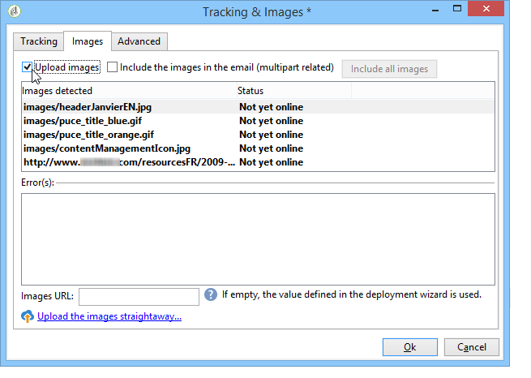</ph></source>
<target xml:lang="en-XX"><ph id="1" ctype="x-IMAGE"></ph></target>
</trans-unit>
<trans-unit id="tu98" xml:space="preserve">
<source xml:lang="en-US">You can upload images manually without waiting for the delivery analysis phase. To do this, click the <ph id="1" ctype="x-STRONG_EMPHASIS">**[!UICONTROL </ph>Upload the images straightaway...<ph id="3" ctype="x-LINK_REF">]**</ph> link.</source>
<target xml:lang="en-XX">Vous pouvez charger les images manuellement sans attendre la phase d’analyse de la diffusion. Pour ce faire, cliquez sur le lien <ph id="1" ctype="x-STRONG_EMPHASIS">**[!UICONTROL </ph>Charger les images tout de suite...<ph id="3" ctype="x-LINK_REF">]**</ph>.</target>
</trans-unit>
<trans-unit id="tu99" xml:space="preserve">
<source xml:lang="en-US">You can specify another path for access to the images on the tracking server. To do this, enter it in the <ph id="1" ctype="x-STRONG_EMPHASIS">**[!UICONTROL </ph>Images URL<ph id="3" ctype="x-LINK_REF">]**</ph> field. This value overrides the value defined in the parameters of the installation assistant.</source>
<target xml:lang="en-XX">Vous pouvez spécifier un autre chemin d’accès aux images sur le serveur de tracking. Pour ce faire, renseignez-le dans le champ <ph id="1" ctype="x-STRONG_EMPHASIS">**[!UICONTROL </ph>URL des images<ph id="3" ctype="x-LINK_REF">]**</ph>. Cette valeur remplace la valeur définie dans les paramètres de l’assistant d’installation.</target>
</trans-unit>
<trans-unit id="tu100" xml:space="preserve">
<source xml:lang="en-US">When you open HTML content with included images in the delivery assistant, a message gives you the option of uploading the images immediately, according to the delivery parameters.</source>
<target xml:lang="en-XX">Dans l’assistant de diffusion, lorsque vous ouvrez un contenu HTML avec des images incluses, un message vous propose alors de charger immédiatement les images, selon les paramètres de la diffusion.</target>
</trans-unit>
<trans-unit id="tu101" xml:space="preserve">
<source xml:lang="en-US"><ph id="1" ctype="x-IMAGE">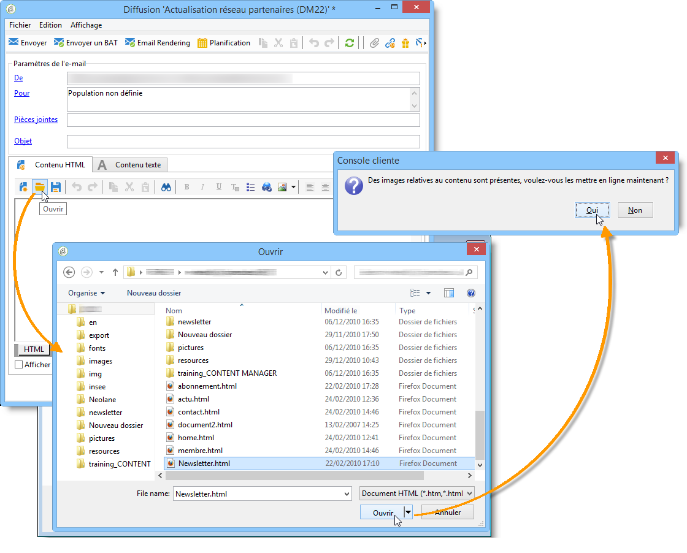</ph></source>
<target xml:lang="en-XX"><ph id="1" ctype="x-IMAGE"></ph></target>
</trans-unit>
<trans-unit id="tu102" xml:space="preserve">
<source xml:lang="en-US"><ph id="1" ctype="x-regxph" equiv-text="&lbrack;!IMPORTANT">[!IMPORTANT]</ph></source>
<target xml:lang="en-XX"><ph id="1" ctype="x-regxph" equiv-text="&lbrack;!IMPORTANT">[!IMPORTANT]</ph></target>
</trans-unit>
<trans-unit id="tu103" xml:space="preserve">
<source xml:lang="en-US">The image URLs are modified during manual uploading or when sending messages.</source>
<target xml:lang="en-XX">Les URL des images sont modifiées lors d’un chargement manuel ou lors de l’envoi des messages.</target>
</trans-unit>
<trans-unit id="tu104" xml:space="preserve">
<source xml:lang="en-US">Use case: send a message with images</source>
<target xml:lang="en-XX">Cas pratique : envoyer un message avec des images</target>
</trans-unit>
<trans-unit id="tu105" xml:space="preserve">
<source xml:lang="en-US">Below is a sample of a delivery with four images:</source>
<target xml:lang="en-XX">Voici un exemple de diffusion avec quatre images :</target>
</trans-unit>
<trans-unit id="tu106" xml:space="preserve">
<source xml:lang="en-US"><ph id="1" ctype="x-IMAGE">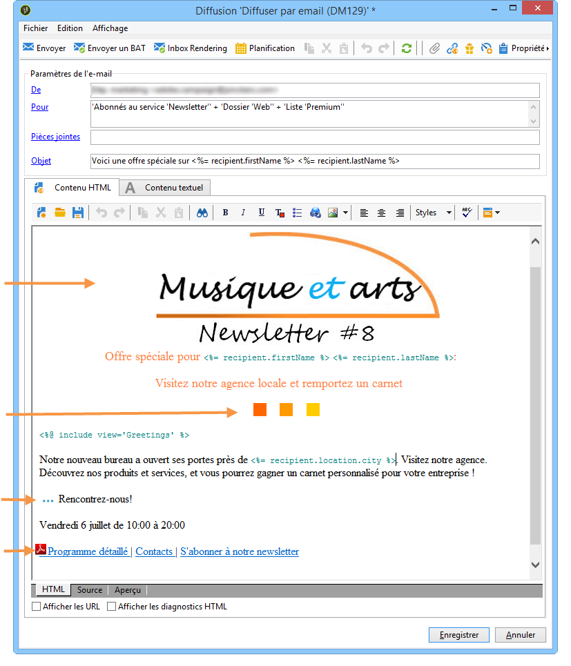</ph></source>
<target xml:lang="en-XX"><ph id="1" ctype="x-IMAGE"></ph></target>
</trans-unit>
<trans-unit id="tu107" xml:space="preserve">
<source xml:lang="en-US">These images come from a local directory or Web site as you can verify from the <ph id="1" ctype="x-STRONG_EMPHASIS">**[!UICONTROL </ph>Source<ph id="3" ctype="x-LINK_REF">]**</ph> tab.</source>
<target xml:lang="en-XX">Ces images sont issues d'un répertoire local ou d'un site web, comme vous pouvez le vérifier depuis l'onglet <ph id="1" ctype="x-STRONG_EMPHASIS">**[!UICONTROL </ph>Source<ph id="3" ctype="x-LINK_REF">]**</ph>.</target>
</trans-unit>
<trans-unit id="tu108" xml:space="preserve">
<source xml:lang="en-US"><ph id="1" ctype="x-IMAGE"></ph></source>
<target xml:lang="en-XX"><ph id="1" ctype="x-IMAGE"></ph></target>
</trans-unit>
<trans-unit id="tu109" xml:space="preserve">
<source xml:lang="en-US">Click the <ph id="1" ctype="x-STRONG_EMPHASIS">**[!UICONTROL </ph>Tracking &amp; Images<ph id="3" ctype="x-LINK_REF">]**</ph> icon and then the <ph id="5" ctype="x-STRONG_EMPHASIS">**[!UICONTROL </ph>Images<ph id="7" ctype="x-LINK_REF">]**</ph> tab to start detecting images in the message.</source>
<target xml:lang="en-XX">Cliquez sur l'icône <ph id="1" ctype="x-STRONG_EMPHASIS">**[!UICONTROL </ph>Tracking &amp; Images<ph id="3" ctype="x-LINK_REF">]**</ph> puis sur l'onglet <ph id="5" ctype="x-STRONG_EMPHASIS">**[!UICONTROL </ph>Images<ph id="7" ctype="x-LINK_REF">]**</ph> pour lancer la détection des images présentes dans le message.</target>
</trans-unit>
<trans-unit id="tu110" xml:space="preserve">
<source xml:lang="en-US">For each image detected, you can view its status:</source>
<target xml:lang="en-XX">Pour chaque image détectée, vous pouvez visualiser son état :</target>
</trans-unit>
<trans-unit id="tu111" xml:space="preserve">
<source xml:lang="en-US">If an image is stored locally or located on another server, even if this server is visible from the outside (on an internet site, for example), it will be detected as <ph id="1" ctype="x-STRONG_EMPHASIS">**[!UICONTROL </ph>Not yet online<ph id="3" ctype="x-LINK_REF">]**</ph>.</source>
<target xml:lang="en-XX">Si une image est locale ou enregistrée sur un autre serveur, et même si ce serveur est accessible depuis l'extérieur (sur un site internet par exemple), elle sera détectée comme <ph id="1" ctype="x-STRONG_EMPHASIS">**[!UICONTROL </ph>Pas encore en ligne<ph id="3" ctype="x-LINK_REF">]**</ph>.</target>
</trans-unit>
<trans-unit id="tu112" xml:space="preserve">
<source xml:lang="en-US">The images are detected as <ph id="1" ctype="x-STRONG_EMPHASIS">**[!UICONTROL </ph>Already online<ph id="3" ctype="x-LINK_REF">]**</ph> if they were uploaded earlier while creating another delivery.</source>
<target xml:lang="en-XX">Les images sont détectées comme <ph id="1" ctype="x-STRONG_EMPHASIS">**[!UICONTROL </ph>Déjà en ligne<ph id="3" ctype="x-LINK_REF">]**</ph> si elles ont été chargées antérieurement lors de la création d’une autre diffusion.</target>
</trans-unit>
<trans-unit id="tu113" xml:space="preserve">
<source xml:lang="en-US">In the deployment wizard, you can define URLs for which image detection is not enabled: uploading these images will be <ph id="1" ctype="x-STRONG_EMPHASIS">**[!UICONTROL </ph>Skipped<ph id="3" ctype="x-LINK_REF">]**</ph>.</source>
<target xml:lang="en-XX">Dans l’assistant de déploiement, vous pouvez définir des URL pour lesquelles la détection des images ne sera pas active : le chargement de ces images est alors <ph id="1" ctype="x-STRONG_EMPHASIS">**[!UICONTROL </ph>Ignorée<ph id="3" ctype="x-LINK_REF">]**</ph>.</target>
</trans-unit>
<trans-unit id="tu114" xml:space="preserve">
<source xml:lang="en-US"><ph id="1" ctype="x-regxph" equiv-text="&lbrack;!NOTE">[!NOTE]</ph></source>
<target xml:lang="en-XX"><ph id="1" ctype="x-regxph" equiv-text="&lbrack;!NOTE">[!NOTE]</ph></target>
</trans-unit>
<trans-unit id="tu115" xml:space="preserve">
<source xml:lang="en-US">Images are identified by their content and not by their access paths. This means that an image uploaded previously under a different name or in a different directory will be detected as <ph id="1" ctype="x-STRONG_EMPHASIS">**[!UICONTROL </ph>Already online<ph id="3" ctype="x-LINK_REF">]**</ph>.</source>
<target xml:lang="en-XX">Une image est identifiée par son contenu, et non par son nom ou son chemin d’accès. Ainsi, une image chargée antérieurement sous un autre nom ou depuis un autre répertoire sera détectée comme <ph id="1" ctype="x-STRONG_EMPHASIS">**[!UICONTROL </ph>Déjà en ligne<ph id="3" ctype="x-LINK_REF">]**</ph>.</target>
</trans-unit>
<trans-unit id="tu116" xml:space="preserve">
<source xml:lang="en-US">During the analysis phase, the images are automatically uploaded to the server so that they are accessible from the exterior, except for the local images which must be uploaded beforehand.</source>
<target xml:lang="en-XX">Lors de la phase d'analyse du message, les images sont automatiquement téléchargées sur le serveur afin d'être accessibles depuis l'extérieur, sauf les images locales qui doivent avoir été téléchargées préalablement.</target>
</trans-unit>
<trans-unit id="tu117" xml:space="preserve">
<source xml:lang="en-US">You can work ahead and upload images so that they can be viewed by other Adobe Campaign operators. You may find this useful if working collaboratively. To do this, click <ph id="1" ctype="x-STRONG_EMPHASIS">**[!UICONTROL </ph>Upload the images straightaway...<ph id="3" ctype="x-LINK_REF">]**</ph> to upload the images onto the server.</source>
<target xml:lang="en-XX">Vous pouvez anticiper le chargement des images afin qu’elles puissent être visualisées par d’autres opérateurs et opératrices d’Adobe Campaign. Cela peut s’avérer utile si vous travaillez en collaboration. Pour cela, sélectionnez l'option <ph id="1" ctype="x-STRONG_EMPHASIS">**[!UICONTROL </ph>Charger les images tout de suite<ph id="3" ctype="x-LINK_REF">]**</ph> et cliquez sur le lien pour charger les images sur le serveur.</target>
</trans-unit>
<trans-unit id="tu118" xml:space="preserve">
<source xml:lang="en-US"><ph id="1" ctype="x-IMAGE"></ph></source>
<target xml:lang="en-XX"><ph id="1" ctype="x-IMAGE"></ph></target>
</trans-unit>
<trans-unit id="tu119" xml:space="preserve">
<source xml:lang="en-US"><ph id="1" ctype="x-regxph" equiv-text="&lbrack;!NOTE">[!NOTE]</ph></source>
<target xml:lang="en-XX"><ph id="1" ctype="x-regxph" equiv-text="&lbrack;!NOTE">[!NOTE]</ph></target>
</trans-unit>
<trans-unit id="tu120" xml:space="preserve">
<source xml:lang="en-US">The URLs of the images in the email, and their names in particular, are then modified.</source>
<target xml:lang="en-XX">Les URL des images de l'email sont alors modifiées, et notamment les noms des images.</target>
</trans-unit>
<trans-unit id="tu121" xml:space="preserve">
<source xml:lang="en-US">Once the images are online, you can view changes to their names and paths from the <ph id="1" ctype="x-STRONG_EMPHASIS">**[!UICONTROL </ph>Source<ph id="3" ctype="x-LINK_REF">]**</ph> tab of the message.</source>
<target xml:lang="en-XX">Une fois les images en ligne, vous pouvez visualiser la modification de leur nom et de leur chemin d'accès depuis l'onglet <ph id="1" ctype="x-STRONG_EMPHASIS">**[!UICONTROL </ph>Source<ph id="3" ctype="x-LINK_REF">]**</ph> du message.</target>
</trans-unit>
<trans-unit id="tu122" xml:space="preserve">
<source xml:lang="en-US"><ph id="1" ctype="x-IMAGE">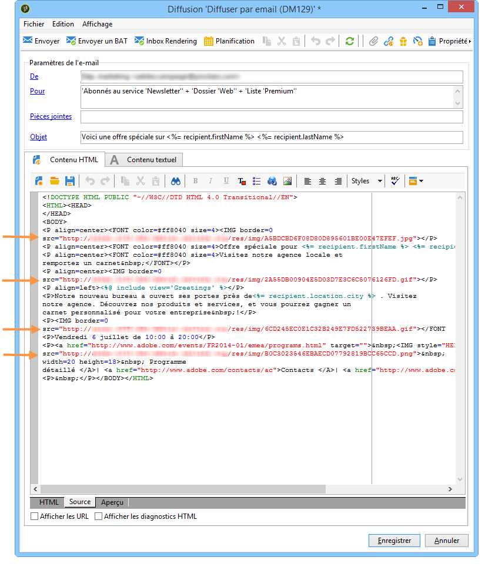</ph></source>
<target xml:lang="en-XX"><ph id="1" ctype="x-IMAGE"></ph></target>
</trans-unit>
<trans-unit id="tu123" xml:space="preserve">
<source xml:lang="en-US">If you select <ph id="1" ctype="x-STRONG_EMPHASIS">**[!UICONTROL </ph>Include the images in the email<ph id="3" ctype="x-LINK_REF">]**</ph>, you can choose which images to include in the corresponding column.</source>
<target xml:lang="en-XX">Si vous cochez l'option <ph id="1" ctype="x-STRONG_EMPHASIS">**[!UICONTROL </ph>Inclure les images dans l'email<ph id="3" ctype="x-LINK_REF">]**</ph>, vous pouvez choisir quelles images inclure ou ne pas inclure depuis la colonne correspondante.</target>
</trans-unit>
<trans-unit id="tu124" xml:space="preserve">
<source xml:lang="en-US"><ph id="1" ctype="x-IMAGE">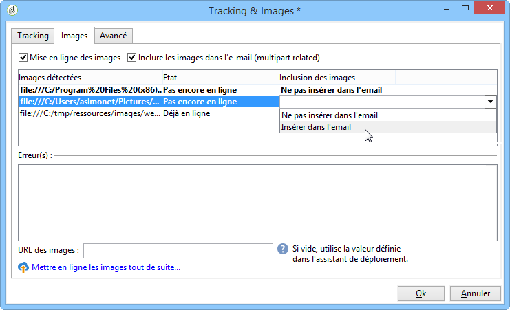</ph></source>
<target xml:lang="en-XX"><ph id="1" ctype="x-IMAGE"></ph></target>
</trans-unit>
<trans-unit id="tu125" xml:space="preserve">
<source xml:lang="en-US"><ph id="1" ctype="x-regxph" equiv-text="&lbrack;!NOTE">[!NOTE]</ph></source>
<target xml:lang="en-XX"><ph id="1" ctype="x-regxph" equiv-text="&lbrack;!NOTE">[!NOTE]</ph></target>
</trans-unit>
<trans-unit id="tu126" xml:space="preserve">
<source xml:lang="en-US">If local images are included in the message, you must confirm changes to the message source code.</source>
<target xml:lang="en-XX">Si des images locales sont incluses dans le message, vous devez confirmer la modification du code source du message.</target>
</trans-unit>
<trans-unit id="tu127" xml:space="preserve">
<source xml:lang="en-US">Insert a personalized barcode</source>
<target xml:lang="en-XX">Insertion d’un code-barres personnalisé</target>
</trans-unit>
<trans-unit id="tu128" xml:space="preserve">
<source xml:lang="en-US">The barcode generation module lets you create several types of barcodes that comply with many common standards, including 2D barcodes.</source>
<target xml:lang="en-XX">Le module de génération de codes-barres permet de créer plusieurs types de codes-barres répondant aux normes les plus courantes, dans les formats 1D (unidimensionnel) et 2D (bidimensionnel).</target>
</trans-unit>
<trans-unit id="tu129" xml:space="preserve">
<source xml:lang="en-US">It is possible to dynamically generate a barcode as a bitmap using a value defined using customer criteria. Personalized barcodes can be included in email campaigns. The recipient can print the message and show it to the issuing company for scanning (when checking out for example).</source>
<target xml:lang="en-XX">Il est possible de générer dynamiquement un code-barres sous forme d’image bitmap à l’aide d’une valeur définie selon les critères de la clientèle. Des codes-barres personnalisés peuvent être inclus dans les campagnes par e-mail. La personne destinataire peut imprimer le message et le montrer à la société émettrice pour qu’elle l’analyse (lors d’une extraction, par exemple).</target>
</trans-unit>
<trans-unit id="tu130" xml:space="preserve">
<source xml:lang="en-US">To insert a barcode into an email, place the cursor in the content where you want to display it, then click the personalization button. Select <ph id="1" ctype="x-STRONG_EMPHASIS">**[!UICONTROL </ph>Include > Barcode...<ph id="3" ctype="x-LINK_REF">]**</ph>.</source>
<target xml:lang="en-XX">Pour insérer un code-barres dans un email, positionnez le curseur dans le contenu, là où vous souhaitez l'afficher, et cliquez sur le bouton de personnalisation. Choisissez <ph id="1" ctype="x-STRONG_EMPHASIS">**[!UICONTROL </ph>Inclure > Code-barres...<ph id="3" ctype="x-LINK_REF">]**</ph>.</target>
</trans-unit>
<trans-unit id="tu131" xml:space="preserve">
<source xml:lang="en-US"><ph id="1" ctype="x-IMAGE">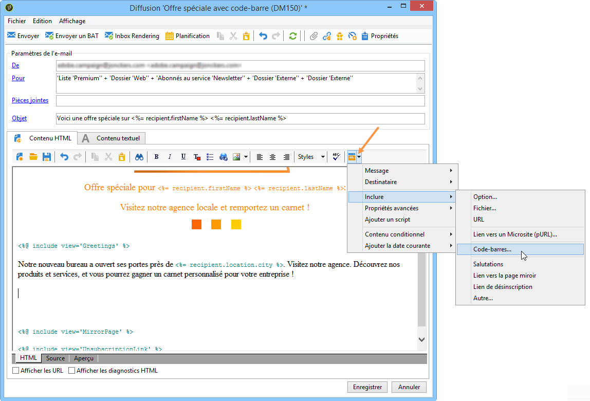</ph></source>
<target xml:lang="en-XX"><ph id="1" ctype="x-IMAGE"></ph></target>
</trans-unit>
<trans-unit id="tu132" xml:space="preserve">
<source xml:lang="en-US">Then configure the following elements to suit your needs:</source>
<target xml:lang="en-XX">Puis paramétrez les éléments suivants en fonction de vos besoins :</target>
</trans-unit>
<trans-unit id="tu133" xml:space="preserve">
<source xml:lang="en-US">Select the type of barcode.</source>
<target xml:lang="en-XX">Choisissez le type de code-barres.</target>
</trans-unit>
<trans-unit id="tu134" xml:space="preserve">
<source xml:lang="en-US">For 1D format, the following types are available in Adobe Campaign: Codabar, Code 128, GS1-128 (formerly EAN-128), UPC-A, UPC-E, ISBN, EAN-8, Code39, Interleaved 2 of 5, POSTNET and Royal Mail (RM4SCC).</source>
<target xml:lang="en-XX">Pour le format 1D, Adobe Campaign propose les types suivants: Codabar, Code 128, GS1-128 (anciennement EAN-128), UPC-A, UPC-E, ISBN, EAN-8, Code39, Interleaved 2 of 5, POSTNET et Royal Mail (RM4SCC).</target>
</trans-unit>
<trans-unit id="tu135" xml:space="preserve">
<source xml:lang="en-US">Example of a 1D barcode:</source>
<target xml:lang="en-XX">Exemple de code-barres 1D :</target>
</trans-unit>
<trans-unit id="tu136" xml:space="preserve">
<source xml:lang="en-US"><ph id="1" ctype="x-IMAGE"></ph></source>
<target xml:lang="en-XX"><ph id="1" ctype="x-IMAGE"></ph></target>
</trans-unit>
<trans-unit id="tu137" xml:space="preserve">
<source xml:lang="en-US">The DataMatrix and PDF417 types concern the 2D format.</source>
<target xml:lang="en-XX">Les types DataMatrix et PDF417 concernent le format 2D.</target>
</trans-unit>
<trans-unit id="tu138" xml:space="preserve">
<source xml:lang="en-US">Example of a 2D barcode:</source>
<target xml:lang="en-XX">Exemple de code-barres 2D :</target>
</trans-unit>
<trans-unit id="tu139" xml:space="preserve">
<source xml:lang="en-US"><ph id="1" ctype="x-IMAGE">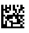</ph></source>
<target xml:lang="en-XX"><ph id="1" ctype="x-IMAGE"></ph></target>
</trans-unit>
<trans-unit id="tu140" xml:space="preserve">
<source xml:lang="en-US">To insert a QR code, select this type and enter the error correction rate to apply. This rate defines the quantity of information repeated and the tolerance to deterioration.</source>
<target xml:lang="en-XX">Pour insérer un code QR, sélectionnez ce type et indiquez le taux de correction d’erreur à appliquer. Ce taux définit la quantité d’informations répétées et donc une tolérance plus ou moins importante aux dégradations.</target>
</trans-unit>
<trans-unit id="tu141" xml:space="preserve">
<source xml:lang="en-US"><ph id="1" ctype="x-IMAGE">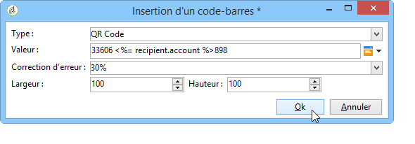</ph></source>
<target xml:lang="en-XX"><ph id="1" ctype="x-IMAGE"></ph></target>
</trans-unit>
<trans-unit id="tu142" xml:space="preserve">
<source xml:lang="en-US">Example of a QR code:</source>
<target xml:lang="en-XX">Exemple de QR Code :</target>
</trans-unit>
<trans-unit id="tu143" xml:space="preserve">
<source xml:lang="en-US"><ph id="1" ctype="x-IMAGE"></ph></source>
<target xml:lang="en-XX"><ph id="1" ctype="x-IMAGE"></ph></target>
</trans-unit>
<trans-unit id="tu144" xml:space="preserve">
<source xml:lang="en-US">Enter the size of the barcode that you want to insert into the email: configuring the scale lets you increase or reduce the size of the barcode, from x1 to x10.</source>
<target xml:lang="en-XX">Indiquez la taille du code-barres à insérer dans l'email : le paramétrage de l'échelle permet d'augmenter ou de réduire la taille du code-barres, de x 1 à x 10.</target>
</trans-unit>
<trans-unit id="tu145" xml:space="preserve">
<source xml:lang="en-US">The <ph id="1" ctype="x-STRONG_EMPHASIS">**[!UICONTROL </ph>Value<ph id="3" ctype="x-LINK_REF">]**</ph> field enables you to define the value of the barcode. A value can match a special offer and can be the function of a criteria, it can be the value of a database field linked to the customers.</source>
<target xml:lang="en-XX">Le champ <ph id="1" ctype="x-STRONG_EMPHASIS">**[!UICONTROL </ph>Valeur<ph id="3" ctype="x-LINK_REF">]**</ph> permet de définir la valeur du code-barres. Une valeur peut correspondre à une offre promotionnelle et peut être une fonction d’un critère, ce peut être la valeur d’un champ de la base de données lié à la clientèle.</target>
</trans-unit>
<trans-unit id="tu146" xml:space="preserve">
<source xml:lang="en-US">This example shows an EAN-8 type barcode, to which was added the account number of a recipient. To add this account number, click the personalization button to the right of the <ph id="1" ctype="x-STRONG_EMPHASIS">**[!UICONTROL </ph>Value<ph id="3" ctype="x-LINK_REF">]**</ph> field and select <ph id="5" ctype="x-STRONG_EMPHASIS">**[!UICONTROL </ph>Recipient > Account number<ph id="7" ctype="x-LINK_REF">]**</ph>.</source>
<target xml:lang="en-XX">L'exemple ci-dessous montre un code-barres de type EAN-8 auquel a été ajouté le numéro de compte d'un destinataire. Pour ajouter ce numéro de compte, cliquez sur le bouton de personnalisation situé à droite du champ <ph id="1" ctype="x-STRONG_EMPHASIS">**[!UICONTROL </ph>Valeur<ph id="3" ctype="x-LINK_REF">]**</ph> et sélectionnez <ph id="5" ctype="x-STRONG_EMPHASIS">**[!UICONTROL </ph>Destinataire > N° de compte<ph id="7" ctype="x-LINK_REF">]**</ph>.</target>
</trans-unit>
<trans-unit id="tu147" xml:space="preserve">
<source xml:lang="en-US"><ph id="1" ctype="x-IMAGE">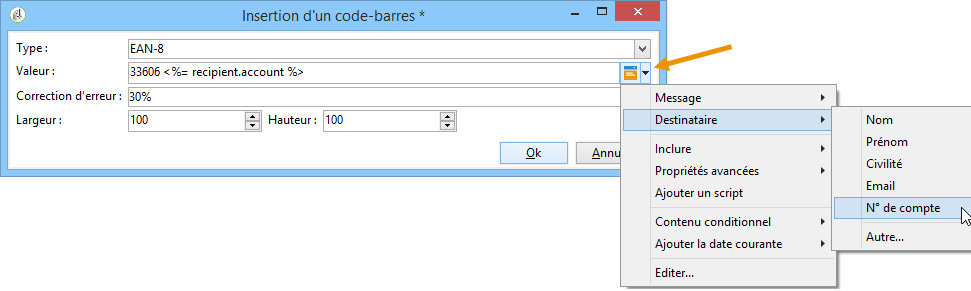</ph></source>
<target xml:lang="en-XX"><ph id="1" ctype="x-IMAGE"></ph></target>
</trans-unit>
<trans-unit id="tu148" xml:space="preserve">
<source xml:lang="en-US">The <ph id="1" ctype="x-STRONG_EMPHASIS">**[!UICONTROL </ph>Height<ph id="3" ctype="x-LINK_REF">]**</ph> field lets you configure the height of the barcode without changing its width, by altering the amount of space between each bar.</source>
<target xml:lang="en-XX">Le champ <ph id="1" ctype="x-STRONG_EMPHASIS">**[!UICONTROL </ph>Hauteur<ph id="3" ctype="x-LINK_REF">]**</ph> permet de paramétrer la hauteur du code-barres sans en modifier la largeur, soit l'espacement entre chaque barre.</target>
</trans-unit>
<trans-unit id="tu149" xml:space="preserve">
<source xml:lang="en-US">There is no restrictive entry control depending on the type of barcode. If a barcode value is incorrect, it will only be visible in <ph id="1" ctype="x-STRONG_EMPHASIS">**</ph>Preview<ph id="2" ctype="x-STRONG_EMPHASIS">**</ph> mode where the barcode will be crossed out in red.</source>
<target xml:lang="en-XX">Il n'existe pas de contrôle restrictif de saisie en fonction du type de code-barres sélectionné. Si une valeur de code-barres est erronée, vous ne le saurez que lorsque vous passerez en vue <ph id="1" ctype="x-STRONG_EMPHASIS">**</ph>Aperçu<ph id="2" ctype="x-STRONG_EMPHASIS">**</ph> avec le code-barres marqué d'une croix rouge.</target>
</trans-unit>
<trans-unit id="tu150" xml:space="preserve">
<source xml:lang="en-US"><ph id="1" ctype="x-regxph" equiv-text="&lbrack;!NOTE">[!NOTE]</ph></source>
<target xml:lang="en-XX"><ph id="1" ctype="x-regxph" equiv-text="&lbrack;!NOTE">[!NOTE]</ph></target>
</trans-unit>
<trans-unit id="tu151" xml:space="preserve">
<source xml:lang="en-US">The value assigned to a barcode depends on its type. For example, an EAN-8 type shall have exactly 8 numbers.</source>
<target xml:lang="en-XX">La valeur attribuée à un code-barres dépend de son type. Par exemple, un type EAN-8 doit avoir exactement 8 numéros.</target>
</trans-unit>
<trans-unit id="tu152" xml:space="preserve">
<source xml:lang="en-US">The personalization button to the right of the <ph id="1" ctype="x-STRONG_EMPHASIS">**[!UICONTROL </ph>Value<ph id="3" ctype="x-LINK_REF">]**</ph> field lets you add data in addition to the value itself. This enriches the barcode, provided that the barcode standard accepts it.</source>
<target xml:lang="en-XX">Le bouton de personnalisation situé à droite du champ <ph id="1" ctype="x-STRONG_EMPHASIS">**[!UICONTROL </ph>Valeur<ph id="3" ctype="x-LINK_REF">]**</ph> permet d’ajouter une ou plusieurs données en plus de la valeur elle-même. Cela enrichit le code-barres, à condition que le standard de code-barres l’accepte.</target>
</trans-unit>
<trans-unit id="tu153" xml:space="preserve">
<source xml:lang="en-US">For example, if you are using a GS1-128 type barcode and want to enter the account number of a recipient in addition to the value, click the personalization button and select <ph id="1" ctype="x-STRONG_EMPHASIS">**[!UICONTROL </ph>Recipient > Account number<ph id="3" ctype="x-LINK_REF">]**</ph>. If the account number of the selected recipient is entered correctly, the barcode takes it into account.</source>
<target xml:lang="en-XX">Par exemple, si vous utilisez un code-barres de type GS1-128 et que vous souhaitez renseigner le numéro de compte d’une personne destinataire en plus de la valeur, cliquez sur le bouton de personnalisation et sélectionnez <ph id="1" ctype="x-STRONG_EMPHASIS">**[!UICONTROL </ph>Destinataire > N° de compte<ph id="3" ctype="x-LINK_REF">]**</ph>. Si le numéro de compte de la personne destinataire sélectionnée est correctement saisi, le code-barres en tient compte.</target>
</trans-unit>
<trans-unit id="tu154" xml:space="preserve">
<source xml:lang="en-US">Once these elements have been configured, you can finalize your email and send it. To avoid errors, always make sure your content is displayed correctly before performing a delivery by clicking the <ph id="1" ctype="x-STRONG_EMPHASIS">**[!UICONTROL </ph>Preview<ph id="3" ctype="x-LINK_REF">]**</ph> tab.</source>
<target xml:lang="en-XX">Une fois ces éléments paramétrés, vous pouvez finaliser votre email et l'envoyer. Pour éviter toute erreur, vérifiez toujours avant une diffusion que votre contenu s'affiche correctement en cliquant sur l'onglet <ph id="1" ctype="x-STRONG_EMPHASIS">**[!UICONTROL </ph>Aperçu<ph id="3" ctype="x-LINK_REF">]**</ph>.</target>
</trans-unit>
<trans-unit id="tu155" xml:space="preserve">
<source xml:lang="en-US"><ph id="1" ctype="x-IMAGE">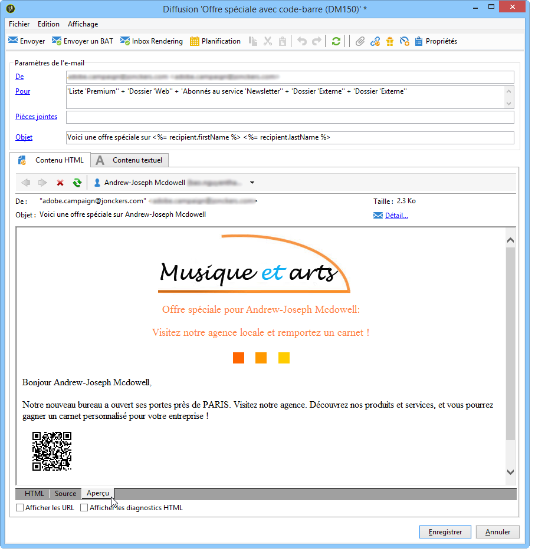</ph></source>
<target xml:lang="en-XX"><ph id="1" ctype="x-IMAGE"></ph></target>
</trans-unit>
<trans-unit id="tu156" xml:space="preserve">
<source xml:lang="en-US"><ph id="1" ctype="x-regxph" equiv-text="&lbrack;!NOTE">[!NOTE]</ph></source>
<target xml:lang="en-XX"><ph id="1" ctype="x-regxph" equiv-text="&lbrack;!NOTE">[!NOTE]</ph></target>
</trans-unit>
<trans-unit id="tu157" xml:space="preserve">
<source xml:lang="en-US">If the value of a barcode is incorrect, its bitmap is shown crossed out in red.</source>
<target xml:lang="en-XX">Si la valeur d'un code-barres s'avère incorrecte, le bitmap qui le représente s'affiche barré d'une croix rouge.</target>
</trans-unit>
<trans-unit id="tu158" xml:space="preserve">
<source xml:lang="en-US"><ph id="1" ctype="x-IMAGE">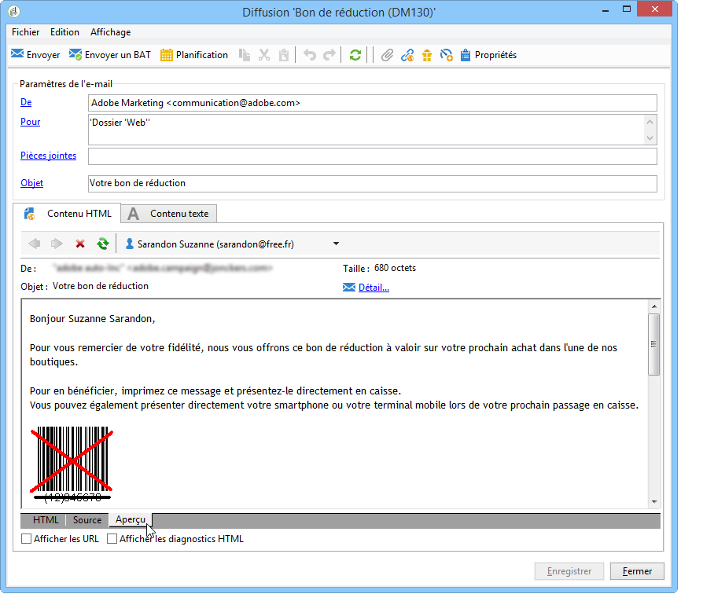</ph></source>
<target xml:lang="en-XX"><ph id="1" ctype="x-IMAGE"></ph></target>
</trans-unit>
</body>
</file>
</xliff>