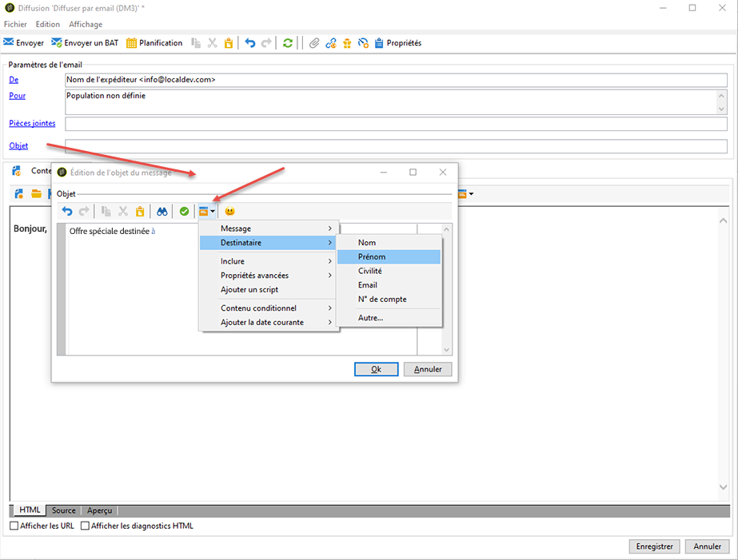
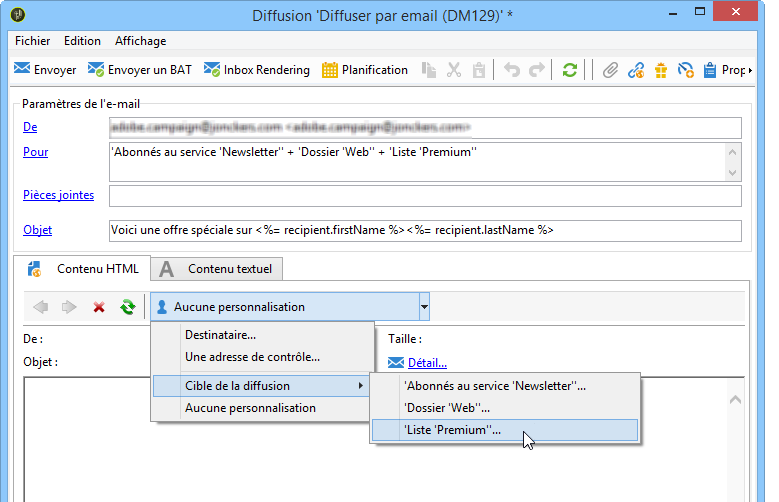
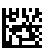

# Définir le contenu de l&#39;email {#defining-the-email-content}

## Expéditeur {#sender}

Pour définir le nom et l’adresse de l’expéditeur qui apparaîtront dans l’en-tête des messages envoyés, cliquez sur le lien **[!UICONTROL De]**.

Cette fenêtre permet de saisir toutes les informations nécessaires à l&#39;élaboration des en-têtes de messages email. Ces informations peuvent être personnalisées.Pour cela, vous devez utiliser des champs de personnalisation, insérés via des boutons situés à droite des champs de saisie.

L’insertion et l’utilisation de champs de personnalisation sont présentées dans la section [À propos de la personnalisation](about-personalization.md).

>[!NOTE]
>
>* Par défaut, l&#39;adresse de réponse est l&#39;adresse de l&#39;expéditeur.
>* Les paramètres d&#39;en-tête ne doivent pas être vides.Par défaut, ils contiennent les valeurs saisies lors de la configuration de l&#39;assistant de déploiement. Pour plus d&#39;informations, reportez-vous au [Guide d&#39;installation](../../installation/using/deploying-an-instance.md).
>* L&#39;adresse de l&#39;expéditeur est obligatoire pour permettre l&#39;envoi d&#39;un email (norme RFC).
>* Adobe Campaign effectue une vérification syntaxique des adresses email saisies.

>[!IMPORTANT]
>
>Dans le cadre des contrôles mis en place par les Fournisseurs d&#39;Accès Internet (FAI) afin de lutter contre les emails non-sollicités (spam), Adobe recommande de créer des comptes emails correspondants aux adresses spécifiées pour l&#39;expédition et la réponse. Vérifiez auprès de l&#39;administrateur de votre messagerie.

## Objet du message {#message-subject}

L&#39;objet du message est paramétré dans le champ correspondant.Vous pouvez le saisir directement dans le champ ou cliquer sur le lien **[!UICONTROL Objet]** pour saisir un script. Le lien de personnalisation permet d&#39;insérer des champs de la base dans l&#39;objet.

>[!IMPORTANT]
>
>L&#39;objet du message est obligatoire.

Le contenu des champs sera remplacé par la valeur enregistrée dans le profil du destinataire lors de l&#39;envoi du message.

Par exemple, dans le message ci-dessus, le sujet du message est personnalisé pour chaque destinataire avec les données de son profil.

>[!NOTE]
>
>L’utilisation des champs de personnalisation est présentée dans la section [À propos de la personnalisation](about-personalization.md).

Vous pouvez également insérer des émoticônes dans votre ligne Objet à l’aide de la fenêtre contextuelle **[!UICONTROL Insérer une émoticône]**.

## Contenu du message {#message-content}

>[!IMPORTANT]
>
>Pour des raisons de confidentialité, nous vous recommandons d’utiliser HTTPS pour toutes les ressources externes.

Le contenu du message est défini dans la section inférieure de la fenêtre de configuration de la diffusion.

Par défaut, les messages sont envoyés en HTML ou en Texte, selon les préférences des destinataires. Il est recommandé de créer un contenu dans les deux formats afin de permettre un affichage correct dans toutes les messageries. Voir à ce sujet la section [Sélection des formats du message](#selecting-message-formats).

* Pour importer un contenu HTML, utilisez le bouton **[!UICONTROL Ouvrir]**. Vous pouvez également coller le code source directement dans le sous-onglet **[!UICONTROL Source]**.

   Si vous utilisez [Digital Content Editor](../../web/using/about-campaign-html-editor.md) (DCE), consultez [Sélection d&#39;un modèle de contenu](../../web/using/use-case--creating-an-email-delivery.md#step-3---selecting-a-content).

   >[!IMPORTANT]
   >
   >Le contenu HTML doit être préalablement créé puis importé dans Adobe Campaign. L&#39;éditeur HTML n&#39;est pas conçu pour la création de contenu.

   Le sous-onglet **[!UICONTROL Aperçu]** permet, pour chaque contenu, de visualiser le rendu pour un destinataire. Les champs de personnalisation et les éléments conditionnels du contenu sont remplacés par les informations correspondantes pour le profil sélectionné.

   Les boutons de la barre d&#39;outils permettent d&#39;accéder aux paramètres de mise en forme standard pour la page HTML.

   

   Vous pouvez insérer des images dans les messages depuis un fichier local ou depuis la bibliothèque d&#39;images disponible dans Adobe Campaign. Pour cela, cliquez sur l&#39;icône **[!UICONTROL Image]** et sélectionnez l&#39;option adéquate.

   

   Les images de la bibliothèque sont accessibles depuis le dossier **[!UICONTROL Ressources>On-line>Ressources publiques]** de l’arborescence. Voir aussi la section [Ajout d’images](#adding-images).

   Le dernier bouton de la barre d&#39;outils permet d&#39;insérer des champs de personnalisation.

   >[!NOTE]
   >
   >L’utilisation des champs de personnalisation est présentée dans la section [À propos de la personnalisation](about-personalization.md).

   Les onglets en bas de page permettent d&#39;afficher le code HTML associé à la page en cours de création et de visualiser le rendu du message, avec sa personnalisation. Pour lancer la visualisation, cliquez sur l&#39;onglet **[!UICONTROL Aperçu]** et sélectionnez un destinataire à partir du bouton **[!UICONTROL Tester la personnalisation]** situé dans la barre d&#39;outils. Vous pouvez sélectionner un destinataire parmi la ou les cibles définies ou choisir un autre destinataire.

   

   Vous pouvez valider le message HTML. Vous pouvez également visualiser le contenu de l&#39;en-tête de l&#39;email.

   

* Pour importer un contenu texte, utilisez le bouton **[!UICONTROL Ouvrir]** ou l&#39;onglet **[!UICONTROL Contenu texte]** pour saisir le contenu du message lorsqu&#39;il sera affiché au format texte. Les boutons de la barre d&#39;outils permettent d&#39;accéder aux actions sur le contenu. Le dernier bouton permet d&#39;insérer des champs de personnalisation.

   

   Comme pour le format HTML, cliquez sur l&#39;onglet **[!UICONTROL Aperçu]** en bas de page pour visualiser le rendu du message, avec sa personnalisation.

   

<!--## Selecting message formats {#selecting-message-formats}

You can change the format of email messages sent. To do this, edit the delivery properties and click the **[!UICONTROL Delivery]** tab.

Select the format of the email in the lower section of the window:

* **[!UICONTROL Use recipient preferences]** (default mode)

  The message format is defined according to the data stored in the recipient profile and stored by default in the **[!UICONTROL email format]** field (@emailFormat). If a recipient wishes to receive messages in a certain format, this is the format sent. If the field is not filled in, a multipart-alternative message is sent (see below).

* **[!UICONTROL Let recipient mail client choose the most appropriate format]**

  The message contains both formats: text and HTML. The format displayed on reception depends on the configuration of the recipient's mail software (multipart-alternative).

  >[!IMPORTANT]
  >
  >This option includes both versions of the document. It therefore impacts the delivery rate, because the message size is greater.

* **[!UICONTROL Send all messages in text format]**

  The message is sent in text format. HTML format will not be sent, but used for the mirror page only when the recipient clicks on the message.-->

## Définition d’un contenu interactif {#amp-for-email-format}

Adobe Campaign permet de tester le nouveau format interactif [AMP for email](https://amp.dev/about/email/) qui sert, sous certaines conditions, à envoyer des emails dynamiques.

Voir à ce propos [cette section](defining-interactive-content.md).

## Utilisation de la gestion de contenu {#using-content-management}

Vous pouvez définir le contenu de la diffusion en utilisant les formulaires d&#39;une gestion de contenu, directement dans l&#39;assistant de diffusion. Pour cela, vous devez référencer le modèle de publication de la gestion de contenu à utiliser, dans l&#39;onglet **[!UICONTROL Avancé]** des propriétés de la diffusion.

Ainsi, un onglet supplémentaire permet de saisir un contenu qui sera automatiquement intégré et mis en forme selon les règles de la gestion de contenu.

>[!NOTE]
>
>Pour plus d’informations sur la gestion de contenu dans Adobe Campaign, voir [cette section](about-content-management.md).

## Insertion d’émoticônes {#inserting-emoticons}

Vous pouvez insérer des émoticônes dans le contenu d’un email.

1. Cliquez sur l’icône **[!UICONTROL Insérer une émoticône]**.
1. Sélectionnez une émoticône dans la fenêtre contextuelle.

   

1. Cliquez sur le bouton **[!UICONTROL Fermer]** lorsque vous avez terminé.

Pour personnaliser la liste des émoticônes, voir cette [page](customizing-emoticon-list.md).

## Ajout d&#39;images {#adding-images}

Les diffusions par email au format HTML peuvent contenir des images. Depuis l&#39;assistant de diffusion, vous pouvez importer une page HTML contenant des images ou insérer des images directement depuis l&#39;éditeur HTML à partir de l&#39;icône **[!UICONTROL Image]**.

Ces images peuvent être :

* locales ou appelées depuis un serveur
* stockées dans la bibliothèque des ressources publiques d&#39;Adobe Campaign

   Les ressources publiques sont accessibles à partir du nœud **[!UICONTROL Ressources >On-line > Ressources publiques]** de l&#39;arborescence Adobe Campaign. Elles sont regroupées dans une bibliothèque et peuvent être incluses dans les emails, mais aussi utilisées au niveau des opérations ou des tâches, ainsi que pour la gestion de contenu.

* Une ressource partagée via Adobe Experience Cloud. Consultez [cette section](../../integrations/using/sharing-assets-with-adobe-experience-cloud.md).

>[!IMPORTANT]
>
>Pour inclure des images dans les emails via l&#39;assistant de diffusion, l&#39;instance Adobe Campaign doit être paramétrée afin de permettre la gestion des ressources publiques. Cette opération est réalisée dans l&#39;assistant de déploiement.Reportez-vous à [cette section](../../installation/using/deploying-an-instance.md) pour consulter les informations de paramétrage.

L&#39;assistant de diffusion vous permet d&#39;ajouter dans le contenu des messages des images locales ou des images stockées dans la bibliothèque. Pour cela, cliquez sur le bouton **[!UICONTROL Image]** situé dans la barre d&#39;outils du contenu HTML.

>[!IMPORTANT]
>
>Pour être visibles par les destinataires, ces images dans les messages doivent être présentes sur un serveur accessible depuis l&#39;extérieur.

Pour gérer les images via l’assistant de diffusion :

1. Cliquez sur l’icône **[!UICONTROL Tracking &amp; Images]** dans la barre d’outils.
   

1. Sélectionnez **[!UICONTROL Mise en ligne des images]** dans l’onglet **[!UICONTROL Images]**.
1. Vous pouvez ensuite choisir d’inclure les images dans le message email.
   

* Vous pouvez mettre en ligne les images manuellement sans attendre la phase d’analyse de la diffusion. Pour ce faire, cliquez sur le lien **[!UICONTROL Mettre en ligne les images tout de suite...]**.
* Vous pouvez spécifier un autre chemin d’accès aux images sur le serveur de tracking. Pour ce faire, renseignez-le dans le champ **[!UICONTROL URL des images]**. Cette valeur remplace la valeur définie dans les paramètres de l’assistant d’installation.

Dans l&#39;assistant de diffusion, lorsque vous ouvrez un contenu HTML avec des images incluses en relatif, un message vous propose alors de mettre en ligne immédiatement les images, selon les paramètres de la diffusion.

>[!IMPORTANT]
>
>Les chemins d&#39;accès aux images sont modifiés lors d&#39;une mise en ligne manuelle ou lors de l&#39;envoi des messages.

### Envoi d’un message avec des images {#sending-a-message-with-images}

>[!NOTE]
>
>Pour éviter tout problème de performances, si vous incluez des images téléchargées à la volée à partir d’une URL personnalisée en tant que [pièce jointe](attaching-files.md), la taille d’une image ne doit pas dépasser 100 000 octets par défaut. Le seuil recommandé peut être configuré à partir de la [liste des options de Campaign Classic](../../installation/using/configuring-campaign-options.md#delivery).

Voici un exemple de diffusion avec quatre images :

Ces images sont issues d&#39;un répertoire local ou d&#39;un site web, comme vous pouvez le vérifier depuis l&#39;onglet **[!UICONTROL Source]**.

Cliquez sur l&#39;icône **[!UICONTROL Tracking &amp; Images]** puis sur l&#39;onglet **[!UICONTROL Images]** pour lancer la détection des images présentes dans le message.

Pour chaque image détectée, vous pouvez visualiser son état :

* Si une image est locale ou enregistrée sur un autre serveur, et même si ce serveur est accessible depuis l&#39;extérieur (sur un site internet par exemple), elle sera détectée comme **[!UICONTROL Pas encore en ligne]**.
* Les images sont détectées comme **[!UICONTROL Déjà en ligne]** si elles ont été mises en ligne antérieurement lors de la création d&#39;une autre diffusion.
* Dans l&#39;assistant de déploiement, vous pouvez définir des URL pour lesquelles la détection des images ne sera pas active : la mise en ligne de ces images est alors **[!UICONTROL Ignorée]**.

>[!NOTE]
>
>Une image est identifiée par son contenu, et non par son nom ou son chemin d&#39;accès. Ainsi, une image mise en ligne antérieurement sous un autre nom ou depuis un autre répertoire sera détectée comme **[!UICONTROL Déjà en ligne]**.

Lors de la phase d&#39;analyse du message, les images sont automatiquement téléchargées sur le serveur afin d&#39;être accessibles depuis l&#39;extérieur, sauf les images locales qui doivent avoir été téléchargées préalablement.

Vous pouvez anticiper la mise en ligne si vous souhaitez rendre des images locales visibles par d&#39;autres opérateurs Adobe Campaign, notamment dans le cadre d&#39;un travail collaboratif sur les diffusions. Pour cela, sélectionnez l&#39;option **[!UICONTROL Mise en ligne des images]** et cliquez sur le lien pour télécharger les images sur le serveur.

>[!NOTE]
>
>Les URL des images de l&#39;email sont alors modifiées, et notamment les noms des images.

Une fois les images en ligne, vous pouvez visualiser la modification de leur nom et de leur chemin d&#39;accès depuis l&#39;onglet **[!UICONTROL Source]** du message.

Si vous cochez l&#39;option **[!UICONTROL Inclure les images dans l&#39;email]**, vous pouvez choisir quelles images inclure ou ne pas inclure depuis la colonne correspondante.

>[!NOTE]
>
>Si des images locales sont incluses dans le message, vous devez confirmer la modification du code source du message.

## Insérer un code-barres dans un email{#inserting-a-barcode-in-an-email}

Le module de génération de codes-barres permet de créer plusieurs types de codes-barres répondant aux normes les plus courantes, dans les formats 1D (unidimensionnel) et 2D (bidimensionnel).

Il est possible de générer dynamiquement un code-barres sous la forme d&#39;un bitmap au moyen d&#39;une valeur définie grâce à des critères client. Un code-barres personnalisé peut être intégré à des communications émises par email dans le cadre d&#39;une campagne marketing. Le destinataire pourra imprimer ce message et le présenter à la société émettrice qui le scannera (lors d&#39;un passage en caisse par exemple).

Pour insérer un code-barres dans un email, positionnez le curseur dans le contenu, là où vous souhaitez l&#39;afficher, et cliquez sur le bouton de personnalisation. Choisissez **[!UICONTROL Inclure > Code-barres...]**.

Puis paramétrez les éléments suivants en fonction de vos besoins :

1. Choisissez le type de code-barres.

   * Pour le format 1D, Adobe Campaign propose les types suivants: Codabar, Code 128, GS1-128 (anciennement EAN-128), UPC-A, UPC-E, ISBN, EAN-8, Code39, Interleaved 2 of 5, POSTNET et Royal Mail (RM4SCC).

      Exemple de code-barres 1D :

      

   * Les types DataMatrix et PDF417 concernent le format 2D.

      Exemple de code-barres 2D :

      

   * Pour insérer un QR Code, sélectionnez ce type et indiquez le taux de correction d&#39;erreur à appliquer. Ce taux définit la quantité d&#39;informations répétées et donc une tolérance plus ou moins importante aux dégradations.

      

      Exemple de QR Code :

      

1. Indiquez la taille du code-barres à insérer dans l&#39;email : le paramétrage de l&#39;échelle permet d&#39;augmenter ou de réduire la taille du code-barres, de x 1 à x 10.
1. Le champ **[!UICONTROL Valeur]** permet de définir la valeur du code-barres. Une valeur peut correspondre à une offre promotionnelle et peut être une fonction d&#39;un critère, ce peut être la valeur d&#39;un champ de la base de données relative aux clients.

   L&#39;exemple ci-dessous montre un code-barres de type EAN-8 auquel a été ajouté le numéro de compte d&#39;un destinataire. Pour ajouter ce numéro de compte, cliquez sur le bouton de personnalisation situé à droite du champ **[!UICONTROL Valeur]** et sélectionnez **[!UICONTROL Destinataire > N° de compte]**.

   

1. Le champ **[!UICONTROL Hauteur]** permet de paramétrer la hauteur du code-barres sans en modifier la largeur, soit l&#39;espacement entre chaque barre.

   Il n&#39;existe pas de contrôle restrictif de saisie en fonction du type de code-barres sélectionné. Si une valeur de code-barres est erronée, vous ne le saurez que lorsque vous passerez en vue **Aperçu** avec le code-barres marqué d&#39;une croix rouge.

   >[!NOTE]
   >
   >La valeur donnée à un code-barres dépend du type choisi. Par exemple, un type EAN-8 devra comporter exactement huit chiffres.
   >
   >Le bouton de personnalisation situé à droite du champ **[!UICONTROL Valeur]** permet d&#39;ajouter une ou plusieurs données en plus de la valeur elle-même. Ceci vient enrichir le code-barres sous réserve que la norme du code-barres l&#39;accepte.
   >
   >Par exemple, si vous utilisez un code-barres de type GS1-128 et que vous souhaitez renseigner le numéro de compte d&#39;un destinataire en plus de la valeur, cliquez sur le bouton de personnalisation et sélectionnez **[!UICONTROL Destinataire > N° de compte]**. Si le numéro de compte du destinataire sélectionné est correctement renseigné, le code-barres le prend en considération.

Une fois ces éléments paramétrés, vous pouvez finaliser votre email et l&#39;envoyer. Pour éviter toute erreur, vérifiez toujours avant une diffusion que votre contenu s&#39;affiche correctement en cliquant sur l&#39;onglet **[!UICONTROL Aperçu]**.

>[!NOTE]
>
>Si la valeur d&#39;un code-barres s&#39;avère incorrecte, le bitmap qui le représente s&#39;affiche barré d&#39;une croix rouge.

<!--## Sending emails on Japanese mobiles {#sending-emails-on-japanese-mobiles}

### Email formats for Japanese mobiles {#email-formats-for-japanese-mobiles}

Adobe Campaign manages three specific Japanese formats for email on mobiles: **Deco-mail** (DoCoMo mobiles), **Decore Mail** (Softbank mobiles) and **Decoration Mail** (KDDI AU mobiles). These formats impose particular coding, structure, and size constraints. Learn more about limitations and recommendations in [this section](#limitations-and-recommendations).

In order for the recipient to correctly receive messages in one of these formats, we recommend selecting **[!UICONTROL Deco-mail (DoCoMo)]**, **[!UICONTROL Decore Mail (Softbank)]** or **[!UICONTROL Decoration Mail (KDDI AU)]** in the corresponding profile:

However, if you leave the **[!UICONTROL Email format]** option as **[!UICONTROL Unknown]**, **[!UICONTROL HTML]** or **[!UICONTROL Text]**, Adobe Campaign will automatically detect (when sending the email) the Japanese format to use so that the message is correctly displayed.

This automatic detection system is based on the list of predefined domains defined in the **[!UICONTROL Management of Email Formats]** mail rule set. For more on managing email formats, refer to [this page](../../installation/using/email-deliverability.md#managing-email-formats).

### Limitations and recommendations {#limitations-and-recommendations}

A certain number of constraints apply for sending emails that will be read on a mobile operated by a Japanese provider (Softbank, DoCoMo, KDDI AU).

Therefore, you must:

* Only use images in JPEG or GIF format
* Create a delivery with text and HTML sections that are strictly lower than 10 000 bytes (for KDDI AU and DoCoMo)
* Use images with a total size (before encoding) that is lower than 100 KB
* Do not use more than 20 images per message
* Use a reduced size HTML format (a limited number of tags are available for each operator)

>[!NOTE]
>
>Limitations specific to each operator are to be taken into account when creating your message. Refer to:  
>
>* For DoCoMo, refer to [this page](https://www.nttdocomo.co.jp/service/developer/make/content/deco_mail/index.html)
>* For KDDI AU, refer to [this page](https://www.au.com/ezfactory/tec/spec/decorations/template.html)
>* For Softbank, refer to [this page](https://www.support.softbankmobile.co.jp/partner/home_tech3/index.cfm)

### Testing the email content {#testing-the-email-content}

#### Previewing the message {#previewing-the-message}

Adobe Campaign allows you to check that your message format is adapted to be sent to a Japanese mobile.

Once you have defined your content and entered the email subject, you can check the display and formatting when the message is created.

In the **[!UICONTROL Preview]** tab of the content editing window, clicking **[!UICONTROL More... > Deco-mail diagnostic]** allows you to:

* Check that the HTML content tags conform to the Japanese format restrictions
* Check that the number of images in the message does not exceed the limit imposed by the format (20 images)
* Check the total message size (less than 100kB)

  

#### Running typology rule {#running-typology-rule}

In addition to the previewing diagnosis, a second check is carried out when sending a proof or a delivery: a specific typology rule, **[!UICONTROL Deco-mail check]**, is started during the analysis.

>[!IMPORTANT]
>
>This typology rule is only executed if at least one of the recipients is configured to receive emails in **[!UICONTROL Deco-mail (DoCoMo)]**, **[!UICONTROL Decore Mail (Softbank)]** or **[!UICONTROL Decoration Mail (KDDI AU)]** format.

This typology rule allows you to make sure that the delivery respects the [format constraints](#limitations-and-recommendations) defined by the Japanese operators, particularly in relation to the total size of the email, the size of the HTML and text sections, the number of images in the messages, and the tags in the HTML content.

#### Sending proofs {#sending-proofs}

You can send proofs to test your delivery. When you send the proof, if you are using substitution addresses, please enter addresses that correspond to the email format of the profile used.

For example, you can replace a profile's address by test@softbank.ne.jp if the email format for this profile was defined beforehand on **[!UICONTROL Decore Mail (Softbank)]**.

### Sending messages {#sending-messages}

To send an email to recipients with Japanese email formats with Campaign, two options are possible:

* Create two deliveries: one only for Japanese recipients and another for other recipients - refer to [this section](#designing-a-specific-delivery-for-japanese-formats).
* Create a single delivery and Adobe Campaign will automatically detect the format to use - refer to [this section](#designing-a-delivery-for-all-formats).

#### Designing a specific delivery for Japanese formats {#designing-a-specific-delivery-for-japanese-formats}

You can create a workflow that contains two deliveries: one to be read on a Japanese mobile and another for recipients with a standard email format.

To do this, use the **[!UICONTROL Split]** activity in your workflow and define the Japanese email formats (Deco-mail, Decoration Mail and Decore Mail) as filtering conditions.

#### Designing a delivery for all formats {#designing-a-delivery-for-all-formats}

When Adobe Campaign dynamically manages the formats according to the domain (profiles with email formats defined as **[!UICONTROL Unknown]**, **[!UICONTROL HTML]** or **[!UICONTROL Text]** ), you can send the same delivery to all of your recipients.

The message contact will display correctly for the users on Japanese mobiles, just as for the standard recipients.

>[!IMPORTANT]
>
>Make sure to respect the special features associated with each Japanese email format (Deco-mail, Decoration Mail, and Decore Mail). For more information on limitations, refer to [this section](#limitations-and-recommendations).-->
