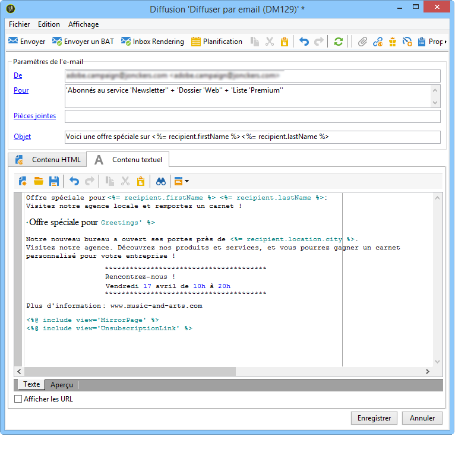
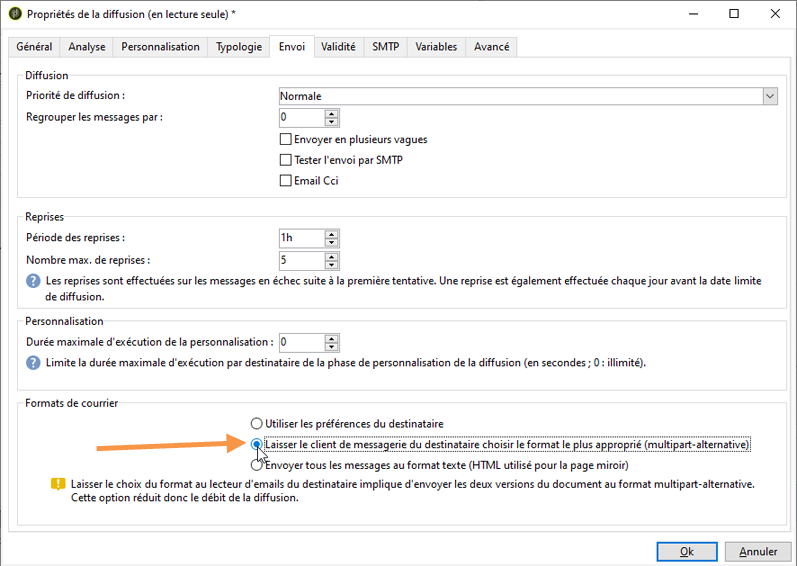
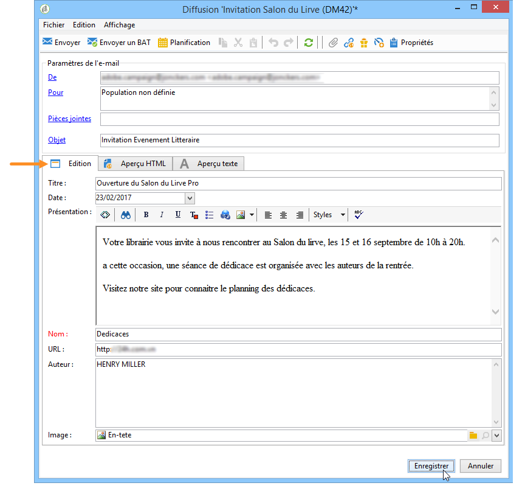
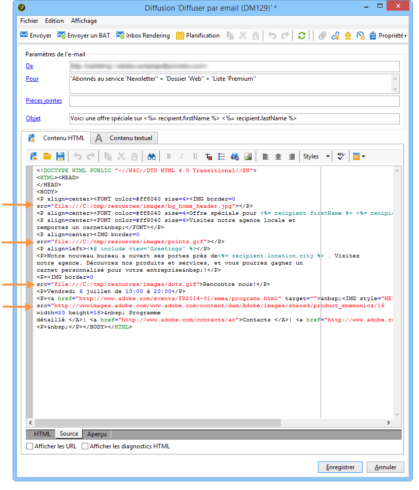
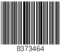

# Définir le contenu de l&#39;email{#defining-the-email-content}

## Expéditeur {#sender}

To define the name and address of the sender which will appear in the header of messages sent, click the **[!UICONTROL From]** link.

Cette fenêtre permet de saisir toutes les informations nécessaires à l&#39;élaboration des en-têtes de messages email. Ces informations peuvent être personnalisées. Pour cela, vous devez utiliser des champs de personnalisation, insérés via des boutons situés à droite des champs de saisie.

To find out how to insert and use personalization fields, refer to [About personalization](../../delivery/using/about-personalization.md) section.

>[!NOTE]
>
>* Par défaut, l&#39;adresse de réponse est l&#39;adresse de l&#39;expéditeur.
>* Les paramètres d&#39;en-tête ne doivent pas être vides. Par défaut, ils contiennent les valeurs saisies lors de la configuration de l&#39;assistant de déploiement. Pour plus d&#39;informations, reportez-vous au [Guide d&#39;installation](../../installation/using/deploying-an-instance.md).
>* L&#39;adresse de l&#39;expéditeur est obligatoire pour permettre l&#39;envoi d&#39;un email (norme RFC).
>* Adobe Campaign effectue une vérification syntaxique des adresses email saisies.

>[!CAUTION]
>
>Dans le cadre des contrôles mis en place par les Fournisseurs d&#39;Accès Internet (FAI) afin de lutter contre les emails non-sollicités (spam), Adobe recommande de créer des comptes emails correspondants aux adresses spécifiées pour l&#39;expédition et la réponse. Vérifiez auprès de l&#39;administrateur de votre messagerie.

## Objet du message {#message-subject}

L’objet du message est configuré dans le champ correspondant. Vous pouvez le saisir directement dans le champ ou cliquer sur le **[!UICONTROL Subject]** lien pour entrer un script. Le lien de personnalisation vous permet d’insérer des champs de base de données dans l’objet.

>[!CAUTION]
>
>L&#39;objet du message est obligatoire.

Le contenu des champs sera remplacé par la valeur enregistrée dans le profil du destinataire lors de l&#39;envoi du message.

Par exemple, dans le message ci-dessus, le sujet du message est personnalisé pour chaque destinataire avec les données de son profil.

>[!NOTE]
>
>The use of personalization fields is presented in [About personalization](../../delivery/using/about-personalization.md).

## Contenu du message {#message-content}

>[!CAUTION]
>
>Pour des raisons de confidentialité, nous vous recommandons d’utiliser HTTPS pour toutes les ressources externes.

Le contenu du message est défini dans la section inférieure de la fenêtre de configuration de la diffusion.

Les messages sont envoyés au format HTML ou texte par défaut, selon les préférences du destinataire. Nous vous recommandons de créer du contenu dans les deux formats afin de vous assurer que les messages peuvent s&#39;afficher correctement dans n&#39;importe quel système de messagerie. Pour plus d’informations, reportez-vous à [Sélection de formats](#selecting-message-formats)de message.

* Pour importer un contenu HTML, utilisez le **[!UICONTROL Open]** bouton. Vous pouvez également coller le code source directement dans le **[!UICONTROL Source]** sous-onglet.

   Si vous utilisez [Digital Content Editor](../../web/using/about-campaign-html-editor.md) (DCE), consultez [Sélection d&#39;un modèle de contenu](../../web/using/use-case--creating-an-email-delivery.md#step-3---selecting-a-content).

   >[!CAUTION]
   >
   >Le contenu HTML doit être préalablement créé puis importé dans Adobe Campaign. L&#39;éditeur HTML n&#39;est pas conçu pour la création de contenu.

   Le **[!UICONTROL Preview]** sous-onglet permet d’afficher le rendu de chaque contenu pour un destinataire. Les champs de personnalisation et les éléments conditionnels du contenu sont remplacés par les informations correspondantes pour le profil sélectionné.

   Les boutons de la barre d&#39;outils permettent d&#39;accéder aux paramètres de mise en forme standard pour la page HTML.

   

   Vous pouvez insérer des images dans des messages à partir d’un fichier local ou d’une bibliothèque d’images dans Adobe Campaign. Pour ce faire, cliquez sur l’ **[!UICONTROL Image]** icône et sélectionnez l’option appropriée.

   

   Les images de la bibliothèque sont accessibles via le **[!UICONTROL Resources>Online>Public resources]** dossier de l’arborescence des dossiers. Voir aussi [Ajout d’images](#adding-images).

   Le dernier bouton de la barre d&#39;outils permet d&#39;insérer des champs de personnalisation.

   >[!NOTE]
   >
   >The use of personalization fields is presented in [About personalization](../../delivery/using/about-personalization.md).

   Les onglets au bas de la page vous permettent d’afficher le code HTML de la page en cours de création et d’afficher le rendu du message avec sa personnalisation. Pour lancer cet affichage, cliquez sur **[!UICONTROL Preview]** et sélectionnez un destinataire à l’aide du **[!UICONTROL Test personalization]** bouton de la barre d’outils. Vous pouvez sélectionner un destinataire parmi les cibles définies ou choisir un autre destinataire.

   

   Vous pouvez valider le message HTML. Vous pouvez également visualiser le contenu de l&#39;en-tête de l&#39;email.

   

* Pour importer un contenu de texte, utilisez le **[!UICONTROL Open]** bouton ou l’ **[!UICONTROL Text Content]** onglet pour saisir le contenu du message lorsqu’il est affiché au format texte. Utilisez les boutons de la barre d’outils pour accéder aux actions sur le contenu. Le dernier bouton permet d’insérer des champs de personnalisation.

   

   As for the HTML format click the **[!UICONTROL Preview]** tab at the bottom of the page to view the rendering of the message with its personalization.

   

## Sélection des formats du message {#selecting-message-formats}

Vous pouvez modifier le format des courriers électroniques envoyés. Pour ce faire, modifiez les propriétés de remise et cliquez sur l’ **[!UICONTROL Delivery]** onglet.

Sélectionnez le format du mail dans la section inférieure de la fenêtre :

* **[!UICONTROL Use recipient preferences]** (mode par défaut)

   The message format is defined according to the data stored in the recipient profile and stored by default in the **[!UICONTROL email format]** field (@emailFormat). Si un destinataire souhaite recevoir les messages dans un format particulier, ce format lui est envoyé. Si le champ n’est pas renseigné, un message multipartie alternatif est envoyé (voir ci-dessous).

* **[!UICONTROL Let recipient mail client choose the most appropriate format]**

   Le message contient les deux formats : texte et HTML. Le format affiché lors de la réception dépend de la configuration du logiciel de messagerie du destinataire (multipart-alternative).

   >[!CAUTION]
   >
   >Cette option inclut les deux versions du document et, par conséquent, impacte le débit de diffusion des messages, car le poids du message est plus élevé.

* **[!UICONTROL Send all messages in text format]**

   Le message est envoyé au format texte. Le format HTML ne sera pas envoyé mais uniquement utilisé pour la page miroir, lorsque le destinataire clique sur le lien dans le message.

## Définition de contenu interactif {#amp-for-email-format}

Adobe Campaign vous permet de tester le nouveau format interactif [AMP pour les courriers électroniques](https://amp.dev/about/email/) , qui permet d’envoyer des courriers électroniques dynamiques, sous certaines conditions.

Voir à ce propos [cette section](../../delivery/using/defining-interactive-content.md).

## Utilisation de la gestion de contenu {#using-content-management}

Vous pouvez définir le contenu de la diffusion à l’aide des formulaires de gestion de contenu, directement dans l’assistant de diffusion. Pour ce faire, vous devez référencer le modèle de publication de la gestion du contenu à utiliser, dans l’ **[!UICONTROL Advanced]** onglet des propriétés de diffusion.

Ainsi, un onglet supplémentaire permet de saisir un contenu qui sera automatiquement intégré et mis en forme selon les règles de la gestion de contenu.

>[!NOTE]
>
>For further information about content management in Adobe Campaign, refer to [this section](../../delivery/using/about-content-management.md).

## Ajout d&#39;images {#adding-images}

Les diffusions de courrier électronique au format HTML peuvent contenir des images. From the delivery wizard, you can import an HTML page containing images or insert images directly using the HTML editor via the **[!UICONTROL Image]** icon.

Ces images peuvent être :

* locales ou appelées depuis un serveur
* stockées dans la bibliothèque des ressources publiques d&#39;Adobe Campaign

   Les ressources publiques sont accessibles via le **[!UICONTROL Resources > Online]** noeud de la hiérarchie Adobe Campaign. Ils sont regroupés dans une bibliothèque et peuvent être inclus dans des messages électroniques, mais peuvent également être utilisés pour des campagnes ou des tâches ou pour la gestion de contenu.

* partagées via Adobe Experience Cloud. Consultez [cette section](../../integrations/using/sharing-assets-with-adobe-experience-cloud.md).

>[!CAUTION]
>
>Pour inclure des images dans les emails via l&#39;assistant de diffusion, l&#39;instance Adobe Campaign doit être paramétrée afin de permettre la gestion des ressources publiques. Cette opération est réalisée dans l&#39;assistant de déploiement. Reportez-vous à [cette section](../../installation/using/deploying-an-instance.md) pour consulter les informations de paramétrage.

L’assistant de diffusion vous permet d’ajouter des images locales, ou des images stockées dans la bibliothèque, au contenu des messages. Pour ce faire, cliquez sur le **[!UICONTROL Image]** bouton dans la barre d’outils de contenu HTML.

Pour être visibles par les destinataires, ces images dans les messages doivent être présentes sur un serveur accessible depuis l&#39;extérieur.

Pour gérer les images via l&#39;assistant de diffusion, vous devez cliquer sur l&#39;icône **[!UICONTROL Tracking & Images]** située dans la barre d&#39;outils.

Sélectionnez **[!UICONTROL Upload images]** dans l’ **[!UICONTROL Images]** onglet. Vous pouvez ensuite choisir d’inclure les images dans le message électronique.

* Vous pouvez télécharger les images manuellement sans attendre la phase d’analyse de diffusion. To do this, click the **[!UICONTROL Upload images now]** link.
* Vous pouvez spécifier un autre chemin d’accès aux images sur le serveur de suivi. Pour ce faire, entrez-la dans le **[!UICONTROL Image URL]** champ. Cette valeur remplace la valeur définie dans les paramètres de l’assistant d’installation.

Dans l&#39;assistant de diffusion, lorsque vous ouvrez un contenu HTML avec des images incluses en relatif, un message vous propose alors de mettre en ligne immédiatement les images, selon les paramètres de la diffusion.

>[!CAUTION]
>
>Les chemins d&#39;accès aux images sont modifiés lors d&#39;une mise en ligne manuelle ou lors de l&#39;envoi des messages.

**Exemple : envoi d&#39;un message avec des images{#example--sending-a-message-with-images}**

Voici un exemple de diffusion avec quatre images :

Ces images sont issues d&#39;un répertoire local ou d&#39;un site web, comme vous pouvez le vérifier depuis l&#39;onglet **[!UICONTROL Source]**.

Cliquez sur l&#39;icône **[!UICONTROL Tracking & Images]** puis sur l&#39;onglet **[!UICONTROL Images]** pour lancer la détection des images présentes dans le message.

Pour chaque image détectée, vous pouvez visualiser son état :

* If an image is stored locally or located on another server, even if this server is visible from the outside (on an internet site, for example), it will be detected as **[!UICONTROL Not yet online]**.
* The images are detected as **[!UICONTROL Already online]** if they were uploaded earlier while creating another delivery.
* In the deployment wizard, you can define URLs for which image detection is not enabled: uploading these images will be **[!UICONTROL Skipped]**.

>[!NOTE]
>
>Images are identified by their content and not by their access paths. This means that an image uploaded previously under a different name or in a different directory will be detected as **[!UICONTROL Already online]**.

Lors de la phase d&#39;analyse du message, les images sont automatiquement téléchargées sur le serveur afin d&#39;être accessibles depuis l&#39;extérieur, sauf les images locales qui doivent avoir été téléchargées préalablement.

Vous pouvez continuer à travailler et télécharger des images afin qu’elles puissent être visualisées par d’autres opérateurs Adobe Campaign. Cela peut vous être utile si vous travaillez en collaboration. Pour ce faire, cliquez sur **[!UICONTROL Upload the images straightaway...]** pour télécharger les images sur le serveur.

>[!NOTE]
>
>Les URL des images de l&#39;email sont alors modifiées, et notamment les noms des images.

Une fois les images en ligne, vous pouvez visualiser la modification de leur nom et de leur chemin d&#39;accès depuis l&#39;onglet **[!UICONTROL Source]** du message.

Si vous sélectionnez **[!UICONTROL Include the images in the email]**, vous pouvez choisir les images à inclure dans la colonne correspondante.

>[!NOTE]
>
>Si des images locales sont incluses dans le message, vous devez confirmer la modification du code source du message.

## Insérer un code-barres dans un email{#inserting-a-barcode-in-an-email}

Le module de génération de codes-barres permet de créer plusieurs types de codes-barres répondant aux normes les plus courantes, dans les formats 1D (unidimensionnel) et 2D (bidimensionnel).

Il est possible de générer dynamiquement un code-barres sous la forme d&#39;un bitmap au moyen d&#39;une valeur définie grâce à des critères client. Un code-barres personnalisé peut être intégré à des communications émises par email dans le cadre d&#39;une campagne marketing. Le destinataire pourra imprimer ce message et le présenter à la société émettrice qui le scannera (lors d&#39;un passage en caisse par exemple).

To insert a barcode into an email, place the cursor in the content where you want to display it, then click the personalization button. Select **[!UICONTROL Include > Barcode...]**.

Puis paramétrez les éléments suivants en fonction de vos besoins :

1. Choisissez le type de code-barres.

   * Pour le format 1D, Adobe Campaign propose les types suivants: Codabar, Code 128, GS1-128 (anciennement EAN-128), UPC-A, UPC-E, ISBN, EAN-8, Code39, Interleaved 2 of 5, POSTNET et Royal Mail (RM4SCC).

      Exemple de code-barres 1D :

      

   * Les types DataMatrix et PDF417 concernent le format 2D.

      Exemple de code-barres 2D :

      

   * Pour insérer un QR Code, sélectionnez ce type et indiquez le taux de correction d&#39;erreur à appliquer. Ce taux définit la quantité d&#39;informations répétées et donc une tolérance plus ou moins importante aux dégradations.

      

      Exemple de QR Code :

      

1. Indiquez la taille du code-barres à insérer dans l&#39;email : le paramétrage de l&#39;échelle permet d&#39;augmenter ou de réduire la taille du code-barres, de x 1 à x 10.
1. Le **[!UICONTROL Value]** champ vous permet de définir la valeur du code à barres. Une valeur peut correspondre à une offre spéciale et peut être fonction d’un critère ; elle peut être la valeur d’un champ de base de données lié aux clients.

   Cet exemple montre un code à barres de type EAN-8 auquel a été ajouté le numéro de compte d’un destinataire. Pour ajouter ce numéro de compte, cliquez sur le bouton de personnalisation à droite du **[!UICONTROL Value]** champ et sélectionnez **[!UICONTROL Recipient > Account number]**.

   

1. The **[!UICONTROL Height]** field lets you configure the height of the barcode without changing its width, by altering the amount of space between each bar.

   Il n&#39;existe pas de contrôle restrictif de saisie en fonction du type de code-barres sélectionné. Si une valeur de code-barres est erronée, vous ne le saurez que lorsque vous passerez en vue **Aperçu** avec le code-barres marqué d&#39;une croix rouge.

   >[!NOTE]
   >
   >La valeur donnée à un code-barres dépend du type choisi. Par exemple, un type EAN-8 devra comporter exactement huit chiffres.
   >
   >Le bouton de personnalisation à droite du **[!UICONTROL Value]** champ vous permet d’ajouter des données en plus de la valeur elle-même. Cela enrichit le code à barres, à condition que la norme de code à barres l’accepte.
   >
   >For example, if you are using a GS1-128 type barcode and want to enter the account number of a recipient in addition to the value, click the personalization button and select **[!UICONTROL Recipient > Account number]**. If the account number of the selected recipient is entered correctly, the barcode takes it into account.

Une fois ces éléments configurés, vous pouvez finaliser votre courrier électronique et l’envoyer. Pour éviter les erreurs, assurez-vous toujours que votre contenu s’affiche correctement avant d’effectuer une diffusion en cliquant sur l’ **[!UICONTROL Preview]** onglet.

>[!NOTE]
>
>Si la valeur d&#39;un code-barres s&#39;avère incorrecte, le bitmap qui le représente s&#39;affiche barré d&#39;une croix rouge.

## Envoi d&#39;emails sur un mobile japonais {#sending-emails-on-japanese-mobiles}

### Formats d&#39;email pour les mobiles japonais {#email-formats-for-japanese-mobiles}

Adobe Campaign gère trois formats japonais spécifiques pour les emails sur les mobiles : **Deco-mail** (mobiles DoCoMo), **Decore Mail** (mobiles Softbank) et **Decoration Mail** (mobiles KDDI AU). Ces formats imposent des contraintes particulières d&#39;encodage, de structure et de taille. Pour plus d&#39;informations sur les limites et pour obtenir des recommandations, consultez [cette section](#limitations-and-recommendations).

In order for the recipient to correctly receive messages in one of these formats, we recommend selecting **[!UICONTROL Deco-mail (DoCoMo)]**, **[!UICONTROL Decore Mail (Softbank)]** or **[!UICONTROL Decoration Mail (KDDI AU)]** in the corresponding profile:

However, if you leave the **[!UICONTROL Email format]** option as **[!UICONTROL Unknown]**, **[!UICONTROL HTML]** or **[!UICONTROL Text]**, Adobe Campaign will automatically detect (when sending the email) the Japanese format to use so that the message is correctly displayed.

Ce système de détection automatique est basé sur la liste des domaines prédéfinis définis dans le jeu de règles de **[!UICONTROL Management of Email Formats]** messagerie. Pour en savoir plus sur la gestion des formats de courrier électronique, consultez [cette page](../../installation/using/email-deliverability.md#managing-email-formats).

### Limites et recommandations {#limitations-and-recommendations}

Un certain nombre de contraintes s&#39;appliquent lorsque vous souhaitez envoyer des emails destinés à être lus sur un mobile opéré par un fournisseur japonais (Softbank, DoCoMo, KDDI AU).

Ainsi, vous devez :

* Utiliser exclusivement des images au format JPEG ou GIF.
* Créer une diffusion dont la somme des parties texte et HTML est strictement inférieure à 10 000 octets (pour KDDI AU et DoCoMo).
* Utiliser des images dont la taille totale avant encodage est inférieure à 100 Ko.
* Ne pas utiliser plus de 20 images par message.
* Utiliser un format HTML réduit (un nombre limité de balises sont disponibles pour chaque opérateur).

>[!NOTE]
>
>Des limitations spécifiques à chaque opérateur sont à prendre en compte lors de la création de votre message. Pour plus d&#39;informations, voir :
>
>* Pour DoCoMo, consultez [cette page](https://www.nttdocomo.co.jp/service/developer/make/content/deco_mail/index.html).
>* Pour For KDDI AU, consultez [cette page](https://www.au.com/ezfactory/tec/spec/decorations/template.html).
>* Pour Softbank, consultez [cette page](https://www.support.softbankmobile.co.jp/partner/home_tech3/index.cfm).

### Test du contenu de l&#39;email {#testing-the-email-content}

#### Prévisualisation du message {#previewing-the-message}

Adobe Campaign vous permet de vérifier que le format de votre message est adapté à l&#39;envoi sur un mobile japonais.

Vous pouvez d&#39;abord contrôler l&#39;affichage et le formatage au moment de la création du message, une fois que vous avez défini votre contenu et renseigné l&#39;objet de l&#39;email.

Dans l’ **[!UICONTROL Preview]** onglet de la fenêtre de modification du contenu, cliquer **[!UICONTROL More... > Deco-mail diagnostic]** permet d’effectuer les opérations suivantes :

* vérifier que les balises du contenu HTML sont conformes aux restrictions du format japonais.
* vérifier que le nombre d&#39;images dans le message ne dépasse pas la limite imposée par le format (20 images).
* vérifier la taille totale du message (inférieure à 100 Ko).

   

#### Exécution d&#39;une règle de typologie {#running-typology-rule}

In addition to the previewing diagnosis, a second check is carried out when sending a proof or a delivery: a specific typology rule, **[!UICONTROL Deco-mail check]**, is started during the analysis.

>[!CAUTION]
>
>This typology rule is only executed if at least one of the recipients is configured to receive emails in **[!UICONTROL Deco-mail (DoCoMo)]**, **[!UICONTROL Decore Mail (Softbank)]** or **[!UICONTROL Decoration Mail (KDDI AU)]** format.

Cette règle permet de s&#39;assurer que la diffusion respecte les [contraintes de format](#limitations-and-recommendations) définies par les opérateurs japonais, notamment la taille totale de l&#39;email, la taille de ses parties HTML et texte, le nombre d&#39;images dans le message et les balises du contenu HTML.

#### Envoyer un bon à tirer {#sending-proofs}

Vous pouvez envoyer des BAT pour tester la diffusion. Lors de l&#39;envoi d&#39;un BAT, si vous avez recours à des adresses de substitution, veillez à saisir des adresses correspondant au format des emails du profil utilisé.

Par exemple, vous pouvez remplacer l&#39;adresse d&#39;un profil par test@softbank.ne.jp si le format des emails de ce profil a été défini au préalable sur **[!UICONTROL Decore Mail (Softbank)]**.

### Envoyer les messages {#sending-messages}

Pour envoyer une diffusion à des destinataires dont le format des emails est japonais, vous pouvez procéder de deux manières :

* créer deux diffusions, une propre aux destinataires japonais et une pour les autres destinataires (voir [cette section](#designing-a-specific-delivery-for-japanese-formats)) ;
* créer une seule diffusion et laisser Adobe Campaign détecter automatiquement le format à utiliser (voir [cette section](#designing-a-delivery-for-all-formats)).

#### Conception d&#39;une diffusion spécifique pour les formats japonais {#designing-a-specific-delivery-for-japanese-formats}

Vous pouvez créer un workflow comprenant deux diffusions : une destinée à être lue sur un mobile japonais et une pour les destinataires avec un format d&#39;email standard.

To do this, use the **[!UICONTROL Split]** activity in your workflow and define the Japanese email formats (Deco-mail, Decoration Mail and Decore Mail) as filtering conditions.

#### Conception d&#39;une diffusion pour tous les formats {#designing-a-delivery-for-all-formats}

When Adobe Campaign dynamically manages the formats according to the domain (profiles with email formats defined as **[!UICONTROL Unknown]**, **[!UICONTROL HTML]** or **[!UICONTROL Text]** ), you can send the same delivery to all of your recipients.

Le contenu du message s&#39;affichera correctement d&#39;une part pour les utilisateurs de mobiles japonais, d&#39;autre part pour les destinataires standard.

>[!CAUTION]
>
>Veillez toutefois à respecter les spécificités liées à chaque format d&#39;email japonais (Deco-mail, Decoration Mail et Decore Mail). Pour plus d&#39;informations sur les limites, consultez [cette section](#limitations-and-recommendations).
