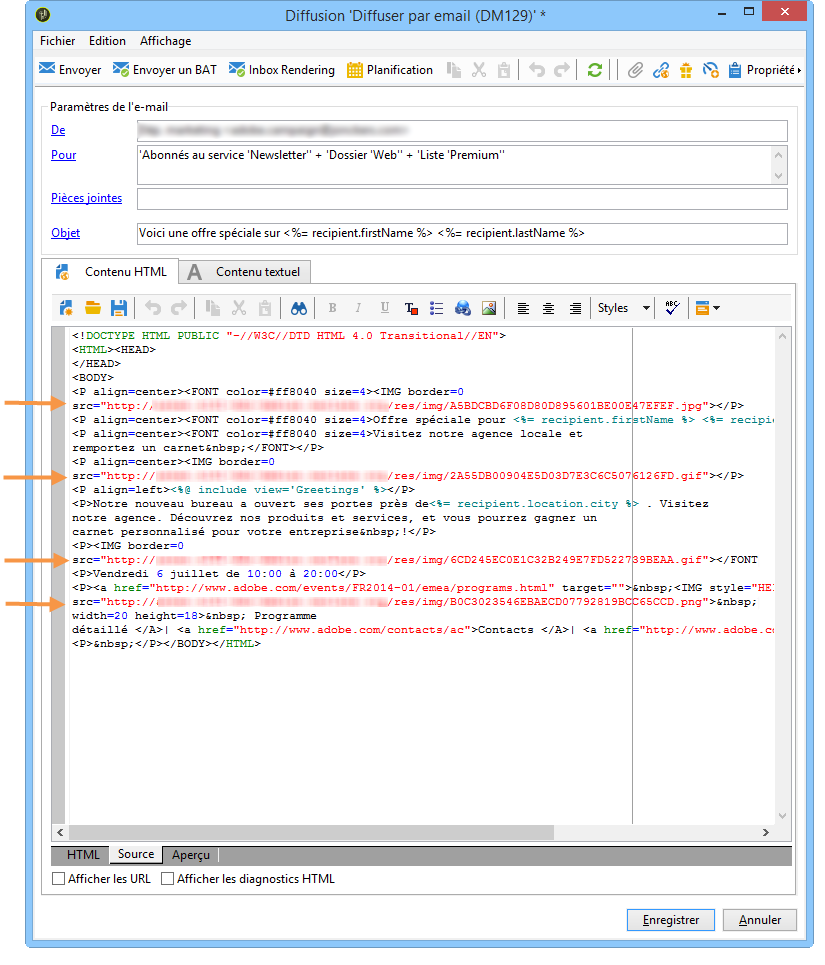

# Définir le contenu de l&#39;email{#defining-the-email-content}

## Expéditeur {#sender}

Pour définir le nom et l&#39;adresse de l&#39;expéditeur qui apparaîtront en en-tête des messages envoyés, cliquez sur le lien **[!UICONTROL De]**.

Cette fenêtre permet de saisir toutes les informations nécessaires à l&#39;élaboration des en-têtes de messages email. Ces informations peuvent être personnalisées. Pour cela, vous devez utiliser des champs de personnalisation, insérés via des boutons situés à droite des champs de saisie.

To find out how to insert and use personalization fields, refer to [About personalization](../../delivery/using/about-personalization.md) section.

>[!NOTE]
>
>* Par défaut, l&#39;adresse de réponse est l&#39;adresse de l&#39;expéditeur.
>* Les paramètres d&#39;en-tête ne doivent pas être vides. Par défaut, ils contiennent les valeurs saisies lors de la configuration de l&#39;assistant de déploiement. Pour plus d&#39;informations, reportez-vous au [Guide d&#39;installation](../../installation/using/deploying-an-instance.md).
>* L&#39;adresse de l&#39;expéditeur est obligatoire pour permettre l&#39;envoi d&#39;un email (norme RFC).
>* Adobe Campaign effectue une vérification syntaxique des adresses email saisies.

>[!CAUTION]
>
>Dans le cadre des contrôles mis en place par les Fournisseurs d&#39;Accès Internet (FAI) afin de lutter contre les emails non-sollicités (spam), Adobe recommande de créer des comptes emails correspondants aux adresses spécifiées pour l&#39;expédition et la réponse. Vérifiez auprès de l&#39;administrateur de votre messagerie.

## Objet du message {#message-subject}

L&#39;objet du message est paramétré dans le champ correspondant. Vous pouvez le saisir directement dans le champ ou cliquer sur le lien **[!UICONTROL Objet]** pour saisir un script. Le lien de personnalisation permet d&#39;insérer des champs de la base dans l&#39;objet.

>[!CAUTION]
>
>L&#39;objet du message est obligatoire.

Le contenu des champs sera remplacé par la valeur enregistrée dans le profil du destinataire lors de l&#39;envoi du message.

Par exemple, dans le message ci-dessus, le sujet du message est personnalisé pour chaque destinataire avec les données de son profil.

>[!NOTE]
>
>The use of personalization fields is presented in [About personalization](../../delivery/using/about-personalization.md).

## Contenu du message {#message-content}

>[!CAUTION]
>
>Pour des raisons de confidentialité, nous vous recommandons d’utiliser HTTPS pour toutes les ressources externes.

Le contenu du message est défini dans la section inférieure de la fenêtre de configuration de la diffusion.

Les messages sont envoyés au format HTML ou texte par défaut, selon les préférences du destinataire. Nous vous recommandons de créer du contenu dans les deux formats afin de vous assurer que les messages peuvent s&#39;afficher correctement dans n&#39;importe quel système de messagerie. Pour plus d’informations, reportez-vous à [Sélection de formats](#selecting-message-formats)de message.

* Pour importer un contenu HTML, utilisez le bouton **[!UICONTROL Ouvrir]**. Vous pouvez également coller le code source directement dans le sous-onglet **[!UICONTROL Source]**.

   Si vous utilisez [Digital Content Editor](../../web/using/about-campaign-html-editor.md) (DCE), consultez [Sélection d&#39;un modèle de contenu](../../web/using/use-case--creating-an-email-delivery.md#step-3---selecting-a-content).

   >[!CAUTION]
   >
   >Le contenu HTML doit être préalablement créé puis importé dans Adobe Campaign. L&#39;éditeur HTML n&#39;est pas conçu pour la création de contenu.

   Le sous-onglet **[!UICONTROL Aperçu]** permet, pour chaque contenu, de visualiser le rendu pour un destinataire. Les champs de personnalisation et les éléments conditionnels du contenu sont remplacés par les informations correspondantes pour le profil sélectionné.

   Les boutons de la barre d&#39;outils permettent d&#39;accéder aux paramètres de mise en forme standard pour la page HTML.

   

   Vous pouvez insérer des images dans les messages depuis un fichier local ou depuis la bibliothèque d&#39;images disponible dans Adobe Campaign. Pour cela, cliquez sur l&#39;icône **[!UICONTROL Image]** et sélectionnez l&#39;option adéquate.

   

   Library images can be accessed via the **[!UICONTROL Resources>Online>Public resources]** folder in the folder tree. Voir aussi [Ajout d’images](#adding-images).

   Le dernier bouton de la barre d&#39;outils permet d&#39;insérer des champs de personnalisation.

   >[!NOTE]
   >
   >The use of personalization fields is presented in [About personalization](../../delivery/using/about-personalization.md).

   Les onglets en bas de page permettent d&#39;afficher le code HTML associé à la page en cours de création et de visualiser le rendu du message, avec sa personnalisation. Pour lancer la visualisation, cliquez sur l&#39;onglet **[!UICONTROL Aperçu]** et sélectionnez un destinataire à partir du bouton **[!UICONTROL Tester la personnalisation]** situé dans la barre d&#39;outils. Vous pouvez sélectionner un destinataire parmi la ou les cibles définies ou choisir un autre destinataire.

   

   Vous pouvez valider le message HTML. Vous pouvez également visualiser le contenu de l&#39;en-tête de l&#39;email.

   

* Pour importer un contenu texte, utilisez le bouton **[!UICONTROL Ouvrir]** ou l&#39;onglet **[!UICONTROL Contenu texte]** pour saisir le contenu du message lorsqu&#39;il sera affiché au format texte. Les boutons de la barre d&#39;outils permettent d&#39;accéder aux actions sur le contenu. Le dernier bouton permet d&#39;insérer des champs de personnalisation.

   

   Comme pour le format HTML, cliquez sur l&#39;onglet **[!UICONTROL Aperçu]** en bas de page pour visualiser le rendu du message, avec sa personnalisation.

   

## Sélection des formats du message {#selecting-message-formats}

Vous pouvez paramétrer le format des emails envoyés. Pour cela, éditez les propriétés de la diffusion et cliquez sur l&#39;onglet **[!UICONTROL Envoi]**.

Sélectionnez le format du mail dans la section inférieure de la fenêtre :

* **[!UICONTROL Tenir compte des préférences des destinataires]** (mode par défaut)

   Le format du message est défini en fonction des informations enregistrées dans le profil du destinataire et stockées par défaut dans le champ **[!UICONTROL Format des emails]** (@emailFormat). Si un destinataire souhaite recevoir les messages dans un format particulier, ce format lui est envoyé. Si ce champ n&#39;est pas renseigné, le message sera envoyé en multipart-alternative (voir ci-dessous).

* **[!UICONTROL Laisser le mailer des destinataires choisir le format le plus adapté]**

   Le message contient les deux formats : texte et HTML. Le format affiché lors de la réception dépend de la configuration du logiciel de messagerie du destinataire (multipart-alternative).

   >[!CAUTION]
   >
   >Cette option inclut les deux versions du document et, par conséquent, impacte le débit de diffusion des messages, car le poids du message est plus élevé.

* **[!UICONTROL Envoyer tous les messages au format texte]**

   Le message est envoyé au format texte. Le format HTML ne sera pas envoyé mais uniquement utilisé pour la page miroir, lorsque le destinataire clique sur le lien dans le message.

## Définition de contenu interactif {#amp-for-email-format}

Adobe Campaign vous permet de tester le nouveau format interactif [AMP pour les courriers électroniques](https://amp.dev/about/email/) , qui permet d’envoyer des courriers électroniques dynamiques, sous certaines conditions.

Voir à ce propos [cette section](../../delivery/using/defining-interactive-content.md).

## Utilisation de la gestion de contenu {#using-content-management}

Vous pouvez définir le contenu de la diffusion en utilisant les formulaires d&#39;une gestion de contenu, directement dans l&#39;assistant de diffusion. Pour cela, vous devez référencer le modèle de publication de la gestion de contenu à utiliser, dans l&#39;onglet **[!UICONTROL Avancé]** des propriétés de la diffusion.

Ainsi, un onglet supplémentaire permet de saisir un contenu qui sera automatiquement intégré et mis en forme selon les règles de la gestion de contenu.

>[!NOTE]
>
>For further information about content management in Adobe Campaign, refer to [this section](../../delivery/using/about-content-management.md).

## Ajout d&#39;images {#adding-images}

Les diffusions par email au format HTML peuvent contenir des images. Depuis l&#39;assistant de diffusion, vous pouvez importer une page HTML contenant des images ou insérer des images directement depuis l&#39;éditeur HTML à partir de l&#39;icône **[!UICONTROL Image]**.

Ces images peuvent être :

* locales ou appelées depuis un serveur
* stockées dans la bibliothèque des ressources publiques d&#39;Adobe Campaign

   Les ressources publiques sont accessibles à partir du nœud **[!UICONTROL Ressources >On-line > Ressources publiques]** de l&#39;arborescence Adobe Campaign. Elles sont regroupées dans une bibliothèque et peuvent être incluses dans les emails, mais aussi utilisées au niveau des opérations ou des tâches, ainsi que pour la gestion de contenu.

* partagées via Adobe Experience Cloud. Consultez [cette section](../../integrations/using/sharing-assets-with-adobe-experience-cloud.md).

>[!CAUTION]
>
>Pour inclure des images dans les emails via l&#39;assistant de diffusion, l&#39;instance Adobe Campaign doit être paramétrée afin de permettre la gestion des ressources publiques. Cette opération est réalisée dans l&#39;assistant de déploiement. Reportez-vous à [cette section](../../installation/using/deploying-an-instance.md) pour consulter les informations de paramétrage.

L&#39;assistant de diffusion vous permet d&#39;ajouter dans le contenu des messages des images locales ou des images stockées dans la bibliothèque. Pour cela, cliquez sur le bouton **[!UICONTROL Image]** situé dans la barre d&#39;outils du contenu HTML.

Pour être visibles par les destinataires, ces images dans les messages doivent être présentes sur un serveur accessible depuis l&#39;extérieur.

Pour gérer les images via l&#39;assistant de diffusion, vous devez cliquer sur l&#39;icône **[!UICONTROL Tracking &amp; Images]** située dans la barre d&#39;outils.

Cocher l&#39;option **[!UICONTROL Mise en ligne des images]** proposée dans l&#39;onglet **[!UICONTROL Images]**. Vous pouvez alors choisir d&#39;inclure ou non les images dans l&#39;email.

* Pour mettre en ligne manuellement les images, sans attendre la phase d&#39;analyse de la diffusion, cliquez sur le lien **[!UICONTROL Mettre en ligne les images tout de suite...]**.
* Vous pouvez indiquer un autre chemin d&#39;accès aux images sur le serveur de tracking, pour cela saisissez-le dans le champ **[!UICONTROL URL des images]**. Cette valeur surcharge celle définie dans les paramètres de l&#39;assistant de déploiement.

Dans l&#39;assistant de diffusion, lorsque vous ouvrez un contenu HTML avec des images incluses en relatif, un message vous propose alors de mettre en ligne immédiatement les images, selon les paramètres de la diffusion.

>[!CAUTION]
>
>Les chemins d&#39;accès aux images sont modifiés lors d&#39;une mise en ligne manuelle ou lors de l&#39;envoi des messages.

**Exemple : envoi d&#39;un message avec des images{#example--sending-a-message-with-images}**

Voici un exemple de diffusion avec quatre images :

Ces images sont issues d&#39;un répertoire local ou d&#39;un site web, comme vous pouvez le vérifier depuis l&#39;onglet **[!UICONTROL Source]**.

Cliquez sur l&#39;icône **[!UICONTROL Tracking &amp; Images]** puis sur l&#39;onglet **[!UICONTROL Images]** pour lancer la détection des images présentes dans le message.

Pour chaque image détectée, vous pouvez visualiser son état :

* Si une image est locale ou enregistrée sur un autre serveur, et même si ce serveur est accessible depuis l&#39;extérieur (sur un site internet par exemple), elle sera détectée comme **[!UICONTROL Pas encore en ligne]**.
* Les images sont détectées comme **[!UICONTROL Déjà en ligne]** si elles ont été mises en ligne antérieurement lors de la création d&#39;une autre diffusion.
* Dans l&#39;assistant de déploiement, vous pouvez définir des URL pour lesquelles la détection des images ne sera pas active : la mise en ligne de ces images est alors **[!UICONTROL Ignorée]**.

>[!NOTE]
>
>Une image est identifiée par son contenu, et non par son nom ou son chemin d&#39;accès. Ainsi, une image mise en ligne antérieurement sous un autre nom ou depuis un autre répertoire sera détectée comme **[!UICONTROL Déjà en ligne]**.

Lors de la phase d&#39;analyse du message, les images sont automatiquement téléchargées sur le serveur afin d&#39;être accessibles depuis l&#39;extérieur, sauf les images locales qui doivent avoir été téléchargées préalablement.

Vous pouvez anticiper la mise en ligne si vous souhaitez rendre des images locales visibles par d&#39;autres opérateurs Adobe Campaign, notamment dans le cadre d&#39;un travail collaboratif sur les diffusions. Pour cela, sélectionnez l&#39;option **[!UICONTROL Mise en ligne des images]** et cliquez sur le lien pour télécharger les images sur le serveur.

>[!NOTE]
>
>Les URL des images de l&#39;email sont alors modifiées, et notamment les noms des images.

Une fois les images en ligne, vous pouvez visualiser la modification de leur nom et de leur chemin d&#39;accès depuis l&#39;onglet **[!UICONTROL Source]** du message.

Si vous cochez l&#39;option **[!UICONTROL Inclure les images dans l&#39;email]**, vous pouvez choisir quelles images inclure ou ne pas inclure depuis la colonne correspondante.

>[!NOTE]
>
>Si des images locales sont incluses dans le message, vous devez confirmer la modification du code source du message.

## Insérer un code-barres dans un email{#inserting-a-barcode-in-an-email}

Le module de génération de codes-barres permet de créer plusieurs types de codes-barres répondant aux normes les plus courantes, dans les formats 1D (unidimensionnel) et 2D (bidimensionnel).

Il est possible de générer dynamiquement un code-barres sous la forme d&#39;un bitmap au moyen d&#39;une valeur définie grâce à des critères client. Un code-barres personnalisé peut être intégré à des communications émises par email dans le cadre d&#39;une campagne marketing. Le destinataire pourra imprimer ce message et le présenter à la société émettrice qui le scannera (lors d&#39;un passage en caisse par exemple).

Pour insérer un code-barres dans un email, positionnez le curseur dans le contenu, là où vous souhaitez l&#39;afficher, et cliquez sur le bouton de personnalisation. Choisissez **[!UICONTROL Inclure > Code-barres...]**.

Puis paramétrez les éléments suivants en fonction de vos besoins :

1. Choisissez le type de code-barres.

   * Pour le format 1D, Adobe Campaign propose les types suivants: Codabar, Code 128, GS1-128 (anciennement EAN-128), UPC-A, UPC-E, ISBN, EAN-8, Code39, Interleaved 2 of 5, POSTNET et Royal Mail (RM4SCC).

      Exemple de code-barres 1D :

      

   * Les types DataMatrix et PDF417 concernent le format 2D.

      Exemple de code-barres 2D :

      

   * Pour insérer un QR Code, sélectionnez ce type et indiquez le taux de correction d&#39;erreur à appliquer. Ce taux définit la quantité d&#39;informations répétées et donc une tolérance plus ou moins importante aux dégradations.

      

      Exemple de QR Code :

      

1. Indiquez la taille du code-barres à insérer dans l&#39;email : le paramétrage de l&#39;échelle permet d&#39;augmenter ou de réduire la taille du code-barres, de x 1 à x 10.
1. Le champ **[!UICONTROL Valeur]** permet de définir la valeur du code-barres. Une valeur peut correspondre à une offre promotionnelle et peut être une fonction d&#39;un critère, ce peut être la valeur d&#39;un champ de la base de données relative aux clients.

   L&#39;exemple ci-dessous montre un code-barres de type EAN-8 auquel a été ajouté le numéro de compte d&#39;un destinataire. Pour ajouter ce numéro de compte, cliquez sur le bouton de personnalisation situé à droite du champ **[!UICONTROL Valeur]** et sélectionnez **[!UICONTROL Destinataire > N° de compte]**.

   

1. Le champ **[!UICONTROL Hauteur]** permet de paramétrer la hauteur du code-barres sans en modifier la largeur, soit l&#39;espacement entre chaque barre.

   Il n&#39;existe pas de contrôle restrictif de saisie en fonction du type de code-barres sélectionné. Si une valeur de code-barres est erronée, vous ne le saurez que lorsque vous passerez en vue **Aperçu** avec le code-barres marqué d&#39;une croix rouge.

   >[!NOTE]
   >
   >La valeur donnée à un code-barres dépend du type choisi. Par exemple, un type EAN-8 devra comporter exactement huit chiffres.
   >
   >Le bouton de personnalisation situé à droite du champ **[!UICONTROL Valeur]** permet d&#39;ajouter une ou plusieurs données en plus de la valeur elle-même. Ceci vient enrichir le code-barres sous réserve que la norme du code-barres l&#39;accepte.
   >
   >Par exemple, si vous utilisez un code-barres de type GS1-128 et que vous souhaitez renseigner le numéro de compte d&#39;un destinataire en plus de la valeur, cliquez sur le bouton de personnalisation et sélectionnez **[!UICONTROL Destinataire > N° de compte]**. Si le numéro de compte du destinataire sélectionné est correctement renseigné, le code-barres le prend en considération.

Une fois ces éléments paramétrés, vous pouvez finaliser votre email et l&#39;envoyer. Pour éviter toute erreur, vérifiez toujours avant une diffusion que votre contenu s&#39;affiche correctement en cliquant sur l&#39;onglet **[!UICONTROL Aperçu]**.

>[!NOTE]
>
>Si la valeur d&#39;un code-barres s&#39;avère incorrecte, le bitmap qui le représente s&#39;affiche barré d&#39;une croix rouge.

## Envoi d&#39;emails sur un mobile japonais {#sending-emails-on-japanese-mobiles}

### Formats d&#39;email pour les mobiles japonais {#email-formats-for-japanese-mobiles}

Adobe Campaign gère trois formats japonais spécifiques pour les emails sur les mobiles : **Deco-mail** (mobiles DoCoMo), **Decore Mail** (mobiles Softbank) et **Decoration Mail** (mobiles KDDI AU). Ces formats imposent des contraintes particulières d&#39;encodage, de structure et de taille. Pour plus d&#39;informations sur les limites et pour obtenir des recommandations, consultez [cette section](#limitations-and-recommendations).

Pour qu&#39;un destinataire puisse recevoir correctement des messages dans l&#39;un de ces formats, il est recommandé de sélectionner **[!UICONTROL Deco-mail (DoCoMo)]**, **[!UICONTROL Decore Mail (Softbank)]** ou **[!UICONTROL Decoration Mail (KDDI AU)]** dans le profil correspondant :

Cependant, si vous laissez l&#39;option **[!UICONTROL Format des emails]** définie sur **[!UICONTROL Inconnu]**, **[!UICONTROL HTML]** ou **[!UICONTROL Texte]**, Adobe Campaign détectera automatiquement, lors de l&#39;envoi de l&#39;email, le format japonais à utiliser pour que le message s&#39;affiche correctement.

Ce système de détection automatique repose sur la liste des domaines prédéfinis dans l&#39;ensemble de règles de mail **[!UICONTROL Gestion des formats des emails]**. Pour plus d&#39;informations sur la gestion des formats des emails, consultez [cette page](../../installation/using/email-deliverability.md#managing-email-formats).

### Limites et recommandations {#limitations-and-recommendations}

Un certain nombre de contraintes s&#39;appliquent lorsque vous souhaitez envoyer des emails destinés à être lus sur un mobile opéré par un fournisseur japonais (Softbank, DoCoMo, KDDI AU).

Ainsi, vous devez :

* Utiliser exclusivement des images au format JPEG ou GIF.
* Créer une diffusion dont la somme des parties texte et HTML est strictement inférieure à 10 000 octets (pour KDDI AU et DoCoMo).
* Utiliser des images dont la taille totale avant encodage est inférieure à 100 Ko.
* Ne pas utiliser plus de 20 images par message.
* Utiliser un format HTML réduit (un nombre limité de balises sont disponibles pour chaque opérateur).

>[!NOTE]
>
>Des limitations spécifiques à chaque opérateur sont à prendre en compte lors de la création de votre message. Pour plus d&#39;informations, voir :
>
>* Pour DoCoMo, consultez [cette page](https://www.nttdocomo.co.jp/service/developer/make/content/deco_mail/index.html).
>* Pour For KDDI AU, consultez [cette page](https://www.au.com/ezfactory/tec/spec/decorations/template.html).
>* Pour Softbank, consultez [cette page](https://www.support.softbankmobile.co.jp/partner/home_tech3/index.cfm).

### Test du contenu de l&#39;email {#testing-the-email-content}

#### Prévisualisation du message {#previewing-the-message}

Adobe Campaign vous permet de vérifier que le format de votre message est adapté à l&#39;envoi sur un mobile japonais.

Vous pouvez d&#39;abord contrôler l&#39;affichage et le formatage au moment de la création du message, une fois que vous avez défini votre contenu et renseigné l&#39;objet de l&#39;email.

Dans l&#39;onglet **[!UICONTROL Aperçu]** de la fenêtre d&#39;édition du contenu, en cliquant sur **[!UICONTROL Détails > Diagnostic Deco-mail]**, vous pouvez alors :

* vérifier que les balises du contenu HTML sont conformes aux restrictions du format japonais.
* vérifier que le nombre d&#39;images dans le message ne dépasse pas la limite imposée par le format (20 images).
* vérifier la taille totale du message (inférieure à 100 Ko).

   

#### Exécution d&#39;une règle de typologie {#running-typology-rule}

En plus du diagnostic de prévisualisation, une deuxième vérification est effectuée lors de l&#39;envoi d&#39;un BAT ou d&#39;une diffusion : une règle de typologie spécifique, **[!UICONTROL Vérification du Deco-mail]**, est lancée au cours de l&#39;analyse.

>[!CAUTION]
>
>Cette règle de typologie s&#39;exécute seulement si au moins l&#39;un des destinataires est paramétré pour recevoir des emails au format **[!UICONTROL Deco-mail (DoCoMo)]**, **[!UICONTROL Decore Mail (Softbank)]** ou **[!UICONTROL Decoration Mail (KDDI AU)]**.

Cette règle permet de s&#39;assurer que la diffusion respecte les [contraintes de format](#limitations-and-recommendations) définies par les opérateurs japonais, notamment la taille totale de l&#39;email, la taille de ses parties HTML et texte, le nombre d&#39;images dans le message et les balises du contenu HTML.

#### Envoyer un bon à tirer {#sending-proofs}

Vous pouvez envoyer des BAT pour tester la diffusion. Lors de l&#39;envoi d&#39;un BAT, si vous avez recours à des adresses de substitution, veillez à saisir des adresses correspondant au format des emails du profil utilisé.

Par exemple, vous pouvez remplacer l&#39;adresse d&#39;un profil par test@softbank.ne.jp si le format des emails de ce profil a été défini au préalable sur **[!UICONTROL Decore Mail (Softbank)]**.

### Envoyer les messages {#sending-messages}

Pour envoyer une diffusion à des destinataires dont le format des emails est japonais, vous pouvez procéder de deux manières :

* créer deux diffusions, une propre aux destinataires japonais et une pour les autres destinataires (voir [cette section](#designing-a-specific-delivery-for-japanese-formats)) ;
* créer une seule diffusion et laisser Adobe Campaign détecter automatiquement le format à utiliser (voir [cette section](#designing-a-delivery-for-all-formats)).

#### Conception d&#39;une diffusion spécifique pour les formats japonais {#designing-a-specific-delivery-for-japanese-formats}

Vous pouvez créer un workflow comprenant deux diffusions : une destinée à être lue sur un mobile japonais et une pour les destinataires avec un format d&#39;email standard.

Pour cela, utilisez une activité **[!UICONTROL Partage]** dans votre workflow et définissez les formats d&#39;email japonais (Deco-mail, Decoration Mail et Decore Mail) comme conditions de filtrage.

#### Conception d&#39;une diffusion pour tous les formats {#designing-a-delivery-for-all-formats}

Lorsqu&#39;Adobe Campaign gère dynamiquement les formats en fonction du domaine (profils avec format des emails défini sur **[!UICONTROL Inconnu]**, **[!UICONTROL HTML]** ou **[!UICONTROL Texte]**), vous pouvez envoyer la même diffusion à tous vos destinataires.

Le contenu du message s&#39;affichera correctement d&#39;une part pour les utilisateurs de mobiles japonais, d&#39;autre part pour les destinataires standard.

>[!CAUTION]
>
>Veillez toutefois à respecter les spécificités liées à chaque format d&#39;email japonais (Deco-mail, Decoration Mail et Decore Mail). Pour plus d&#39;informations sur les limites, consultez [cette section](#limitations-and-recommendations).
