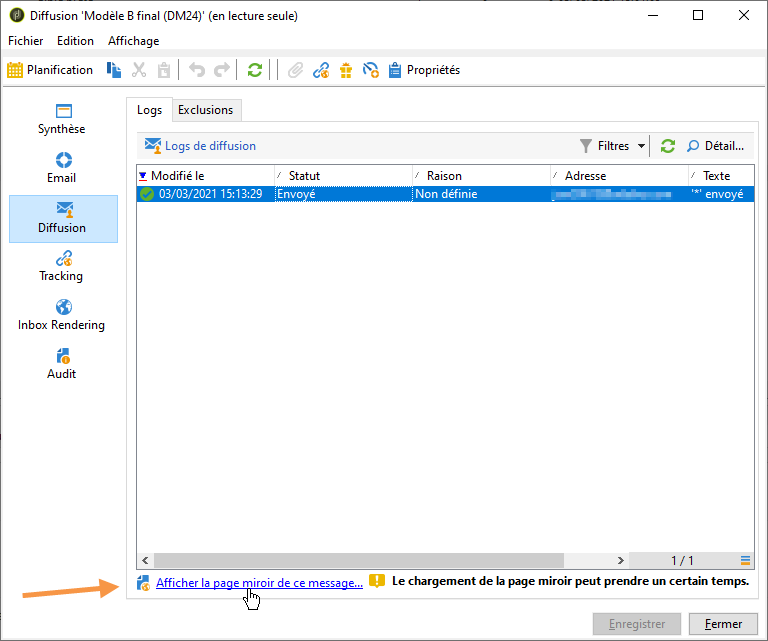
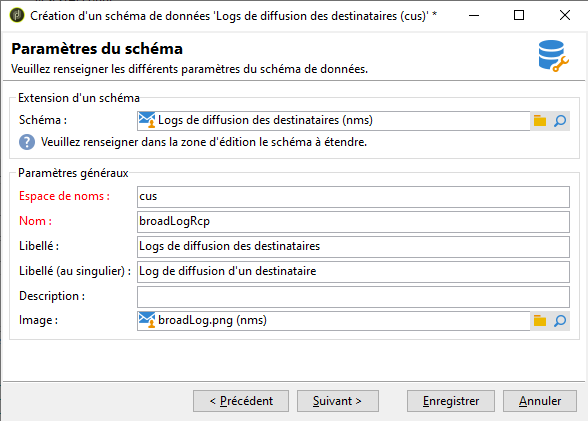
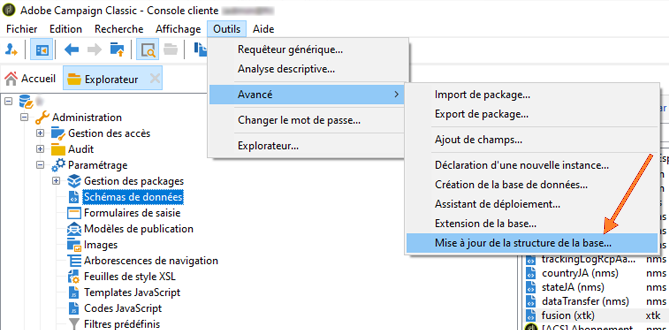
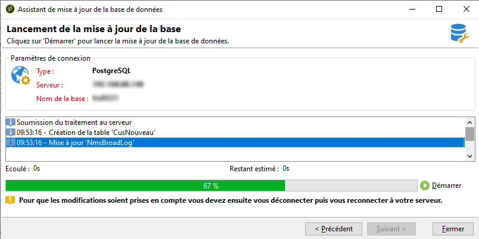

# Tableau de bord de la diffusion {#delivery-dashboard}


Le **tableau de bord de la diffusion** est la clé pour suivre les diffusions et les erreurs éventuelles rencontrées lors de l&#39;envoi des messages.

Il vous permet de récupérer des informations sur une diffusion et de les modifier si nécessaire. Veuillez noter que le contenu de ces onglets n&#39;est plus modifiable lorsque la diffusion a été envoyée.

Vous trouverez ci-dessous les informations à surveiller à l&#39;aide des différents onglets disponibles dans le tableau de bord :

* [Synthèse des diffusions](#delivery-summary)
* [Rapports sur les diffusions](#delivery-reports)
* [Logs de diffusion, pages miroir, exclusions](#delivery-logs-and-history)
* [Logs et historique de suivi des diffusions](#tracking-logs)
* [Rendu des diffusions](#delivery-rendering)
* [Suivi de la diffusion](#delivery-audit-)


**Rubriques connexes :**

* [Comprendre les échecs de diffusion](understanding-delivery-failures.md)
* [Comprendre la gestion des quarantaines](understanding-quarantine-management.md)
* [Bonnes pratiques relatives à la diffusion](delivery-best-practices.md)
* [Gestion de la délivrabilité](about-deliverability.md)

## Synthèse des diffusions {#delivery-summary}

L&#39;onglet **[!UICONTROL Résumé]** contient les caractéristiques de la diffusion : état de la diffusion, canal utilisé, informations sur l&#39;expéditeur, objet, informations relatives à l&#39;exécution.

## Rapports sur les diffusions {#delivery-reports}

Le lien **[!UICONTROL Rapports]**, accessible à partir de l&#39;onglet **[!UICONTROL Résumé]**, vous permet de consulter un ensemble de rapports liés à la dernière diffusion : rapport général de diffusion, rapport détaillé, rapport de diffusion, distribution des messages en échec, taux d&#39;ouverture, clics et transactions, etc.

Le contenu de cet onglet peut être configuré en fonction de vos besoins. Pour plus d’informations sur les rapports de la diffusion, consultez [cette section](../../reporting/using/delivery-reports.md).


## Logs, historique et exclusions de diffusion {#delivery-logs-and-history}

L&#39;onglet **[!UICONTROL Diffusion]** propose un historique des occurrences de cette diffusion. Il contient les logs de diffusion, c&#39;est-à-dire la liste des messages envoyés et leur statut. Il permet de visualiser l&#39;état de la diffusion pour chaque destinataire et les messages associés.

Pour une diffusion, vous pouvez afficher (par exemple) uniquement les destinataires dont la diffusion a échoué ou une adresse en quarantaine. Pour ce faire, cliquez sur le bouton **[!UICONTROL Filtres]** et sélectionnez **[!UICONTROL Par état]**. Sélectionnez ensuite l’état dans la liste déroulante. Les différents statuts sont répertoriés dans [cette page](delivery-statuses.md).

>[!NOTE]
>
>La liste qui affiche les logs de diffusion peut être personnalisée, comme toute liste dans Campaign Classic. Vous pouvez, par exemple, ajouter une colonne pour connaître l&#39;adresse IP qui a envoyé chaque email dans une diffusion. Pour plus d&#39;informations à ce sujet, reportez-vous au cas pratique détaillé dans [cette section](#use-case).


Le lien **[!UICONTROL Afficher la page miroir de ce message...]** vous permet d&#39;afficher la page miroir du contenu de la diffusion sélectionnée dans la liste dans une nouvelle fenêtre.

La page miroir est disponible uniquement pour les diffusions pour lesquelles un contenu HTML a été défini. Voir à ce sujet la section [Générer la page miroir](sending-messages.md#generating-the-mirror-page).



## Logs et historique de suivi des diffusions {#tracking-logs}

L&#39;onglet **[!UICONTROL Tracking]** liste l&#39;historique du tracking pour cette diffusion. Cet onglet affiche les informations de tracking sur les messages envoyés, soit toutes les URL qui ont fait l&#39;objet d&#39;un tracking par Adobe Campaign. Les informations de tracking sont mises à jour toutes les heures.

>[!NOTE]
>
>Si le tracking n&#39;est pas activé pour une diffusion, cet onglet n&#39;est pas affiché.

Le paramétrage du tracking est effectué dans l&#39;assistant de diffusion, à l&#39;étape concernée. Voir à ce sujet la section [Comment configurer des liens suivis](how-to-configure-tracked-links.md). 

**[!UICONTROL Tracking]** Les données sont interprétées dans les rapports de diffusion. Consultez [cette section](../../reporting/using/delivery-reports.md).


## Inbox rendering {#delivery-rendering}

L&#39;onglet **[!UICONTROL Inbox rendering]** permet de prévisualiser le message dans les différents contextes dans lesquels il peut être reçu et de vérifier la compatibilité auprès des principaux ordinateurs de bureau et applications.

Ainsi, vous pouvez vérifier que l&#39;affichage de votre message sera optimal pour les destinataires sur divers clients web, webmails et appareils.

Voir à ce propos [cette section](inbox-rendering.md).


## Suivi de la diffusion {#delivery-audit-}

L&#39;onglet **[!UICONTROL Audit]** contient le log des diffusions et tous les messages concernant les BAT.

Le bouton **[!UICONTROL Actualiser]** permet de mettre à jour les données. Utilisez le bouton **[!UICONTROL Filtres]** pour définir un filtre sur les données.

Des icônes spécifiques permettent de repérer les erreurs ou avertissements. Pour plus d&#39;informations, consultez la section [Analyser la diffusion](steps-validating-the-delivery.md#analyzing-the-delivery).

Le sous-onglet **[!UICONTROL Bons à tirer]** vous permet de voir la liste des BAT qui ont été envoyés.


Vous pouvez modifier les informations affichées dans cette fenêtre (ainsi que celles du **[!UICONTROL Diffusion]** et **[!UICONTROL Tracking]** onglets) en sélectionnant les colonnes à afficher. Pour ce faire, cliquez sur le bouton **[!UICONTROL Configurer la liste]** située dans le coin inférieur droit. Pour plus d&#39;informations sur le paramétrage de l&#39;affichage des listes, reportez-vous à la section [cette section](../../platform/using/adobe-campaign-workspace.md#configuring-lists).

## Synchronisation du tableau de bord des diffusions {#delivery-dashboard-synchronization}

Dans le tableau de bord des diffusions, vous souhaitez vérifier les messages traités et les logs de diffusion pour vous assurer que la diffusion a bien été envoyée.

Certains indicateurs ou statuts peuvent être incorrects ou ne pas être à jour. Ce problème peut être résolu à l&#39;aide des solutions suivantes :

* Si le statut de votre diffusion est incorrect, vérifiez que toutes les validations nécessaires ont été effectuées pour celle-ci ou que les workflows **[!UICONTROL operationMgt]** et **[!UICONTROL deliveryMgt]** s&#39;exécutent sans erreur. La diffusion peut aussi utiliser une affinité qui n&#39;est pas configurée sur l&#39;instance d&#39;envoi.

* Si vos indicateurs de diffusion sont toujours à zéro et que vous utilisez un paramétrage de mid-sourcing, vérifiez les **[!UICONTROL Mid-sourcing (compteurs des diffusions)]** workflow technique. Démarrez-la si son état n’est pas **[!UICONTROL Démarré]**. Vous pouvez ensuite essayer de recalculer les indicateurs en cliquant avec le bouton droit sur la diffusion concernée dans l&#39;explorateur Adobe Campaign et en sélectionnant **[!UICONTROL Actions]** > **[!UICONTROL Recalculer les indicateurs de diffusion et de tracking]**. Pour plus d&#39;informations sur les indicateurs de tracking, reportez-vous à cette section [section](../../reporting/using/delivery-reports.md#tracking-indicators).

* Si votre compteur de diffusions ne correspond pas à votre diffusion, essayez de recalculer les indicateurs en cliquant avec le bouton droit sur la diffusion concernée dans l&#39;explorateur Adobe Campaign et en sélectionnant **[!UICONTROL Actions]** > **[!UICONTROL Recalculer les indicateurs de diffusion et de tracking]** pour resynchroniser. Pour plus d&#39;informations sur les indicateurs de tracking, reportez-vous à cette section [section](../../reporting/using/delivery-reports.md#tracking-indicators).

* Si votre compteur de diffusions n&#39;est pas à jour pour les déploiements en mid-sourcing, vérifiez que la variable **[!UICONTROL Mid-sourcing (compteurs des diffusions)]** workflow technique en cours d’exécution. Pour en savoir plus à ce sujet, consultez cette [page](../../installation/using/mid-sourcing-deployment.md).

Vous pouvez également effectuer le suivi de vos diffusions avec différents rapports depuis le tableau de bord des diffusions. Pour plus d’informations à ce sujet, consultez cette [section](../../reporting/using/delivery-reports.md).

## Cas pratique : Ajouter les adresses IP des expéditeurs aux logs {#use-case}

Dans cette section, vous apprendrez comment ajouter aux logs de diffusion des informations concernant l’adresse IP qui a envoyé chaque email dans une diffusion.

>[!NOTE]
>
>Cette modification est différente si vous utilisez une instance unique ou une instance de midsourcing. Avant de procéder à la modification, vérifiez que vous êtes connecté à l&#39;instance d&#39;envoi d&#39;email.

### Étape 1 : Optimiser le schéma

Pour ajouter **publicID** dans vos logs de diffusion, vous devez d&#39;abord optimiser le schéma. Vous pouvez procéder comme suit.

1. Créez une extension de schéma sous **[!UICONTROL Administration]** > **[!UICONTROL Configuration]** > **[!UICONTROL Schémas de données]** > **[!UICONTROL Nouveau]**.

   Pour plus d&#39;informations sur les extensions de schéma, consultez [cette page](../../configuration/using/extending-a-schema.md).

1. Sélectionnez **[!UICONTROL broadLogRcp]** pour optimiser les logs de diffusion du destinataire (nms) et définir un espace de noms personnalisé. Dans ce cas, ce sera &quot;cus&quot; :

   

   >[!NOTE]
   >
   >Si votre instance est en midsourcing, vous devez utiliser le schéma broadLogMid.

1. Ajoutez le nouveau champ dans votre extension. Dans cet exemple, vous devez remplacer :

   ```
   <element img="nms:broadLog.png" label="Recipient delivery logs" labelSingular="Recipient delivery log" name="broadLogRcp"/>
   ```

   par :

   ```
   <element img="nms:broadLog.png" label="Recipient delivery logs" labelSingular="Recipient delivery log" name="broadLogRcp">
   <attribute desc="Outbound IP identifier" label="IP identifier"
   name="publicId" type="long"/>
   </element>
   ```

   

### Étape 2 : Mettre à jour la structure de la base de données

Une fois les modifications effectuées, vous devez mettre à jour la structure de la base de données afin de l&#39;aligner sur sa description logique.

Pour ce faire, procédez comme suit :

1. Cliquez sur **[!UICONTROL Outils]** > **[!UICONTROL Avancé]** > **[!UICONTROL Mise à jour de la structure de la base...]**.

   

1. Dans la fenêtre **[!UICONTROL Modification des tables]**, la table **[!UICONTROL NmsBroadLogRcp]** est cochée (ou la table **[!UICONTROL broadLogMid]** si votre environnement est en midsourcing), comme suit :

   

   >[!IMPORTANT]
   >
   >Assurez-vous toujours qu&#39;il n&#39;y a aucune autre modification, à l&#39;exception de la table **[!UICONTROL NmsBroadLoGRcp]** (ou de la table **[!UICONTROL broadLogMid]** si vous êtes dans un environnement de midsourcing). Si tel est le cas, désélectionnez les autres tables.

1. Cliquez sur **[!UICONTROL Suivant]** pour valider. L’écran suivant s’affiche :

   

1. Cliquez sur **[!UICONTROL Suivant]**, puis sur **[!UICONTROL Démarrer]** pour commencer la mise à jour de la structure de la base de données. La création de l&#39;index commence. Cette étape peut être longue, en fonction du nombre de lignes dans la table **[!UICONTROL NmsBroadLogRcp]**.

   

>[!NOTE]
>
>Une fois la mise à jour de la structure physique de la base de données terminée avec succès, vous devez vous déconnecter et vous reconnecter afin que vos modifications soient prises en compte.

### Étape 3 : Valider la modification

Pour vérifier que tout a fonctionné correctement, vous devez mettre à jour l’écran des logs de diffusion.

Pour ce faire, accédez aux logs de diffusion et ajoutez la colonne &quot;Identifiant de l&#39;IP&quot;.


>[!NOTE]
>
>Pour savoir comment configurer des listes dans l&#39;interface de Campaign Classic, consultez [cette page](../../platform/using/adobe-campaign-workspace.md).

Vous trouverez ci-dessous ce que vous devez voir dans l’onglet **[!UICONTROL Diffusion]** après les modifications :


