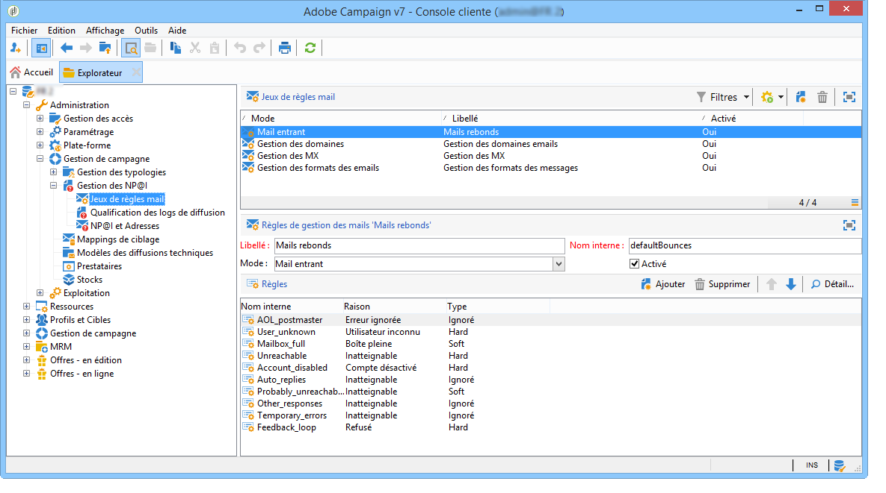

# Diffusions en échec et gestion des quarantaines {#delivery-failures-quarantine}

>[!NOTE]
>
>Des conseils complets sur les diffusions en échec et la gestion des quarantaines sont documentés dans la documentation de Campaign v8. Ce contenu s’applique aux utilisateurs et utilisatrices de Campaign Classic v7 et de Campaign v8 :
>
>* [Comprendre les diffusions en échec](https://experienceleague.adobe.com/fr/docs/campaign/campaign-v8/send/monitor/delivery-failures){target="_blank"} - Couvre les types d’échecs, les raisons des erreurs, les erreurs synchrones/asynchrones, la gestion des reprises et le dépannage.
>* [Gestion des quarantaines](https://experienceleague.adobe.com/fr/docs/campaign/campaign-v8/send/monitor/quarantines){target="_blank"} - Couvre la quarantaine par rapport à la place sur la liste bloquée, les seuils d’erreur soft, les rapports de quarantaine et la suppression d’adresses.
>
>Cette page présente la **configuration spécifique à Campaign Classic v7** pour la gestion des rebonds d’e-mails et des quarantaines dans les déploiements hybrides et on-premise.

## Présentation des échecs de diffusion

Pour connaître les concepts courants relatifs aux diffusions en échec, les types d’erreur et les conseils de dépannage, reportez-vous à la documentation [Présentation des diffusions en échec dans Campaign v8](https://experienceleague.adobe.com/fr/docs/campaign/campaign-v8/send/monitor/delivery-failures){target="_blank"}.

## Configuration des rebonds d’e-mails {#bounce-mail-config}

Les options de configuration suivantes sont disponibles pour les **déploiements hybrides/on-premise de Campaign Classic v7** afin de gérer le traitement des rebonds d’e-mails.

### Configuration de la boîte des rebonds d’e-mails {#bounce-mailbox-configuration}

Pour les installations on-premise, la configuration de la boîte des rebonds d’e-mails est décrite dans [cette section](../../installation/using/deploying-an-instance.md#managing-bounced-emails).

Les messages d’erreur asynchrones sont collectés par la plateforme Adobe Campaign via la boîte des rebonds d’e-mails et qualifiés par le processus inMail pour enrichir la liste des règles de gestion des e-mails.

>[!NOTE]
>
>Pour les utilisateurs et utilisatrices de Campaign v8 Managed Cloud Services, la configuration des boîtes des rebonds d’e-mails est effectuée et gérée par Adobe. Aucune configuration n’est requise.

### Gestion de la qualification des rebonds d’e-mails {#bounce-mail-qualification-management}

Pour les installations on-premise et les installations hébergées/hybrides utilisant l’ancien MTA de Campaign, lorsque la diffusion d&#39;un email échoue, le serveur de diffusion d&#39;Adobe Campaign reçoit un message d&#39;erreur du serveur de messagerie ou du serveur DNS distant. La liste des erreurs est composée de chaînes contenues dans le message renvoyé par le serveur distant. Les types et raisons des échec sont affectés à chaque message d&#39;erreur.

Cette liste est disponible depuis le nœud **[!UICONTROL Administration > Gestion de campagne > Gestion des NP@I > Qualification des logs de diffusion]**. Il contient toutes les règles utilisées par Adobe Campaign pour qualifier les erreurs de diffusion. Cette liste est non exhaustive et est régulièrement mise à jour par Adobe Campaign. Elle peut également être gérée par l&#39;utilisateur.

Le message renvoyé par le serveur distant à la première occurrence de ce type d&#39;erreur est affiché dans la colonne **[!UICONTROL Premier texte]** de la table **[!UICONTROL Qualification des logs de diffusion]**. Si cette colonne n&#39;est pas visible, cliquez sur le bouton **[!UICONTROL Configurer la liste]** en bas à droite de la liste pour la sélectionner.

Adobe Campaign filtre ce message pour supprimer le contenu de la variable (identifiants, dates, adresses email, numéros de téléphone, etc.) et affiche le résultat filtré dans la colonne **[!UICONTROL Texte]**. Les variables sont remplacées par **`#xxx#`**, à l&#39;exception des adresses remplacées par **`*`**.

Ce processus permet de regrouper tous les échecs d&#39;un même type et d&#39;éviter plusieurs entrées pour des erreurs similaires dans la table Qualification des logs de diffusion.

>[!NOTE]
>
>Le champ **[!UICONTROL Nombre d&#39;occurrences]** affiche le nombre d&#39;occurrences du message dans la liste. Ce nombre est limité à 100 000 occurrences. Vous pouvez modifier le champ si vous le souhaitez, par exemple pour le réinitialiser.

Les statuts de qualification des mails rebonds sont les suivants :

* **[!UICONTROL À qualifier]** : le rebond d’e-mail n’a pas pu être qualifié. La qualification doit être confiée à l’équipe chargée de la délivrabilité afin de garantir le bon fonctionnement de la délivrabilité de la plateforme. Tant qu’il n’est pas qualifié, le rebond d’e-mail n’est pas utilisé pour compléter la liste des règles de gestion des e-mails.
* **[!UICONTROL Conserver]** : le rebond d’e-mail a été qualifié et sera utilisé par le workflow **Mise à jour pour la délivrabilité** pour être comparé aux règles de gestion des e-mails existantes et en enrichir la liste.
* **[!UICONTROL Ignorer]** : le rebond d’e-mail est ignoré par le MTA de Campaign, ce qui signifie que ce rebond ne provoquera jamais la mise en quarantaine de l’adresse de la personne destinataire. Il ne sera pas utilisé par le workflow **Mise à jour pour la délivrabilité** et il ne sera pas envoyé aux instances clientes.

>[!NOTE]
>
>En cas de panne d&#39;un fournisseur de services Internet, les emails envoyés par le biais de Campaign seront incorrectement marqués comme des rebonds. Pour corriger ce problème, vous devez mettre à jour la qualification des rebonds. Pour plus d’informations à ce sujet, consultez [cette page](update-bounce-qualification.md).

### Configuration des règles de gestion des e-mails {#email-management-rules}

Les règles mail sont accessibles depuis le nœud **[!UICONTROL Administration > Gestion de campagne > Gestion des NP@I > Jeux de règles mail]**. Vous pouvez consulter les règles de gestion des e-mails dans la section inférieure de la fenêtre.

>[!NOTE]
>
>Les paramètres par défaut de la plateforme sont configurés dans l&#39;assistant de déploiement. Pour plus d’informations, consultez [cette section](../../installation/using/deploying-an-instance.md).

Les règles par défaut sont les suivantes :

>[!IMPORTANT]
>
>* Le serveur de diffusion (MTA) doit être relancé si les paramètres ont été modifiés.
>* La modification ou la création de règles de gestion est réservée à des utilisateurs et utilisatrices experts.

#### Mail entrant {#inbound-email}

Ces règles contiennent les chaînes qui peuvent être renvoyées par les serveurs distants et qui permettent de qualifier l’erreur en **Hard** (rebond définitif), **Soft** (rebond temporaire) ou **Ignoré**.

Lors de l’échec d’un envoi d’e-mail, le serveur de messagerie distant renvoie un message d’erreur rebond à l’adresse spécifiée dans les paramètres de la plateforme. Adobe Campaign compare le contenu de chaque message de rebond aux chaînes de la liste des règles, puis attribue l’un des trois types d’erreur.

>[!NOTE]
>
>L’utilisateur peut créer ses propres règles. Lors d’un import de package et lors de la mise à jour des données par le workflow **Mise à jour pour la délivrabilité**, les règles e-mail créées par l’utilisateur ou l’utilisatrice sont écrasées.

Pour plus d’informations sur la qualification des e-mails rebonds, consultez [cette section](#bounce-mail-qualification-management).

#### Gestion des domaines {#domain-management}

Pour les installations on-premise, le MTA applique une règle unique de **gestion des domaines** à tous les domaines.

<!---->

* Vous pouvez choisir d’activer ou non certaines normes d’identification et clés de chiffrement pour vérifier le nom de domaine, comme **Sender ID**, **DomainKeys**, **DKIM**, **S/MIME**.
* Les paramètres de **Relais SMTP** permettent de configurer l’adresse IP et le port d’un serveur relais pour un domaine particulier. Pour plus d’informations à ce sujet, consultez [cette section](../../installation/using/configuring-campaign-server.md#smtp-relay).

Si vos messages sont affichés avec la mention **[!UICONTROL Au nom de]** dans l’adresse de l’expéditeur ou de l’expéditrice, veillez à ne pas signer vos e-mails avec le **Sender ID**, qui est la norme d’authentification de messagerie exclusive de Microsoft, devenue obsolète. Si l&#39;option **[!UICONTROL Sender ID]** est activée, décochez la case correspondante et contactez l&#39;[Assistance clientèle d&#39;Adobe Campaign](https://helpx.adobe.com/fr/enterprise/admin-guide.html/enterprise/using/support-for-experience-cloud.ug.html). Il n&#39;y aura aucune incidence sur la délivrabilité.

#### Gestion MX {#mx-management}

Pour les installations on-premise, les règles de gestion MX permettent de réguler le flux des e-mails sortants pour un domaine spécifique.

<!---->

Ces règles sont disponibles dans l’assistant de déploiement et peuvent être personnalisées :

* **[!UICONTROL Gestion MX]** : cette règle est utilisée pour contrôler le flux des e-mails sortants pour un domaine. Elle consiste à faire un échantillonnage des messages de rebond et à bloquer les envois, le cas échéant.

* **[!UICONTROL Période]** : période pendant laquelle les messages sont limités ou bloqués.

* **[!UICONTROL Limite]** : nombre maximal de messages autorisés par période.

* **[!UICONTROL Type]** : type d’erreur (hard, soft ou ignoré) utilisé pour déterminer le comportement d’envoi. Consultez la [documentation de Campaign v8](https://experienceleague.adobe.com/fr/docs/campaign/campaign-v8/send/monitor/delivery-failures){target="_blank"} pour obtenir des définitions des types d’erreurs.

Pour plus d’informations sur la gestion MX, consultez [cette section](../../installation/using/email-deliverability.md#about-mx-rules).

>[!NOTE]
>
>Pour les utilisateurs et utilisatrices de Campaign v8 Managed Cloud Services, les règles MX et la gestion des flux d’e-mails sont gérées par Adobe dans le cadre de l’infrastructure gérée. Contactez l’assistance clientèle Adobe si vous devez ajuster les paramètres MX pour des cas d’utilisation spécifiques.

## Gestion des quarantaines {#quarantine-management}

Pour obtenir des conseils complets sur la gestion des quarantaines, consultez la [documentation Gestion des quarantaines de Campaign v8](https://experienceleague.adobe.com/fr/docs/campaign/campaign-v8/send/monitor/quarantines){target="_blank"}.

## Configuration de la quarantaine {#quarantine-config}

Les options de configuration suivantes sont disponibles pour les **déploiements hybrides/on-premise de Campaign Classic v7** afin de personnaliser le comportement de la quarantaine.

### Configuration du seuil d’erreur soft {#soft-error-threshold}

Pour les installations on-premise utilisant l’ancien MTA de Campaign, vous pouvez modifier le nombre d’erreurs et la période entre deux erreurs avant qu’une adresse ne soit mise en quarantaine.

Pour configurer ces paramètres, procédez comme suit :

1. Accéder à l’assistant de déploiement depuis **[!UICONTROL Outils]** > **[!UICONTROL Avancé]** > **[!UICONTROL Assistant de déploiement]**
2. Accéder à **[!UICONTROL Canal e-mail]** > **[!UICONTROL Paramètres avancés]**
3. Configurer :
   * **Nombre d’erreurs** : nombre maximal d’erreurs soft avant la mise en quarantaine d’une adresse (par défaut : 5)
   * **Période entre deux erreurs significatives** : fenêtre temporelle (en secondes) pour le comptage des erreurs (par défaut : 86 400 secondes = 1 jour)

Quand le compteur d’erreurs atteint le seuil limite, l’adresse passe en quarantaine. Si la dernière erreur significative s’est produite il y a plus de 10 jours, le compteur d’erreurs est réinitialisé.

Pour plus d’informations, consultez [cette page](communication-channels.md) sous **Envoi de diffusion** > **Configurer les reprises**.

>[!NOTE]
>
>Pour les utilisateurs et utilisatrices de Campaign v8 Managed Cloud Services, les paramètres de reprise et les seuils d’erreur sont gérés par Adobe en fonction des performances IP et de la réputation du domaine. Aucune configuration n’est requise.

### Workflow de nettoyage de la base de données {#database-cleanup-workflow}

Pour les installations on-premise, le workflow technique **[!UICONTROL Nettoyage de la base de données]** supprime automatiquement les adresses en quarantaine qui correspondent à des conditions spécifiques.

Accédez à ce workflow depuis **[!UICONTROL Administration]** > **[!UICONTROL Production]** > **[!UICONTROL Workflows techniques]** > **[!UICONTROL Nettoyage de la base de données]**.

Le workflow supprime les adresses de la quarantaine dans les cas suivants :

* Adresses avec le statut **[!UICONTROL En erreur]** après une diffusion réussie
* Adresses avec le statut **[!UICONTROL En erreur]** si le dernier soft bounce s’est produit il y a plus de 10 jours.
* Adresses avec le statut **[!UICONTROL En erreur]**, avec l’erreur **[!UICONTROL Boîte pleine]** après 30 jours

Assurez-vous que ce workflow s’exécute régulièrement (recommandé : tous les jours) pour maintenir l’hygiène des listes de quarantaine.

Pour plus d’informations sur le nettoyage de base de données, reportez-vous à [cette section](../../production/using/database-cleanup-workflow.md).

>[!NOTE]
>
>Pour les utilisateurs et utilisatrices de Campaign v8 Managed Cloud Services, le workflow de nettoyage de la base de données est surveillé et géré par Adobe.

### Spécificités de la quarantaine des notifications push {#push-quarantine-specifics}

Pour Campaign Classic v7, les quarantaines des notifications push suivent le mécanisme général de mise en quarantaine avec certains comportements spécifiques aux canaux.

Pour les notifications push **iOS** et **Android**, le mécanisme de quarantaine utilise des jetons d’appareil plutôt que des adresses e-mail. Lorsqu’une application mobile est désinstallée ou réinstallée, le jeton associé est mis en quarantaine.

Pour plus d’informations sur les scénarios de quarantaine des notifications push (types d’erreur iOS et Android, comportement des reprises, etc.), reportez-vous à la documentation [Comprendre les diffusions en échec](https://experienceleague.adobe.com/fr/docs/campaign/campaign-v8/send/monitor/delivery-failures){target="_blank"} qui comprend des tableaux complets sur les types d’erreur des notifications push.

### Éléments spécifiques de la quarantaine SMS {#sms-quarantine-specifics}

Pour Campaign Classic v7, les quarantaines des SMS suivent le mécanisme général de mise en quarantaine avec certains comportements spécifiques aux canaux liés aux numéros de téléphone plutôt qu’aux adresses e-mail.

Le mécanisme de mise en quarantaine des SMS varie en fonction du connecteur utilisé :

* **Connecteurs SMPP standard** : les règles de qualification des erreurs définies dans **[!UICONTROL Administration > Gestion de campagne > Gestion des non-délivrables > Qualification des logs de diffusion]** s’appliquent aux diffusions SMS.

* **Connecteur SMPP générique étendu** : la gestion des erreurs est traitée différemment à l’aide d’expressions régulières (regex) pour analyser les messages de rapport de statut (SR) renvoyés par le fournisseur SMSC.

Pour plus d’informations sur les scénarios de mise en quarantaine des SMS et les types d’erreur, reportez-vous à la documentation [Comprendre les diffusions en échec](https://experienceleague.adobe.com/fr/docs/campaign/campaign-v8/send/monitor/delivery-failures){target="_blank"} qui comprend des tableaux complets de types d’erreur SMS.

## Rubriques connexes

* [Comprendre les diffusions en échec](https://experienceleague.adobe.com/fr/docs/campaign/campaign-v8/send/monitor/delivery-failures){target="_blank"} (documentation de Campaign v8)
* [Gestion des quarantaines](https://experienceleague.adobe.com/fr/docs/campaign/campaign-v8/send/monitor/quarantines){target="_blank"} (documentation de Campaign v8)
* [Bonnes pratiques de diffusion](https://experienceleague.adobe.com/fr/docs/campaign/campaign-v8/start/delivery-best-practices){target="_blank"} (documentation de Campaign v8)
* [Statuts de diffusion](https://experienceleague.adobe.com/fr/docs/campaign/campaign-v8/send/monitor/delivery-statuses){target="_blank"} (documentation de Campaign v8)
* [Workflow de nettoyage de la base de données](../../production/using/database-cleanup-workflow.md) (v7 hybride/on-premise)
* [Configuration des reprises de diffusion](communication-channels.md) (v7 hybride/on-premise)
* [Mise à jour de la qualification des rebonds](update-bounce-qualification.md) (v7 hybride/on-premise)
* [Configuration de la délivrabilité des e-mails](../../installation/using/email-deliverability.md) (v7 hybride/on-premise)
* [Déploiement d’une instance](../../installation/using/deploying-an-instance.md#managing-bounced-emails) (v7 hybride/on-premise)

