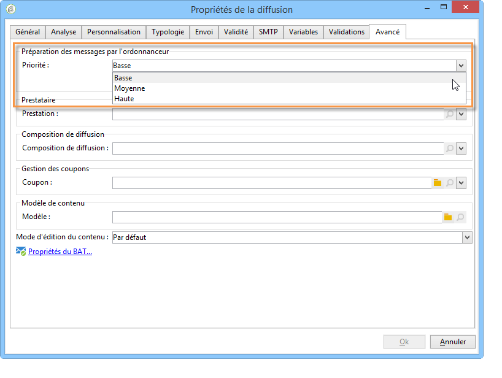
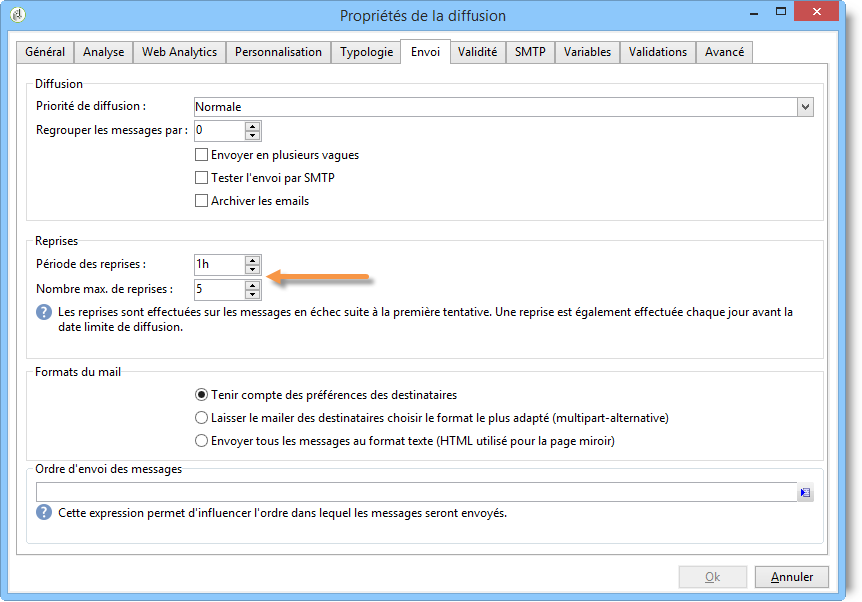
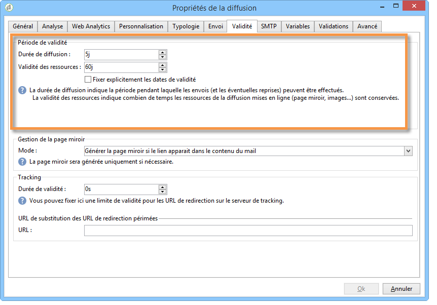

# Paramètres de diffusion {#about-delivery-settings}

Les paramètres suivants sont propres à Campaign Classic. Pour les autres paramètres de diffusion, consultez la [documentation de Campaign v8](https://experienceleague.adobe.com/docs/campaign/campaign-v8/send/gs-message.html?lang=fr){target="_blank"}.

## Analyse des diffusions {#delivery-analysis}

### Améliorer les performances des analyses de diffusions {#improving-delivery-analysis}

Pour accélérer la préparation de la diffusion, vous pouvez cocher l’option **[!UICONTROL Préparer les fragments de diffusion dans la base de données]** avant de lancer l’analyse.

Lorsque cette option est activée, la préparation de la diffusion est effectuée directement dans la base de données, ce qui peut accélérer considérablement l’analyse.

Actuellement, cette option n’est disponible que si les conditions suivantes sont remplies :

* La diffusion doit être un email. Les autres canaux ne sont pas pris en charge pour l’instant.
* Vous ne devez pas utiliser de routage de mid-sourcing ou externe. Seul le type de routage de diffusion en masse est possible. Vous pouvez vérifier le routage utilisé dans l’onglet **[!UICONTROL Général]** des **[!UICONTROL Propriétés de la diffusion]**.
* Vous ne pouvez pas cibler une population provenant d’un fichier externe. Pour une diffusion unique, cliquez sur le lien **[!UICONTROL À]** dans les **[!UICONTROL Paramètres de l’e-mail]** et vérifiez que l’option **[!UICONTROL Définie depuis la base de données]** est sélectionnée. Pour une diffusion utilisée dans un workflow, vérifiez que les destinataires sont **[!UICONTROL Spécifiés par le ou les événements entrants]** dans l’onglet **[!UICONTROL Diffusion]**.
* Vous devez utiliser une base de données PostgreSQL.

### Configurer la priorité d’analyse {#analysis-priority-}

Lorsque votre diffusion fait partie d&#39;une campagne, l&#39;onglet **[!UICONTROL Avancé]** propose une option supplémentaire : celle-ci vous permet d&#39;organiser l&#39;ordre de traitement des diffusions d&#39;une même campagne.

Avant envoi, chaque diffusion est analysée. La durée d&#39;analyse dépend de la taille du fichier d&#39;extraction de la diffusion. Plus sa taille est importante, plus l&#39;analyse est longue, ce qui met en attente les diffusions suivantes.

Les options de la section **[!UICONTROL Préparation des messages par l’ordonnanceur]** vous permettent de prioriser l’analyse des diffusions d’un workflow de campagne.

Si une diffusion est trop volumineuse, il est préférable de lui administrer une priorité basse afin de ne pas ralentir l’analyse des autres diffusions du workflow.

>[!NOTE]
>
>Pour vous assurer que l&#39;analyse des diffusions les plus volumineuses ne freine pas le déroulement de vos workflows, il vous est possible de différer leur exécution en cochant la case **[!UICONTROL Différer l&#39;exécution vers une plage horaire de faible activité]**.

## Envoi de la diffusion {#delivery-sending}

### Configuration des reprises {#configuring-retries}

Les messages temporairement non diffusés en raison d&#39;une erreur **Soft** ou **Ignoré** sont soumis à une nouvelle reprise automatique. Les types et les raisons d&#39;échec de diffusion sont présentés dans cette [section](understanding-delivery-failures.md#delivery-failure-types-and-reasons).

>[!IMPORTANT]
>
>Pour les installations hébergées ou hybrides, si vous avez effectué une mise à niveau vers le [MTA amélioré](sending-with-enhanced-mta.md), les paramètres de reprise de la diffusion ne sont plus utilisés par Campaign. Les reprises des rebonds temporaires et l’intervalle qui les sépare sont déterminés par le MTA amélioré en fonction du type et de la gravité des réponses des rebonds provenant du domaine de messagerie du message.

Pour les installations on-premise et les installations hébergées/hybrides utilisant l’ancien MTA de Campaign, la section centrale de l’onglet **[!UICONTROL Diffusion]** pour les paramètres de diffusion indique le nombre de reprises à effectuer le lendemain de la diffusion et le délai minimal entre celles-ci.

Par défaut, cinq reprises sont planifiées le premier jour de l’envoi, avec un intervalle minimum d’une heure, réparties sur les 24h de la journée. Les jours suivants, une reprise par jour est programmée jusquʼà la date limite de la diffusion, définie dans lʼonglet **[!UICONTROL Validité]**. Consultez la section [Définition de la période de validité](#defining-validity-period).

### Définition de la période de validité {#defining-validity-period}

Une fois la diffusion lancée, les messages (et les éventuelles reprises) peuvent être envoyés jusqu&#39;à la limite de la diffusion. Elle est indiquée dans les propriétés de la diffusion, à partir de l&#39;onglet **[!UICONTROL Validité]**.

* Le champ **[!UICONTROL Durée de diffusion]** permet de saisir la limite pour des reprises globales de diffusion. Concrètement, Adobe Campaign diffuse les messages à partir de la date de lancement. Puis, pour les messages en erreur uniquement, des reprises régulières et paramétrables sont effectuées tant que la limite de diffusion n’est pas atteinte.

  Vous pouvez également choisir de spécifier des dates. Pour ce faire, sélectionnez **[!UICONTROL Fixer explicitement les dates de validité]**. Dans ce cas, les dates limites de diffusion et de validité permettent également de définir l’heure. L’heure actuelle est utilisée par défaut, mais vous pouvez la modifier directement dans le champ de saisie.

  >[!IMPORTANT]
  >
  >Pour les installations hébergées ou hybrides, si vous avez effectué une mise à niveau vers le [MTA amélioré](sending-with-enhanced-mta.md), le paramètre **[!UICONTROL Durée de diffusion]** des diffusions Campaign ne sera utilisé que s’il est défini sur **3,5 jours ou moins**. Si vous définissez une valeur supérieure à 3,5 jours, elle ne sera pas prise en compte.

* **Limite de validité des ressources** : le champ **[!UICONTROL Limite de validité]** est utilisé pour les ressources téléchargées, principalement pour la page miroir et les images. Les ressources de cette page ont une durée de validité limitée (afin d&#39;économiser de l&#39;espace disque).

  Dans ce champ, les valeurs peuvent être exprimées dans les unités listées dans [cette section](../../platform/using/adobe-campaign-workspace.md#default-units).
