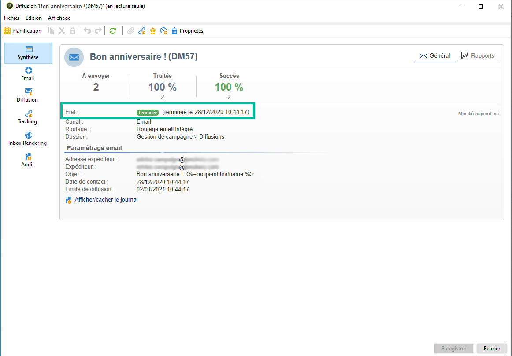

# Statuts de diffusion {#delivery-statuses}

<!--ajouter intro 

ajouter screenshot -->

Une fois qu’une diffusion a été envoyée, le tableau de bord de diffusion affiche un état qui vous permet de vérifier si l’envoi a réussi. Les états possibles sont détaillés dans la section ci-dessous.



Pour plus d&#39;informations sur les différents échecs de diffusion que vous pouvez rencontrer et sur la façon de les résoudre, consultez [cette page](../../delivery/using/understanding-delivery-failures.md).

**Rubriques connexes :**

* [Tableau de bord de la diffusion](../../delivery/using/delivery-dashboard.md)
* [Résolution des problèmes liés aux diffusions](../../delivery/using/delivery-troubleshooting.md)
* [À propos de la délivrabilité](../../delivery/using/about-deliverability.md)

## Liste des états de diffusion {#list-delivery-statuses}

<table> 
 <thead> 
  <tr> 
   <th> Status<br /> </th> 
   <th> Définition et solution<br /> </th> 
  </tr> 
 </thead> 
 <tbody> 
  <tr> 
   <td> Envoyés<br /> </td> 
   <td> La diffusion a été correctement transmise au fournisseur de messagerie (mais le destinataire ne l'a pas nécessairement reçu).<br /> </td> 
  </tr> 
  <tr> 
   <td> Ignoré<br /> </td> 
   <td> La diffusion n’a pas été envoyée au destinataire en raison d’une erreur liée à son adresse. Elle était soit sur liste bloquée, soit mise en quarantaine, soit non fournie, ou il s'agissait d'un doublon. <br /> </td> 
  </tr> 
  <tr> 
   <td> En échec<br /> </td> 
   <td> La diffusion n'a pas pu atteindre le destinataire en raison d'une adresse invalide ou d'une boîte de réception pleine par exemple. La raison peut être également un problème lié aux blocs de personnalisation. Ils peuvent générer des erreurs lorsque les schémas ne correspondent pas au mapping de diffusion. Voir <a href="../../delivery/using/understanding-delivery-failures.md" target="_blank">Comprendre les échecs de diffusion</a><br /> </td> 
  </tr>
  <tr> 
   <td> En attente<br /> </td> 
   <td> La diffusion est prête à être envoyée. Elle sera traitée par le serveur de diffusion (MTA). Voir la section <a href="#pending-status" target="_blank">Statut En attente</a>.<br /> </td> 
  </tr> 
  <tr> 
   <td> Non applicable<br /> </td> 
   <td> La diffusion a été prise en compte par le serveur (MTA), mais ce dernier ne l'a pas traitée.<br /> </td> 
  </tr>  
  <tr> 
   <td> Diffusion annulée<br /> </td> 
   <td> La diffusion a été annulée par un opérateur.<br /> </td> 
  </tr> 
  <tr> 
   <td> Pris en compte par le fournisseur de services<br /> </td> 
   <td> Le fournisseur de services SMS a reçu la diffusion.<br /> </td> 
  </tr> 
  <tr> 
   <td> Reçu sur le mobile<br /> </td> 
   <td> Le destinataire a reçu le SMS sur son appareil mobile.<br /> </td> 
  </tr>
  <tr> 
   <td> Transmis au prestataire<br /> </td> 
   <td> La diffusion a été envoyée au fournisseur de services SMS qui ne l'a pas encore reçue.<br />
   </td> 
  </tr> 
  <tr> 
   <td> Préparé<br /> </td> 
   <td> Statut intermédiaire utilisé uniquement pour les connecteurs externes tels que le canal mobile. Il succède à l'état 'En attente' et c'est le connecteur externe qui déterminera le statut suivant.<br /> </td> 
  </tr> 
 </tbody> 
</table>

Pour apprendre à optimiser la délivrabilité de vos emails Adobe Campaign, consultez le [guide de bonnes pratiques de délivrabilité](../../delivery/using/deliverability-key-points.md) d&#39;Adobe Campaign ainsi que [cette page](../../delivery/using/about-deliverability.md).

## Statut En attente {#pending-status}

Après avoir validé votre diffusion, vous pouvez constater que son statut est **[!UICONTROL En attente]**.Ce statut signifie que le processus d&#39;exécution attend la disponibilité de certaines ressources.

Le statut **[!UICONTROL En attente]** peut d&#39;abord signifier que votre diffusion a été planifiée et qu&#39;elle est en attente jusqu&#39;à la date spécifiée. Voir à ce sujet la section [Planifier la diffusion](../../delivery/using/steps-sending-the-delivery.md#scheduling-the-delivery-sending).

Si votre diffusion n&#39;est pas envoyée et reste dans un état **[!UICONTROL En attente]**, la raison peut en être la suivante :

* Le Message Transfert Agent (MTA) qui exécute les modules et les processus sur le serveur de diffusion et qui gère l&#39;envoi des emails peut ne pas avoir été lancé ou doit être redémarré.

   Pour le vérifier, puis au besoin le lancer, les étapes sont les suivantes :

   >[!NOTE]
   >
   >Cette opération peut être effectuée avec un modèle d’hébergement **sur site** ou **hybride** ayant accès au serveur Campaign (voir [modèles d’hébergement](../../installation/using/hosting-models.md)).

   1. Vérifiez que vos modules `mta@<instance>` sont bien lancés sur vos serveurs MTA.

      ```
      nlserver pdump
      HH:MM:SS > Application server for Adobe Campaign Classic (X.Y.Z YY.R build nnnn@SHA1) of DD/MM/YYYY
      [...]
      mta@<INSTANCENAME> (9268) - 23.0 Mb
      [...]
      ```

   1. Si le MTA n&#39;est pas listé, démarrez-le à l&#39;aide de la commande suivante :

      ```
      nlserver start mta@<INSTANCENAME>
      ```

      >[!NOTE]
      >
      >Remplacez `<INSTANCENAME>` par le nom de votre instance (production, développement, etc.). Le nom de l&#39;instance est identifié via les fichiers de configuration : `[path of application]nl6/conf/config-<INSTANCENAME>.xml`

* La diffusion peut utiliser une affinité qui n&#39;a pas été configurée sur le serveur d&#39;envoi.

   Dans ce cas, vérifiez la configuration de la gestion du trafic (affinité IP) et utilisez le champ **[!UICONTROL Gestion des affinités avec les adresses IP]** pour lier les diffusions au MTA qui gère l&#39;affinité. Voir à ce propos [cette section](../../installation/using/configuring-campaign-server.md#personalizing-delivery-parameters).

* Lorsque trop de campagnes sont en cours d’exécution, l’état de la diffusion reste &quot;En attente&quot;.

   La limite des campagnes simultanées est définie dans l&#39;option **[!UICONTROL NmsOperation_LimitConcurrency]**. La valeur par défaut est 10.

   Pour en savoir plus sur les options de [cette page](../../installation/using/configuring-campaign-options.md).


**Rubriques connexes :**

* [Logs et historique de la diffusion](#delivery-logs-and-history)
* [Comprendre les diffusions en échec](../../delivery/using/understanding-delivery-failures.md)
* [Types de diffusion en échec et raisons](../../delivery/using/understanding-delivery-failures.md#delivery-failure-types-and-reasons)
