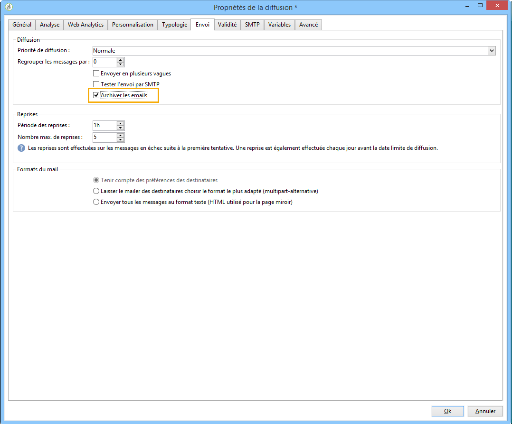
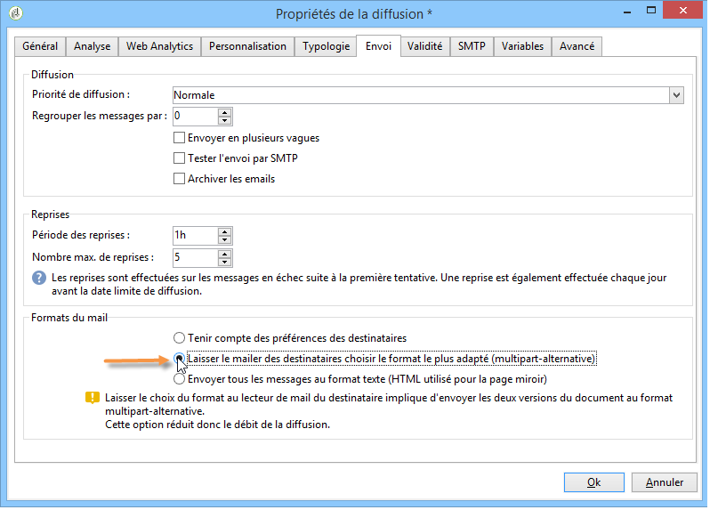
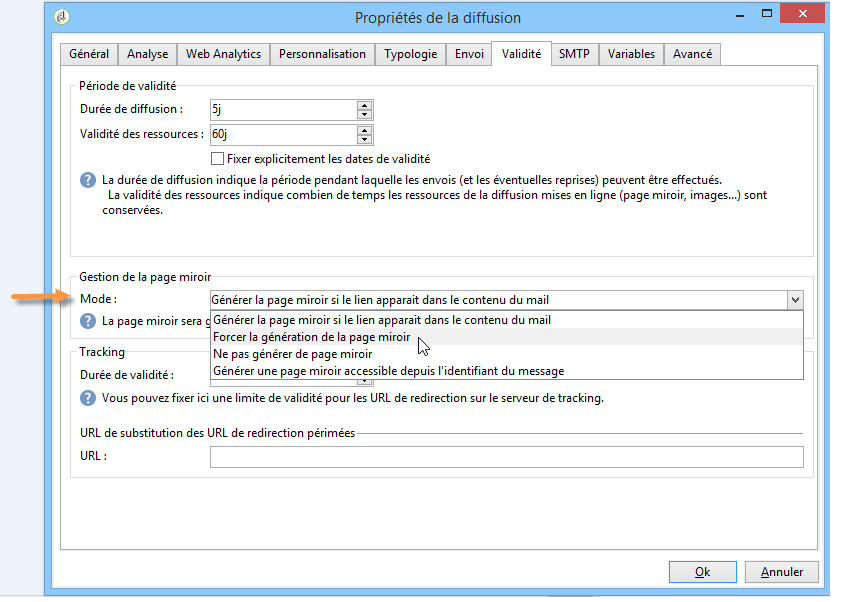
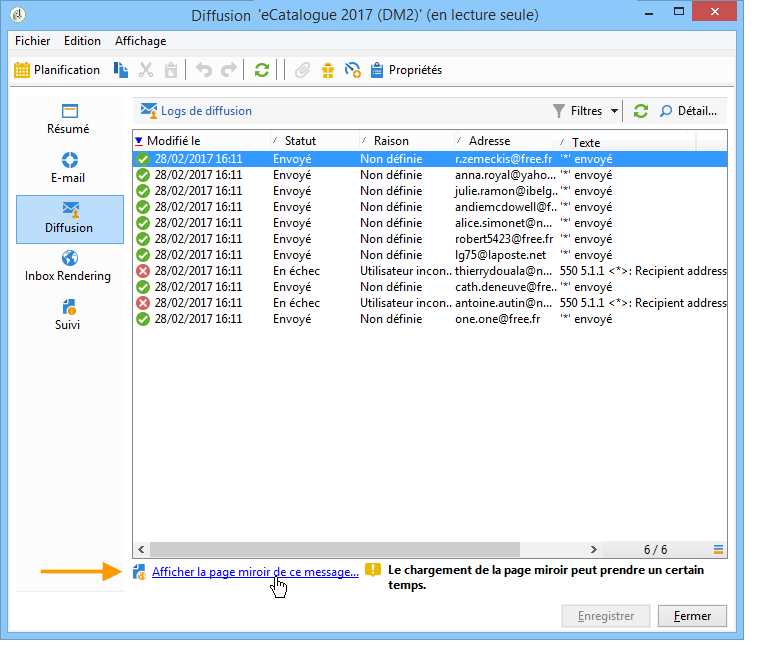
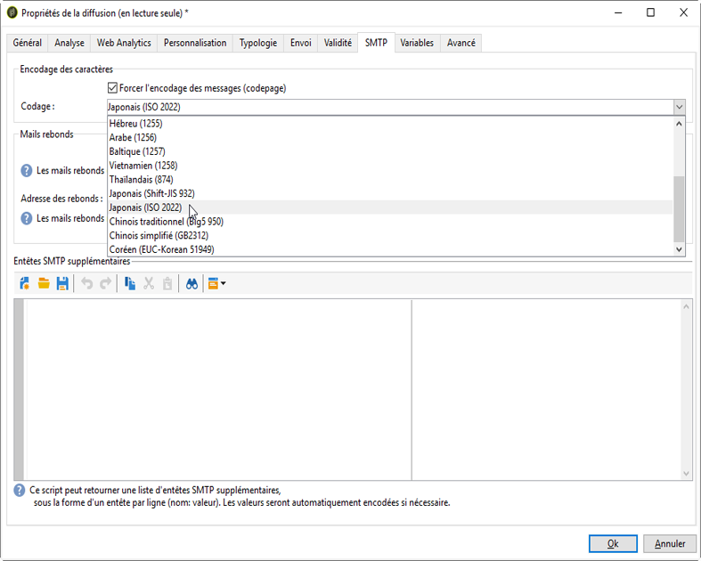
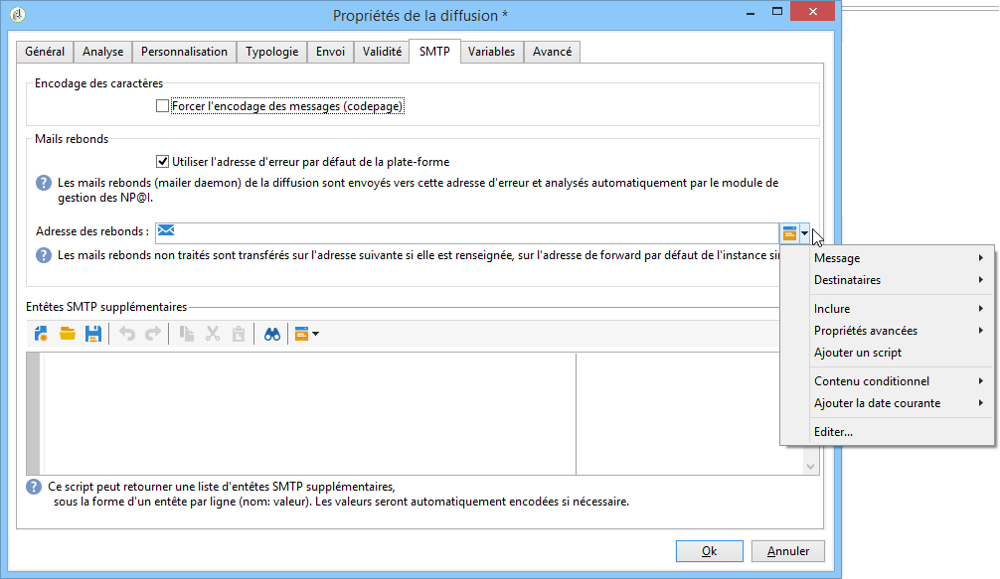

# Paramètres de l’e-mail {#email-parameters}

Cette section présente les options et paramètres spécifiques à la diffusion par email.

## E-mail Cci {#email-bcc}

Adobe Campaign permet de stocker les emails sur un système externe à l&#39;aide de l&#39;option BCC en ajoutant une adresse email en &quot;copie cachée&quot; (BCC en anglais) à la cible des messages.

Une fois l&#39;option activée, une copie exacte de tous les messages envoyés sera conservée pour cette diffusion.

Pour plus d&#39;informations sur les bonnes pratiques et la configuration de la fonctionnalité Email Cci, consultez [cette section](../../installation/using/email-archiving.md).

>[!NOTE]
>
>Email Cci est une fonctionnalité facultative. Vérifiez votre contrat de licence et contactez votre chargé de compte pour l&#39;activer.

Lors de la création d&#39;une diffusion ou d&#39;un modèle de diffusion, la fonctionnalité Email Cci n&#39;est pas activée par défaut. Vous devez l&#39;activer manuellement au niveau de la diffusion email ou du modèle de diffusion.

>[!NOTE]
>
>Si vous utilisez Email Cci avec le MTA amélioré, cette option est automatiquement activée pour toutes les diffusions.

Pour activer la fonctionnalité Email Cci pour un modèle de diffusion email, procédez comme suit :

1. Accédez à **[!UICONTROL Gestion de campagne]** > **[!UICONTROL Diffusions]** ou **[!UICONTROL Ressources]** > **[!UICONTROL Modèles]** > **[!UICONTROL Modèles de diffusion]**.
1. Sélectionnez la diffusion de votre choix ou dupliquez le modèle d&#39;usine **Diffusion email**, puis sélectionnez le modèle dupliqué.
1. Cliquez sur le bouton **Propriétés**.
1. Sélectionnez l&#39;onglet **[!UICONTROL Diffusion]**.
1. Cochez l&#39;option **Email Cci**. Une copie de tous les messages envoyés pour chaque diffusion basée sur ce modèle sera envoyée à l&#39;adresse électronique en Cci qui a été configurée.

   

>[!NOTE]
>
>Si les emails envoyés à l&#39;adresse en Cci sont ouverts et font l&#39;objet de clics, cela sera pris en compte dans les **[!UICONTROL Ouvertures totales]** et les **[!UICONTROL Clics]** provenant de l&#39;analyse d&#39;envoi, ce qui pourrait entraîner des erreurs de calcul.

## Sélection des formats du message {#selecting-message-formats}

Vous pouvez paramétrer le format des emails envoyés. Pour cela, éditez les propriétés de la diffusion et cliquez sur l&#39;onglet **[!UICONTROL Envoi]**.

Sélectionnez le format du mail dans la section inférieure de la fenêtre :

* **[!UICONTROL Tenir compte des préférences des destinataires]** (mode par défaut)

  Le format du message est défini en fonction des informations enregistrées dans le profil du destinataire et stockées par défaut dans le champ **[!UICONTROL Format des emails]** (@emailFormat). Si un destinataire souhaite recevoir les messages dans un format particulier, ce format lui est envoyé. Si ce champ n&#39;est pas renseigné, le message sera envoyé en multipart-alternative (voir ci-dessous).

* **[!UICONTROL Laisser le mailer des destinataires choisir le format le plus adapté]**

  Le message contient les deux formats : texte et HTML. Le format affiché lors de la réception dépend de la configuration du logiciel de messagerie du destinataire (multipart-alternative).

  >[!IMPORTANT]
  >
  >Cette option inclut les deux versions du document et, par conséquent, impacte le débit de diffusion des messages, car le poids du message est plus élevé.

* **[!UICONTROL Envoyer tous les messages au format texte]**

  Le message est envoyé au format texte. Le format HTML ne sera pas envoyé mais uniquement utilisé pour la page miroir, lorsque le destinataire clique sur le lien dans le message.

>[!NOTE]
>
>Pour en savoir plus sur la définition d&#39;email, consultez [cette section](defining-the-email-content.md).

## Générer la page miroir {#generating-mirror-page}

La page miroir est une page HTML accessible en ligne via un navigateur web et dont le contenu est identique à celui de l&#39;email.

Par défaut, la page miroir est générée si le lien est inséré dans le contenu de l’email. Pour plus d’informations sur l’insertion de blocs de personnalisation, consultez la section [Blocs de personnalisation](personalization-blocks.md).

Dans les propriétés de diffusion, le champ **[!UICONTROL Mode]** de l&#39;onglet **[!UICONTROL Validité]** vous permet de modifier le mode de génération de la page.

>[!IMPORTANT]
>
>Un contenu HTML doit avoir été défini pour la diffusion pour que la page miroir soit créée.

Outre le mode par défaut, les options disponibles sont les suivantes :

* **[!UICONTROL Forcer la génération de la page miroir]** : même si aucun lien vers la page miroir n&#39;est inséré dans la diffusion, la page miroir sera créée.
* **[!UICONTROL Ne pas générer de page miroir]** : aucune page miroir n&#39;est générée, même si le lien est présent dans la diffusion.
* **[!UICONTROL Générer une page miroir accessible depuis l&#39;identifiant du message]** : cette option permet d&#39;accéder au contenu de la page miroir, avec les informations de personnalisation, dans la fenêtre des logs de diffusion. Pour cela, une fois la diffusion terminée, cliquez sur l&#39;onglet **[!UICONTROL Diffusion]** et sélectionnez la ligne du destinataire dont vous souhaitez visualiser la page miroir. Cliquez ensuite sur le lien **[!UICONTROL Afficher la page miroir de ce message...]**.

  

## Encodage des caractères {#character-encoding}

Dans l’onglet **[!UICONTROL SMTP]** des paramètres de diffusion, la section **[!UICONTROL Encodage des caractères]** vous permet de définir un encodage spécifique.

L’encodage par défaut est UTF-8. Si certains fournisseurs de messagerie de vos destinataires ne prennent pas en charge l’encodage UTF-8 standard, vous pouvez définir un encodage spécifique pour afficher correctement les caractères spéciaux sur les emails de vos destinataires.

Par exemple, vous souhaitez envoyer un email contenant des caractères japonais. Pour vous assurer que tous les caractères s’afficheront correctement à vos destinataires au Japon, vous pouvez utiliser un encodage prenant en charge les caractères japonais plutôt que le format UTF-8 standard.

Pour ce faire, sélectionnez l’option **[!UICONTROL Forcer l&#39;encodage des messages (codepage)]** dans la section **[!UICONTROL Encodage des caractères]**, puis choisissez un encodage dans la liste déroulante qui s’affiche.

## Gérer les mails rebonds {#managing-bounce-emails}

L&#39;onglet **[!UICONTROL SMTP]** des paramètres de la diffusion permet de paramétrer la gestion des mails rebonds.

Par défaut, les e-mails rebonds sont réceptionnés dans la [boîte d&#39;erreur par défaut de la plateforme](../../installation/using/deploying-an-instance.md#parameters-for-delivered-emails-parameters-for-delivered-emails). Vous pouvez toutefois définir une adresse d’erreur spécifique pour une diffusion.

Vous pouvez également définir une adresse spécifique depuis cet écran afin d&#39;investiguer sur les causes des mails rebonds n&#39;ayant pas pu être automatiquement qualifiés par l&#39;application. Pour chacun de ces champs, l&#39;icône d&#39;**ajout de champs personnalisés** permet d&#39;ajouter des paramètres de personnalisation.

Pour plus d’informations sur la gestion des mails rebonds, consultez [cette section](understanding-delivery-failures.md#bounce-mail-management).

## Ajouter des en-têtes SMTP {#adding-smtp-headers}

Vous pouvez ajouter des en-têtes SMTP supplémentaires à vos diffusions. Pour cela, utilisez la section correspondante dans l&#39;onglet **[!UICONTROL SMTP]** des propriétés de la diffusion.

Le script saisi dans cette fenêtre doit référencer un en-tête par ligne, sous la forme **nom: valeur**.

Les valeurs sont automatiquement encodées, si nécessaire.

>[!IMPORTANT]
>
>L&#39;ajout d&#39;un script pour l&#39;insertion d&#39;en-têtes SMTP supplémentaires est réservé aux utilisateurs expérimentés.
>
>La syntaxe de ce script doit être strictement conforme aux exigences de ce type de contenu : aucun espace superflu, aucune ligne vide, etc.
