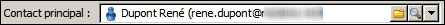
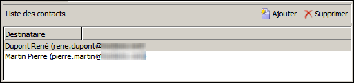

# Enrichir le contenu{#enriching-content}

Les agrégateurs permettent d&#39;enrichir le contenu avec des données externes. Ces données proviennent de requêtes génériques ou de tables liées.

## Requêtes génériques {#generic-queries}

Les requêtes sont paramétrées à partir du modèle de publication dans l&#39;onglet **[!UICONTROL Agrégateur]**.

Les données récupérées vont enrichir le document XML en sortie à partir de son élément principal.

Exemple de retour d&#39;une requête sur le schéma des destinataires (**nms:recipient**) :

```
<book name="Content Management">
  ...
  <collection-recipient>
    <recipient lastName="Doe" firstName="John" email="john.doe@aolf.com">
    ...
  </collection-recipient>
</book>
```

L’élément **`<collection-recipient>`** représente l’élément d’entrée du document obtenu à partir d’une requête. Les données récupérées sont renvoyées sous cet élément ; dans notre exemple, une liste de destinataires.

### Ajouter une requête {#adding-a-query}

Un assistant permet de modifier les paramètres de la requête.

1. La première page permet de spécifier le libellé et le schéma contenant les données à récupérer.

   

   >[!NOTE]
   >
   >Le champ d&#39;édition **Chemin** permet de renommer l&#39;élément de sortie de la requête.

1. La page suivante permet de sélectionner les données à récupérer.

   

1. La page suivante définit la condition de filtrage.

   

1. La dernière page lance une prévisualisation des données retournées par la requête.

   

## Tables liées {#linked-tables}

Les liens permettent de récupérer des données externes liées au contenu.

Il existe deux types de données liées :

* Liens de contenu : c&#39;est le mode natif de la gestion de contenu. Le contenu du lien est automatiquement intégré dans le document XML de sortie.
* Liens vers des tables externes : ils permettent l&#39;accès à toutes les autres tables de la base avec la contrainte de récupérer les données du lien sélectionné avec un agrégateur.

### Liens vers un schéma contenu {#link-to-a-content-schema}

Un lien de contenu est déclaré dans le schéma de données de la façon suivante :

```
<element expandSchemaTarget="cus:chapter" label="Main chapter" name="mainChapter" type="string"/>
```

La définition du lien est renseignée sur un **`<element>`** de type **string**. L’attribut **expandSchemaTarget** référence le schéma cible (&quot;cus:chapter&quot; dans notre exemple). Le schéma référencé doit être un schéma de contenu.

Le contenu de l’élément ciblé vient enrichir l’élément lien, soit l’élément **`<chapter>`** dans notre exemple de schéma :

```
<mainChapter computeString="Introduction" id="7011" title="Introduction" xtkschema="cus:chapter">    
  <page>Introduction to input <STRONG>forms</STRONG>.</page>
</mainChapter>
```

>[!NOTE]
>
>La **Compute string** du lien est présente à partir de l&#39;attribut **computeString**.

Dans le formulaire de saisie, le contrôle d&#39;édition du lien est déclaré de la façon suivante :

```
<input type="articleEdit" xpath="mainChapter"/>
```


L&#39;icône **[!UICONTROL Loupe]** permet de lancer le formulaire d&#39;édition de l&#39;élément lié.

#### Collection de liens {#link-collection}

Pour renseigner une collection de liens, vous devez ajouter l&#39;attribut **unbound=&quot;true&quot;** à la définition de l&#39;élément lien dans le schéma de données :

```
<element expandSchemaTarget="cus:chapter" label="List of chapters" name="chapter"  ordered="true" unbound="true"/>
```

Le contenu de l&#39;élément ciblé vient enrichir chaque élément de collection :

```
<chapter computeString="Introduction" id="7011" title="Introduction" xtkschema="cus:chapter">    
  <page>Introduction to input <STRONG>forms</STRONG>.</page>
</chapter>
```

Dans le formulaire de saisie, le contrôle liste est déclaré de la façon suivante :

```
<input editable="false" nolabel="true" toolbarCaption="List of chapters" type="articleList" xpath="chapter" zoom="true"/>
```


Une colonne par défaut est affichée afin de visualiser la **Compute string** des éléments ciblés.

### Liens vers de tables externes {#links-to-external-tables}

Un lien sur une table externe est déclaré dans le schéma de données de la façon suivante :

```
<element label="Main contact" name="mainContact" target="nms:recipient" type="link"/>
```

La définition du lien est renseignée sur un **`<element>`** de type **link**. L’attribut **target** référence le schéma cible (&quot;nms:recipient&quot; dans notre exemple).

Par convention, les liens doivent être déclarés à partir de l&#39;élément principal du schéma de données.

La **Compute string** et la clé de l’élément ciblé vont enrichir les attributs **`<name>-id`** et **`<name>-cs`** de l’élément principal.

Dans notre exemple, le lien est renseigné dans le schéma &quot;cus:livre&quot;, le contenu des données du lien est présent dans les attributs &quot;mainContact-id&quot; et &quot;mainContact-cs&quot; :

```
<book computeString="Content management" date="2006/06/08" id="6106" language="en" mainContact-cs="John Doe (john.doe@adobe.com)" mainContact-id="3012" name="Content management" xtkschema="cus:book">
```

Le contrôle d&#39;édition du lien est déclaré de la façon suivante :

```
<input xpath="mainContact"/>
```



Il est possible de restreindre le choix des éléments de la cible en ajoutant l’élément **`<sysfilter>`** à partir de la définition du lien dans le formulaire de saisie :

```
<input xpath="mainContact">
  <!-- Filter the selection of the link on the Adobe domain -->
  <sysFilter>
    <condition expr="@domain =  'adobe.com '"/>
  </sysFilter>
</input>
```

>[!NOTE]
>
>La restriction est aussi applicable sur les liens de contenu.

#### Collection de liens {#link-collection-1}

La définition de la collection est identique à celle d&#39;une liste sur des éléments de collection :

```
<element label="List of contacts" name="contact" unbound="true">
  <element label="Recipient" name="recipient" target="nms:recipient" type="link"/>
</element>
```

Dans le formulaire de saisie, le contrôle liste est déclaré de la façon suivante :

```
<input nolabel="true" toolbarCaption="List of contacts" type="list" xpath="contact">
  <input xpath="recipient"/>
</input>
```



>[!NOTE]
>
>La liste est éditable et permet de sélectionner le lien à partir d&#39;un contrôle de type &quot;link&quot; présenté ci-dessus.

Le contenu de l&#39;élément ciblé vient enrichir chaque élément de collection dans le document de sortie :

```
<contact id="11504978621" recipient-cs="Doe John (john.doe@adobe.com)" recipient-id="3012"/>
<contact id="11504982510" recipient-cs="Martinez Peter (peter.martinez@adobe.com)" recipient-id="3013"/>
```

#### Agrégation des liens {#link-aggregation}

Le contenu de chaque lien référencé est limité à la clé interne et à la **Compute string** de l&#39;élément ciblé.

Un script JavaScript est utilisé pour enrichir le contenu des liens à partir de requêtes SOAP.

**Exemple** : Ajouter le nom du destinataire sur le lien &quot;mainContact&quot; et les liens de collection &quot;contact&quot; :

```
// Update <mainContact> link
var mainContactId = content.@['mainContact-id']
var query = xtk.queryDef.create(
    <queryDef schema="nms:recipient" operation="get">
      <select>
        <node expr="@lastName"/>
      </select>
      <where>
        <condition expr={"@id="+mainContactId}/>
      </where>
    </queryDef>)

var recipient = query.ExecuteQuery()
content.mainContact.@lastName = recipient.@lastName

// Update <contact> link collection
for each(var contact in content.contact)
{
  var contactId = contact.@['recipient-id']
  var query = xtk.queryDef.create(
    <queryDef schema="nms:recipient" operation="get">
      <select>
        <node expr="@lastName"/>
      </select>
      <where>
        <condition expr={"@id="+contactId}/>
      </where>
    </queryDef>
  )
  
  var recipient = query.ExecuteQuery()
  contact.@lastName = recipient.@lastName
}
```

Le résultat obtenu après exécution du script :

```
<mainContact lastName="Doe"/>

<contact id="11504978621" lastName="Doe" recipient-cs="Doe John (john.doe@adobe.com)" recipient-id="3012"/>  
<contact id="11504982510" lastName="Martinez" recipient-cs="Martinez Peter (peter.martinez@adobe.com)" recipient-id="3013"/> 
```

Le contenu du code JavaScript est ajouté à partir du dossier **[!UICONTROL Administration > Paramétrage > Gestion de contenu > Codes JavaScript]** et doit être renseigné dans le modèle de publication pour chaque transformation.


