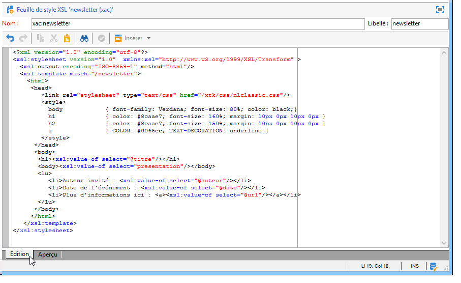
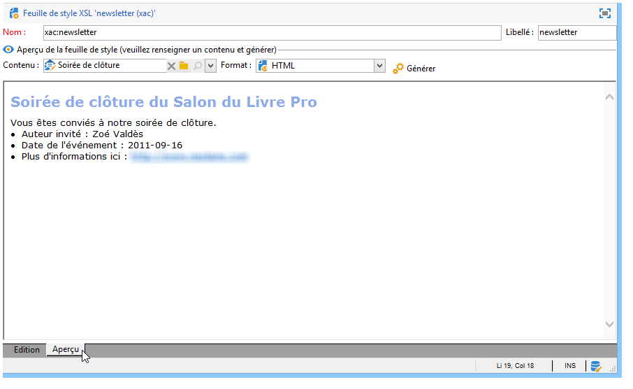

# Mise en forme{#formatting}

## Templates JavaScript {#javascript-templates}

Un template JavaScript est un document HTML ou texte incluant du code JavaScript. Il est construit de la même manière qu&#39;un contenu email dans une action de diffusion.

### Identification d&#39;un template JavaScript {#identification-of-a-javascript-template}

Un template JavaScript est identifié par son nom et son espace de noms de la même manière que les schémas et les formulaires. Il est cependant préconisé de compléter le nom du template avec l&#39;option **.js**.

### Structure d&#39;un template JavaScript {#structure-of-a-javascript-template}

Exemple de template JavaScript de mise en forme HTML se basant sur le schéma &quot;cus:livre&quot; :

```
<html>
  <body>
    <!-- Title of book -->
    <h1><%= content.@name %></h1>
    <ul>
      <% for each(var chapter in content.chapter) { %>
        <li><%= chapter.@name %></li>
      <% }%>
    </ul>
  </body>
</html>
```

Les différentes directives JavaScript se présentent sous la forme suivante :

* Champs de fusion : affiche le contenu des données avec la syntaxe **`<%= <source> %>`**, où `<source>` correspond au champ source des données à afficher.
* blocs d&#39;instructions : exécute une série d&#39;instructions JavaScript incluses entre les balises &lt;% et %>.

L&#39;objet **content** représente l&#39;élément principal du document XML en entrée.

Dans notre exemple, la ligne suivante affiche le contenu du nom du livre :

```
<h1><%= content.@name %></h1>
```

Le code suivant itère sur l’élément de collection `<chapter>` :

```
<% for each(var chapter in content.chapter) { %>
  <li><%= chapter.@name %></li>
<% }%>
```

Les attributs et éléments du contenu sont représentés comme des objets JavaScript et respectent la structure du document source.

**Exemple**:

* **content.@name** : récupère la valeur de l’attribut « name » de l’élément principal
* **content.@`['name']`** : identique au contenu **.syntaxe @name**
* **content.chapter.length**`<chapter` : retourne le nombre d’éléments sur l’élément de collection
* **content.chapter`[0]`.@name** : récupère le nom du premier élément `<chapter>`
* **chapter.name()** : retourne le nom de l’élément `<chapter>`
* **chapter.parent().name()** : retourne le nom de l’élément parent de `<chapter>`

>[!CAUTION]
>
>Le caractère « - » étant réservé dans le langage JavaScript, la récupération de la valeur de tout attribut ou élément contenant ce caractère devra passer par la syntaxe `['<field>']`.
>
>Par exemple: `content.@['offer-id']`.

Toute la puissance d&#39;un langage de programmation (variables, boucles, tests conditionnels, fonctions, etc.) est disponible pour construire le document en sortie. Les API SOAP sont accessibles pour enrichir le document de sortie.

Exemples:

* Test conditionnel :

  ```
  <% if (content.@number == 1 || content.@language == 'en') { %>
  <!-- Content to be displayed if test is true--> 
  <% } %>
  ```

* Appel de fonction :

  ```
  <!-- Displays a horizontal bar -->
  ;<% function DisplayHorizontalBar() { %>
    <hr/>
  <% } %> 
  
  <!-- The same function in a block  -->
  <% 
  function DisplayHorizontalBar2()
  {
    document.write('<hr/>');
  }
  %> 
  
  <!-- Returns the value in uppercase -->
  <% 
  function formatName(value)
  { 
    return value.toUpperCase(); 
  }
  %>
  
  <!-- Call functions -->
  <%= DisplayHorizontalBar1() %>
  <%= DisplayHorizontalBar2() %>
  <%= formatName(content.@name) %>
  ```

* Déclarations et appel de variables :

  ```
  <%  var counter = 0; %>
  
  <%= counter += 10 %>
  ```

* Récupération et affichage du nom d&#39;un destinataire avec les méthodes statiques :

  ```
  <% var recipient = nms.recipient.get(1246); %>
  <%= recipient.lastName %>
  ```

* Récupération et affichage du nom d&#39;un destinataire avec les méthodes non statiques :

  ```
  <% var query = xtk.queryDef.create(
    <queryDef schema="nms:recipient" operation="get">
      <select>
        <node expr="@lastName"/>
      </select>
      <where>
        <condition expr="@id=1246"/>
      </where>
    </queryDef>);
  
    var recipient = query.ExecuteQuery();
  %>
  
  <%= recipient.@lastName %>
  ```

### Inclusion de template JavaScript {#including-a-javascript-template}

Vous pouvez constituer une bibliothèque de fonctions ou de variables pour une utilisation ultérieure. Pour cela, importez le template JavaScript avec le **eval** de la fonction Vous pouvez ainsi enrichir les contextes avec des fonctions supplémentaires déclarées dans d&#39;autres modèles JavaScript.

**Exemple** : import du template **common.js**.

```
<% eval(xtk.javascript.get("cus:common.js").data);  %>
```

### Edition d&#39;un template JavaScript {#editing-a-javascript-template}

La zone d&#39;édition permet de renseigner le contenu du template JavaScript :


>[!NOTE]
>
>Il est nécessaire de renseigner le schéma du modèle de données associé pour l&#39;initialisation des objets JavaScript.

Pour générer à tout moment l&#39;aperçu du document de sortie, vous devez sélectionner un contenu et le format de sortie (HTML, Texte, XML) puis cliquer sur le bouton **[!UICONTROL Générer]** :


>[!NOTE]
>
>Il n&#39;est pas nécessaire d&#39;enregistrer les modifications pour visualiser l&#39;aperçu du document de sortie.

### Exemple de réalisation et d&#39;utilisation d&#39;un template JavaScript {#example-of-how-to-create-and-use-a-javascript-template}

Vous trouverez ci-dessous le paramétrage nécessaire à l&#39;implémentation de la gestion de contenu suivante en utilisant un template Javascript :


Les étapes de réalisation de cet exemple sont les suivantes :

1. Créez le schéma suivant (ici :**neo:news**):

   ```
   <srcSchema _cs="Invitation (neo)"   entitySchema="xtk:srcSchema" img="xtk:schema.png" label="Invitation" mappingType="sql" name="news" namespace="neo" xtkschema="xtk:srcSchema">
   
     <enumeration basetype="string" default="en" name="language">
       <value label="Français" name="fr" value="fr"/>
       <value label="English" name="gb" value="gb"/>
     </enumeration>
   
     <enumeration basetype="string" name="css">
       <value label="Blue" name="bl" value="blue"/>
       <value label="Orange" name="or" value="orange"/>
     </enumeration>
   
     <element label="Intervenants" name="attendee">
       <key internal="true" name="id">
         <keyfield xpath="@id"/>
       </key>
       <attribute label="Name" name="name" type="string"/>
       <element label="Image" name="image" target="xtk:fileRes" type="link"/>
       <attribute label="Description" name="description" type="string"/>
       <attribute default="Gid()" label="Id" name="id" type="long"/>
     </element>
   
     <element label="Invitation" name="news" template="ncm:content" xmlChildren="true">
   
       <compute-string expr="@name"/>
       <attribute enum="language" label="Language" name="language" type="string"/>
       <attribute enum="css" label="Stylesheet" name="css" type="string"/>
       <attribute label="Title" name="title" type="string"/>
       <element label="Presentation" name="presentation" type="html"/>
       <attribute label="Date" name="date" type="date"/>
       <element label="Attendees list" name="attendeesList" ordered="true" ref="attendee" unbound="true"/>
   
     </element>
   </srcSchema>
   ```

1. Créez le formulaire associé (**neo:news**) de type **[!UICONTROL Gestion de contenu]** :

   ```
   <form _cs="News (neo)" entitySchema="xtk:form"  img="xtk:form.png" label="News"  name="news" namespace="neo" type="contentForm" xtkschema="xtk:form">
   
     <container type="iconbox">
       <container label="Invitation">
         <input xpath="@langue"/>
         <input xpath="@css"/>
         <input xpath="@title"/>
         <input xpath="@date"/>
         <input xpath="presentation"/>
       </container>
   
       <container label="Intervenants">
         <container toolbarCaption="Liste des intervenants" type="notebooklist" xpath="attendeesList" xpath-label="@nom">
           <container>
             <input xpath="@nom"/>
             <input img="nl:sryimage.png" newEntityFormChoice="true" xpath="image">
               <sysFilter>
                 <condition expr="@isImage = true"/>
               </sysFilter>
             </input>
             <input xpath="@description"/>
           </container>
         </container>
       </container>
     </container>
   
   </form>
   ```

1. Créez les templates JavaScript avec les contenus du message pour les formats HTML et Texte.

   * Dans notre exemple, pour le HTML :

     ```
     <html>     
       <head>         
         <title>Newsletter</title>
          <style type="text/css">
           .body {font-family:Verdana, Arial, Helvetica, sans-serif; font-size:10px; color:#514c48; margin-left: auto; margin-right: auto;}
           .body table {width:748; border: solid 1px; cellpadding:0; cellspacing:0"}
          </style>
       </head>     
       <body>
         <p><center><%= mirrorPage %></center></p>
         <center>
           <table>      
            <tr>
             <td>                                                         
                                                  
             </td>
             <td>
               <h1><%= content.@title %></h1>
             </td>
            </tr>
            <tr>
     
            <td>
             <div >                                    
               <h0><%= hello,</h0>                              
               <p><%= content.presentation %></p>                                          
     
               <h0>Useful information</h0>                              
               <p>                                  
                 When? <br/><%= formatDate(content.@date, "%2D %Bl %4Y") %> From 10 AM in your bookshop.</p><br/>                                       
               <p>                                  
                 Who? <br>Meet our favorite authors and illustrators and get a signed copy of their book.</p><br/>                                                         
               <p>                                  
                 Attendance is free but there is a limited number of seats: sign up now!</p>
           </div>
           </td>
     
             <td>                                                    
              <div style="text-align:left; width:210; height:400px; background:url([IMAGE DE FOND])">
     
                 <h0><%= participant %></h0>
                 <%
                 var i
                 var iLength = content.attendeesList.length()
                 for (i=0; i<iLength; i++)
                 { %>
                 <p>
                   <%= generateImgTag(content.attendeesList[i].@["image-id"]) %>  <%= content.attendeesList[i].@description %>
                 </p>  
                 <% }  
                 %>                              
              </div2>
             </td>
         </tr>
       </table>
     </center>
     </body>    
     </html>
     ```

   * Pour le texte :

     ```
     <%= content.@title %>
     <%= content.presentation %>
     
     *** When? On <%= formatDate(content.@date, "%2D %Bl %4Y") %> From 10 AM in your bookshop.
     
     *** Who? Come and meet our favorite authors and illustrators and get a signed copy of their books. 
     
     *** Attendance is free but there is a limited number of seats: sign up now!
     
     Guests:
     ******************
     <%
     var i
     var iLength = content.attendeesList.length()
     //for (i=(iLength-1); i>-1; i--)
     for( i=0 ; i<iLength ; i++ )
       { %>
       Description <%= i %> : <%= content.attendeesList[i].@description %>
       <% }  
     %>
     ```

1. Créez enfin le modèle de publication utilisé pour les deux formats :

   * Pour le HTML :

     

   * Pour le Texte :

     

1. Vous pouvez enfin utiliser ce modèle de contenu dans vos diffusions.

   Pour plus d’informations à ce sujet, reportez-vous à la section [Utiliser un modèle de contenu](using-a-content-template.md).

## Feuilles de style XSL {#xsl-stylesheets}

Le langage XSLT permet de transformer un document XML en un document de sortie. Selon la méthode de sortie de la feuille de style, le document résultant peut être généré en HTML, en texte brut ou en une autre arborescence XML.

Cette transformation est elle-même décrite en XML dans un document appelé feuille de style.

### Identification d&#39;une feuille de style {#identifying-a-stylesheet}

Une feuille de style est identifiée par son nom et son espace de noms, tout comme les schémas et les formulaires. Il est toutefois recommandé d’ajouter la variable **.xml** extension au nom de la feuille de style.

La clé d&#39;identification d&#39;une feuille de style est une chaîne construite avec l&#39;espace de noms et le nom séparés par le caractère &#39;:&#39; (par exemple : **cus:livre.xsl**).

### Structure d&#39;une feuille de style {#structure-of-a-stylesheet}

Exemple de feuille de style de mise en forme HTML se basant sur le schéma d&#39;exemple &quot;cus:livre&quot; :

```
<?xml version="1.0" encoding="ISO-8859-1" ?>
<xsl:stylesheet xmlns:xsl="http://www.w3.org/1999/XSL/Transform" version="1.0">
  <xsl:output encoding="ISO-8859-1" method="html"/>
  <!-- Point of entry of the stylesheet -->
  <xsl:template match="/book">
    <html>
      <body>
        <!-- Book title -->
        <h1><xsl:value-of select="@name"/></h1>
        <lu>
          <!-- List of chapters -->
          <xsl:for-each select="child::chapter">
            <li><xsl:value-of select="@name"/></li>
          </xsl:for-each>
       </lu>
      </body>
    </html>
   </xsl:template>
</xsl:stylesheet>
```

Une feuille de style est un document XML respectant les règles suivantes :

* les valeurs d&#39;attributs sont entre guillemets,
* un élément doit avoir un marqueur d&#39;ouverture et un marqueur de fermeture,
* les caractères « &lt; » ou « &amp; » doivent être remplacés par les entités **&#39;&lt;&#39;** ou **&#39;&amp;&#39;**,
* chaque élément XSL doit utiliser l&#39;espace de noms **xsl**.

Une feuille de style doit commencer par le marqueur d’élément racine XSL **`<xsl:stylesheet>`** et se terminer par le marqueur **`</xsl:stylesheet>`**. L’espace de noms XSL doit être défini dans le marqueur d’ouverture comme suit :

```
<xsl:stylesheet xmlns:xsl="http://www.w3.org/1999/XSL/Transform" version="1.0">
```

L’élément **`<xsl:output>`** spécifie le format du document généré. Spécifiez le jeu de caractères souhaité et le format de sortie.

```
<xsl:output encoding="ISO-8859-1" method="html"/>
```

Les instructions suivantes décrivent le paramétrage de la feuille de style pour la mise en forme du document de sortie.

```
<xsl:template match="/book">
  <html>
    <body>
      <!-- Book title -->
      <h1><xsl:value-of select="@name"/></h1>
      <lu>
        <!-- List of chapters -->
        <xsl:for-each select="child::chapter">
          <li><xsl:value-of select="@name"/></li>
        </xsl:for-each>
      </lu>
    </body>
  </html>
</xsl:template>
```

Par défaut, le processeur XSLT recherche l’objet **modèle** qui s’applique au noeud racine ou principal du document XML d’entrée. La construction du document de sortie commence ainsi. **modèle**.

Dans notre exemple, on génère une page HTML à partir du schéma &quot;cus:livre&quot; en affichant le nom du livre et la liste des chapitres.

>[!NOTE]
>
>Pour plus d&#39;informations sur le langage XSLT, reportez-vous à une documentation de référence.

### Afficher du HTML/XML {#displaying-html-xml}

Pour afficher un champ **html**, utilisez l’option **disable-output-escaping=&quot;yes&quot;** de la directive **`<xsl:value-of>`**. Vous évitez ainsi de remplacer les caractères par leur entité XML (par exemple &lt; par &lt;).

La directive **`<xsl:text>`** avec l’option **disable-output-escaping=&quot;yes&quot;** permet d’insérer des balises JavaScript de champs de personnalisation ou de test conditionnels.

Exemples:

* Afficher le contenu d&#39;un champ de type &quot;html&quot; :

  ```
  <xsl:value-of select="summary" disable-output-escaping="yes"/>
  ```

* Insérer le champ de personnalisation **&lt;%= recipient.email %>** :

  ```
  <xsl:text disable-output-escaping="yes"><%= recipient.email %></xsl:text>
  ```

* Ajouter le test conditionnel **&lt;% if (recipient.language == &#39;fr&#39;) `{` %>** :

  ```
  <xsl:text disable-output-escaping="yes"><% if (recipient.language == 'en') { %></xsl:text>
  ```

### Inclusion de feuilles de style {#including-stylesheets}

Il est possible de créer une bibliothèque de modèles ou de variables à partager entre plusieurs feuilles de style. Le &quot;longMonth&quot; **modèle**, présenté ci-dessus, est un exemple typique de l’avantage de placer un modèle à distance dans une feuille de style afin qu’il puisse être réutilisé ultérieurement.

La directive **`<xsl:include>`** indique le nom de la feuille de style à inclure dans le document.

**Exemple** : inclusion de la feuille de style &quot;common.xsl&quot;.

```
<? xml version="1.0" encoding="ISO-8859-1" ?>
<xsl:stylesheet xmlns:xsl="http://www.w3.org/1999/XSL/Transform" version="1.0">
  <xsl:include href="common.xsl"/> 
  <xsl:output encoding="ISO-8859-1" method="jsp" indent="yes"/>
  ...
</xsl:stylesheet>
```

>[!NOTE]
>
>Le nom de l&#39;espace de noms ne doit pas être renseigné dans la référence de la feuille de style à inclure. Par convention, cette feuille de style est créée avec l&#39;espace de noms utilisateur.

### Edition d&#39;une feuille de style {#editing-a-stylesheet}

La zone d&#39;édition permet de renseigner le contenu de la feuille de style :



Pour générer à tout moment l&#39;aperçu du document de sortie, vous devez sélectionner une instance de contenu et le format de mise en forme (HTML, Texte, XML), puis cliquer sur le bouton **[!UICONTROL Générer]** :



>[!NOTE]
>
>Il n&#39;est pas nécessaire d&#39;enregistrer les modifications de la feuille de style pour visualiser l&#39;aperçu du document de sortie.

## Gestion des images {#image-management}

### Référencement des images {#image-referencing}

Les images renseignées dans le document HTML de sortie peuvent être référencées en absolu ou en relatif.

Le référencement relatif permet de renseigner l&#39;URL du serveur contenant les images dans les options **NcmRessourcesDir** et **NcmRessourcesDirPreview**. Ces options contiennent l&#39;emplacement des images pour la publication et la prévisualisation dans la console cliente Adobe Campaign.

Ces deux options sont accessibles à partir de l&#39;écran des gestions des options dans le dossier **[!UICONTROL Administration > Plateforme > Options]**.

**Exemple**:

* NcmResourcesDir = &quot;https://server/images/&quot;
* NcmResourcesDirPreview = &quot;x:/images/&quot;

Lors du traitement de la feuille de style, selon le contexte (aperçu ou publication), l’attribut **_resPath** sur l’élément principal du document XML en entrée est automatiquement renseigné avec l’une ou l’autre des deux options.

Exemple d&#39;utilisation de l&#39;option d&#39;emplacement des images et son utilisation avec une image :

```
/newsletter/image.png"/>
```

>[!NOTE]
>
>Il est conseillé de déclarer une variable contenant la référence du serveur où sont stockées les images (« resPath » dans notre exemple).

### Utilisation des ressources publiques {#using-public-resources}

Vous pouvez également utiliser les **[!UICONTROL Ressources publiques]** pour déclarer les images et les télécharger sur le serveur selon les paramètres de l&#39;instance, renseignés dans l&#39;assistant de déploiement.

Vous pourrez ensuite appeler ces images dans les contenus. Pour cela, utilisez la syntaxe suivante dans le schéma de gestion de contenu :

```
<element label="Image" name="image" target="xtk:fileRes" type="link"/>
```

Dans le formulaire, le champ de sélection de l&#39;image sera ajouté via la syntaxe suivante :

```
<input img="nl:sryimage.png" newEntityFormChoice="true" xpath="image">
    <sysFilter>
      <condition expr="@isImage = true"/>
    </sysFilter>
  </input>
```

>[!NOTE]
>
>Les **[!UICONTROL Ressources publiques]**, leur paramétrage et leur mode d&#39;utilisation sont présentés dans [cette section](../../installation/using/deploying-an-instance.md#managing-public-resources).

## Affichage des dates {#date-display}

Dans le document XML en entrée, les dates sont stockées au format interne XML : **`YYYY/MM/DD HH:MM:SS`** (exemple `2018/10/01 12:23:30`).

Adobe Campaign met à disposition des fonctions de formatage des dates pour les templates JavaScript et les feuilles de style XSL qui sont présentés ci-après.

### Formatage des dates en JavaScript {#javascript-date-formatting}

Pour afficher une date dans le format souhaité, Adobe Campaign met à disposition la fonction **formatDate** qui prend en entrée le contenu de la date et une chaîne spécifiant le format de sortie avec la syntaxe suivante : **%4Y/%2M/%2D %2H%2N%2S**

Exemples:

* Afficher la date au format **31/10/2018** :

  ```
   <%= formatDate(content.@date, "%2D/%2M/%4Y") %>
  ```

* Afficher la date au format **Juillet 2018** :

  ```
  <%
   function displayDate(date)
    {
      var aMonth = 
      [ 'January', 'February', 'March', 'April', 'May', 'June', 'July', 'August', 'September', 'October', 'November', 'December' ];
  
      var month = formatDate(content.@date, "%2M")
      var year = formatDate(content.@date, "%4Y")
  
      return aMonth[month-1]+" "+year;
    }
  %>
  
  <%= displayDate(content.@date) %>
  ```

### Formatage des dates en XSL {#xsl-date-formatting}

La syntaxe XSLT ne contient aucune fonction de gestion des dates standard. Pour afficher une date dans le format souhaité, Adobe Campaign fournit la fonction externe **date-format**. Cette fonction prend en entrée le contenu de la date et une chaîne spécifiant le format de sortie avec la syntaxe suivante : **%4Y/%2M/%2D %2H%2N%2S**

Exemples:

* Pour afficher la date au format **01/10/2018** :

  ```
  <xsl:value-of select="external:date-format(@date, '%2D/%2M/%4Y')"/>
  ```

* Pour afficher la date au format **Juillet 2018** :

  ```
  <!-- Returns the month in the form of a string with the month number as input -->
  <xsl:template name="longMonth">
    <xsl:param name="monthNumber"/>
  
    <xsl:choose>
      <xsl:when test="$monthNumber = 1">January</xsl:when>
      <xsl:when test="$monthNumber = 2">February</xsl:when>
      <xsl:when test="$monthNumber = 3">March</xsl:when>
      <xsl:when test="$monthNumber = 4">April</xsl:when>
      <xsl:when test="$monthNumber = 5">May</xsl:when>
      <xsl:when test="$monthNumber = 6">June</xsl:when>
      <xsl:when test="$monthNumber = 7">July</xsl:when>
      <xsl:when test="$monthNumber = 8">August</xsl:when>
      <xsl:when test="$monthNumber = 9">September</xsl:when>
      <xsl:when test="$monthNumber = 10">October</xsl:when>
      <xsl:when test="$monthNumber = 11">November</xsl:when>
      <xsl:when test="$monthNumber = 12">December</xsl:when>
    </xsl:choose>
  </xsl:template> 
  
  <!-- Display date -->
  <xsl:call-template name="longMonth">
    <xsl:with-param name="monthNumber">
      <xsl:value-of select="external:date-format(@date, '%2M')"/>
    </xsl:with-param>
  </xsl:call-template>
   <xsl:value-of select="external:date-format(@date, '%4y')"/>
  ```
