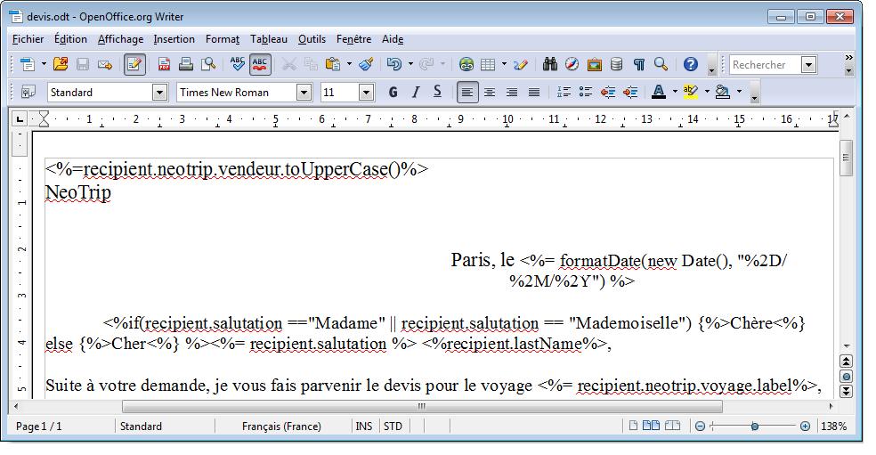
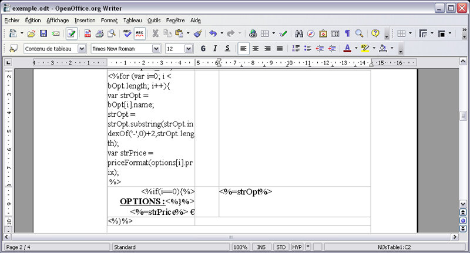
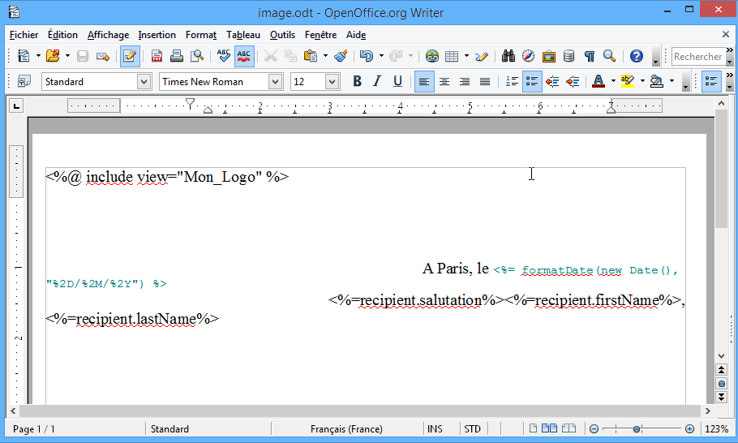
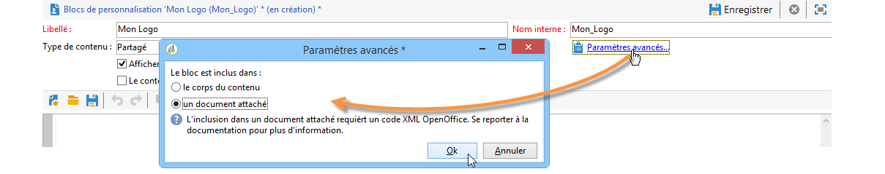
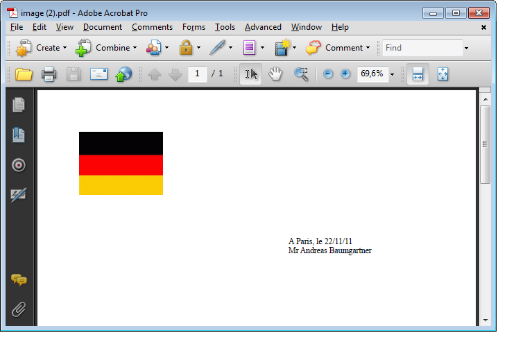

# Génération de documents PDF personnalisés{#generating-personalized-pdf-documents}

## À propos des documents PDF variables {#about-variable-pdf-documents}

Adobe Campaign permet la génération de documents PDF variables pour pièces jointes d&#39;email à partir de documents LibreOffice ou Microsoft Word.

Les extensions supportées sont : &quot;.docx&quot;, &quot;.doc&quot;, et &quot;.odt&quot;.

Pour personnaliser vos documents, vous disposez des mêmes fonctionnalités JavaScript que celles disponibles pour la personnalisation des e-mails.

Vous devez activer l&#39;option **[!UICONTROL « Le contenu du fichier est personnalisé et converti en PDF au moment de l’envoi pour chaque message »]**. Cette option est accessible lors de l’ajout de la pièce jointe dans l’email de la diffusion. Pour plus d’informations sur l’ajout d’un fichier calculé en pièce jointe, consultez la section [Joindre des fichiers](attaching-files.md).

Exemple de personnalisation de l&#39;en-tête d&#39;une facture :



Si vous souhaitez générer des tableaux dynamiques ou inclure des images à partir d&#39;URL, vous devez suivre une procédure particulière.

## Génération de tableaux dynamiques {#generating-dynamic-tables}

La procédure pour générer des tableaux dynamiques est la suivante :

* Créez un tableau de trois lignes, avec autant de colonnes que vous le souhaitez, et paramétrez sa mise en page (bordures, trame, etc.).
* Positionnez-vous sur le tableau et cliquez sur le bouton **[!UICONTROL Tableau > Propriétés du tableau]** . Accédez au **[!UICONTROL Tableau]** et saisissez un nom commençant par **NlJsTable**.
* Dans la première cellule de la première ligne, définissez une boucle (&quot;for&quot; par exemple) qui va permettre d&#39;itérer sur les valeurs que vous souhaitez afficher dans votre tableau.
* Insérez, dans chaque cellule de la deuxième ligne du tableau, les scripts retournant les valeurs à afficher.
* Fermez votre boucle dans la troisième et dernière ligne du tableau.

  Exemple de définition d&#39;un tableau dynamique :

  

## Insertion dʼimages externes {#inserting-external-images}

L&#39;insertion d&#39;images externes est utile lorsque, par exemple, vous souhaitez personnaliser un document avec une image dont l&#39;URL est renseignée dans un champ du destinataire.

Pour cela, il est nécessaire de paramétrer un bloc de personnalisation, puis d’inclure dans la pièce jointe un appel au bloc de personnalisation.

**Exemple : insertion dʼun logo personnalisé en fonction du pays du destinataire**

**Étape n°1 : Création de la pièce jointe :**

* Insérez l&#39;appel au bloc de personnalisation : **&lt;%@ include view=&quot;nomdubloc&quot; %>**
* Insérez votre contenu personnalisé ou non dans le corps du fichier



**Etape n°2 : Création du bloc de personnalisation:**

* Allez dans le menu **[!UICONTROL Ressources > Gestion de campagne > Blocs de personnalisation]** de la console Adobe Campaign.
* Créez un nouveau bloc de personnalisation &quot;Mon Logo&quot; avec pour nom interne &quot;Mon_Logo&quot;.
* Cliquez sur le lien **[!UICONTROL Paramètres avancés…]** et cochez l’option **[!UICONTROL « Le bloc est inclus dans une pièce jointe »]**. Cette option va permettre de recopier la définition du bloc de personnalisation directement dans le contenu du fichier OpenOffice.

  

  Il est nécessaire de distinguer deux types de déclaration à l&#39;intérieur du bloc de personnalisation :

   * Le code Adobe Campaign des champs de personnalisation pour lequel les chevrons « ouvert » et « fermé » doivent être remplacés par des caractères échappés (respectivement `&lt;` et `&gt;`).
   * Le code XML OpenOffice qui sera intégralement recopié dans le document OpenOffice.

Dans l&#39;exemple, le bloc de personnalisation est de cette forme :

```
<% if (recipient.country.label == "Germany") { %>
<draw:frame svg:width="4cm" svg:height="3cm">
<draw:image xlink:href=https://..../logo_germany.png />
</draw:frame>
<% } else
if (recipient.country.label == "USA")
{ %>
<draw:frame svg:width="4cm" svg:height="3cm">
<draw:image xlink:href=https://..../logo_USA.png />
</draw:frame>
<% } %>
```

En fonction du pays du destinataire, la personnalisation est bien visible dans le document lié à la diffusion:


