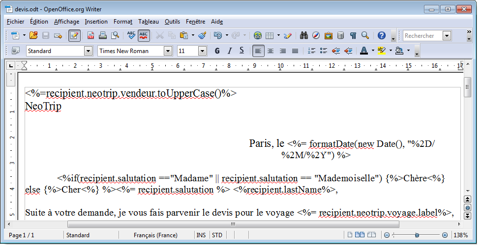
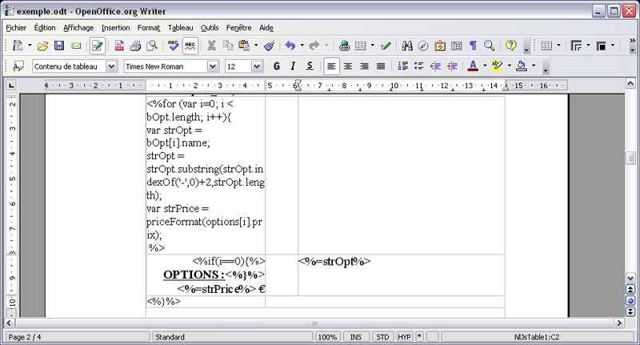
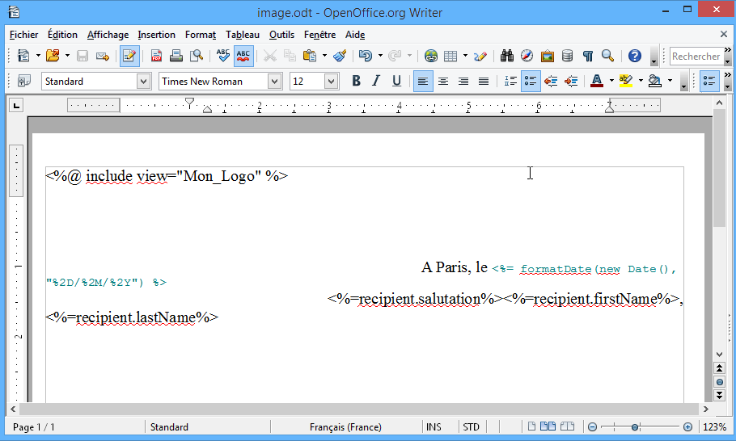
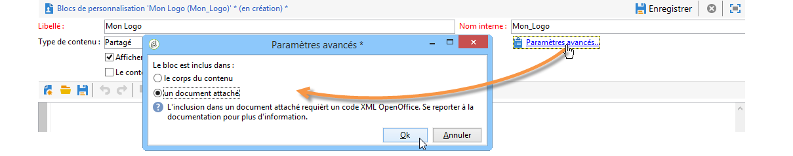
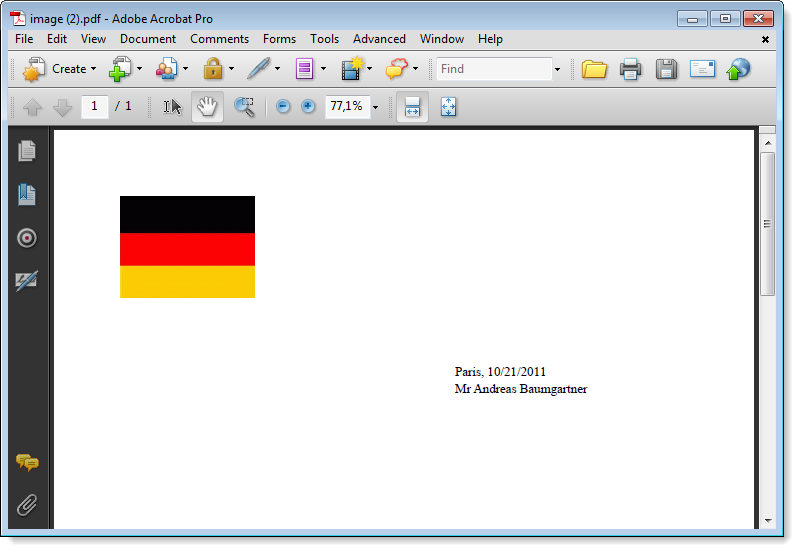

<?xml version="1.0" encoding="UTF-8"?>
<xliff xmlns="urn:oasis:names:tc:xliff:document:1.2" xmlns:okp="okapi-framework:xliff-extensions" xmlns:its="http://www.w3.org/2005/11/its" xmlns:itsxlf="http://www.w3.org/ns/its-xliff/" version="1.2" its:version="2.0">
<file original="help/delivery/using/generating-personalized-pdf-documents.md.mdsc" source-language="en-US" target-language="en-XX" datatype="x-text/markdown">
<body>
<trans-unit id="tu11" xml:space="preserve">
<source xml:lang="en-US">https://experienceleague.adobe.com/docs/campaign/campaign-v8/send/emails/attaching-files.html?lang=fr</source>
<target xml:lang="en-XX">https://experienceleague.adobe.com/docs/campaign/campaign-v8/send/emails/attaching-files.html?lang=fr</target>
</trans-unit>
<trans-unit id="tu27" xml:space="preserve">
<source xml:lang="en-US">https://experienceleague.adobe.com/fr/docs/control-panel/using/instances-settings/url-permissions</source>
<target xml:lang="en-XX">https://experienceleague.adobe.com/fr/docs/control-panel/using/instances-settings/url-permissions</target>
</trans-unit>
<trans-unit id="tu1" restype="x-YAML_METADATA_HEADER_VALUE" xml:space="preserve">
<source xml:lang="en-US">Generate personalized PDF documents</source>
<target xml:lang="en-XX">Génération de documents PDF personnalisés</target>
</trans-unit>
<trans-unit id="tu2" restype="x-YAML_METADATA_HEADER_VALUE" xml:space="preserve">
<source xml:lang="en-US">Learn how to generate personalized PDF documents</source>
<target xml:lang="en-XX">Découvrez comment générer des documents PDF personnalisés</target>
</trans-unit>
<trans-unit id="tu3" xml:space="preserve">
<source xml:lang="en-US">Also applies to v8</source>
<target xml:lang="en-XX">S’applique également à la v8.</target>
</trans-unit>
<trans-unit id="tu4" xml:space="preserve">
<source xml:lang="en-US">Also applies to Campaign v8</source>
<target xml:lang="en-XX">S’applique également à Campaign v8.</target>
</trans-unit>
<trans-unit id="tu5" xml:space="preserve">
<source xml:lang="en-US">Generate personalized PDF documents</source>
<target xml:lang="en-XX">Génération de documents PDF personnalisés</target>
</trans-unit>
<trans-unit id="tu6" xml:space="preserve">
<source xml:lang="en-US">About variable PDF documents</source>
<target xml:lang="en-XX">À propos des documents PDF variables</target>
</trans-unit>
<trans-unit id="tu7" xml:space="preserve">
<source xml:lang="en-US">Adobe Campaign lets you generate variable PDF documents for email attachments from LibreOffice or Microsoft Word documents.</source>
<target xml:lang="en-XX">Adobe Campaign permet la génération de documents PDF variables pour pièces jointes d'email à partir de documents LibreOffice ou Microsoft Word.</target>
</trans-unit>
<trans-unit id="tu8" xml:space="preserve">
<source xml:lang="en-US">The following extensions are supported: ".docx", ".doc", and ".odt".</source>
<target xml:lang="en-XX">Les extensions supportées sont : ".docx", ".doc", et ".odt".</target>
</trans-unit>
<trans-unit id="tu9" xml:space="preserve">
<source xml:lang="en-US">To personalize your documents, the same JavaScript functionalities as for email personalization are available.</source>
<target xml:lang="en-XX">Pour personnaliser vos documents, vous disposez des mêmes fonctionnalités JavaScript que celles disponibles pour la personnalisation des e-mails.</target>
</trans-unit>
<trans-unit id="tu10" xml:space="preserve">
<source xml:lang="en-US">You need to activate the <ph id="1" ctype="x-STRONG_EMPHASIS">**[!UICONTROL </ph>"The content of the file is personalized and converted to PDF during the delivery of each message"<ph id="3" ctype="x-LINK_REF">]**</ph> option. This option is accessible when you attach the file to the delivery email. For more on attaching a calculated file, refer the <ph id="5" ctype="x-LINK">&lbrack;</ph>Campaign v8 documentation<ph id="6" ctype="x-LINK">[#$tu11]{target="_blank"}</ph>.</source>
<target xml:lang="en-XX">Vous devez activer l’option <ph id="1" ctype="x-STRONG_EMPHASIS">**[!UICONTROL </ph>« Le contenu du fichier est personnalisé et converti en PDF au moment de la diffusion pour chaque message »<ph id="3" ctype="x-LINK_REF">]**</ph>. Cette option est accessible lors de l’ajout du fichier en pièce jointe à l’e-mail de la diffusion. Pour en savoir plus sur l’ajout d’un fichier calculé en pièce jointe, consultez la <ph id="5" ctype="x-LINK">&lbrack;</ph>documentation de Campaign v8<ph id="6" ctype="x-LINK">[#$tu11]{target="_blank"}</ph>.</target>
</trans-unit>
<trans-unit id="tu12" xml:space="preserve">
<source xml:lang="en-US">Example of an invoice header personalization:</source>
<target xml:lang="en-XX">Exemple de personnalisation de l'en-tête d'une facture :</target>
</trans-unit>
<trans-unit id="tu13" xml:space="preserve">
<source xml:lang="en-US"><ph id="1" ctype="x-IMAGE"></ph></source>
<target xml:lang="en-XX"><ph id="1" ctype="x-IMAGE"></ph></target>
</trans-unit>
<trans-unit id="tu14" xml:space="preserve">
<source xml:lang="en-US">To generate dynamic tables or include images via a URL, you need to follow a specific process.</source>
<target xml:lang="en-XX">Si vous souhaitez générer des tableaux dynamiques ou inclure des images à partir d'URL, vous devez suivre une procédure particulière.</target>
</trans-unit>
<trans-unit id="tu15" xml:space="preserve">
<source xml:lang="en-US">Generate dynamic tables</source>
<target xml:lang="en-XX">Génération de tableaux dynamiques</target>
</trans-unit>
<trans-unit id="tu16" xml:space="preserve">
<source xml:lang="en-US">The procedure for generating dynamic tables is as follows:</source>
<target xml:lang="en-XX">La procédure pour générer des tableaux dynamiques est la suivante :</target>
</trans-unit>
<trans-unit id="tu17" xml:space="preserve">
<source xml:lang="en-US">Create a table with three lines and as many columns as necessary, then configure its layout (borders, etc.).</source>
<target xml:lang="en-XX">Créez un tableau de trois lignes, avec autant de colonnes que vous le souhaitez, et paramétrez sa mise en page (bordures, trame, etc.).</target>
</trans-unit>
<trans-unit id="tu18" xml:space="preserve">
<source xml:lang="en-US">Place your cursor on the table and click the <ph id="1" ctype="x-STRONG_EMPHASIS">**[!UICONTROL </ph>Table > Table properties<ph id="3" ctype="x-LINK_REF">]**</ph> menu. Go to the <ph id="5" ctype="x-STRONG_EMPHASIS">**[!UICONTROL </ph>Table<ph id="7" ctype="x-LINK_REF">]**</ph> tab and enter a name beginning with <ph id="9" ctype="x-STRONG_EMPHASIS">**</ph>NlJsTable<ph id="10" ctype="x-STRONG_EMPHASIS">**</ph>.</source>
<target xml:lang="en-XX">Positionnez le curseur sur le tableau créé, et cliquez dans le menu <ph id="1" ctype="x-STRONG_EMPHASIS">**[!UICONTROL </ph>Tableau > Propriétés du tableau<ph id="3" ctype="x-LINK_REF">]**</ph>. Depuis l'onglet <ph id="5" ctype="x-STRONG_EMPHASIS">**[!UICONTROL </ph>Tableau<ph id="7" ctype="x-LINK_REF">]**</ph>, saisissez un nom commençant par <ph id="9" ctype="x-STRONG_EMPHASIS">**</ph>NlJsTable<ph id="10" ctype="x-STRONG_EMPHASIS">**</ph>.</target>
</trans-unit>
<trans-unit id="tu19" xml:space="preserve">
<source xml:lang="en-US">In the first cell of the first line, define a loop ("for", for example) that enables iteration on the values you want to display in the table.</source>
<target xml:lang="en-XX">Dans la première cellule de la première ligne, définissez une boucle ("for" par exemple) qui va permettre d'itérer sur les valeurs que vous souhaitez afficher dans votre tableau.</target>
</trans-unit>
<trans-unit id="tu20" xml:space="preserve">
<source xml:lang="en-US">In each cell of the second line of the table, insert scripts that return the values to display.</source>
<target xml:lang="en-XX">Insérez, dans chaque cellule de la deuxième ligne du tableau, les scripts retournant les valeurs à afficher.</target>
</trans-unit>
<trans-unit id="tu21" xml:space="preserve">
<source xml:lang="en-US">Close the loop in the third and last line of the table.</source>
<target xml:lang="en-XX">Fermez votre boucle dans la troisième et dernière ligne du tableau.</target>
</trans-unit>
<trans-unit id="tu22" xml:space="preserve">
<source xml:lang="en-US">Example of a dynamic table definition:</source>
<target xml:lang="en-XX">Exemple de définition d'un tableau dynamique :</target>
</trans-unit>
<trans-unit id="tu23" xml:space="preserve">
<source xml:lang="en-US"><ph id="1" ctype="x-IMAGE"></ph></source>
<target xml:lang="en-XX"><ph id="1" ctype="x-IMAGE"></ph></target>
</trans-unit>
<trans-unit id="tu24" xml:space="preserve">
<source xml:lang="en-US">Insert external images</source>
<target xml:lang="en-XX">Insertion dʼimages externes</target>
</trans-unit>
<trans-unit id="tu25" xml:space="preserve">
<source xml:lang="en-US"><ph id="1" ctype="x-regxph" equiv-text="&lbrack;!IMPORTANT">[!IMPORTANT]</ph></source>
<target xml:lang="en-XX"><ph id="1" ctype="x-regxph" equiv-text="&lbrack;!IMPORTANT">[!IMPORTANT]</ph></target>
</trans-unit>
<trans-unit id="tu26" xml:space="preserve">
<source xml:lang="en-US">Release 7.4.4 (build 9401) includes an update to the external URL allow list. Make sure the domains used for external images in your attachments are added to your instance's approved allow list so that resources continue to load without interruption. As a Campaign Administrator, use the Control Panel to add and manage allow-listed URLs. See <ph id="1" ctype="x-LINK">&lbrack;</ph>Add URL permissions<ph id="2" ctype="x-LINK">[#$tu27]{target="_blank"}</ph> for steps.</source>
<target xml:lang="en-XX">La version 7.4.4 (build 9401) comprend une mise à jour de la liste des URL externes autorisées. Assurez-vous que les domaines utilisés pour les images externes dans vos pièces jointes sont ajoutés à la liste autorisée approuvée de votre instance afin que les ressources continuent à se charger sans interruption. En tant qu’administrateur ou administratrice de Campaign, utilisez le panneau de contrôle pour ajouter et gérer des URL placées sur la liste autorisée. Pour connaître la procédure, consultez <ph id="1" ctype="x-LINK">&lbrack;</ph>Ajouter des autorisations d’URL<ph id="2" ctype="x-LINK">[#$tu27]{target="_blank"}</ph>.</target>
</trans-unit>
<trans-unit id="tu28" xml:space="preserve">
<source xml:lang="en-US">The insertion of external images is useful if, for instance, you want to personalize a document with an image whose URL is entered in a field of the recipient.</source>
<target xml:lang="en-XX">L'insertion d'images externes est utile lorsque, par exemple, vous souhaitez personnaliser un document avec une image dont l'URL est renseignée dans un champ du destinataire.</target>
</trans-unit>
<trans-unit id="tu29" xml:space="preserve">
<source xml:lang="en-US">To do this, you need to configure a personalization block, then include a call to the personalization block in the attachment.</source>
<target xml:lang="en-XX">Pour cela, il est nécessaire de paramétrer un bloc de personnalisation, puis d’inclure dans la pièce jointe un appel au bloc de personnalisation.</target>
</trans-unit>
<trans-unit id="tu30" xml:space="preserve">
<source xml:lang="en-US"><ph id="1" ctype="x-STRONG_EMPHASIS">**</ph>Example: insert a personalized logo depending on the recipient's country<ph id="2" ctype="x-STRONG_EMPHASIS">**</ph></source>
<target xml:lang="en-XX"><ph id="1" ctype="x-STRONG_EMPHASIS">**</ph>Exemple : insertion dʼun logo personnalisé en fonction du pays du destinataire<ph id="2" ctype="x-STRONG_EMPHASIS">**</ph></target>
</trans-unit>
<trans-unit id="tu31" xml:space="preserve">
<source xml:lang="en-US"><ph id="1" ctype="x-STRONG_EMPHASIS">**</ph>Step 1: create the attachment:<ph id="2" ctype="x-STRONG_EMPHASIS">**</ph></source>
<target xml:lang="en-XX"><ph id="1" ctype="x-STRONG_EMPHASIS">**</ph>Étape n°1 : Création de la pièce jointe :<ph id="2" ctype="x-STRONG_EMPHASIS">**</ph></target>
</trans-unit>
<trans-unit id="tu32" xml:space="preserve">
<source xml:lang="en-US">Insert the call to the personalization block: <ph id="1" ctype="x-STRONG_EMPHASIS">**</ph>&lt;%@ include view="blockname" %><ph id="2" ctype="x-STRONG_EMPHASIS">**</ph>.</source>
<target xml:lang="en-XX">Insérez l'appel au bloc de personnalisation : <ph id="1" ctype="x-STRONG_EMPHASIS">**</ph>&lt;%@ include view="nomdubloc" %><ph id="2" ctype="x-STRONG_EMPHASIS">**</ph></target>
</trans-unit>
<trans-unit id="tu33" xml:space="preserve">
<source xml:lang="en-US">Insert your content (personalized or not) into the body of the file.</source>
<target xml:lang="en-XX">Insérez votre contenu personnalisé ou non dans le corps du fichier</target>
</trans-unit>
<trans-unit id="tu34" xml:space="preserve">
<source xml:lang="en-US"><ph id="1" ctype="x-IMAGE"></ph></source>
<target xml:lang="en-XX"><ph id="1" ctype="x-IMAGE"></ph></target>
</trans-unit>
<trans-unit id="tu35" xml:space="preserve">
<source xml:lang="en-US"><ph id="1" ctype="x-STRONG_EMPHASIS">**</ph>Step 2: create the personalization block:<ph id="2" ctype="x-STRONG_EMPHASIS">**</ph></source>
<target xml:lang="en-XX"><ph id="1" ctype="x-STRONG_EMPHASIS">**</ph>Etape n°2 : Création du bloc de personnalisation:<ph id="2" ctype="x-STRONG_EMPHASIS">**</ph></target>
</trans-unit>
<trans-unit id="tu36" xml:space="preserve">
<source xml:lang="en-US">Go to the <ph id="1" ctype="x-STRONG_EMPHASIS">**[!UICONTROL </ph>Resources > Campaign management > Personalization blocks<ph id="3" ctype="x-LINK_REF">]**</ph> menu of the Adobe Campaign console.</source>
<target xml:lang="en-XX">Allez dans le menu <ph id="1" ctype="x-STRONG_EMPHASIS">**[!UICONTROL </ph>Ressources > Gestion de campagne > Blocs de personnalisation<ph id="3" ctype="x-LINK_REF">]**</ph> de la console Adobe Campaign.</target>
</trans-unit>
<trans-unit id="tu37" xml:space="preserve">
<source xml:lang="en-US">Create a new "My Logo" personalization block with "My_Logo" as an internal name.</source>
<target xml:lang="en-XX">Créez un nouveau bloc de personnalisation "Mon Logo" avec pour nom interne "Mon_Logo".</target>
</trans-unit>
<trans-unit id="tu38" xml:space="preserve">
<source xml:lang="en-US">Click on the <ph id="1" ctype="x-STRONG_EMPHASIS">**[!UICONTROL </ph>Advanced parameters...<ph id="3" ctype="x-LINK_REF">]**</ph> link then check the <ph id="5" ctype="x-STRONG_EMPHASIS">**[!UICONTROL </ph>"The content of the block is included in an attachment"<ph id="7" ctype="x-LINK_REF">]**</ph> option. This lets you copy the definition of the personalization block directly into the content of the OpenOffice file.</source>
<target xml:lang="en-XX">Cliquez sur le lien <ph id="1" ctype="x-STRONG_EMPHASIS">**[!UICONTROL </ph>Paramètres avancés…<ph id="3" ctype="x-LINK_REF">]**</ph> et cochez l’option <ph id="5" ctype="x-STRONG_EMPHASIS">**[!UICONTROL </ph>« Le bloc est inclus dans une pièce jointe »<ph id="7" ctype="x-LINK_REF">]**</ph>. Cela vous permet de copier la définition du bloc de personnalisation directement dans le contenu du fichier OpenOffice.</target>
</trans-unit>
<trans-unit id="tu39" xml:space="preserve">
<source xml:lang="en-US"><ph id="1" ctype="x-IMAGE"></ph></source>
<target xml:lang="en-XX"><ph id="1" ctype="x-IMAGE"></ph></target>
</trans-unit>
<trans-unit id="tu40" xml:space="preserve">
<source xml:lang="en-US">You need to differentiate two types of declarations within the personalization block:</source>
<target xml:lang="en-XX">Il est nécessaire de distinguer deux types de déclaration à l'intérieur du bloc de personnalisation :</target>
</trans-unit>
<trans-unit id="tu41" xml:space="preserve">
<source xml:lang="en-US">The Adobe Campaign code of the personalization fields for which the "open" and "closed" chevrons must be replaced with escape characters (respectively <ph id="1" ctype="x-CODE">`&amp;lt;`</ph> and <ph id="2" ctype="x-CODE">`&amp;gt;`</ph>).</source>
<target xml:lang="en-XX">Le code Adobe Campaign des champs de personnalisation pour lequel les chevrons « ouvert » et « fermé » doivent être remplacés par des caractères échappés (respectivement <ph id="1" ctype="x-CODE">`&amp;lt;`</ph> et <ph id="2" ctype="x-CODE">`&amp;gt;`</ph>).</target>
</trans-unit>
<trans-unit id="tu42" xml:space="preserve">
<source xml:lang="en-US">The entire OpenOffice XML code will be copied into the OpenOffice document.</source>
<target xml:lang="en-XX">Le code XML OpenOffice qui sera intégralement recopié dans le document OpenOffice.</target>
</trans-unit>
<trans-unit id="tu43" xml:space="preserve">
<source xml:lang="en-US">In the example, the personalization block looks like this:</source>
<target xml:lang="en-XX">Dans l'exemple, le bloc de personnalisation est de cette forme :</target>
</trans-unit>
<trans-unit id="tu44" xml:space="preserve">
<source xml:lang="en-US">Depending on the recipient's country, personalization is visible in the document linked to the delivery:</source>
<target xml:lang="en-XX">En fonction du pays du destinataire, la personnalisation est bien visible dans le document lié à la diffusion:</target>
</trans-unit>
<trans-unit id="tu45" xml:space="preserve">
<source xml:lang="en-US"><ph id="1" ctype="x-IMAGE"></ph></source>
<target xml:lang="en-XX"><ph id="1" ctype="x-IMAGE"></ph></target>
</trans-unit>
</body>
</file>
</xliff>