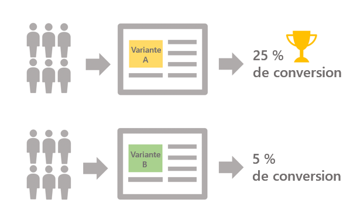

# Prise en main des tests A/B {#get-started-a-b-testing}

Les tests A/B vous permettent de comparer plusieurs versions d’une diffusion les unes par rapport aux autres, afin d’identifier celle qui aura le plus grand impact sur la population ciblée.

Pour ce faire, vous devez d’abord définir plusieurs variantes de la diffusion. Chaque variante est ensuite envoyée à des échantillons de population afin de déterminer laquelle fonctionne le mieux selon les critères de votre choix (ouvertures, plaintes pour spam, clics sur un lien spécifique, etc.)

Dans l&#39;exemple ci-dessous, la cible de diffusion a été divisée en deux groupes, représentant chacun 50 % de la population ciblée. Chaque groupe reçoit deux versions de la diffusion avec deux offres promotionnelles différentes. Une fois la diffusion envoyée, il est conclu que la variante A a obtenu de meilleurs résultats, en fonction du nombre de clics sur les offres promotionnelles.

Avec Campaign Classic, les tests A/B sont implémentés via des workflows, où vous spécifiez la population à cibler ainsi que les groupes qui recevront chaque variante (voir [Configuration des tests A/B](configuring-a-b-testing.md)).

Les étapes principales sont les suivantes :

1. **Cibler** la population désirée.
1. **Diviser la population** en sous-ensembles sur lesquels vous allez tester les variantes de votre diffusion.

   Par exemple, vous pouvez envoyer une version d’une diffusion à une petite partie de la population ciblée et une autre version à la population restante. Vous pouvez ainsi tester une nouvelle version d’une diffusion par rapport à la diffusion généralement envoyée à vos clients. Vous pouvez également diviser la population ciblée en 3 groupes afin de lui envoyer trois versions différentes d’une diffusion.

1. **Créer plusieurs versions** de la diffusion correspondant à chaque sous-ensemble. La variante à tester peut être l&#39;objet, le contenu du message, le nom de l&#39;expéditeur, etc.
1. Démarrez le workflow, puis utilisez les **logs de diffusion** pour analyser le comportement des sous-ensembles avec chaque variante.

>[!NOTE]
>
>Les workflows vous permettent également d&#39;automatiser vos processus en identifiant automatiquement la variante de diffusion qui a obtenu de meilleurs résultats, puis en l&#39;envoyant à la population restante. Voir à ce propos le [cas pratique](a-b-testing-use-case.md) dédié.
