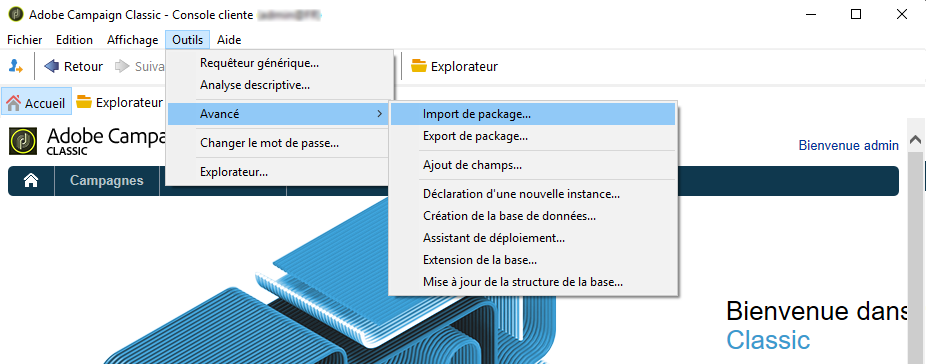

# Prise en main de la configuration de l&#39;application

Vous trouverez dans cette section un exemple de configuration basé sur une société qui vend des forfaits vacances en ligne. Son application mobile (Neotrips) est disponible pour ses clients en deux versions : Neotrips pour Android et Neotrips pour iOS.

Pour envoyer des notifications push dans Adobe Campaign, vous devez effectuer les opérations suivantes :

* Créez un service d&#39;information de type **[!UICONTROL Application mobile]** pour l&#39;application mobile Neotrips. Reportez-vous à [cette section pour iOS](configuring-the-mobile-application.md#configuring-ios-service) et à [cette section pour Android](configuring-the-mobile-application-android.md#configuring-android-service).
* Ajoutez, à ce service, les versions iOS et Android de l&#39;application.
* Créez une diffusion pour [iOS](create-notifications-ios.md) et [Android](create-notifications-android.md).

>[!NOTE]
>
>Dans l&#39;onglet **[!UICONTROL Abonnements]** du service, vous trouverez la liste de tous les abonnés au service, c&#39;est-à-dire toutes les personnes ayant installé l&#39;application sur leur terminal mobile et accepté de recevoir des notifications.

## Installez le package {#installing-package-ios}

[!BADGE On-premise et hybride]{type=Caution url="https://experienceleague.adobe.com/docs/campaign-classic/using/installing-campaign-classic/architecture-and-hosting-models/hosting-models-lp/hosting-models.html?lang=fr" tooltip="S’applique uniquement aux déploiements on-premise et hybrides"}

 [Découvrez comment installer le package d’application mobile en vidéo](https://experienceleague.adobe.com/docs/campaign-classic-learn/tutorials/sending-messages/push-channel/installing-the-mobile-app-channel.html?lang=fr#sending-messages)

En tant que client hybride/hébergé, contactez l&#39;équipe d&#39;[Assistance clientèle d&#39;Adobe](https://helpx.adobe.com/fr/enterprise/admin-guide.html/enterprise/using/support-for-experience-cloud.ug.html) pour accéder au canal de notifications push dans Campaign.

En tant que client on-premise, vous devez installer un package natif.

>[!CAUTION]
>
>Pour en savoir plus sur les packages natifs de Campaign, les bonnes pratiques et les recommandations, consultez [cette page](../../installation/using/installing-campaign-standard-packages.md).

Les étapes d&#39;installation sont les suivantes :

1. Accédez à l’assistant d’import de package depuis le menu **[!UICONTROL Outils > Avancé > Import de package]** de la console cliente Adobe Campaign.

   

1. Sélectionnez **[!UICONTROL Installer un package standard]**.

1. Dans la liste qui s&#39;affiche, cochez **[!UICONTROL Canal des applications mobiles]**.

   

1. Cliquez sur **[!UICONTROL Suivant]** puis **[!UICONTROL Démarrer]** pour commencer l&#39;installation du package.

   Une fois les packages installés, la barre de progression indique **100 %**. De plus, les logs de l&#39;installation contiennent le message suivant : **[!UICONTROL L&#39;installation des packages s&#39;est terminée avec succès]**.

   

1. **[!UICONTROL Fermez]** la fenêtre d&#39;installation.

Une fois cette étape effectuée, vous pouvez configurer vos applications Android et iOS.
Reportez-vous aux sections suivantes :

* [Étapes de configuration pour iOS](configuring-the-mobile-application.md)

* [Étapes de configuration pour Android](configuring-the-mobile-application-android.md)
