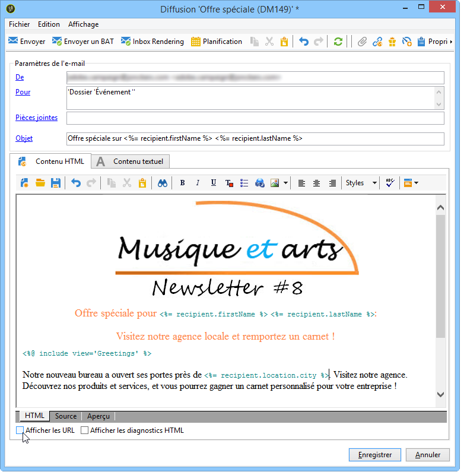
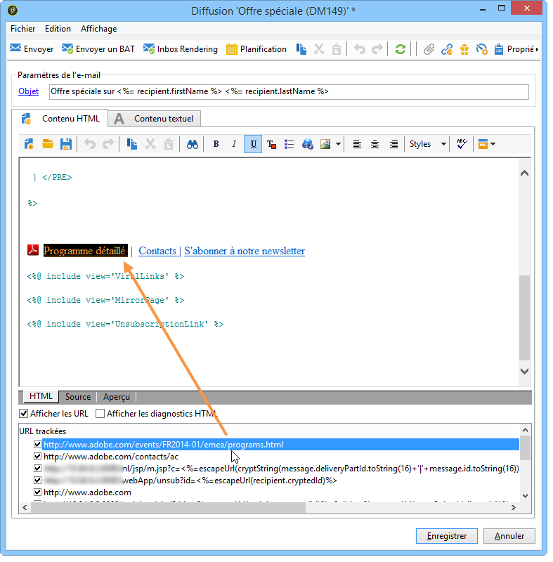

# Comment configurer des liens trackés{#how-to-configure-tracked-links}

La réception des messages ainsi que l&#39;activation des liens insérés dans le contenu des messages peuvent être suivis pour chaque diffusion. Vous pouvez ainsi assurer un tracking du comportement des destinataires suite aux actions de diffusion dont ils ont été la cible.

>[!NOTE]
>
>Le tracking s&#39;applique aux messages, tandis que le tracking Web permet de suivre la navigation des destinataires sur un site internet (pages visitées, achats).
>
>Le paramétrage du tracking Web est présenté dans [cette section](../../configuration/using/about-web-tracking.md).

Le tracking des messages est activé par défaut. Pour personnaliser le tracking des URL, procédez comme suit :

1. Sélectionnez l&#39;option **[!UICONTROL Afficher les URL]**, située dans la section inférieure de l&#39;assistant de diffusion, sous le contenu du message.

   

   Lorsque vous sélectionnez une URL dans la liste des URL trackées, elle est mise en surbrillance dans le contenu de la diffusion, à l&#39;exception du lien de la page miroir et du lien de désinscription qui sont fournis par défaut.

   

1. Pour chaque URL du message, choisissez d&#39;activer ou non le tracking.

   >[!CAUTION]
   >
   >Lorsque l&#39;URL du lien est utilisée comme libellé, il est recommandé de désactiver le tracking afin de prévenir tout risque de rejet pour cause de phishing.
   >
   >Par exemple, si l&#39;URL www.adobe.com est insérée dans le message et que l&#39;URL est trackée, le contenu du lien hypertexte sera transformé en https://nlt.adobe.net/r/?id=xxxxxx. Il pourrait alors être considéré comme frauduleux par les clients de messagerie des destinataires.

1. Au besoin, modifiez le libellé du tracking, double-cliquez dessus et saisissez-en un nouveau.

   >[!NOTE]
   >
   >Les noms des URL trackées et des libellés être modifiés afin de simplifier la lecture des informations lors du suivi des diffusions. Deux URL ou deux libellés portant le même nom seront cumulés lors du calcul des clics.

1. Au besoin, modifiez le tracking, sélectionnez un nouveau mode dans la colonne **[!UICONTROL Tracking]** correspondant au lien visé, comme dans l&#39;exemple ci-dessous :

   

   Pour chaque URL, vous pouvez définir le mode de tracking sur l&#39;une de ces valeurs :

   * **[!UICONTROL Activé]** : active le tracking de cette URL.
   * **[!UICONTROL Non activé]** : désactive le tracking de cette URL.
   * **[!UICONTROL Toujours activé]** : active toujours le tracking de cette URL. Cette information est enregistrée de sorte que si l&#39;URL réapparaît dans le contenu d&#39;un prochain message, son tracking est automatiquement activé.
   * **[!UICONTROL Jamais activé]** : n&#39;active jamais le tracking de cette URL. Cette information est enregistrée de sorte que si l&#39;URL réapparaît dans le contenu d&#39;un prochain message, son tracking est automatiquement désactivé.
   * **[!UICONTROL Opt-out]** : considère cette URL comme une option d&#39;opt-out ou une URL de désabonnement.
   * **[!UICONTROL Page miroir]** : considère cette URL comme une URL de page miroir.

1. De plus, vous pouvez sélectionner une catégorie pour chaque URL trackée dans la liste déroulante de la colonne **[!UICONTROL Catégorie]**. Ces catégories peuvent être affichées dans les rapports, comme par exemple **[!UICONTROL URL et flux de clics]** (voir [cette section](../../reporting/using/reports-on-deliveries.md#urls-and-click-streams)). Elles sont définies dans une énumération spécifique : **[!UICONTROL urlCategory]** (voir [Gestion des énumérations](../../platform/using/managing-enumerations.md)).
