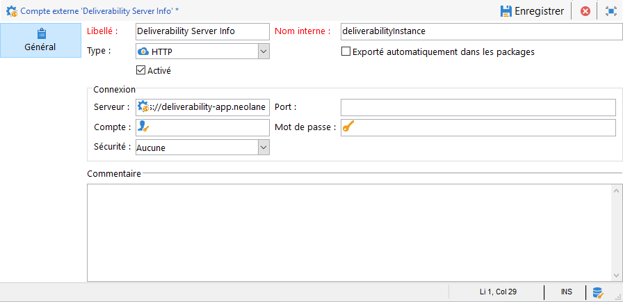
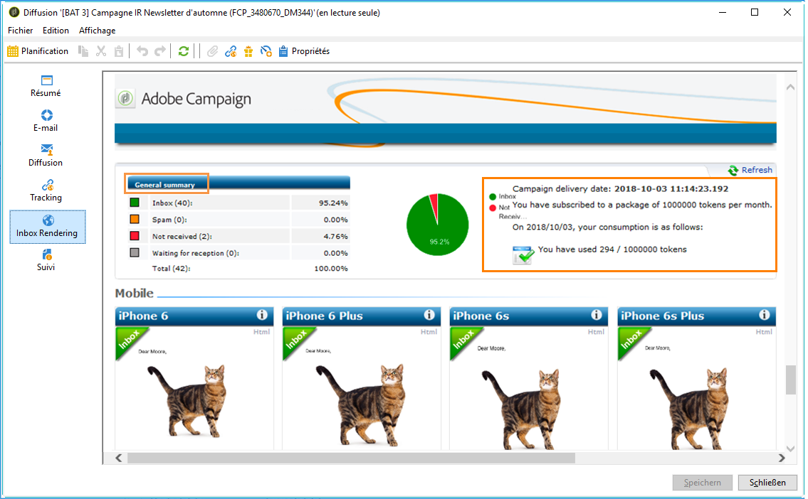
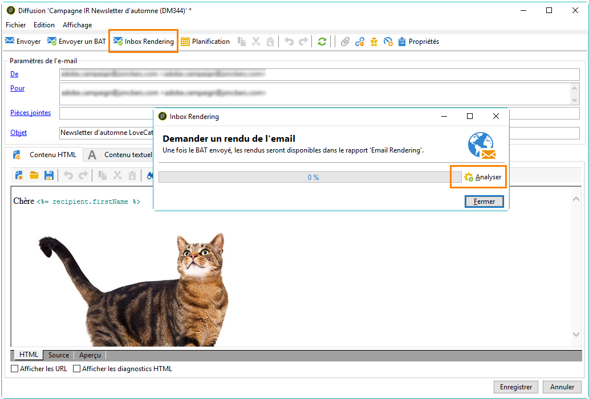
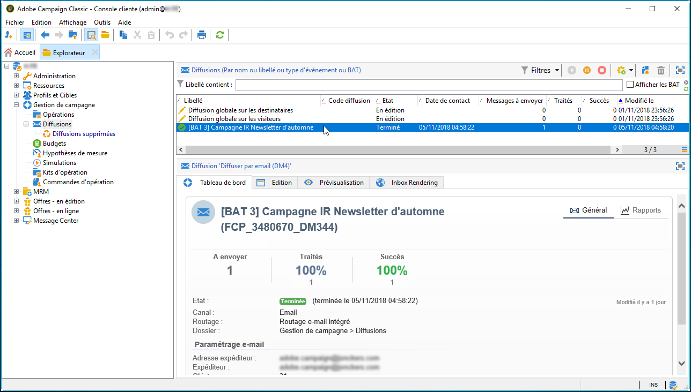
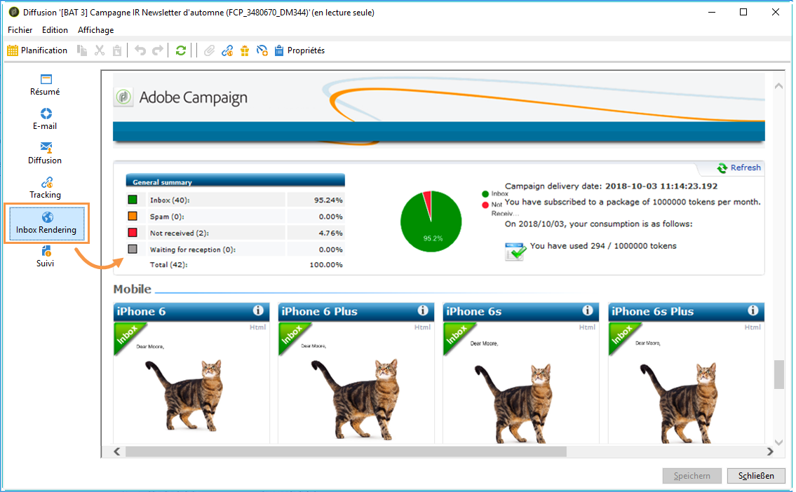
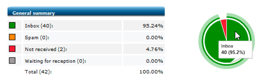
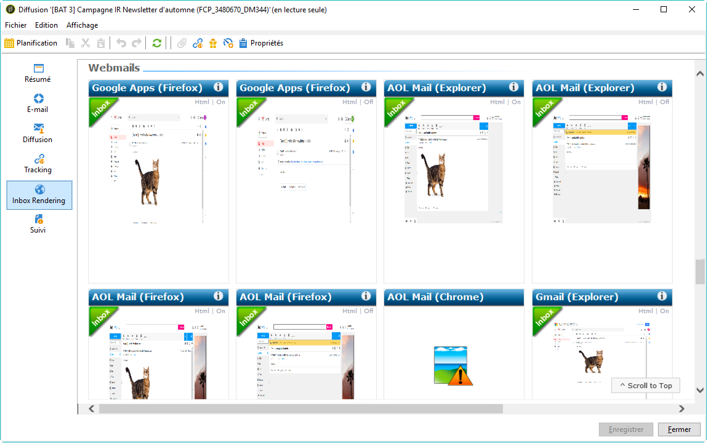
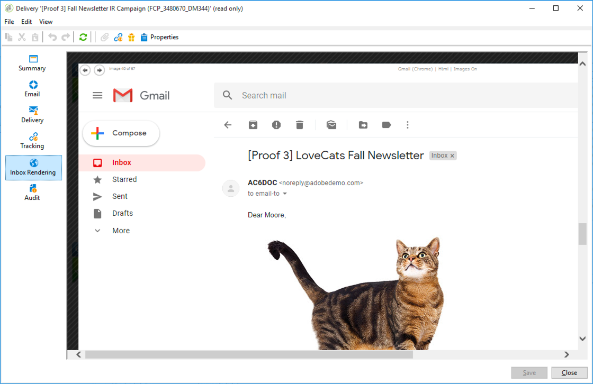

# Rendu de la boîte de réception{#inbox-rendering}

## À propos de l&#39;inbox rendering {#about-inbox-rendering}

Avant d&#39;appuyer sur le bouton **Envoyer**, vérifiez que l&#39;affichage de votre message sera optimal pour les destinataires sur divers clients web, webmails et appareils.

Pour permettre cette vérification, Adobe Campaign utilise la solution web de test d’e-mail [Litmus](https://litmus.com/email-testing) afin de capturer les rendus et de les rendre disponibles dans un rapport dédié.Vous pouvez ainsi prévisualiser le message envoyé dans les différents contextes dans lesquels il peut être reçu et vérifier la compatibilité auprès des principaux ordinateurs de bureau et applications.

>[!CAUTION]
>L’Inbox rendering n’est pas compatible avec les [diffusions récurrentes](communication-channels.md#recurring-delivery).
>

Litmus est une application de validation et de prévisualisation des e-mails, riche en fonctionnalités.Elle permet aux créateurs et créatrices de contenu d’e-mail de prévisualiser le contenu de leur message dans plus de 70 outils de rendu d’e-mail, tels que la boîte de réception Gmail ou le client de messagerie Apple.

Les clients mobiles, de messagerie et webmail disponibles pour l&#39;**Inbox rendering** dans Adobe Campaign sont répertoriés sur le [site web de Litmus](https://litmus.com/email-testing) (cliquez sur **View all email clients**).

>[!NOTE]
>
>L&#39;Inbox rendering n&#39;est pas nécessaire pour tester les personnalisations dans les diffusions. La personnalisation peut être vérifiée à l’aide d’outils d’Adobe Campaign tels que l’**[!UICONTROL Aperçu]** et les BAT. Consultez la [documentation de Campaign v8](https://experienceleague.adobe.com/docs/campaign/campaign-v8/send/validate/preview-and-proof.html?lang=fr){target="_blank"}.

## Activation de l&#39;Inbox rendering {#activating-inbox-rendering}

[!BADGE On-premise et hybride]{type=Caution url="https://experienceleague.adobe.com/docs/campaign-classic/using/installing-campaign-classic/architecture-and-hosting-models/hosting-models-lp/hosting-models.html?lang=fr" tooltip="S’applique uniquement aux déploiements on-premise et hybrides"}

Pour les clients hébergés et hybrides, l&#39;Inbox rendering est configuré pour votre instance par l&#39;assistance technique et les consultants d&#39;Adobe. Pour plus d&#39;informations, contactez votre chargé de compte Adobe.

Pour les installations sur site, suivez la procédure ci-dessous pour configurer l&#39;Inbox rendering.

1. Installez le package **[!UICONTROL Inbox rendering (IR)]** via le menu **[!UICONTROL Outils]** >**[!UICONTROL Avancé]** > **[!UICONTROL Import de package]**. Pour plus d&#39;informations, voir la section [Installer des packages standard Campaign Classic](../../installation/using/installing-campaign-standard-packages.md).
1. Configurez un compte externe de type HTTP via le nœud **[!UICONTROL Administration]** > **[!UICONTROL Plateforme]** > **[!UICONTROL Comptes externes]**. Pour plus d&#39;informations, consultez la section [Créer un compte externe](../../installation/using/external-accounts.md#creating-an-external-account).
1. Définissez les paramètres du compte externe comme suit :
   * **[!UICONTROL Libellé]** : informations relatives au serveur de délivrabilité
   * **[!UICONTROL Nom interne]** : deliverabilityInstance
   * **[!UICONTROL Type]** : HTTP
   * **[!UICONTROL Serveur]** : https://deliverability-app.neolane.net/deliverability
   * **[!UICONTROL Chiffrement]** : Aucun
   * Cochez l&#39;option **[!UICONTROL Activé]**.

   

1. Accédez au nœud **[!UICONTROL Administration]** > **[!UICONTROL Plateforme]** > **[!UICONTROL Options]**. Recherchez l&#39;option **[!UICONTROL DmRendering_cuid]** et contactez l&#39;assistance technique pour obtenir l&#39;identifiant des rapports de diffusion qui doit être copié dans le champ **[!UICONTROL Valeur (texte)]**.
1. Modifiez le fichier **serverConf.xml** pour autoriser un appel au serveur Litmus. Ajoutez la ligne suivante à la section `<urlPermission>` :

   ```
   <url dnsSuffix="deliverability-app.neolane.net" urlRegEx="https://.*"/>
   ```

1. Chargez de nouveau la configuration à l&#39;aide de la commande suivante :

   ```
   nlserver config -reload
   ```

>[!NOTE]
>
>Vous devrez peut-être vous déconnecter de la console et vous reconnecter pour pouvoir utiliser l&#39;Inbox rendering.

## À propos des jetons Litmus {#about-litmus-tokens}

Litmus étant un service tiers, il fonctionne selon un modèle de crédit déduit par utilisation.À chaque fois qu’un utilisateur ou une utilisatrice fait appel à la fonctionnalité Litmus, un crédit est déduit.

Dans Adobe Campaign, le crédit correspond au nombre de rendus disponibles (appelés jetons).

>[!NOTE]
>
>Le nombre de jetons Litmus disponibles dépend de la licence Campaign que vous avez achetée.Vérifiez votre contrat de licence.

Chaque fois que vous utilisez la fonctionnalité **[!UICONTROL Inbox rendering]** dans une diffusion, un rendu généré réduit les jetons disponibles d&#39;une unité.

>[!IMPORTANT]
>
>Les jetons représentent chaque rendu et non le rapport d&#39;inbox rendering complet, ce qui signifie que :
>
>* Chaque fois que le rapport d&#39;inbox rendering est généré, un jeton est déduit par client de messagerie : un jeton pour le rendu Outlook 2000, un pour le rendu Outlook 2010, un pour le rendu Apple Mail 9, etc.
>* Pour une même diffusion, si vous régénérez le rapport d&#39;inbox rendering, le nombre de jetons disponibles est à nouveau réduit en fonction du nombre de rendus générés.
>

Le nombre de jetons disponibles restants est indiqué dans le [rapport d’inbox rendering](#inbox-rendering-report).



En règle générale, la fonction d’inbox rendering permet de tester le framework HTML d’un e-mail nouvellement conçu.Chaque rendu nécessite environ jusqu’à 70 jetons (en fonction du nombre d’environnements généralement testés).Cependant, dans certains cas, vous aurez peut-être besoin de plusieurs rapports d’Inbox Rendering pour tester entièrement votre diffusion.Plusieurs contrôles pourraient donc nécessiter davantage de jetons.

## Accéder au rapport d&#39;inbox rendering {#accessing-the-inbox-rendering-report}

Une fois que vous avez créé votre diffusion email et défini son contenu ainsi que la population ciblée, suivez la procédure décrite ci-après.

Pour plus d&#39;informations sur la conception et le ciblage d&#39;une diffusion, consultez [cette section](about-email-channel.md).

1. Dans la barre supérieure de la diffusion, cliquez sur le bouton **[!UICONTROL Inbox rendering]**.
1. Sélectionnez **[!UICONTROL Analyser]** pour commencer la capture.

   

   Un BAT est envoyé.Les miniatures de rendu sont accessibles dans ce BAT quelques minutes après l’envoi des e-mails.Pour en savoir plus sur l’envoi de BAT, consultez la [documentation de Campaign v8](https://experienceleague.adobe.com/docs/campaign/campaign-v8/send/validate/preview-and-proof.html?lang=fr){target="_blank"}.

1. Une fois envoyé, le BAT apparaît dans la liste de diffusion.Double-cliquez dessus.

   

1. Accédez à l&#39;onglet **Inbox Rendering** du BAT.

   

   Le rapport d&#39;inbox rendering s&#39;affiche.

## Rapport d&#39;inbox rendering {#inbox-rendering-report}

Ce rapport présente les Inbox Renderings tels qu’ils apparaissent côté destinataire.Les rendus peuvent être différents selon le mode d’ouverture de la diffusion e-mail par la personne destinataire : dans un navigateur, sur un appareil mobile ou via une application de messagerie.

La section supérieure présente la répartition du nombre de messages reçus, indésirables (spam), non reçus ou en attente de réception au moyen d’une représentation graphique avec code-couleur.

{width="40%"}

Survolez le graphique avec la souris pour afficher les détails de chaque couleur. Cliquez sur un élément de la liste pour masquer ou afficher la catégorie correspondante dans le graphique.

Le corps du rapport est divisé en trois parties : **[!UICONTROL Mobile]**, **[!UICONTROL Bureau]** et **[!UICONTROL Webmails]**. Faites défiler le rapport pour afficher tous les rendus regroupés dans ces trois catégories.



Pour voir les détails de chaque rapport, cliquez sur la vignette correspondante. Le rendu s’affiche pour le moyen de réception sélectionné.


