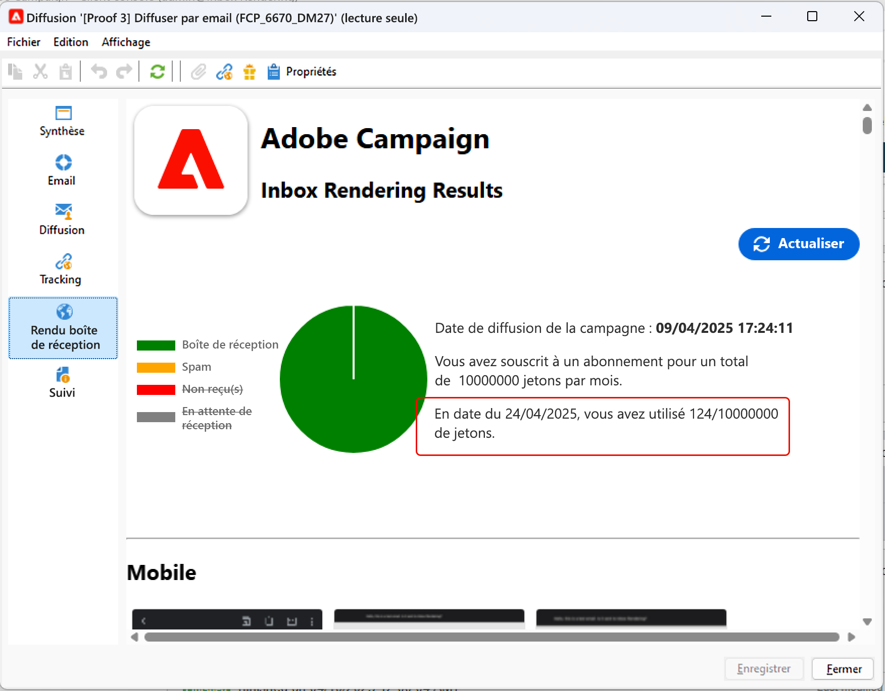
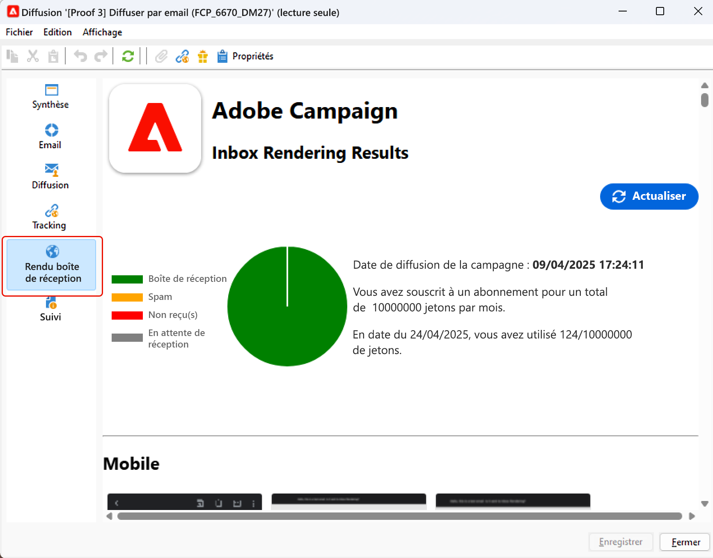
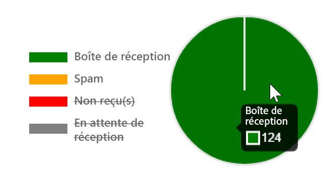
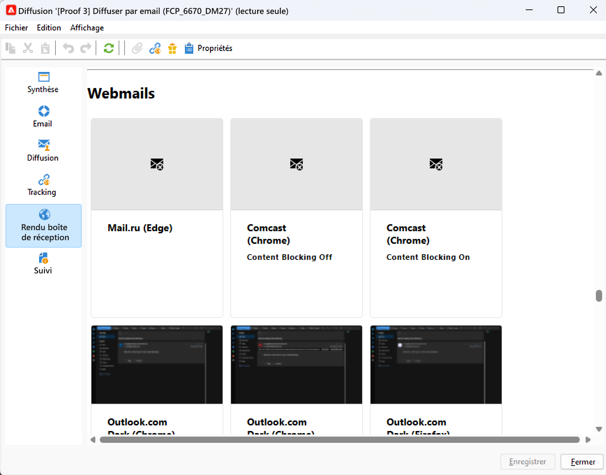
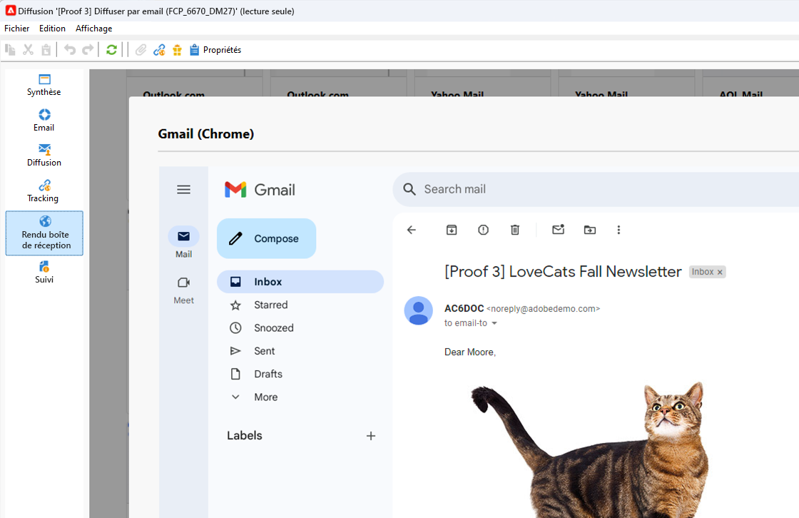

# Inbox rendering{#inbox-rendering}


## À propos de l&#39;inbox rendering {#about-inbox-rendering}

Avant d&#39;appuyer sur le bouton **Envoyer**, vérifiez que l&#39;affichage de votre message sera optimal pour les destinataires sur divers clients web, webmails et appareils.

Pour permettre cette vérification, Adobe Campaign utilise la solution web de test d&#39;email [Litmus](https://litmus.com/email-testing) afin de capturer les rendus et les rendre disponibles dans un rapport dédié. Vous pouvez ainsi visualiser l&#39;affichage du message envoyé dans les différents contextes de réception et vérifier la compatibilité sur les principaux postes de travail et dans les applications majeures.

>[!CAUTION]
>L’Inbox rendering n’est pas compatible avec les [diffusions récurrentes](communication-channels.md#recurring-delivery).

Litmus est une application de validation et de prévisualisation d&#39;emails offrant de nombreuses fonctionnalités. Elle permet aux créateurs de contenus d&#39;email de prévisualiser le contenu d&#39;un message dans plus de 70 outils de rendu d&#39;email, tels que la boîte de réception Gmail ou le client Apple Mail.

Les clients mobiles, de messagerie et webmail disponibles pour l&#39;**Inbox rendering** dans Adobe Campaign sont répertoriés sur le [site web de Litmus](https://litmus.com/email-testing) (cliquez sur **View all email clients**).

>[!NOTE]
>
>L&#39;Inbox rendering n&#39;est pas nécessaire pour tester les personnalisations dans les diffusions. Celles-ci peuvent être vérifiées à l&#39;aide des outils d&#39;Adobe Campaign tels que l&#39;**[!UICONTROL aperçu]** et les [bons à tirer](steps-validating-the-delivery.md#sending-a-proof).

## Activation de l&#39;Inbox rendering{#activating-inbox-rendering}

Pour les clients hébergés et hybrides, l&#39;Inbox rendering est configuré pour votre instance par l&#39;assistance technique et les consultants d&#39;Adobe. Pour plus d&#39;informations, contactez votre chargé de compte Adobe.

Pour les installations sur site, suivez la procédure ci-dessous pour configurer l&#39;Inbox rendering.

1. Installez le package **[!UICONTROL Inbox rendering (IR)]** via le menu **[!UICONTROL Outils]** >**[!UICONTROL Avancé]** > **[!UICONTROL Import de package]**. Pour plus d&#39;informations, voir la section [Installer des packages standard Campaign Classic](../../installation/using/installing-campaign-standard-packages.md).
1. Configurez un compte externe de type HTTP via le nœud **[!UICONTROL Administration]** > **[!UICONTROL Plateforme]** > **[!UICONTROL Comptes externes]**. Pour plus d&#39;informations, consultez la section [Créer un compte externe](../../installation/using/external-accounts.md#creating-an-external-account).
1. Définissez les paramètres du compte externe comme suit :
   * **[!UICONTROL Libellé]** : informations relatives au serveur de délivrabilité
   * **[!UICONTROL Nom interne]** : deliverabilityInstance
   * **[!UICONTROL Type]** : HTTP
   * **[!UICONTROL Serveur]** : https://deliverability-app.neolane.net/deliverability
   * **[!UICONTROL Chiffrement]** : Aucun
   * Cochez l&#39;option **[!UICONTROL Activé]**.

   

1. Accédez au nœud **[!UICONTROL Administration]** > **[!UICONTROL Plateforme]** > **[!UICONTROL Options]**. Recherchez l&#39;option **[!UICONTROL DmRendering_cuid]** et contactez l&#39;assistance technique pour obtenir l&#39;identifiant des rapports de diffusion qui doit être copié dans le champ **[!UICONTROL Valeur (texte)]**.
1. Modifiez le fichier **serverConf.xml** pour autoriser un appel au serveur Litmus. Ajoutez la ligne suivante à la section `<urlPermission>` :

   ```
   <url dnsSuffix="deliverability-app.neolane.net" urlRegEx="https://.*"/>
   ```

1. Chargez de nouveau la configuration à l&#39;aide de la commande suivante :

   ```
   nlserver config -reload
   ```

>[!NOTE]
>
>Vous devrez peut-être vous déconnecter de la console et vous reconnecter pour pouvoir utiliser l&#39;Inbox rendering.

## À propos des jetons Litmus {#about-litmus-tokens}

Litmus étant un service tiers, il fonctionne selon un modèle de crédit déduit par utilisation. Chaque fois qu&#39;un utilisateur fait appel à la fonctionnalité Litmus, un crédit est déduit.

Dans Adobe Campaign, le crédit correspond au nombre de rendus disponibles (appelés jetons).

>[!NOTE]
>
>Le nombre de jetons Litmus disponibles dépend de la licence Campaign que vous avez achetée. Vérifiez votre contrat de licence.

Chaque fois que vous utilisez la fonctionnalité **[!UICONTROL Inbox rendering]** dans une diffusion, un rendu généré réduit les jetons disponibles d&#39;une unité.

>[!IMPORTANT]
>
>Les jetons représentent chaque rendu et non le rapport d&#39;inbox rendering complet, ce qui signifie que :
>
>* Chaque fois que le rapport d&#39;inbox rendering est généré, un jeton est déduit par client de messagerie : un jeton pour le rendu Outlook 2000, un pour le rendu Outlook 2010, un pour le rendu Apple Mail 9, etc.
>* Pour une même diffusion, si vous régénérez le rapport d&#39;inbox rendering, le nombre de jetons disponibles est à nouveau réduit en fonction du nombre de rendus générés.
>


Le nombre de jetons disponibles restants est indiqué dans la **[!UICONTROL synthèse générale]** du [Rapport d&#39;inbox rendering](#inbox-rendering-report).



En règle générale, la fonctionnalité Inbox rendering est utilisée pour tester la structure HTML d&#39;un nouvel email. Chaque rendu nécessite environ 70 jetons (en fonction du nombre d&#39;environnements dans lequel il est généralement testé). Toutefois, dans certains cas, vous devrez peut-être générer plusieurs rapports d&#39;inbox rendering pour tester entièrement votre diffusion. Plusieurs vérifications peuvent donc nécessiter des jetons supplémentaires.

## Accéder au rapport d&#39;inbox rendering {#accessing-the-inbox-rendering-report}

Une fois que vous avez créé votre diffusion email et défini son contenu ainsi que la population ciblée, suivez la procédure décrite ci-après.

Pour plus d&#39;informations sur la conception et le ciblage d&#39;une diffusion, consultez [cette section](about-email-channel.md).

1. Dans la barre supérieure de la diffusion, cliquez sur le bouton **[!UICONTROL Inbox rendering]**.
1. Sélectionnez **[!UICONTROL Analyser]** pour commencer la capture.

   

   Un BAT est envoyé. Les miniatures de rendu sont accessibles dans ce BAT quelques minutes après l&#39;envoi des e-mails. Pour plus d&#39;informations sur l&#39;envoi de BAT, consultez[cette section](steps-validating-the-delivery.md#sending-a-proof).

1. Une fois envoyé, le BAT apparaît dans la liste de diffusion. Double-cliquez dessus.

   

1. Accédez à l&#39;onglet **Inbox Rendering** du BAT.

   

   Le rapport d&#39;inbox rendering s&#39;affiche.

## Rapport d&#39;inbox rendering {#inbox-rendering-report}

Ce rapport présente les inbox renderings tels qu&#39;ils apparaissent côté destinataire. Ils peuvent être différents selon le mode d&#39;ouverture de la diffusion email par le destinataire : dans un navigateur, sur un appareil mobile ou via une application de messagerie.

La **[!UICONTROL synthèse générale]** présente le nombre de messages reçus, indésirables (spam), non reçus ou en attente de réception sous la forme d&#39;une liste et dans une représentation graphique avec un code-couleur.



Survolez le graphique avec la souris pour afficher les détails de chaque couleur.

Le rapport est divisé en trois parties : **[!UICONTROL Mobile]**, **[!UICONTROL Clients de messagerie]** et **[!UICONTROL Webmails]**. Faites défiler le rapport pour afficher tous les rendus regroupés dans ces trois catégories.



Pour voir les détails de chaque rapport, cliquez sur la vignette correspondante. Le rendu s&#39;affiche pour le moyen de réception sélectionné.


