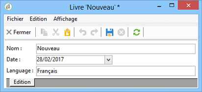
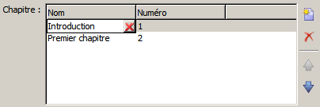
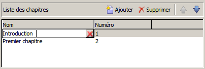
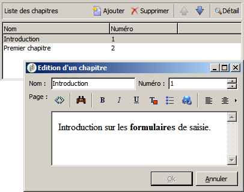
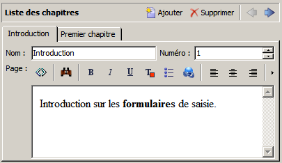
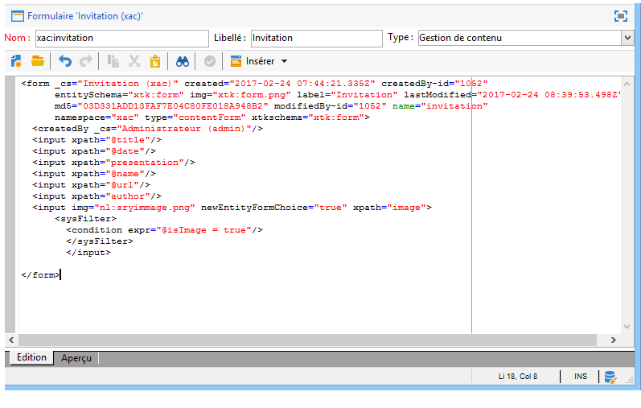

# Formulaires de saisie{#input-forms}


Vous trouverez ci-après quelques principes généraux sur l&#39;utilisation des formulaires de saisie dans Adobe Campaign.

Les formulaires sont présentés dans [cette section](../../configuration/using/identifying-a-form.md).

## Structure d&#39;un formulaire {#form-structure}

Le document XML d’un formulaire de saisie doit contenir l’élément racine **`<form>`** avec les attributs **name** et **namespace** pour renseigner le nom du formulaire et son espace de noms, respectivement.

```xml
<form name="form_name" namespace="name_space">
…
</form>
```

Par défaut, un formulaire est associé au schéma de données qui porte le même nom et le même espace de noms. Pour associer un formulaire avec un nom différent, saisissez la clé de schéma dans l’attribut **entity-schema** de l’élément **`<form>`**.

Pour illustrer la structure d&#39;un formulaire de saisie, nous allons décrire une interface à partir de notre schéma d&#39;exemple &quot;cus:livre&quot; :



Le formulaire de saisie correspondant :

```xml
<form name="book" namespace="cus" type="contentForm">
  <input xpath="@name"/>
  <input xpath="@date"/>
  <input xpath="@language"/>
</form>
```

La description des éléments d’édition commence à partir de l’élément racine **`<form>`**.

Un contrôle d’édition est renseigné sur un élément **`<input>`** avec l’attribut **xpath** qui contient le chemin du champ dans son schéma.

**Rappel sur la syntaxe des XPaths :**

Le langage XPath est utilisé dans Adobe Campaign pour référencer un élément ou un attribut appartenant à un schéma de données.

XPath est une syntaxe permettant la localisation d&#39;un nœud dans l&#39;arbre d&#39;un document XML.

Les éléments sont désignés par leur nom, les attributs sont désignés par leur nom précédé d&#39;un caractère &quot;@&quot;.

Exemples:

* **@date** : sélectionne l&#39;attribut de nom &quot;date&quot;
* **Chapter/@title** : sélectionne l’attribut &quot;titre&quot; sous l’élément `<chapter>`.
* **../@date** : sélectionne la date sur l&#39;élément parent de l&#39;élément courant

Le contrôle d&#39;édition s&#39;adapte automatiquement au type de données correspondant et utilise le libellé défini dans le schéma.

Par défaut, chaque champ est affiché sur une seule ligne et occupe tout l&#39;espace disponible, selon le type de données.

>[!CAUTION]
>
>Le formulaire de saisie doit référencer un attribut **type=&quot;contentForm&quot;** sur l’élément **`<form>`** pour ajouter automatiquement l’encadrement nécessaire à la saisie du contenu.

## Mise en forme {#formatting}

La disposition des contrôles entre eux ressemble à celle utilisée dans les tableaux HTML, avec la possibilité de diviser un contrôle en plusieurs colonnes, d&#39;utiliser des imbrications d&#39;éléments ou de spécifier l&#39;occupation de l&#39;espace disponible. Il faut cependant retenir que la mise en page autorise seulement des répartitions de proportions, il n&#39;est pas possible de spécifier des dimensions fixes pour un objet.

Pour plus d’informations, consultez [cette section](../../configuration/using/form-structure.md#formatting).

## Contrôles de type liste {#list-type-controls}

Pour modifier un élément de collection, il faut obligatoirement utiliser un contrôle de type liste.

### Liste en colonnes {#column-list}

Ce contrôle affiche une liste à colonnes éditable avec une barre d&#39;outils contenant les boutons d&#39;ajout et de suppression.



```xml
<input xpath="chapter" type="list">
  <input xpath="@name"/>
  <input xpath="@number"/>
</input>
```

Le contrôle liste doit être renseigné avec l&#39;attribut **type=&quot;list&quot;**, le chemin de la liste doit porter sur l&#39;élément de collection.

Les colonnes sont déclarées par les éléments **`<input>`** enfants de la liste.

>[!NOTE]
>
>Les boutons de flèches haut et bas d&#39;ordonnancement sont ajoutés automatiquement lorsque l&#39;attribut **ordered=&quot;true&quot;** est renseigné sur l&#39;élément de collection dans le schéma de données.

Par défaut, les boutons de la barre d&#39;outils sont alignés verticalement. Ils peuvent aussi être alignés horizontalement :



```xml
<input nolabel="true" toolbarCaption="List of chapters" type="list" xpath="chapter">
  <input xpath="@name"/>
  <input xpath="@number"/>
</input>
```

L&#39;attribut **toolbarCaption** force l&#39;alignement horizontal de la barre d&#39;outils et renseigne le titre au-dessus de la liste.

>[!NOTE]
>
>Pour ne pas afficher le libellé de l&#39;élément de collection sur la gauche du contrôle, il faut ajouter l&#39;attribut **nolabel=&quot;true&quot;**.

#### Zoom dans les listes {#zoom-in-a-list}

L&#39;insertion et l&#39;édition des données d&#39;une liste peuvent être renseignées dans un formulaire d&#39;édition séparé.

Les formes d&#39;édition dans les listes sont utilisées dans les cas suivants :

* facilité de saisie des informations,
* présence d&#39;un contrôle multi lignes,
* les colonnes de la liste ne comportent que les champs principaux et la forme affiche tous les champs de l&#39;élément de collection.



```xml
<input nolabel="true" toolbarCaption="List of chapters" type="list" xpath="chapter" zoom="true" zoomOnAdd="true">
  <input xpath="@name"/>
  <input xpath="@number"/>

  <form colcount="2" label="Editing a chapter">
    <input xpath="@name"/>
    <input xpath="@number"/>
    <input colspan="2" xpath="page"/>
  </form>
</input>
```

La définition du formulaire d’édition est spécifiée via l’élément **`<form>`** situé sous l’élément de liste. Sa structure est identique à celle d’un formulaire de saisie.

Un bouton **[!UICONTROL Détail]** est automatiquement ajouté lorsque l&#39;attribut **zoom=&quot;true&quot;** est renseigné dans la définition de la liste, celui-ci permet de lancer le formulaire d&#39;édition sur la ligne sélectionnée.

>[!NOTE]
>
>L&#39;ajout de l&#39;attribut **zoomOnAdd=&quot;true&quot;** force l&#39;appel du formulaire d&#39;édition sur l&#39;insertion d&#39;un élément de la liste.

### Liste d&#39;onglets {#tab-list}

Cette liste présente l&#39;édition des éléments de collection sous la forme d&#39;onglets.



```xml
<container toolbarCaption="List of chapters" type="notebooklist" xpath="chapter" xpath-label="@name">
  <container colcount="2">
    <input xpath="@name"/>
    <input xpath="@number"/>
    <input colspan="2" xpath="page"/>
  </container>
</container>
```

Le contrôle liste doit être renseigné avec l&#39;attribut **type=&quot;notebooklist&quot;**, le chemin renseigné doit porter sur l&#39;élément de collection.

Le titre de l&#39;onglet contient la valeur de la donnée renseignée à partir de l&#39;attribut **xpath-label**.

Les contrôles d’édition doivent être déclarés sous un élément **`<container>`** enfant du contrôle liste.

Utilisez les boutons de la barre d&#39;outils pour ajouter ou supprimer des éléments de la liste.

>[!NOTE]
>
>Les flèches gauche et droite d&#39;ordonnancement sont ajoutées automatiquement lorsque l&#39;attribut **ordered=&quot;true&quot;** est renseigné sur l&#39;élément de collection dans le schéma de données.

## Conteneurs {#containers}

Les conteneurs vous permettent de regrouper un ensemble de contrôles. Ils existent via l’élément **`<container>`**. Ils ont déjà été utilisés pour mettre en forme les contrôles dans plusieurs colonnes et pour contrôler la liste d’onglets.

Les containers et leur utilisation dans les formulaires de saisie sont présentés dans [cette section](../../configuration/using/form-structure.md#containers).

## Editer les formulaires {#editing-forms}

La zone d&#39;édition permet de renseigner le contenu XML du formulaire de saisie :



L&#39;onglet **[!UICONTROL Aperçu]** permet de visualiser le formulaire de saisie :


En savoir plus sur la [modification des formulaires](../../configuration/using/editing-forms.md) et la [structure des formulaires](../../configuration/using/form-structure.md).
