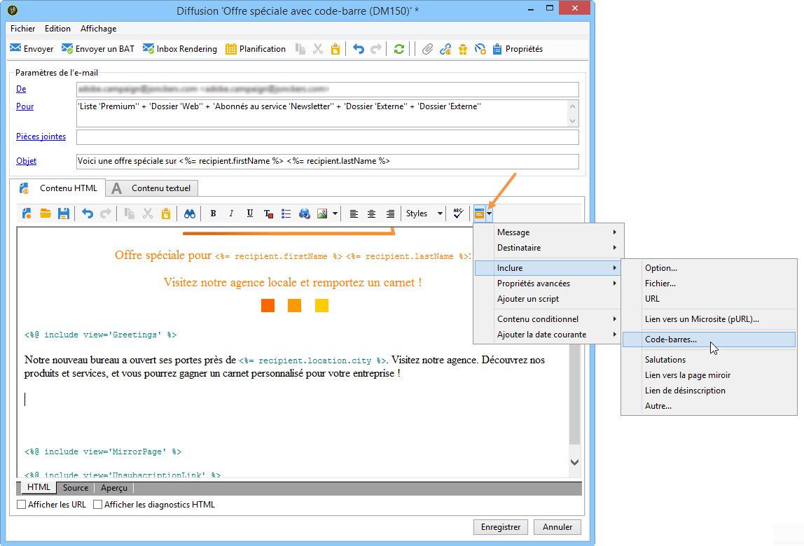
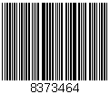
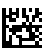
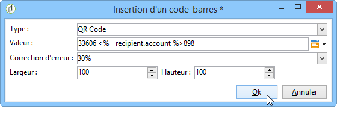
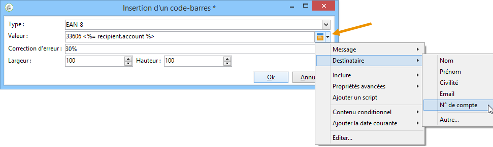
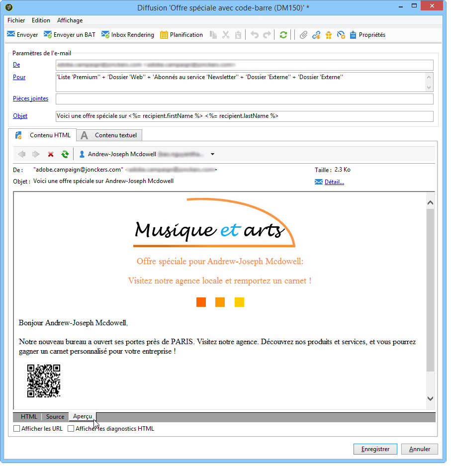
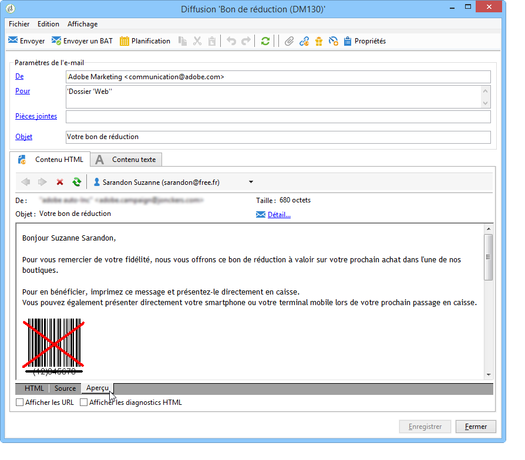

# Insertion d’un code-barres dans un e-mail{#insert-a-barcode-in-an-email}

Le module de génération de codes-barres permet de créer plusieurs types de codes-barres répondant aux normes les plus courantes, dans les formats 1D (unidimensionnel) et 2D (bidimensionnel).

Il est possible de générer dynamiquement un code-barres sous la forme d’un bitmap au moyen d’une valeur définie grâce à des critères client. Des code-barres personnalisés peuvent être inclus dans des campagnes par e-mail. Le destinataire pourra imprimer ce message et le présenter à la société émettrice qui le scannera (lors d’un passage en caisse par exemple).

Pour insérer un code-barres dans un email, positionnez le curseur dans le contenu, là où vous souhaitez l&#39;afficher, et cliquez sur le bouton de personnalisation. Choisissez **[!UICONTROL Inclure > Code-barres...]**.

Puis paramétrez les éléments suivants en fonction de vos besoins :

1. Choisissez le type de code-barres.

   * Pour le format 1D, Adobe Campaign propose les types suivants: Codabar, Code 128, GS1-128 (anciennement EAN-128), UPC-A, UPC-E, ISBN, EAN-8, Code39, Interleaved 2 of 5, POSTNET et Royal Mail (RM4SCC).

      Exemple de code-barres 1D :

      

   * Les types DataMatrix et PDF417 concernent le format 2D.

      Exemple de code-barres 2D :

      

   * Pour insérer un QR Code, sélectionnez ce type et indiquez le taux de correction d&#39;erreur à appliquer. Ce taux définit la quantité d&#39;informations répétées et donc une tolérance plus ou moins importante aux dégradations.

      

      Exemple de QR Code :

      

1. Indiquez la taille du code-barres à insérer dans l&#39;email : le paramétrage de l&#39;échelle permet d&#39;augmenter ou de réduire la taille du code-barres, de x 1 à x 10.
1. Le champ **[!UICONTROL Valeur]** permet de définir la valeur du code-barres. Une valeur peut correspondre à une offre promotionnelle et peut être une fonction d&#39;un critère, ce peut être la valeur d&#39;un champ de la base de données relative aux clients.

   L&#39;exemple ci-dessous montre un code-barres de type EAN-8 auquel a été ajouté le numéro de compte d&#39;un destinataire. Pour ajouter ce numéro de compte, cliquez sur le bouton de personnalisation situé à droite du champ **[!UICONTROL Valeur]** et sélectionnez **[!UICONTROL Destinataire > N° de compte]**.

   

1. Le champ **[!UICONTROL Hauteur]** permet de paramétrer la hauteur du code-barres sans en modifier la largeur, soit l&#39;espacement entre chaque barre.

   Il n&#39;existe pas de contrôle restrictif de saisie en fonction du type de code-barres sélectionné. Si une valeur de code-barres est erronée, vous ne le saurez que lorsque vous passerez en vue **Aperçu** avec le code-barres marqué d&#39;une croix rouge.

   >[!NOTE]
   >
   >La valeur donnée à un code-barres dépend du type choisi. Par exemple, un type EAN-8 devra comporter exactement huit chiffres.
   >
   >Le bouton de personnalisation situé à droite du champ **[!UICONTROL Valeur]** permet d&#39;ajouter une ou plusieurs données en plus de la valeur elle-même. Ceci vient enrichir le code-barres sous réserve que la norme du code-barres l&#39;accepte.
   >
   >Par exemple, si vous utilisez un code-barres de type GS1-128 et que vous souhaitez renseigner le numéro de compte d&#39;un destinataire en plus de la valeur, cliquez sur le bouton de personnalisation et sélectionnez **[!UICONTROL Destinataire > N° de compte]**. Si le numéro de compte du destinataire sélectionné est correctement renseigné, le code-barres le prend en considération.

Une fois ces éléments paramétrés, vous pouvez finaliser votre email et l&#39;envoyer. Pour éviter toute erreur, vérifiez toujours avant une diffusion que votre contenu s&#39;affiche correctement en cliquant sur l&#39;onglet **[!UICONTROL Aperçu]**.

>[!NOTE]
>
>Si la valeur d&#39;un code-barres s&#39;avère incorrecte, le bitmap qui le représente s&#39;affiche barré d&#39;une croix rouge.

