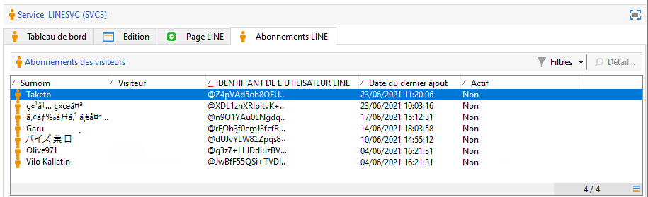
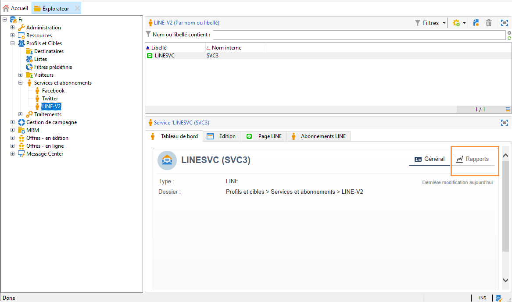

# Canal LINE{#line-channel}

LINE est une application de messagerie instantanée et d&#39;appels vocaux et vidéos gratuits, disponible sur tous les smartphones (iPhone, Android, Windows Phone, Blackberry, Nokia) et sur PC. Adobe Campaign vous permet d&#39;envoyer des messages LINE.

LINE est uniquement disponible pour les installations On-premise ou Managed Services.

LINE peut aussi être combinée au module de message transactionnel pour envoyer des messages en temps réel sur l&#39;application LINE installée sur les appareils mobiles du consommateur. Pour en savoir plus, consultez cette [page](../../message-center/using/transactional-messaging-architecture.md#transactional-messaging-and-line).

Les sections ci-dessous fournissent des informations spécifiques au canal LINE. Pour plus d’informations sur la création d’une diffusion, voir[cette section](../../delivery/using/steps-about-delivery-creation-steps.md).

Pour utiliser le canal LINE, les étapes de réalisation sont les suivantes :

1. Création d&#39;une diffusion
1. Paramétrage de contenu du message
1. Choisir la population cible
1. Diffusion des messages
1. Suivi de la diffusion (tracking, mise en quarantaine, rapports, etc.).

## Configuration du canal LINE {#setting-up-line-channel}

### Création d&#39;un compte LINE et d&#39;un compte externe {#creating-a-line-account-and-an-external-account-}

>[!NOTE]
>
>Avant de créer un compte LINE et un compte externe, vous devez installer le package LINE sur votre instance. Pour en savoir plus, consultez la section [LINE](../../installation/using/installing-campaign-standard-packages.md#line-package) dans le guide d&#39;installation.

Dans un premier temps, vous devez créer un compte LINE pour ensuite le lier à Adobe Campaign. Ainsi, vous pourrez envoyer des messages LINE aux utilisateurs qui ont ajouté votre compte LINE dans leur application mobile. Les comptes externes et le compte LINE ne peuvent être gérés que par l&#39;administrateur fonctionnel de la plateforme.

Pour créer et paramétrer un compte LINE, voir [https://developers.line.me/](https://developers.line.me/).

To create and configure a LINE service, see [Managing subscriptions](../../delivery/using/managing-subscriptions.md).

Enfin, pour créer un compte externe sur Adobe Campaign :

1. Dans l&#39;arborescence **Administration** > **Plate-forme**, cliquez sur l&#39;onglet **Comptes externes**.
1. Cliquez ensuite sur l&#39;icône **Nouveau**.

   

1. Complètez les champs **Libellé** et **Nom interne**.
1. Dans le champ **[!UICONTROL Type]**, sélectionnez Routage. Dans le champ **Canal**, sélectionnez LINE.
1. Click **[!UICONTROL Save]** to create your LINE external account.
1. Un champ de personnalisation **LINE** apparaît sous l&#39;icône **Général**. Renseignez les champs suivants :

   

   * **Alias** du canal : est fourni via votre compte LINE dans l’onglet **[!UICONTROL Channels]** > **[!UICONTROL Technical configuration]** .
   * **Identifiant du canal** : est fourni via votre compte LINE dans l&#39;onglet **Channels**> **Basic Information panel**.
   * **Clé secrète du canal** : est fourni via votre compte LINE dans l&#39;onglet **Channels**> **Basic Information panel**.
   * **Jeton** d’accès : est fourni via votre compte LINE sur le portail des développeurs ou en cliquant sur le **[!UICONTROL Get access token]** bouton.
   * **Date d&#39;expiration du jeton d&#39;accès** : permet de spécifier la date d&#39;expiration d&#39;Access token.
   * **Service d&#39;abonnement LINE** : permet de spécifier le service auquel les utilisateurs seront abonnés.

>[!NOTE]
>
>Vous devez vérifier que les processus **[!UICONTROL LINE access token update (updateLineAccessToken)]** et **[!UICONTROL Delete blocked LINE users (deleteBlockedLineUsers)]** les processus ont démarré. Dans l’explorateur, cliquez **[!UICONTROL Administration > Production > Technical workflows > LINE workflows]** pour vérifier l’état des processus.

## Créer la diffusion {#creating-the-delivery}

Pour créer une diffusion **LINE** vous devez suivre les étapes suivantes :

>[!NOTE]
>
>Les concepts généraux relatifs à la création d&#39;une diffusion sont présentés dans [cette section](../../delivery/using/steps-about-delivery-creation-steps.md).

1. Dans l’ **[!UICONTROL Campaigns]** onglet, sélectionnez **[!UICONTROL Deliveries]** puis cliquez sur le **[!UICONTROL Create]** bouton.
1. In the window that appears, select **[!UICONTROL LINE V2 delivery]** delivery template.

   

1. Identifiez la diffusion avec un libellé, un code et une description. Voir à ce propos [cette section](../../delivery/using/steps-create-and-identify-the-delivery.md#identifying-the-delivery).
1. Click **[!UICONTROL Continue]** to create your delivery.

## Définir le contenu {#defining-the-content}

Pour définir le contenu d&#39;une diffusion LINE, vous devez d&#39;abord ajouter un type de message à votre diffusion. Chaque diffusion LINE peut contenir jusqu&#39;à 5 messages.

Vous pouvez effectuer un choix entre deux types de messages :

* Message texte
* Image et lien

### Paramétrer une diffusion de type Message texte {#configuring-a-text-message-delivery}

Une diffusion LINE de type **Message texte** est un message envoyé aux destinataires sous forme de texte.

Le paramétrage de ce type de message est similaire au paramétrage du format **texte** dans un email. Pour plus d&#39;informations, voir [cette page](../../delivery/using/defining-the-email-content.md#message-content).

### Paramétrer une diffusion de type Image et lien {#configuring-an-image-and-link-delivery}

Une diffusion LINE de type **Image et lien** est un message envoyé aux destinataires sous la forme d&#39;une image pouvant contenir une ou plusieurs URL.

Vous pouvez utiliser :

* une **image personnalisée**,

   >[!NOTE]
   >
   >Vous pouvez utiliser la variable **%SIZE%** : cette variable permet d&#39;optimiser l&#39;affichage de l&#39;image en fonction de la taille de l&#39;écran de l&#39;appareil mobile du destinataire de la diffusion.

   

* une **image URL**,

   

   Les images URL vous permettent d&#39;utiliser des images de résolutions différentes afin d&#39;optimiser la visibilité de la diffusion sur différents appareils mobiles. Seules les images dont la hauteur et la largeur sont identiques sont prises en charge.

   Les images peuvent être définies en fonction de la taille de l&#39;écran :

   * 1040px
   * 700px
   * 460px
   * 300px
   * 240px
   >[!NOTE]
   >
   >La taille 1 040 x 1 040 px est obligatoire pour toutes les images LINE avec un lien.

   Vous devez ensuite ajouter un texte alternatif qui apparaîtra en pop-up sur l&#39;appareil mobile du destinataire.

* et **[!UICONTROL Links]**.

   

   La **[!UICONTROL Links]** section vous permet de choisir entre différentes mises en page qui divisent votre image en plusieurs zones cliquables. Vous pouvez ensuite attribuer à chacun d’eux un lien dédié.

>[!NOTE]
>
>La syntaxe &lt;%@ include option=&#39;NmsServer_URL&#39; %>/webApp/APP3?id=&lt;%=escapeUrl(cryptString(visitor.id))%> permet d&#39;inclure un lien vers une web app dans un message LINE.

### Recommandations {#recommendations}

* Lorsque vous envoyez une diffusion LINE pour la première fois à un nouveau destinataire, vous devez y ajouter le message officiel de LINE à propos des règles d&#39;utilisation et de consentement. Ce message officiel est disponible à l&#39;adresse suivante : [https://terms.line.me/OA_privacy/sp?lang=fr](https://terms.line.me/OA_privacy/sp?lang=fr).

## Choisir la population cible {#selecting-the-target-population}

La sélection des destinataires d’une remise LINE est similaire à la définition des destinataires de la remise par courrier électronique. Pour plus d’informations, voir [Identification des populations](../../delivery/using/steps-defining-the-target-population.md)cibles.

Le ciblage est réalisé sur les **visiteurs**.

## Envoyer les messages {#sending-messages}

Lorsque votre diffusion est correctement créée et paramétrée, vous pouvez l&#39;envoyer à la cible définie précédemment.

L’envoi de remises LINE est similaire à l’envoi d’une remise par courrier électronique. Pour plus d’informations sur l’envoi d’une remise, voir [Envoi de messages](../../delivery/using/sending-messages.md).

## Accéder aux rapports {#accessing-reports}

Vous pouvez afficher les rapports sur le service LINE en cliquant **[!UICONTROL Profiles and Targets > Services and Subscriptions > LINE]** dans l’explorateur. Cliquez ensuite sur l’ **[!UICONTROL Reports]** icône du service LINE.

Pour afficher les rapports sur les livraisons en ligne, cliquez sur **[!UICONTROL Campaign Management > Deliveries]** puis sélectionnez la livraison souhaitée. Les rapports de suivi indiquent le taux de clics publicitaires. LINE ne tient pas compte du taux d&#39;ouverture.

## Exemple : créer et envoyer un message LINE personnalisé {#example--create-and-send-a-personalized-line-message}

Dans cet exemple, nous allons créer et paramétrer un message texte et une image contenant des données qui seront personnalisées en fonction du destinataire.

1. Create your LINE delivery by clicking the **[!UICONTROL Create]** button from the **[!UICONTROL Campaign]** tab.

   

1. Select the **[!UICONTROL LINE V2 delivery]** delivery template and name your delivery.

   

1. Dans la fenêtre de paramétrage de votre diffusion, sélectionnez votre population cible.

   

1. Cliquez sur **[!UICONTROL Add]** pour créer votre message et sélectionnez le **[!UICONTROL Message type]**.

   Nous voulons d&#39;abord créer un message texte.

   

1. Place your cursor in the place where you want to insert the personalized text and click the drop-down icon then select **[!UICONTROL Visitor > First name]**.

   

1. Suivez la même procédure pour ajouter une image, en la sélectionnant **[!UICONTROL Image and links]** dans la **[!UICONTROL Message type]** liste déroulante.

   Ajoutez l&#39;image URL.

   

1. In the **[!UICONTROL Links]** section, select the layout that will divide your image in multiple clickable regions.
1. Affectez une URL à chaque zone de votre image.

   

1. Save your delivery then click **[!UICONTROL Send]** to analyze and send it to the target.

   La diffusion est envoyée à la cible :

   
