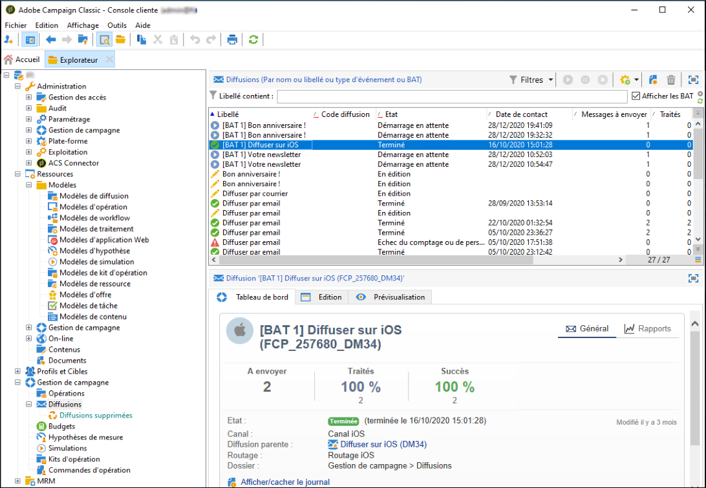

# Accès à la liste des diffusions {#list-of-deliveries}

Vous pouvez accéder aux diffusions à partir de la liste des diffusions accessible depuis le nœud **[!UICONTROL Gestion de campagne > Diffusions]** de l&#39;arborescence.

Par défaut, la liste des diffusions affiche les noms et états des diffusions créées dans le nœud sélectionné. Elle affiche également le nombre de messages à envoyer, traités et envoyés avec succès.

* Le nombre de **[!UICONTROL messages à envoyer]** correspond au nombre de destinataires ciblés après analyse de la diffusion et avant envoi.
* Le nombre de messages de la colonne **[!UICONTROL succès]** correspond au nombre de messages émis par le serveur et bien reçus par le destinataire.
* Le nombre de messages **[!UICONTROL traités]** correspond au nombre de messages reçus avec succès auquel s’ajoute le nombre de messages en erreur.

>[!NOTE]
>
>Pour les diffusions volumineuses, il peut être utile d&#39;actualiser ces valeurs. Pour cela, sélectionnez la diffusion visée et cliquez avec le bouton droit de la souris. Choisissez **[!UICONTROL Action > Recalculer les indicateurs de diffusion et de tracking...]** et renseignez les étapes de l&#39;assistant pour mettre à jour les informations.

**Rubriques connexes :**

* [Tableau de bord de la diffusion](delivery-dashboard.md)
* [Statuts de diffusion](delivery-statuses.md)
