# Gestion des abonnements{#managing-subscriptions}

## À propos des services d&#39;informations {#about-information-services}

Un service d&#39;information est caractérisé par :

* une inscription, un abonnement (opt-in),
* une désinscription, un désabonnement volontaire (opt-out) ou automatique (service à durée limitée : par exemple pour une offre d&#39;essai),
* des mécanismes de confirmation d&#39;inscription et/ou de désinscription (mécanismes simples avec confirmation, double opt-in, etc.),
* un tracking de l’historique des abonnés.

Ces services sont accompagnés, en standard, des rapports et de statistiques spécifiques : tracking des abonnés, niveaux de fidélité, courbes de désinscription, etc.

Pour les emails, les liens de désinscription obligatoires sont automatiquement générés et l&#39;ensemble du processus opt-in/opt-out est alors totalement automatisé avec un tracking des historiques garantissant une totale conformité avec les règlementations en vigueur.

Les opérations d&#39;abonnement/désabonnement aux services peuvent être réalisées selon trois modes différents :

1. manuellement,
1. par un import (abonnement seulement),
1. via un formulaire web,

>[!NOTE]
>
>Un exemple de création d&#39;un formulaire d&#39;abonnement avec double opt-in est présenté dans [cette section](../../web/using/use-cases--web-forms.md#create-a-subscription--form-with-double-opt-in).

## Créer un service d&#39;information {#creating-an-information-service}

Vous pouvez créer et gérer des abonnements à des services d&#39;information auxquels seront associés des messages de confirmation ou des diffusions automatiques vers les abonnés.

Pour accéder à la vue d’ensemble des services d’information, ouvrez l’onglet **[!UICONTROL Profils et cibles]** et cliquez sur le lien **[!UICONTROL Services et abonnements]**.

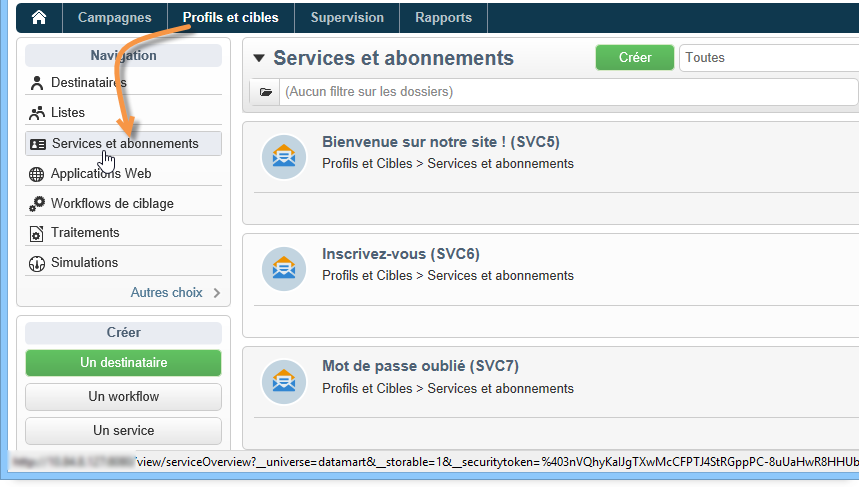

Pour éditer un service existant, cliquez sur son nom. Pour créer un service, cliquez sur le bouton **[!UICONTROL Créer]** situé au-dessus de la liste.

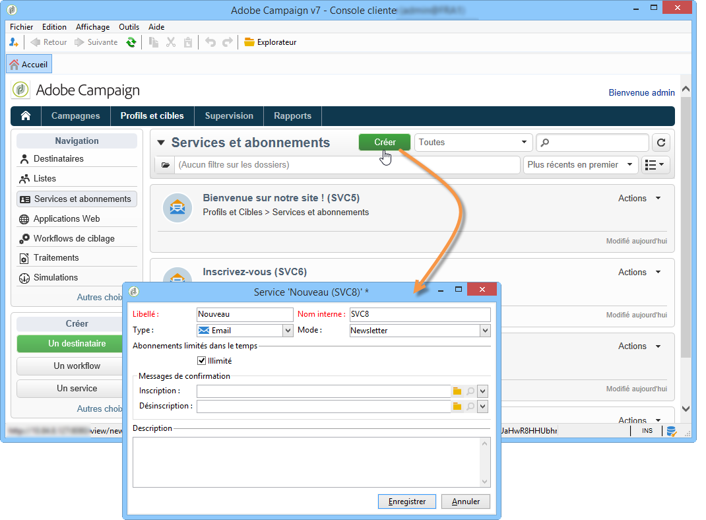

* Saisissez le nom du service dans le champ **[!UICONTROL Libellé]** et sélectionnez le canal de diffusion : email, mobile, Facebook, X (anciennement appelé Twitter) ou applications mobiles.

  >[!NOTE]
  >
  >Les abonnements facebook et X sont détaillés dans la section [cette section](../../social/using/about-social-marketing.md). Les abonnements aux applications mobiles sont détaillés dans [À propos de Mobile App Channel](about-mobile-app-channel.md).

* Pour un service de type Email, choisissez le **mode de diffusion**. Les modes possibles sont : **[!UICONTROL Newsletter]** ou **[!UICONTROL Viral]**.
* Vous pouvez envoyer des **messages de confirmation** lors de l&#39;inscription ou de la désinscription : vous devez alors choisir les modèles de diffusion à utiliser pour créer les diffusions correspondantes depuis les champs **[!UICONTROL Inscription]** ou **[!UICONTROL Désinscription]**. Ces modèles doivent être paramétrés avec un mapping de ciblage de type **[!UICONTROL Abonnement]**, sans aucune cible définie. Pour plus d&#39;informations, consultez la section [À propos du canal Email](about-email-channel.md).
* Par défaut, les abonnements sont illimités. Vous pouvez décocher l&#39;option **[!UICONTROL Illimité]** pour définir la durée de validité du service. La durée peut alors être spécifiée en jours (**[!UICONTROL j]**) ou en mois (**[!UICONTROL m]** ).

Une fois le service enregistré, il est ajouté dans la liste des Services et abonnements : cliquez sur son nom pour le modifier. Plusieurs onglets sont alors proposés. L&#39;onglet **[!UICONTROL Abonnements]** permet de consulter la liste des inscrits au service d&#39;information (onglet **[!UICONTROL Abonnements actifs]**) ou l’historique des abonnements/désinscriptions (onglet **[!UICONTROL Historique]**). Vous pouvez également ajouter et supprimer des abonnés depuis cet onglet. Voir [Ajouter et supprimer des abonnés](#adding-and-deleting-subscribers).

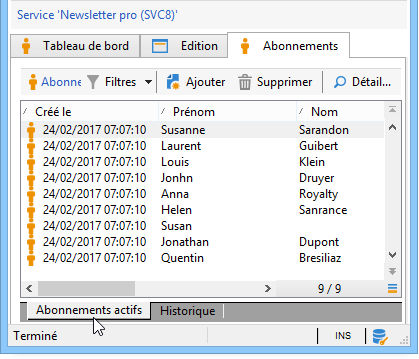

Le bouton **[!UICONTROL Détail...]** permet de consulter les propriétés de l&#39;abonnement pour le destinataire sélectionné.

Vous pouvez modifier les propriétés de l&#39;abonnement pour un destinataire.

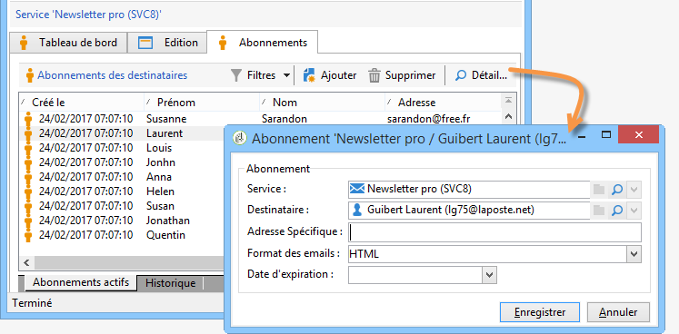

Depuis le tableau de bord, cliquez sur **[!UICONTROL Rapports]** pour suivre les abonnements : évolution des abonnements, nombre total d’abonnés, etc. Vous pouvez archiver les rapports et consulter les historiques depuis cet onglet.

## Ajouter et supprimer des abonnés {#adding-and-deleting-subscribers}

Depuis l&#39;onglet **[!UICONTROL Abonnements]** d&#39;un service d&#39;information, cliquez sur le bouton **[!UICONTROL Ajouter]** pour abonner des destinataires. Vous pouvez également cliquer avec le bouton droit de la souris dans la liste des abonnés et choisir **[!UICONTROL Ajouter]**. Sélectionnez ensuite le dossier où sont stockés les profils à abonner puis sélectionnez les profils à inscrire et cliquez sur **[!UICONTROL OK]** pour valider.

Pour supprimer des abonnés, sélectionnez-les puis cliquez sur le bouton **[!UICONTROL Supprimer]**. Vous pouvez également cliquer avec le bouton droit de la souris dans la liste des abonnés et choisir **[!UICONTROL Supprimer]**.

Dans les deux cas, vous pouvez envoyer un message de confirmation aux utilisateurs concernés si un modèle de diffusion de désinscription a été joint au service (voir [Créer un service d’information](#creating-an-information-service)). Un avertissement vous permet de valider ou non cette diffusion :

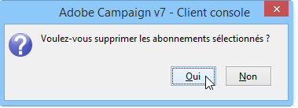

Voir [Inscription et désinscription](#subscription-and-unsubscription-mechanisms).

## Diffuser aux abonnés d&#39;un service {#delivering-to-the-subscribers-of-a-service}

Pour diffuser aux abonnés d&#39;un service d&#39;information, vous devez cibler sur les abonnés au service d&#39;information visé, comme dans l&#39;exemple ci-dessous :

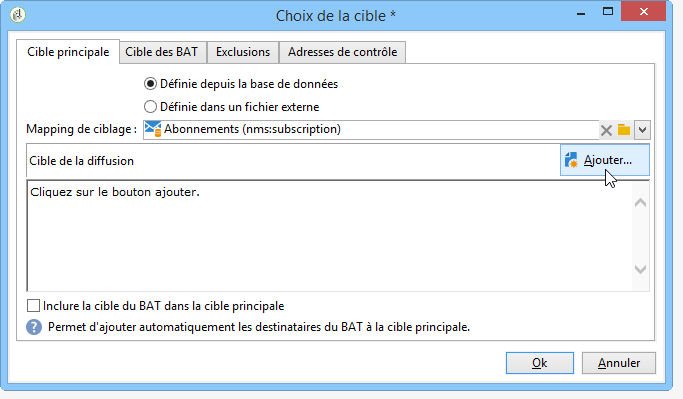

>[!CAUTION]
>
>Le mapping de ciblage doit être **[!UICONTROL Abonnements]**.

Sélectionnez **[!UICONTROL Abonnés d&#39;un service d&#39;information]** et cliquez sur **[!UICONTROL Suivant]**.

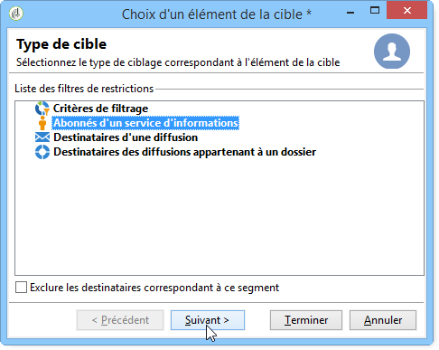

Choisissez le service d&#39;information ciblé et cliquez sur **[!UICONTROL Terminer]**.

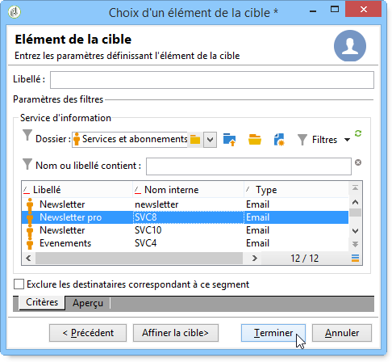

L&#39;onglet **[!UICONTROL Aperçu]** permet de visualiser la liste des abonnés au service d&#39;informations sélectionné.

## Inscription et désinscription {#subscription-and-unsubscription-mechanisms}

Vous pouvez mettre en place des mécanismes d&#39;inscription et de désinscription afin d&#39;automatiser les processus et la gestion des abonnés.

>[!NOTE]
>
>Vous pouvez envoyer un message de confirmation aux nouveaux abonnés.\
>Le contenu de ce message est défini dans le paramétrage du service d&#39;information, depuis le champ **[!UICONTROL Inscription]** ou **[!UICONTROL Désinscription]**.
>
>Les messages de confirmation sont créés à partir des modèles de diffusion indiqués dans ces champs. Ces modèles doivent utiliser le mapping de ciblage des **[!UICONTROL Abonnements]**.

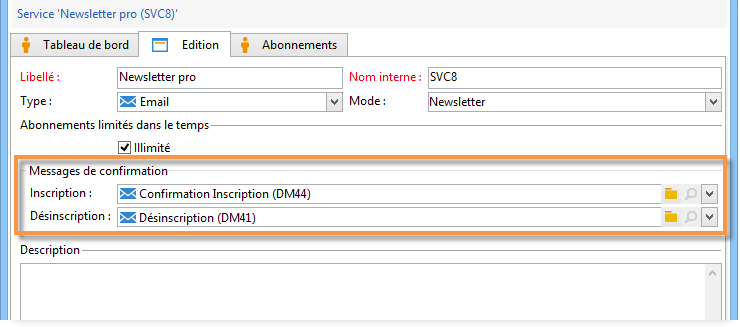

### Inscrire un destinataire à un service {#subscribing-a-recipient-to-a-service}

Pour inscrire des destinataires à un service d&#39;information, vous pouvez :

* Ajouter manuellement ce service : pour cela, depuis l&#39;onglet **[!UICONTROL Abonnements]** de leur profil, cliquez sur le bouton **[!UICONTROL Ajouter]** et sélectionnez le service d&#39;information visé.

  Voir à ce sujet la section sur l&#39;édition de profils dans [cette section](../../platform/using/editing-a-profile.md).

* Abonner automatiquement à ce service un ensemble de destinataires. La liste de ces destinataires peut être issue d&#39;une opération de filtrages, d&#39;un groupe, d&#39;un dossier, d&#39;un import ou d&#39;une sélection directe par la souris. Pour abonner ces destinataires, sélectionnez les profils et cliquez sur le bouton droit de la souris. Choisissez **[!UICONTROL Actions > Abonner la sélection à un service...]** puis sélectionnez le service visé et lancez l&#39;opération.
* Importer des destinataires et les abonner automatiquement à un service d&#39;information : pour cela, sélectionnez le service visé dans la dernière étape de l&#39;assistant d&#39;import.

  Pour plus d’informations, consultez [cette section](../../platform/using/executing-import-jobs.md).

* Utiliser un formulaire web pour que les destinataires puissent s&#39;abonner à un service.

  Pour plus d’informations, consultez [cette section](../../web/using/about-web-applications.md).

* Créer un workflow de ciblage et utiliser une boîte de type **[!UICONTROL Service d&#39;inscriptions]**.

  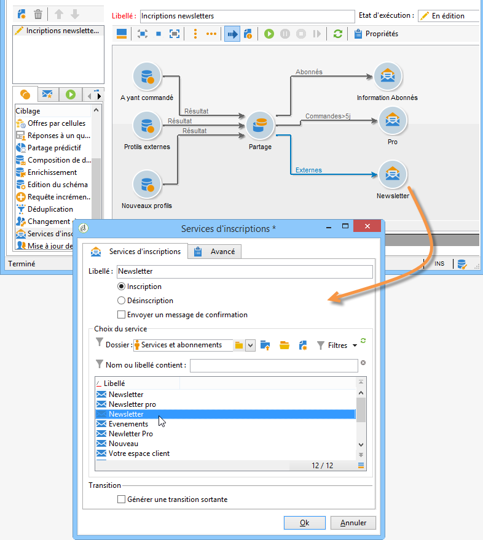

  Les workflows et leur utilisation sont présentés dans [cette section](../../workflow/using/about-workflows.md).

### Désinscrire un destinataire d&#39;un service {#unsubscribing-a-recipient-from-a-service}

#### Désinscription manuelle {#manual-unsubscribing}

Les diffusions par email doivent légalement contenir un lien de désinscription. Les destinataires peuvent cliquer sur ce lien pour mettre à jour leur profil et ainsi être exclu des cibles des prochaines diffusions.

Le lien de désinscription par défaut est inséré via le dernier bouton de la barre d’outils de l’éditeur de contenu fourni dans l’assistant de diffusion (voir [À propos de la personnalisation](about-personalization.md)). Lorsque le destinataire clique sur ce lien, le profil est ajouté à la liste bloquée (opt-out), ce qui signifie que ce destinataire ne sera plus ciblé par aucune action de diffusion.

Les destinataires peuvent toutefois choisir de se désinscrire d’un service sans se désinscrire de tous les services. Pour ce faire, vous pouvez utiliser un formulaire web (voir [cette section](../../web/using/adding-fields-to-a-web-form.md#subscription-checkboxes)) ou insérer un lien de désinscription personnalisé (voir [Blocs de personnalisation](personalization-blocks.md)).

Vous pouvez également désinscrire manuellement un destinataire à partir de son profil. Pour cela, cliquez sur l&#39;onglet **[!UICONTROL Abonnements]** du destinataire visé, sélectionnez le ou les services d&#39;information concernés et cliquez sur **[!UICONTROL Supprimer]**.

Vous pouvez enfin désinscrire un ou plusieurs destinataires depuis le service d&#39;information concerné. Pour cela, cliquez sur l&#39;onglet **[!UICONTROL Abonnements]** du service, sélectionnez le ou les destinataires concernés et cliquez sur **[!UICONTROL Supprimer]**.

#### Désabonnement automatique {#automatic-unsubscription}

Un service d&#39;information peut avoir une durée limitée : les destinataires seront automatiquement désabonnés une fois le délai de validité expiré. Ce délai est spécifié dans l&#39;onglet **[!UICONTROL Edition]** des propriétés du service. Il est exprimé en jours.

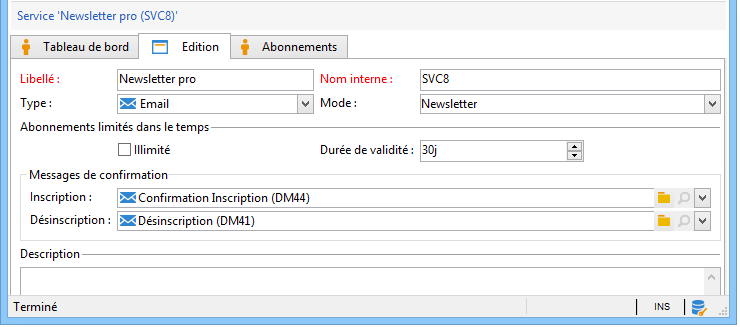

Vous pouvez également mettre en place un workflow de désinscription sur une population. Pour cela, vous devez procéder comme pour un workflow d&#39;inscription, mais en sélectionnant l&#39;option **[!UICONTROL Désinscription]**. Voir [Inscrire un destinataire à un service](#subscribing-a-recipient-to-a-service).

### Tracking des abonnés {#subscriber-tracking}

Le lien **[!UICONTROL Rapport]** du tableau de bord permet de suivre les variations d&#39;inscription aux services d&#39;information.

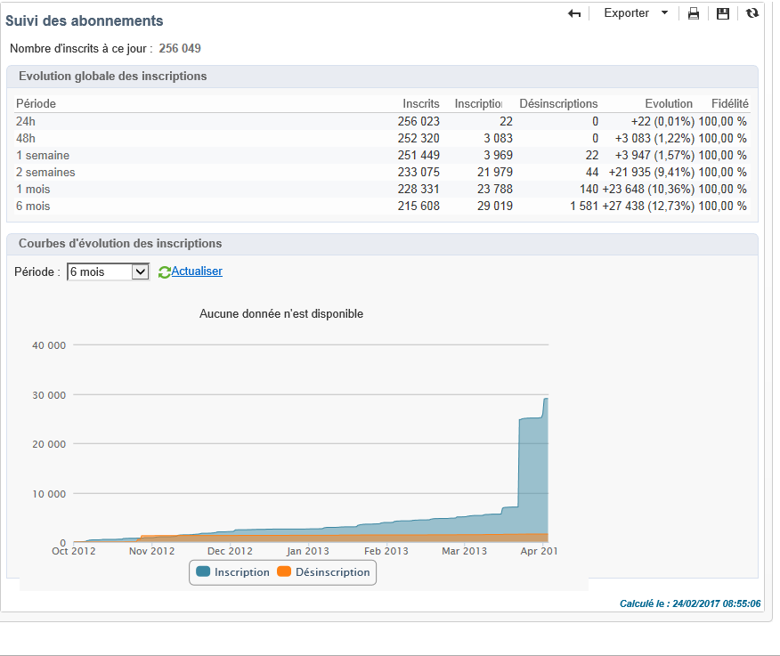
