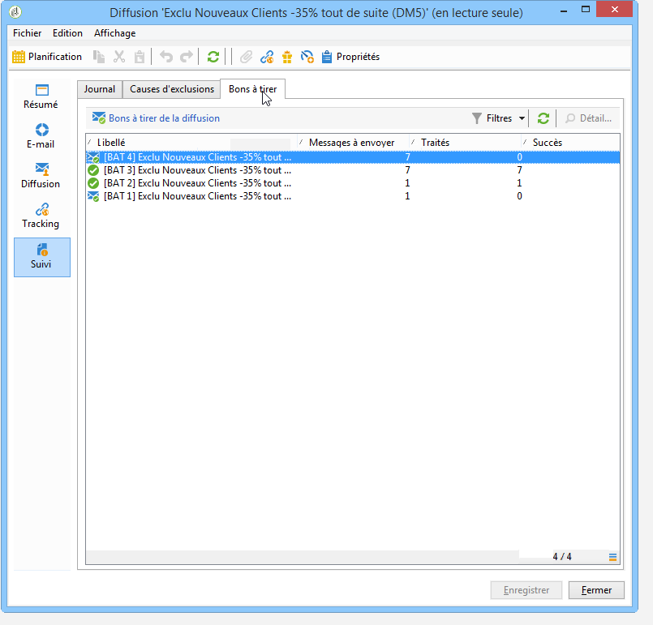

# Contrôler une diffusion{#monitoring-a-delivery}

Le **tableau de bord des diffusions** est la clé pour suivre les diffusions et les erreurs éventuelles rencontrées lors de l&#39;envoi des messages.

**Rubriques connexes :**

* [Comprendre les diffusions en échec](../../delivery/using/understanding-delivery-failures.md)
* [Comprendre la gestion des quarantaines](../../delivery/using/understanding-quarantine-management.md)
* [Bonnes pratiques de diffusion](https://docs.campaign.adobe.com/doc/AC/getting_started/EN/deliveryBestPractices.html)
* [Prise en main : Gestion de la délivrabilité](https://docs.campaign.adobe.com/doc/AC/getting_started/EN/deliverability.html)

## Tableau de bord de la diffusion {#delivery-dashboard}

Pour consulter les informations relatives à une diffusion, éditez-la, consultez son tableau de bord et cliquez sur les onglets disponibles.

Le contenu de ces onglets n&#39;est plus modifiable lorsque la diffusion a été envoyée.


### Synthèse des diffusions (Delivery summary){#delivery-summary}

L’ **[!UICONTROL Summary]** onglet contient les caractéristiques de la diffusion : état de livraison, canal utilisé, informations sur l&#39;expéditeur, sujet, informations concernant l&#39;exécution. Pour plus d’informations, reportez-vous à la section [Nombre de messages envoyés](#number-of-messages-sent).

Le **[!UICONTROL reports]** lien vous permet de consulter un ensemble de rapports concernant l’action de remise : rapport général de livraison, rapport détaillé, rapport de livraison, distribution des messages en échec, taux d&#39;ouverture, clics et transactions, etc. Le contenu de cet onglet peut être configuré selon vos besoins. Voir à ce sujet [cette section](../../reporting/using/delivery-reports.md).

### Logs et historique de la diffusion {#delivery-logs-and-history}

L’ **[!UICONTROL Delivery]** onglet donne un historique des occurrences de cette remise. Il contient les journaux de remise, c&#39;est-à-dire la liste des messages envoyés, leur état et les messages associés.

Pour une remise, vous pouvez afficher (par exemple) uniquement les destinataires dont la remise a échoué ou dont l’adresse est en quarantaine. Pour ce faire, cliquez sur le **[!UICONTROL Filters]** bouton et sélectionnez **[!UICONTROL By state]**. Sélectionnez ensuite l’état dans la liste déroulante.


Les différents statuts sont répertoriés sur [cette page](#delivery-statuses).

>[!NOTE]
>
>Le **[!UICONTROL Display the mirror page for this message...]** lien vous permet d’afficher la page miroir du contenu de la remise sélectionnée dans la liste dans une nouvelle fenêtre. La page miroir est disponible uniquement pour les livraisons pour lesquelles le contenu HTML a été défini. Pour plus d’informations, reportez-vous à [Génération de la page](../../delivery/using/sending-messages.md#generating-the-mirror-page)miroir.

### Tracking {#tracking-logs}

The **[!UICONTROL Tracking]** tab lists the tracking history for this delivery. Cet onglet affiche les données de suivi des messages envoyés, c’est-à-dire toutes les URL faisant l’objet d’un suivi par Adobe Campaign. Les données de suivi sont mises à jour toutes les heures.

>[!NOTE]
>
>Si le tracking n&#39;est pas activé pour une diffusion, cet onglet n&#39;est pas affiché.

La configuration du suivi est effectuée à l’étape appropriée dans l’assistant de remise. See [How to configure tracked links](../../delivery/using/how-to-configure-tracked-links.md).

**[!UICONTROL Tracking]** sont interprétées dans les rapports de remise. Reportez-vous à [cette section](../../reporting/using/delivery-reports.md).


### Suivi de la diffusion {#delivery-audit-}

L&#39; **[!UICONTROL Audit]** onglet contient le journal de livraison et tous les messages concernant les épreuves. Le **[!UICONTROL Refresh]** bouton permet de mettre à jour les données. Utilisez le **[!UICONTROL Filters]** bouton pour définir un filtre sur les données.

Les icônes spéciales permettent d’identifier les erreurs ou les avertissements. Voir [Analyse de la diffusion](../../delivery/using/steps-validating-the-delivery.md#analyzing-the-delivery).

The **[!UICONTROL Proofs]** sub-tab lets you view the list of proofs that have been sent.



Vous pouvez modifier les informations affichées dans cette fenêtre (ainsi que celles des **[!UICONTROL Delivery]** et **[!UICONTROL Tracking]** onglets) en sélectionnant les colonnes à afficher. Pour ce faire, cliquez sur l’ **[!UICONTROL Configure list]** icône située dans le coin inférieur droit. For more on configuring list display, refer to [this section](../../platform/using/adobe-campaign-workspace.md#configuring-lists).

### Synchronisation du tableau de bord des diffusions {#delivery-dashboard-synchronization}

Dans le tableau de bord des diffusions, vous souhaitez vérifier les messages traités et les logs de diffusion pour vous assurer que la diffusion a bien été envoyée.

Certains indicateurs ou statuts peuvent être incorrects ou ne pas être à jour. Ce problème peut être résolu à l&#39;aide des solutions suivantes :

* Si votre état de remise est incorrect, vérifiez que toutes les approbations nécessaires ont été effectuées pour cette remise ou que les processus **[!UICONTROL operationMgt]** et **[!UICONTROL deliveryMgt]** les processus sont exécutés sans erreur. Cela peut également être dû à la diffusion à l’aide d’une affinité non configurée sur l’instance d’envoi.
* Si vos indicateurs de livraison sont toujours à zéro et si vous utilisez une configuration de mi-approvisionnement, vérifiez le flux de travail **[!UICONTROL Mid-sourcing (delivery counters)]** technique. Démarrez-la si son état n’est pas **[!UICONTROL Started]**. Vous pouvez ensuite essayer de recalculer les indicateurs en cliquant avec le bouton droit sur la diffusion appropriée dans l’explorateur Adobe Campaign et en sélectionnant **[!UICONTROL Actions]** > **[!UICONTROL Recompute delivery and tracking indicators]**. For more information on tracking indicators, refer to this [section](../../reporting/using/delivery-reports.md#tracking-indicators).
* If your delivery counter does not match your delivery, try to recompute the indicators by right-clicking the relevant delivery in the Adobe Campaign explorer and selecting **[!UICONTROL Actions]** > **[!UICONTROL Recompute delivery and tracking indicators]** to resynchronize. For more information on tracking indicators, refer to this [section](../../reporting/using/delivery-reports.md#tracking-indicators).
* Si votre compteur de remise n’est pas à jour pour les déploiements de mi-origines, vérifiez que le flux de travaux **[!UICONTROL Mid-Sourcing (Delivery counters)]** technique est en cours d’exécution. Pour plus d’informations à ce propos, consultez [cette page](../../installation/using/mid-sourcing-deployment.md).

Vous pouvez également effectuer un tracking de vos diffusions à l&#39;aide de différents rapports dans le tableau de bord des diffusions. Voir à ce sujet cette [section](../../reporting/using/delivery-reports.md).

## Problèmes de performance {#performance-issues}

### Liste de contrôle {#checklist-}

En cas de mauvaises performances des diffusions, vous pouvez vérifier les points suivants :

* **Taille de la diffusion** : l&#39;envoi de diffusions volumineuses peut prendre plus de temps. Les fils du MTA sont configurés pour gérer une taille de batch par défaut, qui convient à la plupart des instances, mais qui doit être vérifiée lorsque les diffusions sont constamment lentes.
* **Cible de la diffusion** : les performances d&#39;une diffusion peuvent être impactées par les soft bounces, qui sont traités en fonction de la configuration des reprises. Plus le nombre des erreurs est élevé, plus les reprises sont nécessaires.
* **Charge globale de la plateforme** : lorsque plusieurs diffusions volumineuses sont envoyées, la plateforme globale peut être impactée. Vous pouvez également vérifier la réputation IP et les problèmes de délivrabilité. Voir à ce sujet le [guide de bonnes pratiques de délivrabilité](https://docs.campaign.adobe.com/doc/AC/getting_started/EN/deliverability.html) d&#39;Adobe Campaign et [cette page](../../delivery/using/about-deliverability.md).

La maintenance de la plateforme et de la base de données peut également impacter les performances d&#39;envoi des diffusions. Voir à ce sujet [cette page](../../production/using/database-performances.md).

### Diffusions lentes {#slow-deliveries}

Après avoir cliqué sur le **[!UICONTROL Send]** bouton, votre livraison semble prendre plus de temps que d&#39;habitude. Cela peut être dû à différents éléments :

* Certains fournisseurs de service de messagerie peuvent avoir blacklisté vos adresses IP. Vérifiez les broadlogs et consultez ce guide de [prise en main](https://docs.campaign.adobe.com/doc/AC/getting_started/EN/deliverability.html).
* Votre diffusion peut être trop volumineuse pour être traitée rapidement. Cela peut être le cas lorsque la taille de la diffusion dépasse 60 Ko ou que la personnalisation JavaScript est importante. Pour obtenir des instructions relatives au contenu, consultez [Bonnes pratiques de diffusion](https://docs.campaign.adobe.com/doc/AC/getting_started/EN/deliveryBestPractices.html) d&#39;Adobe Campaign.
* Le MTA Adobe Campaign a peut-être été soumis à une limitation. Celle-ci est due aux éléments suivants :

   * Messages en attente (**[!UICONTROL quotas met]** message) : les quotas déclarés par les règles MX déclaratives définies dans Campaign ont été respectés. For more information about this message, refer to [this page](https://helpx.adobe.com/campaign/kb/acc-deliverability-faq.html#FAQ). Pour en savoir plus sur les règles MX, consultez [cette page](../../delivery/using/technical-recommendations.md#mx-rules).
   * Messages pended (**[!UICONTROL dynamic flow control]** message): Campaign MTA has encountered errors when trying to deliver messages for a given ISP which causes a slowdown to avoid too big of an error density and thus facing potential blacklisting.

* Un problème lié au système peut empêcher les serveurs d&#39;interagir ensemble : l&#39;ensemble du processus d&#39;envoi peut être ainsi ralenti. Vérifiez que les serveurs ne présentent aucun problème de mémoire ou de ressource qui peut impacter Campaign dans le processus de récupération des données de personnalisation par exemple.

### Meilleures pratiques en matière de performances {#best-practices-performance}

* Ne gardez pas les diffusions en échec sur l&#39;instance, car cela conserve les tables temporaires et a un impact sur les performances.

* Supprimez les livraisons devenues inutiles.

* Destinataires inactifs au cours des 12 derniers mois à supprimer de la base de données pour maintenir la qualité de l’adresse.

* N&#39;essayez pas de planifier des diffusions volumineuses ensemble. 5 à 10 minutes sont nécessaires pour répartir la charge uniformément sur le système. Coordonnez la planification des livraisons avec les autres membres de votre équipe pour garantir les meilleures performances. Lorsque le serveur marketing gère simultanément trop de tâches différentes, cela peut diminuer les performances.

* Restez le plus petit possible. La taille maximale recommandée pour un email est d&#39;environ 35 Ko. La taille d’une remise par courrier électronique génère un certain volume dans les serveurs d’envoi.

* Les remises importantes, telles que les livraisons à plus d’un million de destinataires, ont besoin d’espace dans les files d’attente d’envoi. Ce seul problème n&#39;est pas un problème pour le serveur, mais lorsqu&#39;il est combiné avec des dizaines d&#39;autres livraisons importantes qui se produisent toutes en même temps, il peut introduire un délai d&#39;envoi.

* La personnalisation dans les courriers électroniques extrait les données de la base de données pour chaque destinataire. S’il existe de nombreux éléments de personnalisation, cela augmente la quantité de données nécessaire pour préparer la diffusion.

* Indexez les adresses. Pour optimiser les performances des requêtes SQL utilisées dans l&#39;application, un index peut être déclaré à partir de l&#39;élément principal du schéma de données.

>[!NOTE]
>
>Les FAI désactiveraient les adresses après une période d&#39;inactivité. Les messages rebondis sont envoyés aux expéditeurs pour les informer de ce nouvel état.

## Statuts de diffusion {#delivery-statuses}

Lors de l&#39;envoi d&#39;une diffusion, les statuts suivants peuvent s&#39;afficher dans le tableau de bord des diffusions :

<table> 
 <thead> 
  <tr> 
   <th> Status<br /> </th> 
   <th> Définition et solution<br /> </th> 
  </tr> 
 </thead> 
 <tbody> 
  <tr> 
   <td> Non applicable<br /> </td> 
   <td> La diffusion a été prise en compte par le serveur (MTA), mais ce dernier ne l'a pas traitée.<br /> </td> 
  </tr> 
  <tr> 
   <td> Ignoré<br /> </td> 
   <td> La diffusion n'a pas été envoyée parce que l'adresse du destinataire est en blackliste, en quarantaine, n'est pas renseignée ou qu'il s'agit d'un doublon. <br /> </td> 
  </tr> 
  <tr> 
   <td> Envoyés<br /> </td> 
   <td> La diffusion a été correctement transmise au fournisseur de messagerie (mais le destinataire ne l'a pas nécessairement reçu).<br /> </td> 
  </tr> 
  <tr> 
   <td> En échec<br /> </td> 
   <td> La diffusion n'a pas pu atteindre le destinataire en raison d'une adresse invalide ou d'une boîte de réception pleine par exemple. La raison peut être également un problème lié aux blocs de personnalisation. Ils peuvent générer des erreurs lorsque les schémas ne correspondent pas au mapping de diffusion. Voir État <a href="#failed-status" target="_blank">d’échec</a><br /> </td> 
  </tr> 
  <tr> 
   <td> Pris en compte par le fournisseur de services<br /> </td> 
   <td> Le fournisseur de services SMS a reçu la diffusion.<br /> </td> 
  </tr> 
  <tr> 
   <td> Reçu sur le mobile<br /> </td> 
   <td> Le destinataire a reçu le SMS sur son appareil mobile.<br /> </td> 
  </tr> 
  <tr> 
   <td> En attente<br /> </td> 
   <td> La diffusion est prête à être envoyée. Elle sera traitée par le serveur de diffusion (MTA). Voir Etat <a href="#pending-status" target="_blank"></a>en attente.<br /> </td> 
  </tr> 
  <tr> 
   <td> Diffusion annulée<br /> </td> 
   <td> La diffusion a été annulée par un opérateur.<br /> </td> 
  </tr> 
  <tr> 
   <td> Préparé<br /> </td> 
   <td> Statut intermédiaire utilisé uniquement pour les connecteurs externes tels que le canal mobile. Il succède à l'état 'En attente' et c'est le connecteur externe qui déterminera le statut suivant.<br /> </td> 
  </tr> 
  <tr> 
   <td> Transmis au prestataire<br /> </td> 
   <td> La diffusion a été envoyée au fournisseur de services SMS qui ne l'a pas encore reçue.<br /> </td> 
  </tr> 
 </tbody> 
</table>

Pour apprendre à optimiser la délivrabilité de vos emails Adobe Campaign, consultez le [guide de bonnes pratiques de délivrabilité](https://docs.campaign.adobe.com/doc/AC/getting_started/EN/deliverability.html) d&#39;Adobe Campaign ainsi que [cette page](../../delivery/using/about-deliverability.md).

### Statut En attente {#pending-status}

After confirming your delivery, you can see that the status of your delivery is **[!UICONTROL Pending]**. This status means that the execution process is waiting on the availability of some resources.

L’ **[!UICONTROL Pending]** état peut d’abord signifier que votre livraison a été planifiée et est en attente jusqu’à la date donnée. For more on this, refer to the [Delivery scheduling](../../delivery/using/steps-sending-the-delivery.md#scheduling-the-delivery-sending) section.

If your delivery is not being sent and its status remains **[!UICONTROL Pending]**, it can be the result of:

* Le Message Transfert Agent (MTA) qui exécute les modules et les processus sur le serveur de diffusion et qui gère l&#39;envoi des emails peut ne pas avoir été lancé ou doit être redémarré. Pour le vérifier, puis au besoin le lancer, les étapes sont les suivantes :

   * Check that your `mta@<instance>` modules are launched on your MTA servers.

   ```
   nlserver pdump
   HH:MM:SS > Application server for Adobe Campaign Classic (X.Y.Z YY.R build nnnn@SHA1) of DD/MM/YYYY
   [...]
   mta@<INSTANCENAME> (9268) - 23.0 Mb
   [...]
   ```

   * Si le MTA n&#39;est pas listé, démarrez-le à l&#39;aide de la commande suivante :

   ```
   nlserver start mta@<INSTANCENAME>
   ```

   >[!NOTE]
   >
   >Remplacez `<INSTANCENAME>` par le nom de votre instance (production, développement, etc.). Le nom de l’instance est identifié via les fichiers de configuration : `[path of application]nl6/conf/config-<INSTANCENAME>.xml`

* La diffusion peut utiliser une affinité non configurée sur le serveur d’envoi. Dans ce cas, vérifiez la configuration de la gestion du trafic (affinité IP) et utilisez le **[!UICONTROL Managing affinities with IP addresses]** champ pour lier les livraisons au MTA qui gère l’affinité. For more information on affinities, refer to [this section](../../installation/using/configuring-campaign-server.md#personalizing-delivery-parameters).
* Lorsque la préparation de la diffusion est en attente, il peut y avoir trop de campagnes en cours d’exécution, ce qui bloque la mise à jour de l’état de la diffusion. Pour résoudre ce problème, accédez à **[!UICONTROL Options]** et augmentez la valeur de **[!UICONTROL NmsOperation_LimitConcurrency]** (10 par défaut). N’exécutez pas plus de campagnes que la valeur affectée à cette option spécifique.

### Statut En échec {#failed-status}

Si l’état d’une remise par courrier électronique est **[!UICONTROL Failed]** défini, il peut être lié à un problème lié aux blocs de personnalisation. Les blocs de personnalisation d’une remise peuvent générer des erreurs lorsque les schémas ne correspondent pas au mappage de la remise, par exemple.

Les logs de diffusion sont la clé pour apprendre pourquoi une diffusion a échoué. Voici les erreurs possibles que vous pouvez détecter dans les logs de diffusion :

* Si les messages des destinataires échouent avec une erreur &quot;Inaccessible&quot; indiquant : **Erreur lors de la compilation du script &quot;content htmlContent&quot; ligne X : n’`[table]`est pas définie. JavaScript : lors de l’évaluation du script &#39;content htmlContent**, ce problème est presque toujours dû à une personnalisation dans le code HTML qui tente d’appeler une table ou un champ qui n’a pas été défini ou mappé dans le ciblage en amont ou dans le mappage cible de la diffusion.

   Pour corriger ce problème, le workflow et le contenu de la diffusion doivent être examinés afin de déterminer précisément quelle personnalisation tente d&#39;appeler la table en question et si la table peut être mappée ou non. À partir de là, supprimer l&#39;appel à cette table dans le code HTML ou résoudre le mapping sur la diffusion peut permettre de résoudre le problème.

* Dans un modèle de déploiement en mid-sourcing, le message suivant peut apparaître dans les logs de diffusion : **Erreur lors de l&#39;appel de la méthode &#39;AppendDeliveryPart&#39; sur le serveur de mid-sourcing : &#39;Erreur de communication avec le serveur : veuillez vérifier que celui-ci est correctement configuré. Code HTTP 408 &#39;Service momentanément indisponible&#39;**.

   La cause de cette erreur est liée à des problèmes de performance. Elle indique que l&#39;instance marketing a passé trop de temps à créer des données avant de les envoyer au serveur de mid-sourcing.

   Pour la corriger, il est recommandé d&#39;effectuer un nettoyage et une réindexation de la base de données. Pour plus d&#39;informations sur la maintenance de la base de données, consultez [cette section](../../production/using/recommendations.md).

   Vous devez également redémarrer tous les workflows avec une activité planifiée et tous ceux dans un état en échec. Consultez [cette section](../../workflow/using/scheduler.md).

* Lorsqu&#39;une diffusion est en échec, le message d&#39;erreur suivant peut apparaître dans les logs de diffusion : **DLV-XXXX Le nombre de messages préparés (123) est supérieur au nombre de messages à envoyer (111). Veuillez contacter le support.**

   En règle générale, cette erreur signifie qu&#39;un champ ou un bloc de personnalisation dans l&#39;email possède plusieurs valeurs pour le destinataire. Un bloc de personnalisation est utilisé et il récupère plusieurs enregistrements pour un destinataire spécifique.

   Pour résoudre ce problème, vérifiez les données de personnalisation utilisées, puis vérifiez la cible pour les destinataires qui ont plusieurs entrées pour l’un de ces champs. Vous pouvez également utiliser une **[!UICONTROL Deduplication]** activité dans le processus de ciblage avant l’activité de diffusion pour vérifier qu’il n’existe qu’un seul champ de personnalisation à la fois. For more information on deduplication, refer to [this page](../../workflow/using/deduplication.md).

* Certaines diffusions peuvent échouer avec une erreur &quot;Inatteignable&quot; indiquant : &quot;Réception d&#39;un email de rebond (la règle &#39;Auto_replies&#39; s&#39;est appliquée à ce rebond). Cela signifie que la diffusion a réussi mais qu&#39;Adobe Campaign a reçu une réponse automatique du destinataire (par exemple, une réponse &quot;Out of office&quot;) qui correspond aux règles d&#39;un email de rebond &#39;Auto_replies&#39;. L&#39;email de réponse automatique est ignoré par Adobe Campaign et l&#39;adresse du destinataire ne sera pas mise en quarantaine.

**Rubriques connexes :**

* [Logs et historique de la diffusion](#delivery-logs-and-history)
* [Comprendre les diffusions en échec](../../delivery/using/understanding-delivery-failures.md)
* [Types de diffusion en échec et raisons](../../delivery/using/understanding-delivery-failures.md#delivery-failure-types-and-reasons)

## nombre d&#39;envois {#number-of-messages-sent}

You can access deliveries from the delivery list, via the **[!UICONTROL Campaign Management > Deliveries]** node of the tree.

Par défaut, la liste des diffusions affiche les noms et états des diffusions créées dans le nœud sélectionné. Elle affiche également le nombre de messages à envoyer, traités et envoyés avec succès.

* The number of **[!UICONTROL Messages to send]** corresponds to the number of recipients targeted after analysis and prior to delivery.
* The number of messages in the **[!UICONTROL success]** column corresponds to the number of messages sent by the server and received by the recipients.
* The number of **[!UICONTROL processed]** messages corresponds to the number of messages received plus the number of messages with errors.

Le tableau de bord de la diffusion permet de suivre le nombre de messages envoyés.

>[!NOTE]
>
>Pour les livraisons volumineuses, vous pouvez mettre à jour ces valeurs. Pour ce faire, sélectionnez la livraison en question, puis cliquez dessus avec le bouton droit de la souris. Sélectionnez **[!UICONTROL Action > Recompute delivery and tracking indicators...]** puis utilisez l’assistant pour mettre à jour ces informations.

## Diffusions planifiées {#scheduled-deliveries-}

Si des diffusions ne s&#39;exécutent pas exactement à la date planifiée, c&#39;est peut-être en raison d&#39;une différence de fuseau horaire entre les serveurs. L&#39;instance de mid-sourcing et celle de production peuvent se trouver dans des fuseaux horaires différents.

Par exemple, si l&#39;instance de mid-sourcing se trouve dans le fuseau horaire de Brisbane et que l&#39;instance de production figure dans le fuseau horaire de Darwin, les deux fuseaux horaires sont espacés d&#39;une demi-heure. Dans le journal d&#39;audit, vous verrez clairement que si la diffusion est planifiée pour la production à 11h56, la même diffusion sera planifiée pour le mid-sourcing à 12h26, ce qui représente une différence d&#39;une demi-heure.
