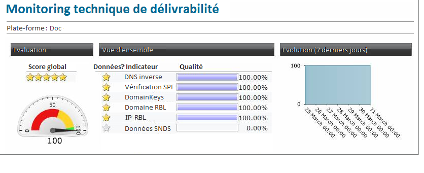

# Contrôle de la délivrabilité{#monitoring-deliverability}

Vous trouverez ci-dessous des informations détaillées sur les différents outils de surveillance fournis par Adobe Campaign ainsi que quelques directives supplémentaires sur la surveillance de la délivrabilité.

## Outils de surveillance {#monitoring-tools}

Utilisez les fonctionnalités offertes par Adobe Campaign pour surveiller la délivrabilité de votre plate-forme.

Le module Délivrabilité vous donne accès aux informations suivantes :

* Rapport de suivi technique pour les performances quotidiennes de la délivrabilité (contrôle technique). Ce rapport, disponible sur demande, vous permet de recevoir un rapport quotidien par courriel à une adresse spécifiée. Pour en savoir plus sur ce sujet, contactez l’équipe d’assistance clientèle d’Adobe.
* Rapport [de rendu de la](../../delivery/using/inbox-rendering.md) boîte de réception qui vous permet de prévisualisation de vos messages sur les principaux clients de messagerie afin d&#39;analyser le contenu et la réputation.
* Présentation de la qualité des messages (boîte de réception, message indésirable).

Vous pouvez également utiliser les outils suivants :

* The **[!UICONTROL Delivery throughput]** report gives you an overview of the entire platform&#39;s throughput for a given period. Voir à ce propos [cette section](../../reporting/using/global-reports.md#delivery-throughput).
* Le rapport de surveillance **[!UICONTROL de la délivrabilité]** technique comprend plusieurs indicateurs de qualité de la délivrabilité pour votre plateforme. Voir à ce propos [cette section](#technical-deliverability-monitoring).
* Chaque diffusion génère un rapport de statistiques de diffusion pour les différents prestataires Internet (FAI). Il présente certaines mesures de qualité et de réputation des données qui peuvent avoir un impact sur votre délivrabilité, notamment les chiffres suivants :
   * **[!UICONTROL Les rebonds]** nets indiquent la qualité des données. Ce chiffre doit être inférieur à 2 %.
   * **[!UICONTROL Les rebonds]** doux indiquent la réputation. Ce nombre ne doit pas être supérieur à 10 % pour un fournisseur de services Internet donné.
   For more on this, see the [Delivery statistics](../../reporting/using/global-reports.md#delivery-statistics) section.
* Plus généralement, le tableau de bord [de](../../delivery/using/monitoring-a-delivery.md#delivery-dashboard) diffusion vous donne accès à :
   * le résumé [de la](../../delivery/using/monitoring-a-delivery.md#delivery-summary)diffusion, qui indique le détail de l&#39;envoi et le [nombre de messages](../../delivery/using/monitoring-a-delivery.md#number-of-messages-sent) à envoyer, à traiter et à envoyer avec succès ;
   * les [logs de diffusion et l&#39;historique](../../delivery/using/monitoring-a-delivery.md#delivery-logs-and-history), qui montrent quelle cible a été exclue et pourquoi ;
   * les [logs de tracking](../../delivery/using/monitoring-a-delivery.md#tracking-logs), qui affichent des informations de suivi telles que les ouvertures et les clics.

## Directives de surveillance {#monitoring-guidelines}

Voici quelques lignes directrices supplémentaires sur la surveillance de la délivrabilité :

* Regularly check the [delivery throughput](../../reporting/using/global-reports.md#delivery-throughput) for the whole platform to verify whether it is consistent with the original set-up.
* Check that [retries](../../delivery/using/understanding-delivery-failures.md#retries-after-a-delivery-temporary-failure) are set up correctly (30 minutes for retry period and more than 20 retries) in delivery templates.
* Regularly verify that the [bounce](../../delivery/using/understanding-delivery-failures.md#bounce-mail-management) mailbox is accessible and that the account is not about to expire.
* Vérifiez chaque débit de diffusion pour vous assurer qu&#39;il correspond à la validité du contenu de la diffusion (par exemple, les ventes Flash doivent être diffusées en quelques minutes et non en plusieurs jours).
* When using [waves](../../delivery/using/steps-sending-the-delivery.md#sending-using-multiple-waves), verify that each wave has enough time to finish before the next one is triggered.
* Check that the number of errors and new [quarantines](../../delivery/using/understanding-quarantine-management.md) are consistent with other deliveries.
* Carefully consult the [delivery logs](../../delivery/using/monitoring-a-delivery.md#delivery-logs-and-history) in detail to check the kind of errors that are highlighted (grey or black-listing, DNS issues, anti-spam rules, etc…).

## Signal Spam {#signal-spam}

Signal Spam est un service français qui propose un reporting de rétroaction anonyme pour les FAI français (Orange, SFR).

* Ce service permet de suivre la réputation des FAI français et l&#39;évolution de l&#39;activité des clients.

* Signal Spam fournit permet également aux utilisateurs finaux de déposer des plaintes directes via une interface dédiée. Ces plaintes sont ensuite mises en quarantaine dans la base de données des adresses email.

## 250ok {#deliverability-250ok}

[250ok](https://250ok.com/) est une solution de surveillance complémentaire des outils internes de délivrabilité d’Adobe qui fournit des indicateurs d’IP, de liste noire des domaines et de réputation.

Les informations fournies sont en temps réel, ce qui permet une assistance proactive.

## Rapport de supervision de la délivrabilité technique {#technical-deliverability-monitoring}

Le rapport de supervision de la délivrabilité technique est mis à jour quotidiennement et disponible en accédant à **[!UICONTROL Surveillance]** > **[!UICONTROL Aperçu]** et en cliquant sur le lien **[!UICONTROL Monitoring technique]** dans l’onglet **[!UICONTROL Accueil]** d’Adobe Campaign. Il comprend plusieurs indicateurs de qualité de la délivrabilité pour votre plateforme.

Ces indicateurs sont mis à jour tous les jours à 9 h.

>[!NOTE]
>
>En outre, vous pouvez recevoir un rapport quotidien par courriel à une adresse spécifiée. Faites-nous connaître l&#39;adresse de courriel demandée par courriel ou via l&#39;Extranet Adobe Campaign.

Les indicateurs utilisés dans ce rapport sont les suivants :

* **[!UICONTROL Reverse DNS]** : Adobe Campaign vérifie qu&#39;un reverse DNS est bien renseigné pour une adresse IP et que celui-ci reboucle bien sur l&#39;IP.

* **[!UICONTROL SPF]** (Sender Policy Framework) : mécanisme d’authentification qui permet aux fournisseurs d’accès à Internet et de messagerie de vérifier si l’expéditeur de l’email autorisé sur le domaine d’envoi.

* **[!UICONTROL DomainKeys]** : Service développé par Yahoo visant à certifier l&#39;identité de l&#39;émetteur d&#39;un email.

* **[!UICONTROL IP et domaine RBL]** (Real-time Blackhole List) : liste des adresses IP et domaines qui ont été marqués par les organisations de liste de blocage pour mauvaise réputation d’envoi. Ces listes sont enrichies par des organismes dédiés tels que Spamhaus, Spamcop, SURBL/URIBL, etc. Adobe Campaign traite actuellement les contrôles par rapport aux RBL qui ont un impact significatif sur la délivrabilité. Ces RBL sont les témoins de votre réputation d’envoi et peuvent être interrogés par les ISP avant acceptation de vos emails.

* **[!UICONTROL SNDS]** (Smart Network Data Services) : un [service Windows Live Hotmail de lutte contre le spam](https://sendersupport.olc.protection.outlook.com/snds/FAQ.aspx). Hotmail est le seul FAI qui fournit ce type d&#39;informations. Les scores de référence sont un résultat de filtre vert, un taux de plainte inférieur à 0,1 % et un taux zéro de pourriel.

<!--### Delivery Reports - Broadcast Statistics {#broadcast-statistics}

Each delivery will generate a broadcast statistics report when you open a delivery in the “Deliveries List”, which includes some reputation metrics that may impact your deliverability.-->
