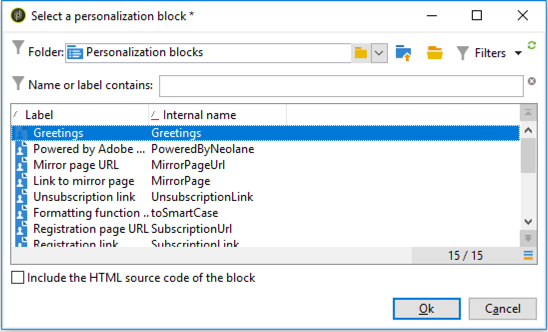
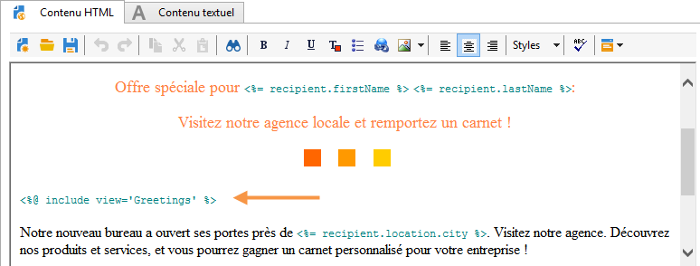
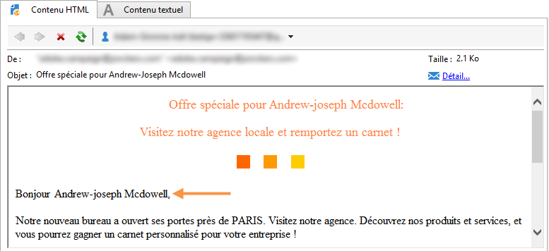
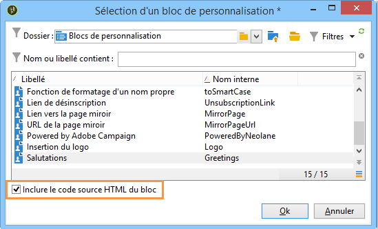
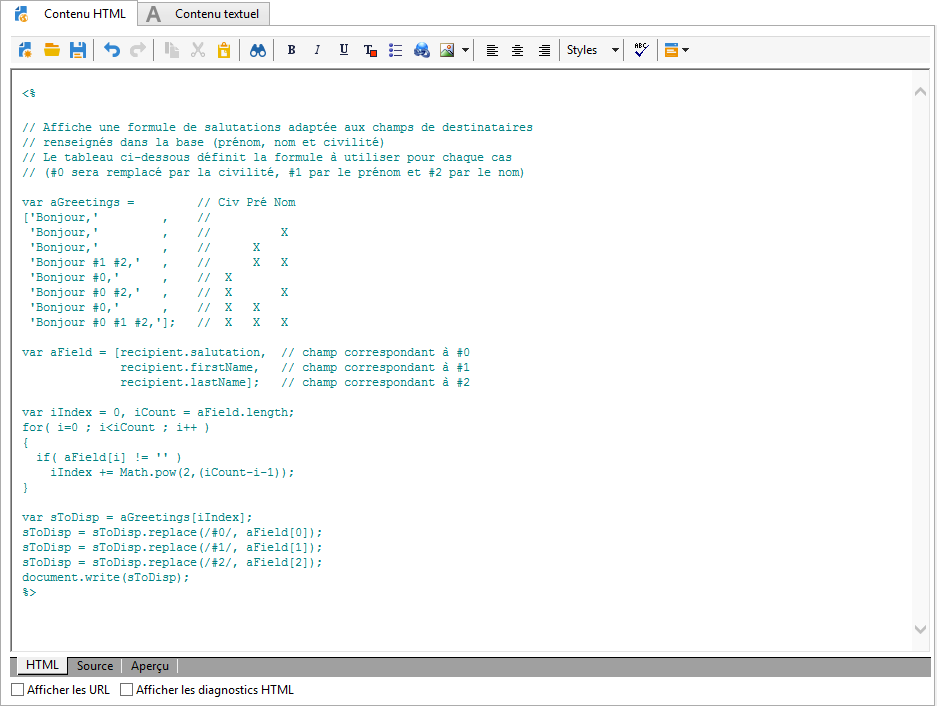
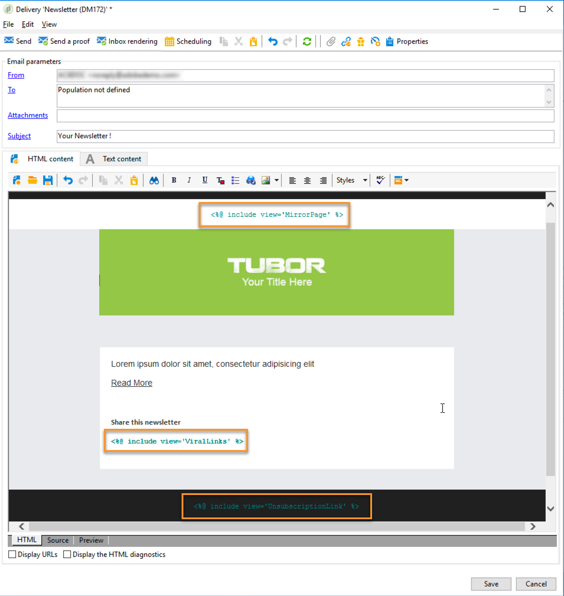
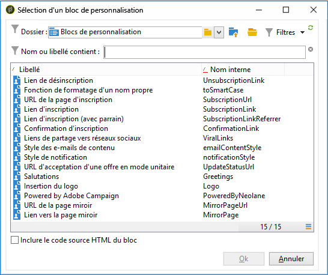
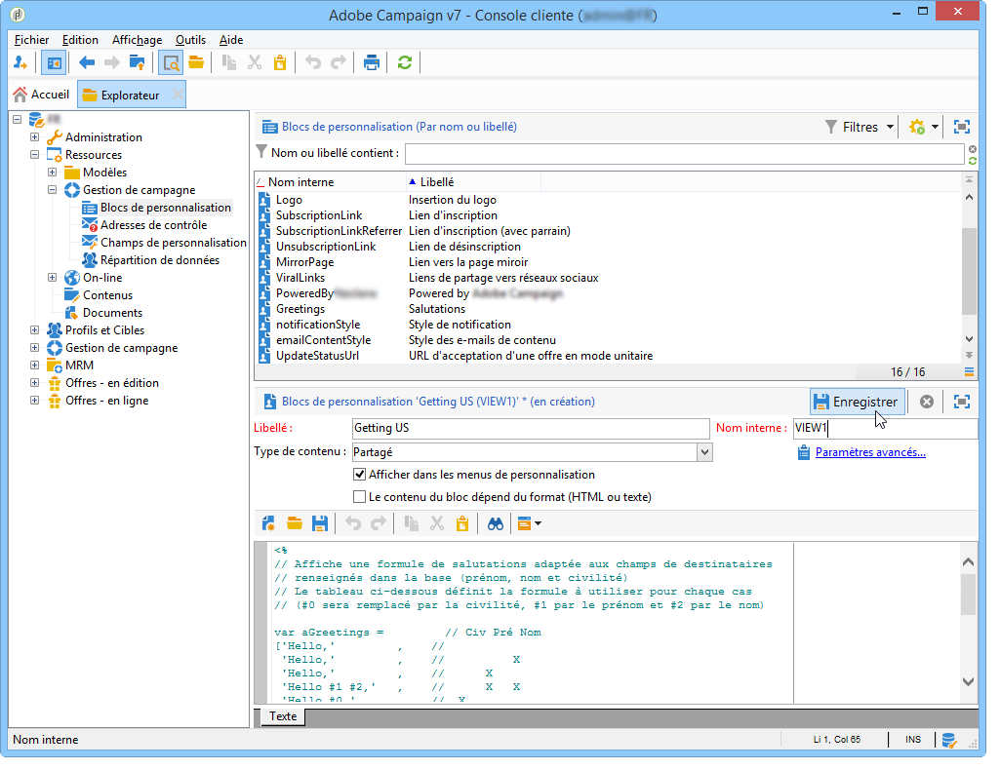

<?xml version="1.0" encoding="UTF-8"?>
<xliff xmlns="urn:oasis:names:tc:xliff:document:1.2" xmlns:okp="okapi-framework:xliff-extensions" xmlns:its="http://www.w3.org/2005/11/its" xmlns:itsxlf="http://www.w3.org/ns/its-xliff/" version="1.2" its:version="2.0">
<file original="help/delivery/using/personalization-blocks.md.mdsc" source-language="en-US" target-language="en-XX" datatype="x-text/markdown">
<body>
<trans-unit id="tu69" xml:space="preserve">
<source xml:lang="en-US">https://experienceleague.adobe.com/fr/docs/control-panel/using/instances-settings/url-permissions</source>
<target xml:lang="en-XX">https://experienceleague.adobe.com/fr/docs/control-panel/using/instances-settings/url-permissions</target>
</trans-unit>
<trans-unit id="tu86" xml:space="preserve">
<source xml:lang="en-US">https://experienceleague.adobe.com/docs/campaign-classic-learn/tutorials/overview.html?lang=fr</source>
<target xml:lang="en-XX">https://experienceleague.adobe.com/docs/campaign-classic-learn/tutorials/overview.html?lang=fr</target>
</trans-unit>
<trans-unit id="tu1" restype="x-YAML_METADATA_HEADER_VALUE" xml:space="preserve">
<source xml:lang="en-US">Personalization blocks</source>
<target xml:lang="en-XX">Blocs de personnalisation</target>
</trans-unit>
<trans-unit id="tu2" restype="x-YAML_METADATA_HEADER_VALUE" xml:space="preserve">
<source xml:lang="en-US">Learn how to use personalization blocks</source>
<target xml:lang="en-XX">Découvrez comment utiliser les blocs de personnalisation</target>
</trans-unit>
<trans-unit id="tu3" xml:space="preserve">
<source xml:lang="en-US">Also applies to v8</source>
<target xml:lang="en-XX">S’applique également à la v8.</target>
</trans-unit>
<trans-unit id="tu4" xml:space="preserve">
<source xml:lang="en-US">Also applies to Campaign v8</source>
<target xml:lang="en-XX">S’applique également à Campaign v8.</target>
</trans-unit>
<trans-unit id="tu5" xml:space="preserve">
<source xml:lang="en-US">Personalization blocks</source>
<target xml:lang="en-XX">Blocs de personnalisation</target>
</trans-unit>
<trans-unit id="tu6" xml:space="preserve">
<source xml:lang="en-US">Personalization blocks are dynamic, personalized and contain a specific rendering that you can insert into your deliveries. For example, you can add a logo, a greeting message, or a link to a mirror page. See <ph id="1" ctype="x-LINK">[</ph>Insert personalization blocks<ph id="2" ctype="x-LINK">](#inserting-personalization-blocks)</ph>.</source>
<target xml:lang="en-XX">Les blocs de personnalisation sont dynamiques, personnalisés et contiennent un rendu spécifique que vous pouvez insérer dans vos diffusions. Vous pouvez par exemple ajouter un logo, un message de salutations ou un lien vers une page miroir. Consultez la section <ph id="1" ctype="x-LINK">[</ph>Insertion de blocs de personnalisation<ph id="2" ctype="x-LINK">](#inserting-personalization-blocks)</ph>.</target>
</trans-unit>
<trans-unit id="tu7" xml:space="preserve">
<source xml:lang="en-US"><ph id="1" ctype="x-IMAGE"></ph> Discover this feature <ph id="3" ctype="x-LINK">[</ph>in video<ph id="4" ctype="x-LINK">](#personalization-blocks-video)</ph></source>
<target xml:lang="en-XX"><ph id="1" ctype="x-IMAGE"></ph>Découvrez cette fonctionnalité <ph id="3" ctype="x-LINK">[</ph>en vidéo<ph id="4" ctype="x-LINK">](#personalization-blocks-video)</ph></target>
</trans-unit>
<trans-unit id="tu8" xml:space="preserve">
<source xml:lang="en-US">Personalization blocks are accessed via the <ph id="1" ctype="x-STRONG_EMPHASIS">**[!UICONTROL </ph>Resources > Campaign Management > Personalization blocks<ph id="3" ctype="x-LINK_REF">]**</ph> node of the Adobe Campaign explorer. Several blocks are available by default (see <ph id="5" ctype="x-LINK">[</ph>Out-of-the-box personalization blocks<ph id="6" ctype="x-LINK">](#out-of-the-box-personalization-blocks)</ph>).</source>
<target xml:lang="en-XX">Les blocs de personnalisation sont accessibles notamment à partir du nœud <ph id="1" ctype="x-STRONG_EMPHASIS">**[!UICONTROL </ph>Ressources > Gestion de campagne > Blocs de personnalisation<ph id="3" ctype="x-LINK_REF">]**</ph> de l'explorateur Adobe Campaign. Plusieurs blocs sont disponibles par défaut (voir <ph id="5" ctype="x-LINK">[</ph>Blocs de personnalisation d'usine<ph id="6" ctype="x-LINK">](#out-of-the-box-personalization-blocks)</ph>).</target>
</trans-unit>
<trans-unit id="tu9" xml:space="preserve">
<source xml:lang="en-US">You have the ability to define new blocks that will enable you to optimize your deliveries personalization. For more on this, refer to <ph id="1" ctype="x-LINK">[</ph>Define custom personalization blocks<ph id="2" ctype="x-LINK">](#defining-custom-personalization-blocks)</ph>.</source>
<target xml:lang="en-XX">Vous pouvez définir de nouveaux blocs qui vous permettront d'optimiser la personnalisation de vos diffusions. Pour plus dʼinformations, consultez la section <ph id="1" ctype="x-LINK">[</ph>Définition de blocs de personnalisation personnalisés<ph id="2" ctype="x-LINK">](#defining-custom-personalization-blocks)</ph>.</target>
</trans-unit>
<trans-unit id="tu10" xml:space="preserve">
<source xml:lang="en-US"><ph id="1" ctype="x-regxph" equiv-text="&lbrack;!NOTE">[!NOTE]</ph></source>
<target xml:lang="en-XX"><ph id="1" ctype="x-regxph" equiv-text="&lbrack;!NOTE">[!NOTE]</ph></target>
</trans-unit>
<trans-unit id="tu11" xml:space="preserve">
<source xml:lang="en-US">Personalization blocks are also available from the <ph id="1" ctype="x-STRONG_EMPHASIS">**[!UICONTROL </ph>Digital Content Editor (DCE)<ph id="3" ctype="x-LINK_REF">]**</ph> . For more on this, refer to <ph id="5" ctype="x-LINK">[</ph>this page<ph id="6" ctype="x-LINK">](../../web/using/editing-content.md#inserting-a-personalization-block)</ph>.</source>
<target xml:lang="en-XX">Les blocs de personnalisation sont aussi disponibles depuis le <ph id="1" ctype="x-STRONG_EMPHASIS">**[!UICONTROL </ph>Digital Content Editor (DCE)<ph id="3" ctype="x-LINK_REF">]**</ph>. Pour plus d’informations, consultez <ph id="5" ctype="x-LINK">[</ph>cette page<ph id="6" ctype="x-LINK">](../../web/using/editing-content.md#inserting-a-personalization-block)</ph>.</target>
</trans-unit>
<trans-unit id="tu12" xml:space="preserve">
<source xml:lang="en-US">Insert personalization blocks</source>
<target xml:lang="en-XX">Insertion de blocs de personnalisation</target>
</trans-unit>
<trans-unit id="tu13" xml:space="preserve">
<source xml:lang="en-US">To insert a personalization block in a message, follow the steps below:</source>
<target xml:lang="en-XX">Pour insérer un bloc de personnalisation dans un message, procédez comme suit :</target>
</trans-unit>
<trans-unit id="tu14" xml:space="preserve">
<source xml:lang="en-US">In the content editor of the delivery assistant, click the personalized field icon and select the <ph id="1" ctype="x-STRONG_EMPHASIS">**[!UICONTROL </ph>Include<ph id="3" ctype="x-LINK_REF">]**</ph> menu.</source>
<target xml:lang="en-XX">Dans l’éditeur de contenu de l’assistant de diffusion, cliquez sur l’icône des champs de personnalisation et sélectionnez le menu <ph id="1" ctype="x-STRONG_EMPHASIS">**[!UICONTROL </ph>Inclure<ph id="3" ctype="x-LINK_REF">]**</ph>.</target>
</trans-unit>
<trans-unit id="tu15" xml:space="preserve">
<source xml:lang="en-US">Select a personalization block from the list (the list displays the 10 last used blocks), or click the <ph id="1" ctype="x-STRONG_EMPHASIS">**[!UICONTROL </ph>Other...<ph id="3" ctype="x-LINK_REF">]**</ph> menu to access the full list.</source>
<target xml:lang="en-XX">Sélectionnez un bloc de personnalisation dans la liste (la liste affiche les 10 derniers blocs utilisés) ou cliquez sur le menu <ph id="1" ctype="x-STRONG_EMPHASIS">**[!UICONTROL </ph>Autre...<ph id="3" ctype="x-LINK_REF">]**</ph> pour accéder à la liste complète.</target>
</trans-unit>
<trans-unit id="tu16" xml:space="preserve">
<source xml:lang="en-US"><ph id="1" ctype="x-IMAGE"></ph></source>
<target xml:lang="en-XX"><ph id="1" ctype="x-IMAGE"></ph></target>
</trans-unit>
<trans-unit id="tu17" xml:space="preserve">
<source xml:lang="en-US">The <ph id="1" ctype="x-STRONG_EMPHASIS">**[!UICONTROL </ph>Other...<ph id="3" ctype="x-LINK_REF">]**</ph> menu gives access to all the out-of-the-box and custom personalization blocks (see <ph id="5" ctype="x-LINK">[</ph>Out-of-the-box personalization blocks<ph id="6" ctype="x-LINK">](#out-of-the-box-personalization-blocks)</ph> and <ph id="7" ctype="x-LINK">[</ph>Define custom personalization blocks<ph id="8" ctype="x-LINK">](#defining-custom-personalization-blocks)</ph>).</source>
<target xml:lang="en-XX">Le menu <ph id="1" ctype="x-STRONG_EMPHASIS">**[!UICONTROL </ph>Autre...<ph id="3" ctype="x-LINK_REF">]**</ph> donne accès à tous les blocs de personnalisation dʼusine et personnalisés (consultez les sections <ph id="5" ctype="x-LINK">[</ph>Blocs de personnalisation dʼusine<ph id="6" ctype="x-LINK">](#out-of-the-box-personalization-blocks)</ph> et <ph id="7" ctype="x-LINK">[</ph>Définition de blocs de personnalisation personnalisés<ph id="8" ctype="x-LINK">](#defining-custom-personalization-blocks)</ph>).</target>
</trans-unit>
<trans-unit id="tu18" xml:space="preserve">
<source xml:lang="en-US"><ph id="1" ctype="x-IMAGE"></ph></source>
<target xml:lang="en-XX"><ph id="1" ctype="x-IMAGE"></ph></target>
</trans-unit>
<trans-unit id="tu19" xml:space="preserve">
<source xml:lang="en-US">The personalization block is then inserted as a script. It is automatically adapted to the recipient profile when personalization is generated.</source>
<target xml:lang="en-XX">Le bloc de personnalisation est alors inséré sous forme de script. Il est automatiquement adapté au profil de la personne destinataire lors de la génération de la personnalisation.</target>
</trans-unit>
<trans-unit id="tu20" xml:space="preserve">
<source xml:lang="en-US"><ph id="1" ctype="x-IMAGE"></ph></source>
<target xml:lang="en-XX"><ph id="1" ctype="x-IMAGE"></ph></target>
</trans-unit>
<trans-unit id="tu21" xml:space="preserve">
<source xml:lang="en-US">Click the <ph id="1" ctype="x-STRONG_EMPHASIS">**[!UICONTROL </ph>Preview<ph id="3" ctype="x-LINK_REF">]**</ph> tab and select a recipient to view the personalization.</source>
<target xml:lang="en-XX">Cliquez sur l'onglet <ph id="1" ctype="x-STRONG_EMPHASIS">**[!UICONTROL </ph>Aperçu<ph id="3" ctype="x-LINK_REF">]**</ph> et sélectionnez un destinataire pour visualiser la personnalisation relative à ce destinataire.</target>
</trans-unit>
<trans-unit id="tu22" xml:space="preserve">
<source xml:lang="en-US"><ph id="1" ctype="x-IMAGE"></ph></source>
<target xml:lang="en-XX"><ph id="1" ctype="x-IMAGE"></ph></target>
</trans-unit>
<trans-unit id="tu23" xml:space="preserve">
<source xml:lang="en-US">You can include the source code of a personalization block in the delivery content. To do this, select <ph id="1" ctype="x-STRONG_EMPHASIS">**[!UICONTROL </ph>Include the HTML source code of the block<ph id="3" ctype="x-LINK_REF">]**</ph> when selecting it.</source>
<target xml:lang="en-XX">Vous pouvez inclure le code source d’un bloc de personnalisation dans le contenu de la diffusion. Pour cela, cochez l'option <ph id="1" ctype="x-STRONG_EMPHASIS">**[!UICONTROL </ph>Inclure le code source HTML du bloc<ph id="3" ctype="x-LINK_REF">]**</ph> lorsque vous le sélectionnez.</target>
</trans-unit>
<trans-unit id="tu24" xml:space="preserve">
<source xml:lang="en-US"><ph id="1" ctype="x-IMAGE"></ph></source>
<target xml:lang="en-XX"><ph id="1" ctype="x-IMAGE"></ph></target>
</trans-unit>
<trans-unit id="tu25" xml:space="preserve">
<source xml:lang="en-US">The HTML source code is inserted in the delivery content. For example, the <ph id="1" ctype="x-STRONG_EMPHASIS">**[!UICONTROL </ph>Greetings<ph id="3" ctype="x-LINK_REF">]**</ph> personalization bloc displays as below:</source>
<target xml:lang="en-XX">Le code source HTML est inséré dans le contenu de la diffusion. Par exemple, le bloc de personnalisation <ph id="1" ctype="x-STRONG_EMPHASIS">**[!UICONTROL </ph>Salutations<ph id="3" ctype="x-LINK_REF">]**</ph> (Greetings) s’affiche comme ci-dessous :</target>
</trans-unit>
<trans-unit id="tu26" xml:space="preserve">
<source xml:lang="en-US"><ph id="1" ctype="x-IMAGE"></ph></source>
<target xml:lang="en-XX"><ph id="1" ctype="x-IMAGE"></ph></target>
</trans-unit>
<trans-unit id="tu27" xml:space="preserve">
<source xml:lang="en-US">Personalization blocks example</source>
<target xml:lang="en-XX">Exemple de blocs de personnalisation</target>
</trans-unit>
<trans-unit id="tu28" xml:space="preserve">
<source xml:lang="en-US">In this example, we create an email in which we use personalization blocks to enable the recipient to view the mirror page, share the newsletter on social networks, and unsubscribe from future deliveries.</source>
<target xml:lang="en-XX">Dans cet exemple, nous créons un email dans lequel nous utilisons les blocs de personnalisation pour permettre au destinataire d'afficher la page miroir, de partager la newsletter sur les réseaux sociaux et de se désabonner des diffusions futures.</target>
</trans-unit>
<trans-unit id="tu29" xml:space="preserve">
<source xml:lang="en-US">To do this, we need to insert the following personalization blocks:</source>
<target xml:lang="en-XX">Pour ce faire, nous devons insérer les blocs de personnalisation suivants :</target>
</trans-unit>
<trans-unit id="tu30" xml:space="preserve">
<source xml:lang="en-US"><ph id="1" ctype="x-STRONG_EMPHASIS">**[!UICONTROL </ph>Link to mirror page<ph id="3" ctype="x-LINK_REF">]**</ph> .</source>
<target xml:lang="en-XX"><ph id="1" ctype="x-STRONG_EMPHASIS">**[!UICONTROL </ph>Lien vers la page miroir<ph id="3" ctype="x-LINK_REF">]**</ph> .</target>
</trans-unit>
<trans-unit id="tu31" xml:space="preserve">
<source xml:lang="en-US"><ph id="1" ctype="x-STRONG_EMPHASIS">**[!UICONTROL </ph>Social network sharing links<ph id="3" ctype="x-LINK_REF">]**</ph> .</source>
<target xml:lang="en-XX"><ph id="1" ctype="x-STRONG_EMPHASIS">**[!UICONTROL </ph>Liens de partage vers les réseaux sociaux<ph id="3" ctype="x-LINK_REF">]**</ph> .</target>
</trans-unit>
<trans-unit id="tu32" xml:space="preserve">
<source xml:lang="en-US"><ph id="1" ctype="x-STRONG_EMPHASIS">**[!UICONTROL </ph>Unsubscription link<ph id="3" ctype="x-LINK_REF">]**</ph> .</source>
<target xml:lang="en-XX"><ph id="1" ctype="x-STRONG_EMPHASIS">**[!UICONTROL </ph>Lien de désabonnement<ph id="3" ctype="x-LINK_REF">]**</ph> .</target>
</trans-unit>
<trans-unit id="tu33" xml:space="preserve">
<source xml:lang="en-US"><ph id="1" ctype="x-regxph" equiv-text="&lbrack;!NOTE">[!NOTE]</ph></source>
<target xml:lang="en-XX"><ph id="1" ctype="x-regxph" equiv-text="&lbrack;!NOTE">[!NOTE]</ph></target>
</trans-unit>
<trans-unit id="tu34" xml:space="preserve">
<source xml:lang="en-US">For more on the mirror page generation, refer to <ph id="1" ctype="x-LINK">[</ph>Generate the mirror page<ph id="2" ctype="x-LINK">](sending-messages.md#generating-the-mirror-page)</ph>.</source>
<target xml:lang="en-XX">Pour plus dʼinformations sur la génération des pages miroir, consultez la section <ph id="1" ctype="x-LINK">[</ph>Génération de la page miroir<ph id="2" ctype="x-LINK">](sending-messages.md#generating-the-mirror-page)</ph>.</target>
</trans-unit>
<trans-unit id="tu35" xml:space="preserve">
<source xml:lang="en-US">Create a new delivery or open an existing email type delivery.</source>
<target xml:lang="en-XX">Créez une diffusion ou ouvrez une diffusion existante de type e-mail.</target>
</trans-unit>
<trans-unit id="tu36" xml:space="preserve">
<source xml:lang="en-US">In the delivery assistant, click <ph id="1" ctype="x-STRONG_EMPHASIS">**[!UICONTROL </ph>Subject<ph id="3" ctype="x-LINK_REF">]**</ph> to edit the subject of the message and enter a subject.</source>
<target xml:lang="en-XX">Dans l’assistant de diffusion, cliquez sur <ph id="1" ctype="x-STRONG_EMPHASIS">**[!UICONTROL </ph>Objet<ph id="3" ctype="x-LINK_REF">]**</ph> pour éditer l’objet du message et saisir un objet.</target>
</trans-unit>
<trans-unit id="tu37" xml:space="preserve">
<source xml:lang="en-US">Insert the personalization blocks in the message body. To do this, click in the message content, click the personalized field icon and select the <ph id="1" ctype="x-STRONG_EMPHASIS">**[!UICONTROL </ph>Include<ph id="3" ctype="x-LINK_REF">]**</ph> menu.</source>
<target xml:lang="en-XX">Insérez ensuite les blocs de personnalisation dans le corps du message. Pour cela, cliquez dans le contenu du message, cliquez sur l'icône de champs de personnalisation et sélectionnez le menu <ph id="1" ctype="x-STRONG_EMPHASIS">**[!UICONTROL </ph>Inclure<ph id="3" ctype="x-LINK_REF">]**</ph>.</target>
</trans-unit>
<trans-unit id="tu38" xml:space="preserve">
<source xml:lang="en-US">Select the first block to insert. Renew the procedure to include the two other blocks.</source>
<target xml:lang="en-XX">Sélectionnez le premier bloc à insérer. Renouvelez la procédure pour inclure les deux autres blocs.</target>
</trans-unit>
<trans-unit id="tu39" xml:space="preserve">
<source xml:lang="en-US"><ph id="1" ctype="x-IMAGE"></ph></source>
<target xml:lang="en-XX"><ph id="1" ctype="x-IMAGE"></ph></target>
</trans-unit>
<trans-unit id="tu40" xml:space="preserve">
<source xml:lang="en-US">Click the <ph id="1" ctype="x-STRONG_EMPHASIS">**[!UICONTROL </ph>Preview<ph id="3" ctype="x-LINK_REF">]**</ph> tab to view the personalization result. You must select a recipient to display that recipient's message.</source>
<target xml:lang="en-XX">Cliquez sur l’onglet <ph id="1" ctype="x-STRONG_EMPHASIS">**[!UICONTROL </ph>Prévisualisation<ph id="3" ctype="x-LINK_REF">]**</ph> pour visualiser le résultat de la personnalisation. Vous devez sélectionner une personne destinataire pour afficher son message.</target>
</trans-unit>
<trans-unit id="tu41" xml:space="preserve">
<source xml:lang="en-US"><ph id="1" ctype="x-IMAGE"></ph></source>
<target xml:lang="en-XX"><ph id="1" ctype="x-IMAGE"></ph></target>
</trans-unit>
<trans-unit id="tu42" xml:space="preserve">
<source xml:lang="en-US">Confirm that the block contents are displayed properly.</source>
<target xml:lang="en-XX">Confirmez que le contenu des blocs est affiché correctement.</target>
</trans-unit>
<trans-unit id="tu43" xml:space="preserve">
<source xml:lang="en-US">Out-of-the-box personalization blocks</source>
<target xml:lang="en-XX">Blocs de personnalisation d'usine</target>
</trans-unit>
<trans-unit id="tu44" xml:space="preserve">
<source xml:lang="en-US">A list of personalization blocks is available by default to help you personalize the content of your message.</source>
<target xml:lang="en-XX">Une liste des blocs de personnalisation est disponible par défaut pour vous aider à personnaliser le contenu de votre message.</target>
</trans-unit>
<trans-unit id="tu45" xml:space="preserve">
<source xml:lang="en-US"><ph id="1" ctype="x-regxph" equiv-text="&lbrack;!NOTE">[!NOTE]</ph></source>
<target xml:lang="en-XX"><ph id="1" ctype="x-regxph" equiv-text="&lbrack;!NOTE">[!NOTE]</ph></target>
</trans-unit>
<trans-unit id="tu46" xml:space="preserve">
<source xml:lang="en-US">The list of personalization blocks depends on the modules and options which have been installed on your instance.</source>
<target xml:lang="en-XX">Cette liste dépend des modules et options installés sur votre instance.</target>
</trans-unit>
<trans-unit id="tu47" xml:space="preserve">
<source xml:lang="en-US"><ph id="1" ctype="x-IMAGE"></ph></source>
<target xml:lang="en-XX"><ph id="1" ctype="x-IMAGE"></ph></target>
</trans-unit>
<trans-unit id="tu48" xml:space="preserve">
<source xml:lang="en-US"><ph id="1" ctype="x-STRONG_EMPHASIS">**[!UICONTROL </ph>Greetings<ph id="3" ctype="x-LINK_REF">]**</ph> : inserts greetings with the recipient's name. Example: "Hello John Doe,".</source>
<target xml:lang="en-XX"><ph id="1" ctype="x-STRONG_EMPHASIS">**[!UICONTROL </ph>Salutations<ph id="3" ctype="x-LINK_REF">]**</ph> : insère des salutations avec le nom de la personne destinataire. Exemple : « Bonjour Pierre Martin, ».</target>
</trans-unit>
<trans-unit id="tu49" xml:space="preserve">
<source xml:lang="en-US"><ph id="1" ctype="x-STRONG_EMPHASIS">**[!UICONTROL </ph>Insert logo<ph id="3" ctype="x-LINK_REF">]**</ph> : inserts an out-of-the-box logo that has been defined when configuring the instance.</source>
<target xml:lang="en-XX"><ph id="1" ctype="x-STRONG_EMPHASIS">**[!UICONTROL </ph>Insertion du logo<ph id="3" ctype="x-LINK_REF">]**</ph> : insère un logo prêt à l'emploi qui a été défini lors du paramétrage de l'instance.</target>
</trans-unit>
<trans-unit id="tu50" xml:space="preserve">
<source xml:lang="en-US"><ph id="1" ctype="x-STRONG_EMPHASIS">**[!UICONTROL </ph>Powered by Adobe Campaign<ph id="3" ctype="x-LINK_REF">]**</ph> : inserts the "Powered by Adobe Campaign" logo.</source>
<target xml:lang="en-XX"><ph id="1" ctype="x-STRONG_EMPHASIS">**[!UICONTROL </ph>Powered by Adobe Campaign<ph id="3" ctype="x-LINK_REF">]**</ph> : insère le logo "Powered by Adobe Campaign".</target>
</trans-unit>
<trans-unit id="tu51" xml:space="preserve">
<source xml:lang="en-US"><ph id="1" ctype="x-STRONG_EMPHASIS">**[!UICONTROL </ph>Mirror page URL<ph id="3" ctype="x-LINK_REF">]**</ph> : inserts the mirror page URL, enabling Delivery Designers to check the link.</source>
<target xml:lang="en-XX"><ph id="1" ctype="x-STRONG_EMPHASIS">**[!UICONTROL </ph>URL de page miroir<ph id="3" ctype="x-LINK_REF">]**</ph> : insère l'URL de page miroir qui permet aux concepteurs de diffusion de vérifier le lien.</target>
</trans-unit>
<trans-unit id="tu52" xml:space="preserve">
<source xml:lang="en-US"><ph id="1" ctype="x-regxph" equiv-text="&lbrack;!NOTE">[!NOTE]</ph></source>
<target xml:lang="en-XX"><ph id="1" ctype="x-regxph" equiv-text="&lbrack;!NOTE">[!NOTE]</ph></target>
</trans-unit>
<trans-unit id="tu53" xml:space="preserve">
<source xml:lang="en-US">For more on the mirror page generation, refer to <ph id="1" ctype="x-LINK">[</ph>Generate the mirror page<ph id="2" ctype="x-LINK">](sending-messages.md#generating-the-mirror-page)</ph>.</source>
<target xml:lang="en-XX">Pour plus dʼinformations sur la génération des pages miroir, consultez la section <ph id="1" ctype="x-LINK">[</ph>Génération de la page miroir<ph id="2" ctype="x-LINK">](sending-messages.md#generating-the-mirror-page)</ph>.</target>
</trans-unit>
<trans-unit id="tu54" xml:space="preserve">
<source xml:lang="en-US"><ph id="1" ctype="x-STRONG_EMPHASIS">**[!UICONTROL </ph>Link to mirror page<ph id="3" ctype="x-LINK_REF">]**</ph> : inserts a link to the mirror page: "If you are unable to view this message correctly, click here".</source>
<target xml:lang="en-XX"><ph id="1" ctype="x-STRONG_EMPHASIS">**[!UICONTROL </ph>Lien vers la page miroir<ph id="3" ctype="x-LINK_REF">]**</ph> : insère un lien vers la page miroir : « Si vous ne parvenez pas à voir correctement ce message, cliquez ici ».</target>
</trans-unit>
<trans-unit id="tu55" xml:space="preserve">
<source xml:lang="en-US"><ph id="1" ctype="x-STRONG_EMPHASIS">**[!UICONTROL </ph>Unsubscription link<ph id="3" ctype="x-LINK_REF">]**</ph> : inserts a link enabling to unsubscribe from all deliveries (denylist).</source>
<target xml:lang="en-XX"><ph id="1" ctype="x-STRONG_EMPHASIS">**[!UICONTROL </ph>Lien de désinscription<ph id="3" ctype="x-LINK_REF">]**</ph> : insère un lien permettant de se désabonner de toutes les diffusions (liste bloquée).</target>
</trans-unit>
<trans-unit id="tu56" xml:space="preserve">
<source xml:lang="en-US"><ph id="1" ctype="x-STRONG_EMPHASIS">**[!UICONTROL </ph>Formatting function for proper nouns<ph id="3" ctype="x-LINK_REF">]**</ph> : generates the <ph id="5" ctype="x-STRONG_EMPHASIS">**[!UICONTROL </ph>toSmartCase<ph id="7" ctype="x-LINK_REF">]**</ph> Javascript function, which changes the first letter of each word to uppercase.</source>
<target xml:lang="en-XX"><ph id="1" ctype="x-STRONG_EMPHASIS">**[!UICONTROL </ph>Fonction de formatage d'un nom propre<ph id="3" ctype="x-LINK_REF">]**</ph> : génère la fonction JavaScript <ph id="5" ctype="x-STRONG_EMPHASIS">**[!UICONTROL </ph>toSmartCase<ph id="7" ctype="x-LINK_REF">]**</ph> qui convertit la première lettre de chaque mot en majuscule.</target>
</trans-unit>
<trans-unit id="tu57" xml:space="preserve">
<source xml:lang="en-US"><ph id="1" ctype="x-STRONG_EMPHASIS">**[!UICONTROL </ph>Registration page URL<ph id="3" ctype="x-LINK_REF">]**</ph> : inserts a subscription URL (see <ph id="5" ctype="x-LINK">[</ph>About services and subscriptions<ph id="6" ctype="x-LINK">](about-services-and-subscriptions.md)</ph>).</source>
<target xml:lang="en-XX"><ph id="1" ctype="x-STRONG_EMPHASIS">**[!UICONTROL </ph>URL de la page d'inscription<ph id="3" ctype="x-LINK_REF">]**</ph> : insère une URL d'abonnement (voir <ph id="5" ctype="x-LINK">[</ph>À propos des services et des abonnements<ph id="6" ctype="x-LINK">](about-services-and-subscriptions.md)</ph>).</target>
</trans-unit>
<trans-unit id="tu58" xml:space="preserve">
<source xml:lang="en-US"><ph id="1" ctype="x-STRONG_EMPHASIS">**[!UICONTROL </ph>Registration link<ph id="3" ctype="x-LINK_REF">]**</ph> : inserts a subscription link. that has been defined when configuring the instance.</source>
<target xml:lang="en-XX"><ph id="1" ctype="x-STRONG_EMPHASIS">**[!UICONTROL </ph>Lien d’inscription<ph id="3" ctype="x-LINK_REF">]**</ph> : insère un lien d’inscription. qui a été défini lors de la configuration de l’instance.</target>
</trans-unit>
<trans-unit id="tu59" xml:space="preserve">
<source xml:lang="en-US"><ph id="1" ctype="x-STRONG_EMPHASIS">**[!UICONTROL </ph>Registration link (with referrer)<ph id="3" ctype="x-LINK_REF">]**</ph> : inserts a subscription link, enabling to identify the visitor and delivery. The link has been defined when configuring the instance.</source>
<target xml:lang="en-XX"><ph id="1" ctype="x-STRONG_EMPHASIS">**[!UICONTROL </ph>Lien d’inscription (avec parrain)<ph id="3" ctype="x-LINK_REF">]**</ph> : insère un lien d’inscription permettant d’identifier le visiteur ou la visiteuse et la diffusion. Le lien a été défini lors du paramétrage de l'instance.</target>
</trans-unit>
<trans-unit id="tu60" xml:space="preserve">
<source xml:lang="en-US"><ph id="1" ctype="x-regxph" equiv-text="&lbrack;!NOTE">[!NOTE]</ph></source>
<target xml:lang="en-XX"><ph id="1" ctype="x-regxph" equiv-text="&lbrack;!NOTE">[!NOTE]</ph></target>
</trans-unit>
<trans-unit id="tu61" xml:space="preserve">
<source xml:lang="en-US">This block can be used in deliveries targeting visitors only.</source>
<target xml:lang="en-XX">Ce bloc peut être utilisé dans les diffusions qui ciblent uniquement les personnes qui visitent le site.</target>
</trans-unit>
<trans-unit id="tu62" xml:space="preserve">
<source xml:lang="en-US"><ph id="1" ctype="x-STRONG_EMPHASIS">**[!UICONTROL </ph>Registration confirmation<ph id="3" ctype="x-LINK_REF">]**</ph> : inserts a link enabling to confirm subscription.</source>
<target xml:lang="en-XX"><ph id="1" ctype="x-STRONG_EMPHASIS">**[!UICONTROL </ph>Confirmation de votre inscription<ph id="3" ctype="x-LINK_REF">]**</ph> : insère un lien permettant de confirmer l'inscription.</target>
</trans-unit>
<trans-unit id="tu63" xml:space="preserve">
<source xml:lang="en-US"><ph id="1" ctype="x-STRONG_EMPHASIS">**[!UICONTROL </ph>Social network sharing links<ph id="3" ctype="x-LINK_REF">]**</ph> : inserts buttons that enable the recipient to share a link to the mirror page content with the email client, Facebook, X (formerly known as Twitter), and LinkedIn (see <ph id="5" ctype="x-LINK">[</ph>Viral marketing: forward to a friend<ph id="6" ctype="x-LINK">](viral-and-social-marketing.md#viral-marketing--forward-to-a-friend)</ph>).</source>
<target xml:lang="en-XX"><ph id="1" ctype="x-STRONG_EMPHASIS">**[!UICONTROL </ph>Liens de partage vers des réseaux sociaux<ph id="3" ctype="x-LINK_REF">]**</ph> : insère des boutons grâce auxquels la personne destinataire peut partager un lien vers le contenu de la page miroir avec le client de messagerie, Facebook, X (anciennement Twitter) et LinkedIn (voir <ph id="5" ctype="x-LINK">[</ph>Marketing viral : transférer à une connaissance<ph id="6" ctype="x-LINK">](viral-and-social-marketing.md#viral-marketing--forward-to-a-friend)</ph>).</target>
</trans-unit>
<trans-unit id="tu64" xml:space="preserve">
<source xml:lang="en-US"><ph id="1" ctype="x-STRONG_EMPHASIS">**[!UICONTROL </ph>Style of content emails<ph id="3" ctype="x-LINK_REF">]**</ph> and <ph id="5" ctype="x-STRONG_EMPHASIS">**[!UICONTROL </ph>Notification style<ph id="7" ctype="x-LINK_REF">]**</ph> : generate code that format an email with predefined HTML styles. These blocks must be inserted in the source code of the delivery, in the <ph id="9" ctype="x-STRONG_EMPHASIS">**[!UICONTROL </ph>...<ph id="11" ctype="x-LINK_REF">]**</ph> section, into <ph id="13" ctype="x-STRONG_EMPHASIS">**`&lt;style>...&lt;/style>`**</ph> tags.</source>
<target xml:lang="en-XX"><ph id="1" ctype="x-STRONG_EMPHASIS">**[!UICONTROL </ph>Style des emails de contenu<ph id="3" ctype="x-LINK_REF">]**</ph> et <ph id="5" ctype="x-STRONG_EMPHASIS">**[!UICONTROL </ph>Style de notification<ph id="7" ctype="x-LINK_REF">]**</ph> : génèrent un code permettant de formater un email avec les styles HTML par défaut. Ces blocs doivent être insérés dans le code source de la diffusion, dans la section <ph id="9" ctype="x-STRONG_EMPHASIS">**[!UICONTROL </ph>...<ph id="11" ctype="x-LINK_REF">]**</ph>, dans les balises <ph id="13" ctype="x-STRONG_EMPHASIS">**`&lt;style>...&lt;/style>`**</ph>.</target>
</trans-unit>
<trans-unit id="tu65" xml:space="preserve">
<source xml:lang="en-US"><ph id="1" ctype="x-STRONG_EMPHASIS">**[!UICONTROL </ph>Offer acceptance URL in unitary mode<ph id="3" ctype="x-LINK_REF">]**</ph> : inserts an URL enabling to set an Interaction offer to <ph id="5" ctype="x-STRONG_EMPHASIS">**[!UICONTROL </ph>Accepted<ph id="7" ctype="x-LINK_REF">]**</ph> (see <ph id="9" ctype="x-LINK">[</ph>this section<ph id="10" ctype="x-LINK">](../../interaction/using/offer-analysis-report.md)</ph>).</source>
<target xml:lang="en-XX"><ph id="1" ctype="x-STRONG_EMPHASIS">**[!UICONTROL </ph>URL d'acceptation d'une offre en mode unitaire<ph id="3" ctype="x-LINK_REF">]**</ph> : insère une URL permettant de définir une offre d'interaction comme étant <ph id="5" ctype="x-STRONG_EMPHASIS">**[!UICONTROL </ph>Acceptée<ph id="7" ctype="x-LINK_REF">]**</ph> (voir <ph id="9" ctype="x-LINK">[</ph>cette section<ph id="10" ctype="x-LINK">](../../interaction/using/offer-analysis-report.md)</ph>).</target>
</trans-unit>
<trans-unit id="tu66" xml:space="preserve">
<source xml:lang="en-US">Define custom personalization blocks</source>
<target xml:lang="en-XX">Définition de blocs de personnalisation personnalisés</target>
</trans-unit>
<trans-unit id="tu67" xml:space="preserve">
<source xml:lang="en-US"><ph id="1" ctype="x-regxph" equiv-text="&lbrack;!IMPORTANT">[!IMPORTANT]</ph></source>
<target xml:lang="en-XX"><ph id="1" ctype="x-regxph" equiv-text="&lbrack;!IMPORTANT">[!IMPORTANT]</ph></target>
</trans-unit>
<trans-unit id="tu68" xml:space="preserve">
<source xml:lang="en-US">Release 7.4.4 (build 9401) includes an update to the external URL allow list. If a custom personalization block references an external URL (for example, an externally-hosted image), make sure that domain is added to your instance's approved allow list so that the resource continues to load without interruption. As a Campaign Administrator, use the Control Panel to add and manage allow-listed URLs. See <ph id="1" ctype="x-LINK">&lbrack;</ph>Add URL permissions<ph id="2" ctype="x-LINK">[#$tu69]{target="_blank"}</ph> for steps.</source>
<target xml:lang="en-XX">La version 7.4.4 (build 9401) comprend une mise à jour de la liste des URL externes autorisées. Si un bloc de personnalisation personnalisé fait référence à une URL externe (par exemple, une image hébergée en externe), assurez-vous que le domaine est ajouté à la liste autorisée approuvée de votre instance afin que la ressource continue à se charger sans interruption. En tant qu’administrateur ou administratrice de Campaign, utilisez le panneau de contrôle pour ajouter et gérer des URL placées sur la liste autorisée. Pour connaître la procédure, consultez <ph id="1" ctype="x-LINK">&lbrack;</ph>Ajouter des autorisations d’URL<ph id="2" ctype="x-LINK">[#$tu69]{target="_blank"}</ph>.</target>
</trans-unit>
<trans-unit id="tu70" xml:space="preserve">
<source xml:lang="en-US">You can define new personalization fields to be inserted from the personalized field icon via the <ph id="1" ctype="x-STRONG_EMPHASIS">**[!UICONTROL </ph>Include...<ph id="3" ctype="x-LINK_REF">]**</ph> menu. These fields are defined in personalization blocks.</source>
<target xml:lang="en-XX">Vous pouvez définir de nouveaux champs de personnalisation qui pourront être insérés à partir de l’icône des champs personnalisés via le menu <ph id="1" ctype="x-STRONG_EMPHASIS">**[!UICONTROL </ph>Inclure…<ph id="3" ctype="x-LINK_REF">]**</ph>. Ces champs sont définis dans des blocs de personnalisation.</target>
</trans-unit>
<trans-unit id="tu71" xml:space="preserve">
<source xml:lang="en-US">To create a personalization block, go to the explorer and apply the following steps:</source>
<target xml:lang="en-XX">Pour créer un bloc de personnalisation, ouvrez l'Explorateur et respectez les étapes suivantes :</target>
</trans-unit>
<trans-unit id="tu72" xml:space="preserve">
<source xml:lang="en-US">Click the <ph id="1" ctype="x-STRONG_EMPHASIS">**[!UICONTROL </ph>Resources > Campaign Management > Personalization blocks<ph id="3" ctype="x-LINK_REF">]**</ph> node.</source>
<target xml:lang="en-XX">Cliquez sur le nœud <ph id="1" ctype="x-STRONG_EMPHASIS">**[!UICONTROL </ph>Ressources > Gestion de campagne > Blocs de personnalisation<ph id="3" ctype="x-LINK_REF">]**</ph>.</target>
</trans-unit>
<trans-unit id="tu73" xml:space="preserve">
<source xml:lang="en-US">Right-click the list of blocks and select <ph id="1" ctype="x-STRONG_EMPHASIS">**[!UICONTROL </ph>New<ph id="3" ctype="x-LINK_REF">]**</ph> .</source>
<target xml:lang="en-XX">Cliquez avec le bouton droit dans la liste des blocs et choisissez <ph id="1" ctype="x-STRONG_EMPHASIS">**[!UICONTROL </ph>Nouveau<ph id="3" ctype="x-LINK_REF">]**</ph> .</target>
</trans-unit>
<trans-unit id="tu74" xml:space="preserve">
<source xml:lang="en-US">Fill in the settings of the personalization block:</source>
<target xml:lang="en-XX">Renseignez le paramétrage du bloc de personnalisation :</target>
</trans-unit>
<trans-unit id="tu75" xml:space="preserve">
<source xml:lang="en-US"><ph id="1" ctype="x-IMAGE"></ph></source>
<target xml:lang="en-XX"><ph id="1" ctype="x-IMAGE"></ph></target>
</trans-unit>
<trans-unit id="tu76" xml:space="preserve">
<source xml:lang="en-US">Enter the label of the block. This label will be displayed in the personalization field insertion window.</source>
<target xml:lang="en-XX">Saisissez le libellé du bloc. Ce libellé sera affiché dans la fenêtre d’insertion du champ de personnalisation.</target>
</trans-unit>
<trans-unit id="tu77" xml:space="preserve">
<source xml:lang="en-US">Select <ph id="1" ctype="x-STRONG_EMPHASIS">**[!UICONTROL </ph>Visible in the customization menus<ph id="3" ctype="x-LINK_REF">]**</ph> to make this block accessible from the personalization field insertion icon.</source>
<target xml:lang="en-XX">Sélectionnez l'option <ph id="1" ctype="x-STRONG_EMPHASIS">**[!UICONTROL </ph>Afficher dans les menus de personnalisation<ph id="3" ctype="x-LINK_REF">]**</ph> pour rendre ce bloc accessible depuis l'icône d'insertion de champs de personnalisation.</target>
</trans-unit>
<trans-unit id="tu78" xml:space="preserve">
<source xml:lang="en-US">If necessary, select <ph id="1" ctype="x-STRONG_EMPHASIS">**[!UICONTROL </ph>The content of the personalization block depends upon the format<ph id="3" ctype="x-LINK_REF">]**</ph> to define two separate blocks for emails in HTML format and those in text format.</source>
<target xml:lang="en-XX">Sélectionnez éventuellement l'option <ph id="1" ctype="x-STRONG_EMPHASIS">**[!UICONTROL </ph>Le contenu du bloc dépend du format<ph id="3" ctype="x-LINK_REF">]**</ph> pour définir deux blocs distincts pour les emails au format HTML et ceux au format texte.</target>
</trans-unit>
<trans-unit id="tu79" xml:space="preserve">
<source xml:lang="en-US">Two tabs are then displayed in the lower section of this editor (HTML content and Text content) to define the corresponding contents.</source>
<target xml:lang="en-XX">Deux onglets seront alors affichés dans la section inférieure de cet éditeur (Contenu HTML et Contenu Texte) pour définir les contenus correspondants.</target>
</trans-unit>
<trans-unit id="tu80" xml:space="preserve">
<source xml:lang="en-US"><ph id="1" ctype="x-IMAGE"></ph></source>
<target xml:lang="en-XX"><ph id="1" ctype="x-IMAGE"></ph></target>
</trans-unit>
<trans-unit id="tu81" xml:space="preserve">
<source xml:lang="en-US">Enter the content (in HTML, text, JavaScript, etc.) of the personalization block(s) and click <ph id="1" ctype="x-STRONG_EMPHASIS">**[!UICONTROL </ph>Save<ph id="3" ctype="x-LINK_REF">]**</ph>.</source>
<target xml:lang="en-XX">Saisissez le contenu (en HTML, texte, JavaScript, etc.) du ou des blocs de personnalisation et cliquez sur <ph id="1" ctype="x-STRONG_EMPHASIS">**[!UICONTROL </ph>Enregistrer<ph id="3" ctype="x-LINK_REF">]**</ph>.</target>
</trans-unit>
<trans-unit id="tu82" xml:space="preserve">
<source xml:lang="en-US">Tutorial video</source>
<target xml:lang="en-XX">Tutoriel vidéo</target>
</trans-unit>
<trans-unit id="tu83" xml:space="preserve">
<source xml:lang="en-US">Learn how to create dynamic content blocks and how to use them to personalize the content of your email delivery.</source>
<target xml:lang="en-XX">Découvrez comment créer des blocs de contenu dynamiques et comment les utiliser pour personnaliser le contenu de votre diffusion email.</target>
</trans-unit>
<trans-unit id="tu84" xml:space="preserve">
<source xml:lang="en-US"><ph id="1" ctype="x-regxph" equiv-text="&lbrack;!VIDEO">[!VIDEO](https://video.tv.adobe.com/v/31325?captions=fre_fr&quality=12)</ph></source>
<target xml:lang="en-XX"><ph id="1" ctype="x-regxph" equiv-text="&lbrack;!VIDEO">[!VIDEO](https://video.tv.adobe.com/v/31325?captions=fre_fr&quality=12)</ph></target>
</trans-unit>
<trans-unit id="tu85" xml:space="preserve">
<source xml:lang="en-US">Additional Campaign Classic how-to videos are available <ph id="1" ctype="x-LINK">&lbrack;</ph>here<ph id="2" ctype="x-LINK">[#$tu86]</ph>.</source>
<target xml:lang="en-XX">D'autres vidéos pratiques sur Campaign Classic sont disponibles <ph id="1" ctype="x-LINK">&lbrack;</ph>ici<ph id="2" ctype="x-LINK">[#$tu86]</ph>.</target>
</trans-unit>
</body>
</file>
</xliff>