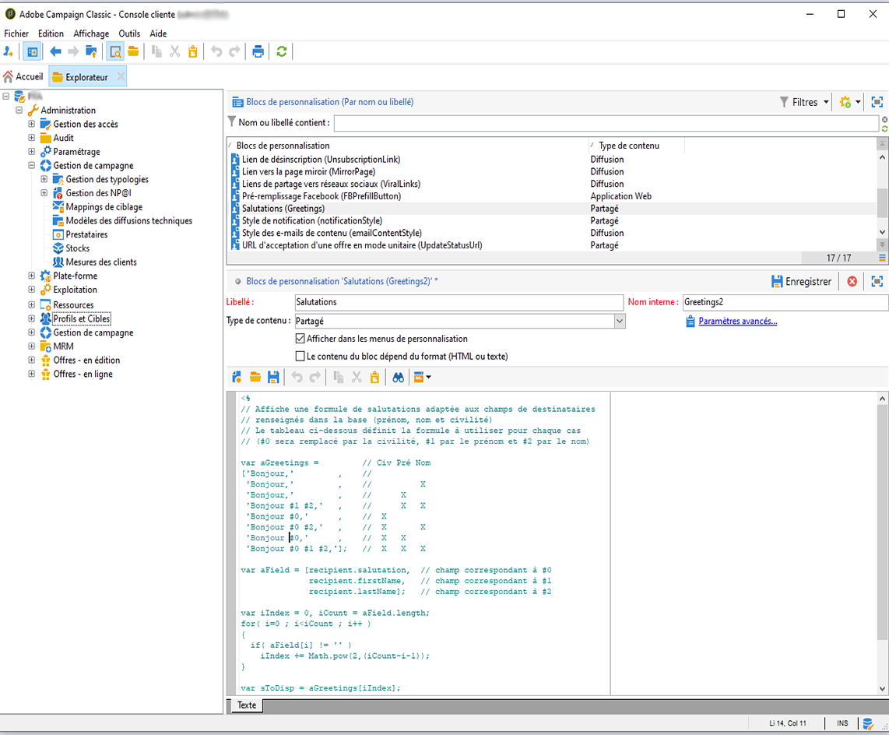

# Blocs de personnalisation{#personalization-blocks}

Les blocs de personnalisation sont dynamiques, personnalisés et contiennent un rendu spécifique que vous pouvez insérer dans vos remises. Par exemple, vous pouvez ajouter un logo, un message de bienvenue ou un lien vers une page miroir. Voir [Insertion de blocs](#inserting-personalization-blocks)de personnalisation.

>[!NOTE]
>
>Les blocs de personnalisation sont aussi disponibles depuis le **[!UICONTROL Digital Content Editor (DCE)]**. Pour plus d&#39;informations, reportez-vous à [cette page](../../web/using/editing-content.md#inserting-a-personalization-block).

Les blocs de personnalisation sont accessibles notamment à partir du nœud **[!UICONTROL Ressources > Gestion de campagne > Blocs de personnalisation]** de l&#39;explorateur Adobe Campaign. Plusieurs blocs sont disponibles par défaut (voir Blocs [](#out-of-the-box-personalization-blocks)de personnalisation prêts à l’emploi).

Vous pouvez définir de nouveaux blocs qui vous permettront d&#39;optimiser la personnalisation de vos livraisons. Pour plus d’informations, reportez-vous à la section [Définition de blocs](#defining-custom-personalization-blocks)de personnalisation personnalisée.

## Insérer des blocs de personnalisation {#inserting-personalization-blocks}

Pour insérer un bloc de personnalisation dans un message, procédez comme suit :

1. Dans l&#39;éditeur de contenus de l&#39;assistant de diffusion, cliquez sur l&#39;icône des champs de personnalisation et sélectionnez le menu **[!UICONTROL Inclure]**.
1. Sélectionnez un bloc de personnalisation dans la liste (la liste affiche les 10 derniers blocs utilisés) ou cliquez sur le menu **[!UICONTROL Autre...]** pour accéder à la liste complète.

   

1. **[!UICONTROL L&#39;]** Autre... donne accès à tous les blocs de personnalisation prêts à l’emploi et personnalisés (voir les blocs [de personnalisation prêts à l’emploi et](#out-of-the-box-personalization-blocks) Définition de blocs [](#defining-custom-personalization-blocks)de personnalisation personnalisée).

   

1. Le bloc de personnalisation est alors inséré sous forme de script. Il sera automatiquement adapté au profil du destinataire lors de la génération de la personnalisation.

   

1. Cliquez sur l&#39;onglet **[!UICONTROL Aperçu]** et sélectionnez un destinataire pour visualiser la personnalisation relative à ce destinataire.

   

Vous pouvez inclure le code source d&#39;un bloc de personnalisation dans le contenu de la diffusion. Pour cela, cochez l&#39;option **[!UICONTROL Inclure le code source HTML du bloc]** lorsque vous le sélectionnez.


Le code source HTML est inséré dans le contenu de la diffusion. Par exemple, le bloc de personnalisation **[!UICONTROL Salutations]** s&#39;affiche comme ci-dessous :


## Exemple de blocs de personnalisation {#personalization-blocks-example}

Dans cet exemple, nous créons un email dans lequel nous utilisons les blocs de personnalisation pour permettre au destinataire d&#39;afficher la page miroir, de partager la newsletter sur les réseaux sociaux et de se désabonner des diffusions futures.

Pour ce faire, nous devons insérer les blocs de personnalisation suivants :

* **[!UICONTROL Lien vers la page miroir]** .
* **[!UICONTROL Liens de partage vers les réseaux sociaux]** .
* **[!UICONTROL Lien de désabonnement]** .

>[!NOTE]
>
>Pour plus d’informations sur la génération de la page miroir, voir [Génération de la page](../../delivery/using/sending-messages.md#generating-the-mirror-page)miroir.

1. Créez une nouvelle diffusion ou ouvrez une diffusion existante de type email.
1. Dans l&#39;assistant de diffusion, cliquez sur le lien **[!UICONTROL Objet]** pour éditer l&#39;objet du message et saisir un objet.
1. Insérez ensuite les blocs de personnalisation dans le corps du message. Pour cela, cliquez dans le contenu du message, cliquez sur l&#39;icône de champs de personnalisation et sélectionnez le menu **[!UICONTROL Inclure]**.
1. Sélectionnez le premier bloc à insérer. Renouvelez la procédure pour inclure les deux autres blocs.

   

1. Cliquez sur l&#39;onglet **[!UICONTROL Aperçu]** pour visualiser le résultat de la personnalisation. Vous devez sélectionner un destinataire pour afficher son message.

   

1. Confirmez que le contenu des blocs est affiché correctement.

## Blocs de personnalisation d&#39;usine {#out-of-the-box-personalization-blocks}

Une liste des blocs de personnalisation est disponible par défaut pour vous aider à personnaliser le contenu de votre message.

>[!NOTE]
>
>Cette liste dépend des modules et options installés sur votre instance.


* **[!UICONTROL Salutations]** : insère des salutations avec le nom du destinataire. Par exemple : &quot;Bonjour John Doe,&quot;.
* **[!UICONTROL Insertion du logo]** : insère un logo prêt à l&#39;emploi qui a été défini lors du paramétrage de l&#39;instance.
* **[!UICONTROL Powered by Adobe Campaign]** : insère le logo &quot;Powered by Adobe Campaign&quot;.
* **[!UICONTROL URL de page miroir]** : insère l&#39;URL de page miroir qui permet aux concepteurs de diffusion de vérifier le lien.

   >[!NOTE]
   >
   >Pour plus d’informations sur la génération de la page miroir, voir [Génération de la page](../../delivery/using/sending-messages.md#generating-the-mirror-page)miroir.

* **[!UICONTROL Lien vers la page miroir]** : insère un lien vers la page miroir : « Si vous ne parvenez pas à voir correctement ce message, cliquez ici. ».
* **[!UICONTROL Lien de désabonnement]** : insère un lien permettant de se désabonner de toutes les diffusions (blacklistage).
* **[!UICONTROL Fonction de formatage d&#39;un nom propre]** : génère la fonction JavaScript **[!UICONTROL toSmartCase]** qui convertit la première lettre de chaque mot en majuscule. Ce bloc doit être inséré dans le code source de la remise, dans les **`<script>...</script>`** balises.

   Dans l’exemple ci-dessous, la fonction est utilisée pour remplacer l’élément &quot;Mon en-tête&quot; par &quot;Mon nouvel en-tête&quot; par des lettres majuscules à chaque mot :

   ```
   <h1 id="sample">My header</h1>
   <script><%@ include view='toSmartCase'%>;
   document.getElementById("sample").innerHTML = toSmartCase("My new header");
   </script>
   ```

   

* **[!UICONTROL URL]** de la page d&#39;inscription : insère une URL d’abonnement (voir [A propos des services et des abonnements](../../delivery/using/about-services-and-subscriptions.md)).
* **[!UICONTROL Lien d&#39;inscription]** : insère un lien d&#39;inscription qui a été défini lors du paramétrage de l&#39;instance.
* **[!UICONTROL Lien d&#39;inscription (avec parrain)]** : insère un lien d&#39;inscription qui permet d&#39;identifier le visiteur et la diffusion. Le lien a été défini lors du paramétrage de l&#39;instance.

   >[!NOTE]
   >
   >Ce bloc peut être utilisé dans les diffusions qui ciblent uniquement les visiteurs.

* **[!UICONTROL Confirmation de votre inscription]** : insère un lien permettant de confirmer l&#39;inscription.
* **[!UICONTROL Liens]** de partage sur les réseaux sociaux : insère des boutons qui permettent au destinataire de partager un lien vers le contenu de la page miroir avec le client de messagerie, Facebook, Twitter, Google + et LinkedIn (voir [Marketing Viral : à un ami](../../delivery/using/viral-and-social-marketing.md#viral-marketing--forward-to-a-friend)).
* **[!UICONTROL Style des courriels]** de contenu et style **[!UICONTROL de]** notification : générer du code qui formate un courrier électronique avec des styles HTML prédéfinis. **[!UICONTROL Ces blocs doivent être insérés dans le code source de la remise, dans le]**... , dans les **`<style>...</style>`** balises .
* **[!UICONTROL URL d&#39;acceptation d&#39;une offre en mode unitaire]** : insère une URL permettant de définir une offre d&#39;interaction comme étant **[!UICONTROL Acceptée]** (voir [cette section](../../interaction/using/offer-analysis-report.md)).

## Définir des blocs de personnalisation personnalisés {#defining-custom-personalization-blocks}

Vous pouvez définir de nouveaux champs de personnalisation qui pourront être insérés à partir de l&#39;icône des champs personnalisés via le menu **[!UICONTROL Inclure...]**. Ces champs sont définis dans des blocs de personnalisation.

Pour créer un bloc de personnalisation, ouvrez l&#39;Explorateur et respectez les étapes suivantes :

1. Cliquez sur le nœud **[!UICONTROL Ressources > Gestion de campagne > Blocs de personnalisation]**.
1. Cliquez avec le bouton droit dans la liste des blocs et choisissez **[!UICONTROL Nouveau]** .
1. Renseignez le paramétrage du bloc de personnalisation :

   

   * Saisissez le libellé du bloc. Ce libellé sera affiché dans la fenêtre d&#39;insertion de champs de personnalisation.
   * Sélectionnez l&#39;option **[!UICONTROL Afficher dans les menus de personnalisation]** pour rendre ce bloc accessible depuis l&#39;icône d&#39;insertion de champs de personnalisation.
   * Sélectionnez éventuellement l&#39;option **[!UICONTROL Le contenu du bloc dépend du format]** pour définir deux blocs distincts pour les emails au format HTML et ceux au format texte.

      Deux onglets seront alors affichés dans la section inférieure de cet éditeur (Contenu HTML et Contenu Texte) pour définir les contenus correspondants.

      

   * Saisissez le contenu (en HTML, texte, JavaScript, etc.) du ou des blocs de personnalisation et cliquez sur le bouton **[!UICONTROL Enregistrer]** .
