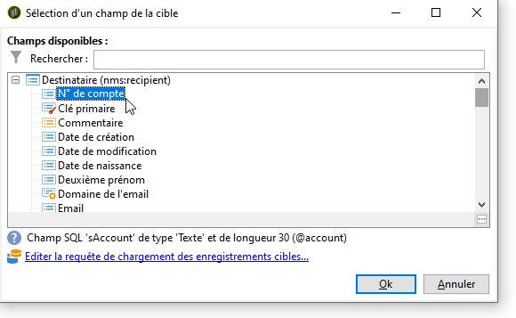

# Champs de personnalisation{#personalization-fields}

Les champs de personnalisation sont utilisés pour la personnalisation de premier niveau du contenu des messages diffusés. Les champs que vous insérez dans un contenu principal indiquent l&#39;emplacement où insérer les données de la source de données sélectionnée.

Par exemple, le champ de personnalisation de syntaxe **&lt;%= recipient.LastName %>** spécifie à Adobe Campaign d&#39;insérer le nom du destinataire se trouvant dans la base de données (table des destinataires).

 [Découvrez cette fonctionnalité en vidéo](#personalization-fields-video)

>[!CAUTION]
>
>Le contenu des champs de personnalisation ne peut pas dépasser 1 024 caractères.

## Sources de données {#data-sources}

Les champs de personnalisation peuvent provenir de deux types de sources de données selon le mode de diffusion sélectionné :

* La source de données est la base de données Adobe Campaign. C&#39;est le cas le plus fréquent. On parlera par exemple de champs de personnalisation du destinataire : il s&#39;agit de l&#39;ensemble des champs définis dans la table des destinataires qu&#39;il s&#39;agisse de champs standards (typiquement nom, prénom, adresse, ville, date de naissance, etc.) ou de champs libres.
* La source de données est un fichier externe. Il s&#39;agit de l&#39;ensemble des champs définis dans les colonnes du fichier présenté en entrée lors d&#39;une diffusion utilisant les informations présentes dans un fichier externe.

>[!NOTE]
>
>Une balise de personnalisation Adobe Campaign est toujours de la forme **&lt;%=table.champ%>**.

## Insertion d&#39;un champ de personnalisation {#inserting-a-personalization-field}

Pour insérer des champs de personnalisation, cliquez sur l’icône déroulante accessible depuis toute zone d’édition des en-têtes, de l’objet ou du corps principal du message.

Après avoir choisi une source de données - champ du destinataire ou champ du fichier - cette insertion se présente sous la forme d&#39;une directive qui sera interprétée par Adobe Campaign et remplacée par la valeur du champ pour un destinataire donné. Le remplacement physique peut alors être visualisé dans l&#39;onglet **[!UICONTROL Aperçu]**.

## Exemple de champ de personnalisation {#personalization-fields-example}

Nous allons créer un email dans lequel nous allons tout d&#39;abord insérer le nom du destinataire et ensuite ajouter dans le corps du message la date de création de son profil. Pour cela :

1. Créez une diffusion ou ouvrez une diffusion existante de type e-mail.
1. Dans l’assistant de diffusion, cliquez sur **[!UICONTROL Objet]** pour éditer l’objet du message et saisir un objet.
1. Saisissez le texte « **[!UICONTROL Offre spéciale pour]** » et utilisez le dernier bouton de la barre d’outils pour insérer un champ de personnalisation. Choisissez **[!UICONTROL Destinataire>Prénom]**.

   

1. Répétez l&#39;opération pour insérer le nom du destinataire. Insérez des espaces entre chacun de ces champs de personnalisation.
1. Cliquez sur **[!UICONTROL OK]** pour valider.
1. Insérez ensuite la personnalisation dans le corps du message. Pour cela, cliquez dans le contenu du message et cliquez sur le bouton d&#39;insertion de champs.
1. Choisissez **[!UICONTROL Destinataire > Autre...]**.

   

1. Sélectionnez le champ contenant l&#39;information à afficher et cliquez sur **[!UICONTROL Ok]**.

   

1. Cliquez sur l&#39;onglet **[!UICONTROL Aperçu]** pour visualiser le résultat de la personnalisation. Vous devez sélectionner un destinataire pour afficher son message.

   

   >[!NOTE]
   >
   >Lorsqu&#39;une diffusion s&#39;inscrit dans un workflow, vous pouvez utiliser les données issues de la table de travail temporaire du workflow. Ces données sont rassemblées dans le menu **[!UICONTROL Extension de la cible]**. Pour plus d’informations, consultez [cette section](../../workflow/using/data-life-cycle.md#target-data).

## Optimiser la personnalisation {#optimizing-personalization}

Vous pouvez optimiser la personnalisation à l&#39;aide d&#39;une option dédiée : **[!UICONTROL Préparer les données de personnalisation avec un workflow]**, disponible dans l&#39;onglet **[!UICONTROL Analyse]** des propriétés d&#39;une diffusion. Pour plus d’informations sur l’analyse de la diffusion, voir [cette section](steps-validating-the-delivery.md#analyzing-the-delivery).

Cette option permet, lors de l&#39;analyse de la diffusion, de créer automatiquement et d&#39;exécuter un workflow qui stocke dans une table temporaire toutes les données liées à la cible, notamment les données issues des tables liées en FDA.

Si vous cochez cette option, les performances de l’analyse des diffusions peuvent être améliorées lorsque de nombreuses données sont en cours de traitement, en particulier si les données de personnalisation proviennent d’une table externe par le biais de FDA. Voir à ce sujet la section [Accès à une base externe (FDA)](../../installation/using/about-fda.md);

Par exemple, si vous rencontrez des problèmes de performances lorsque vous diffusez des messages à un grand nombre de destinataires tout en utilisant un nombre important de champs de personnalisation et/ou de blocs de personnalisation dans le contenu de vos messages, cette option peut accélérer le traitement de la personnalisation et, par conséquent, la diffusion de vos messages.

Pour utiliser cette option, procédez comme suit :

1. Créez une campagne. Pour plus d’informations, consultez [cette section](../../campaign/using/setting-up-marketing-campaigns.md#creating-a-campaign).
1. Dans l’onglet **[!UICONTROL Ciblage et workflows]** de la campagne, ajoutez une activité **Requête** à votre workflow. Pour plus d’informations sur cette activité, consultez [cette section](../../workflow/using/query.md).
1. Ajoutez une activité **[!UICONTROL Diffusion e-mail]** au workflow et ouvrez-la. Pour plus d’informations sur cette activité, consultez [cette section](../../workflow/using/delivery.md).
1. Accédez à l&#39;onglet **[!UICONTROL Analyse]** des **[!UICONTROL Propriétés de la diffusion]** et sélectionnez l&#39;option **[!UICONTROL Préparer les données de personnalisation avec un workflow]**.

   

1. Configurez la diffusion et démarrez le workflow afin de lancer l&#39;analyse.

Une fois l&#39;analyse terminée, les données de personnalisation sont stockées dans une table temporaire via un workflow technique temporaire créé à la volée lors de l&#39;analyse.

Ce workflow n&#39;est pas visible dans l&#39;interface d&#39;Adobe Campaign. Il s&#39;agit uniquement d&#39;un moyen technique permettant de stocker et de traiter rapidement les données de personnalisation.

Une fois l&#39;analyse terminée, accédez aux **[!UICONTROL Propriétés]** du workflow et sélectionnez l&#39;onglet **[!UICONTROL Variables]**. Celui-ci contient le nom de la table temporaire que vous pouvez utiliser pour effectuer un appel SQL afin d&#39;afficher les identifiants qu&#39;elle contient.

## Délai d’expiration de la phase de personnalisation {#timing-out-personalization}

Pour améliorer la protection de la diffusion, vous pouvez définir un délai d’expiration pour la phase de personnalisation.

Dans l’onglet **[!UICONTROL Livraison]** des **[!UICONTROL Propriétés de diffusion]**, sélectionnez une valeur maximale en secondes pour l’option **[!UICONTROL Durée maximale d’exécution de la personnalisation]**.

Lors de l’aperçu ou de l’envoi, si la phase de personnalisation dépasse la durée maximale définie dans ce champ, le processus est abandonné avec un message d’erreur et la diffusion échoue.

La valeur par défaut est de 5 secondes.

Si vous définissez cette option sur 0, il n’y aura aucune limite de temps pour la phase de personnalisation.

## Onglet Personnalisation {#personalization-tab}

Dans les propriétés de la diffusion, vous disposez d’un onglet Personnalisation.

Vous pouvez y ajouter des données à la requête de profil de la dimension de ciblage en cliquant sur « **Modifier la requête de chargement du profil du ou de la destinataire** ». Vous pouvez utiliser les données extraites directement dans une expression pour extraire ce dont vous avez réellement besoin. Ces données seront ajoutées au contexte.

{zoomable="yes"}

Si les données que vous souhaitez ajouter ne figurent pas dans la dimension de ciblage, vous pouvez cliquer sur « **Ajouter des objets dans le contexte d’exécution des scripts** ».

{zoomable="yes"}

Vous pouvez y sélectionner le schéma d’objet dont vous avez besoin, puis utiliser ces données dans votre code JavaScript, qui sera exécuté pendant la préparation de la diffusion.

{zoomable="yes"}

En ajoutant le schéma d’objet, vous pouvez sélectionner les champs à ajouter au contexte :

{zoomable="yes"}

## Tutoriel vidéo {#personalization-fields-video}

Découvrez comment ajouter un champ de personnalisation à la ligne d’objet et au contenu d’une diffusion email.

>[!VIDEO](https://video.tv.adobe.com/v/24925?quality=12)

D’autres vidéos pratiques sur Campaign Classic sont disponibles [ici](https://experienceleague.adobe.com/docs/campaign-classic-learn/tutorials/overview.html?lang=fr).
